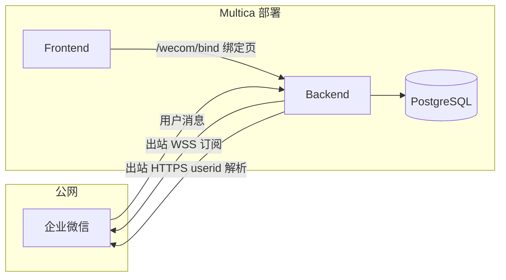

import { Callout } from "fumadocs-ui/components/callout";

把任意[智能体](/agents)绑定到企业微信智能机器人后，团队可以在企微里直接使用它——私聊 Bot、在群里 @ 它，或者输入 `/issue` 创建 [Multica issue](/issues)，无需打开 Web 应用。智能体的回复以**流式消息**的形式回到聊天里，处理完成后更新为最终答复。

每个 Bot 与一个 Multica 智能体**一对一**绑定。再绑定一个智能体会创建另一条安装记录；一个智能体在同一工作区内只对应一个企微 Bot。

## 这个集成能做什么

| 入口 | 行为 |
|---|---|
| **设置 → 集成 → 企业微信** | 工作区所有者/管理员填写企微管理后台的 Bot 凭据，完成绑定。 |
| **智能体 → 集成** | 显示该智能体是否已连接企微 Bot；凭据在设置页统一维护。 |
| **私聊 Bot** | 工作区成员在企微里直接给 Bot 发消息。每人拥有**独立的** Multica [chat](/chat) 会话。 |
| **群里 @ 它** | 把 Bot 加进企微群并 @ 它。仅处理 @ 消息；**整个群共享一个** chat 会话（见下文）。 |
| **`/issue` 命令** | 输入 `/issue <标题>`（可附正文）会在工作区创建 issue，记在你名下。 |
| **流式回复** | Bot 先回复「已收到，正在处理中…」，智能体跑完后在同一条流式消息里更新为最终内容。 |

## 架构概览

企微集成使用**长连接 API 模式**（`wss://openws.work.weixin.qq.com`），与飞书的入站回调不同：



要点：

- **不需要**向企微配置 Multica 的入站 Webhook URL；Backend **主动出站**连接企微。
- **需要** Backend 容器/进程能访问外网（企微 WSS + `qyapi.weixin.qq.com`）。
- **需要**用户能访问 Multica **前端公网地址**（身份绑定链接 `{PUBLIC_URL}/wecom/bind?token=…`）。
- 智能体任务仍由成员本机的 **Daemon** 执行；Daemon 不在 Multica 服务端容器内。

## 企微管理后台准备

在 Multica 里填凭据之前，请先在[企业微信管理后台](https://work.weixin.qq.com/)完成：

1. **创建智能机器人**，接入方式选择 **API 长连接**（不是回调 URL 模式）。
2. 记录 **Bot ID** 与 **长连接 Secret**（对应 Multica 表单中的「长连接 Secret」）。
3. 准备 **企业 ID（CorpID）** 与 **自建应用 Secret**（CorpSecret），用于将加密 `open_userid` 解析为明文 `userid`。自建应用需开通通讯录相关权限（`openuserid_to_userid` 接口）。
4. （可选）**自建应用 AgentId**：部分部署场景下用于辅助配置，一般可留空。

<Callout type="info">
Multica 会把 Bot Secret 与 Corp Secret **加密后存入数据库**。加密密钥由服务端的 `MULTICA_WECOM_SECRET_KEY` 提供，见下文「自部署配置」。
</Callout>

## 绑定智能体（所有者 / 管理员）

与飞书扫码安装不同，企微 MVP 通过 **设置页手动填凭据** 完成绑定：

1. 打开 **设置 → 集成 → 企业微信**。
2. 填写：
   - **智能体 ID** — 要绑定的 Multica 智能体 UUID（在智能体详情 URL 或设置中可见）。
   - **Bot ID**、**长连接 Secret** — 来自智能机器人长连接配置。
   - **企业 ID（CorpID）**、**自建应用 Secret** — 用于成员身份解析。
   - **自建应用 AgentId** — 可选。
3. 点击 **连接**。成功后 Backend 会为该安装建立企微长连接（Hub 自动订阅消息）。

在 **智能体 → 集成** 中可看到「已连接的 Bot: Bot {bot_id}」状态。

<Callout type="warning">
断开连接会撤销安装记录并释放长连接租约；之后需重新填写凭据才能恢复。安装者（installer）身份会写入数据库，用于群聊 session 的稳定归属。
</Callout>

## 使用 Bot（成员）

### 前置：加入工作区

用户必须是 **Multica 工作区成员**（通过邀请链接或管理员添加）。非成员即使完成企微绑定也无法使用 Bot。

### 第一条消息：绑定企微身份

第一次给 Bot 发消息（私聊或群里 @）时，若尚未绑定，Bot 会回复：

> 请先绑定 Multica 账号，点击链接完成绑定：`{MULTICA_PUBLIC_URL}/wecom/bind?token=…`

成员点开链接 → 登录 Multica → 自动完成绑定。成功后页面显示「绑定成功，可以回到企业微信继续对话。」

<Callout type="warning">
绑定 redeem 接口会校验登录用户是否为该工作区成员。请先接受工作区邀请，再点击绑定链接。
</Callout>

### 对话与 `/issue`

- **随便问智能体** — 私聊 Bot，或在群里 @ 它。消息进入 Multica chat 会话，智能体通过 Daemon 运行后流式回覆。
- **创建 issue** — 发送 `/issue 修复登录跳转`，标题后换行可写描述。
- **智能体离线** — 若智能体没有挂载运行时，Bot 提示「智能体当前离线，消息已记录，上线后会继续处理。」
- **智能体已归档** — Bot 提示联系管理员恢复。

## 群聊会话模型

这是与私聊最重要的区别：

| 场景 | chat_session 粒度 |
|---|---|
| **私聊 Bot** | 每人 ↔ Bot 一条独立会话 |
| **群聊 @Bot** | **整个企微群** 共享 **一个** 会话 |

设计原因：

- 群聊语义是「一个房间、一个 Agent 上下文」，与飞书集成一致。
- 会话 owner 使用**安装 Bot 的管理员**（`installer_user_id`），避免群成员变动导致 session 被级联删除。
- 每条 `chat_message` 仍记录**真实发送者**的 Multica 用户 ID，Agent 运行时能看到多人对话历史。

群聊规则：

- **必须 @Bot** 才会处理；未 @ 的群消息静默丢弃（不回复、不触发绑定提示）。
- 短时间内的多条消息会 **3 秒防抖** 合并为一次 Agent run。
- Agent 回复发回该群，群内所有人可见。

若需要「群里每人独立 Agent 线程」，当前 MVP **不支持**，需改数据模型（按 `(群 ID, userid)` 分会话）。

## 权限

| 操作 | 要求 |
|---|---|
| 连接 / 断开企微 Bot | 工作区 **所有者** 或 **管理员** |
| 查看已连接 Bot 列表 | 所有成员 |
| 与 Bot 对话 | 工作区成员 + 已完成企微身份绑定 |
| 未绑定 / 非成员消息 | 丢弃，仅写审计原因，**不保存消息正文** |

## 自部署配置

Multica Cloud 若已启用该集成可跳过本节。自托管时，**未设置加密密钥前企微集成处于关闭状态**。

### 必需环境变量

```dotenv
# 32 字节密钥的 base64 编码，加密 Bot/Corp Secret 落库前使用
# 生成：openssl rand -base64 32
MULTICA_WECOM_SECRET_KEY=<your-key>

# 用户可访问的前端 URL（无尾斜杠），用于绑定链接
MULTICA_PUBLIC_URL=https://multica.example.com

# 建议与 PUBLIC_URL 一致
MULTICA_APP_URL=https://multica.example.com
FRONTEND_ORIGIN=https://multica.example.com
```

设置后重启 Backend。启动日志应出现：

```text
wecom integration enabled public_url=https://multica.example.com
```

若看到 `wecom integration disabled (MULTICA_WECOM_SECRET_KEY not set)`，说明密钥未传入进程。

### Docker Compose 部署

标准自托管栈为 **三个服务**（不是单个镜像）：

| 服务 | 镜像 | 说明 |
|---|---|---|
| postgres | `pgvector/pgvector:pg17` | 含企微相关 migration |
| backend | `Dockerfile` | 企微 Hub、Dispatcher、绑定 API |
| frontend | `Dockerfile.web` | 含 `/wecom/bind` 页面 |

从当前代码构建（含企微功能的分支）：

```bash
cp .env.example .env
# 编辑 .env：JWT_SECRET、MULTICA_WECOM_SECRET_KEY、MULTICA_PUBLIC_URL 等
make selfhost-build
```

`docker-compose.selfhost.yml` 会透传 `MULTICA_WECOM_SECRET_KEY`。数据库迁移在 backend 启动时自动执行。

<Callout type="info">
前端镜像构建时将 `REMOTE_API_URL=http://backend:8080` 写入 Next.js 反向代理，容器内前后端通过 Docker 网络通信，一般无需设置 `NEXT_PUBLIC_API_URL`。
</Callout>

### 网络与反向代理

- Compose 默认将端口绑定在 `127.0.0.1`；对外访问请在前方加 **Caddy / nginx** 做 TLS 与转发。
- Backend 需能出站访问 `openws.work.weixin.qq.com` 与 `qyapi.weixin.qq.com`。
- 成员本机 **Daemon** 需能访问你的 Backend API / WebSocket（与 Web 相同公网入口或内网地址）。

### Redis（可选）

未配置 `REDIS_URL` 时：

- 企微 Hub 使用**进程内内存**模式（单 Backend 副本即可）。
- 全局限流关闭。

小团队自托管可暂不部署 Redis。

## 故障排查

| 现象 | 可能原因 | 处理 |
|---|---|---|
| 设置页显示「未启用企业微信集成」 | `MULTICA_WECOM_SECRET_KEY` 未设置或未传入容器 | 检查 `.env` 并重启 backend |
| Bot 只回复短句「请先绑定…」**无链接** | `MULTICA_PUBLIC_URL` 为空，或 token mint 失败 | 确认 PUBLIC_URL；查 backend 日志 `mint binding token failed` |
| 绑定页一直「正在绑定…」 | 前端 redeem 竞态（旧版本） | 使用含修复的版本重新 `pnpm build` / 重建 web 镜像 |
| 绑定页 403 | 用户不是工作区成员 | 先接受邀请再加入绑定 |
| Bot 无回复 | 群聊未 @Bot；用户未绑定；Daemon 未运行 | 确认 @、绑定状态、`multica daemon status` |
| 长连接频繁断开 | 网络不稳定；多副本抢租约 | 生产建议单 Backend 持有 WS 租约，或依赖 DB lease 机制 |

Backend 关键日志：

```text
wecom integration enabled public_url=...
wecom hub: binding link minted bind_url=...
wecom hub: dispatch outcome outcome=ingested
```

## 与飞书集成的差异

| 项目 | 飞书 | 企业微信 |
|---|---|---|
| 安装方式 | 扫码授权 | 设置页填凭据 |
| 入站连接 | 飞书长连接 bootstrap | 企微 WSS 长连接 |
| 身份绑定 | `/lark/bind` | `/wecom/bind` |
| 回复形态 | 互动卡片 patch | Stream 流式消息 |
| 群聊会话 | 一群一会话 | 一群一会话（相同） |

## 下一步

- [智能体](/agents) — 每个 Bot 绑定一个智能体
- [Chat](/chat) — Bot 对话在 Multica 中的对应关系
- [Issues](/issues) — `/issue` 创建的内容
- [Daemon 与运行时](/daemon-runtimes) — 智能体实际执行环境
- [环境变量](/environment-variables) — 完整自部署配置参考
- [自托管快速开始](/self-host-quickstart) — Docker Compose 入门
