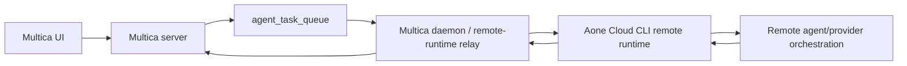
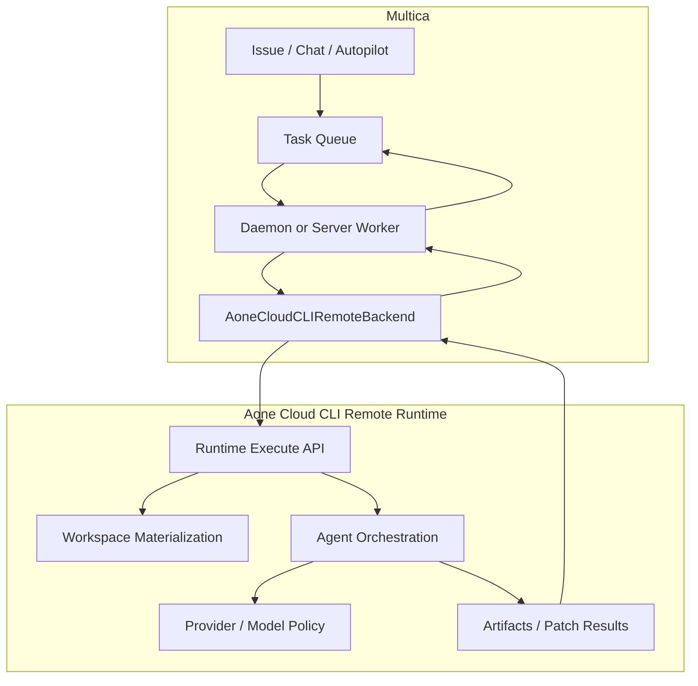

# Aone Cloud CLI Remote Runtime-Only Design

## 背景

Multica 当前把每个本机 agent CLI 都注册成一个 runtime：daemon 启动时扫描 `claude`、`codex`、`copilot`、`opencode`、`openclaw`、`hermes`、`gemini`、`pi`、`cursor-agent`、`kimi`、`kiro-cli`，然后按 provider 写入 `agent_runtime`。任务执行时，server 根据 agent 绑定的 `runtime_id` 派发给 daemon，daemon 再按 runtime 的 `provider` 选择 Go 侧 agent backend。

Aone Cloud CLI 在这个集成里应该被视为远端智能体运行时，而不是 Multica daemon 需要在本机探测、启动和托管的 CLI。也就是说，Multica 不再直接面对 Claude、Codex、Cursor、Gemini 等 provider，也不再假设 agent 执行发生在本机 `cwd`。Multica 的边界应该收敛为唯一的远端 runtime：



第一阶段可以保留 Multica daemon 作为现有任务队列的 relay，降低改造成本；但 daemon 不再负责启动本地 Aone Cloud CLI 进程。更长期可以把 `aone_cloud_cli` backend 移到 server worker，由 Multica server 直接调用远端 runtime。

## 目标

1. Multica 只注册一个 runtime：`provider = "aone_cloud_cli"`。
2. 这个 runtime 的 location 是 remote，不是本机 CLI binary。
3. Multica UI 不再让用户选择 Claude、Codex、Cursor 等 runtime provider；这些是 Aone Cloud CLI 远端运行时内部能力。
4. Multica 继续管理任务生命周期、issue/comment/chat/autopilot、runtime ownership、usage rollup 和团队协作语义。
5. Aone Cloud CLI 远端 runtime 负责真实 agent 执行、provider 差异、session resume、权限事件、工具事件和结果归一。

## 当前落地

本分支已经实现第一阶段的可运行闭环：

- Aone Cloud CLI 新增 headless runtime API：
  - `GET /api/runtime/health`
  - `GET /api/runtime/capabilities`
  - `POST /api/runtime/execute`
- Multica 新增 `aone_cloud_cli` backend，`ExecutablePath` 表示 Aone runtime URL，不再表示本地 binary。
- 当 `MULTICA_AONE_RUNTIME_URL` 存在时，Multica daemon 的 agent 配置只保留一个 `aone_cloud_cli` runtime；未设置该变量时仍保留旧的本机 CLI 探测逻辑，方便回退和并行验证。
- Aone runtime execute 输出 `application/x-ndjson`，事件形态为 `message` / `result`；Multica 会把 Aone normalized message 映射成 `agent.Message`，最终 `result` 映射成 `agent.Result`。
- 本地联调可用 `AONE_RUNTIME_SMOKE=1` 让 Aone Cloud CLI 返回确定性 smoke 结果，不依赖真实 Claude/Codex 凭证。

本地联调环境变量：

```bash
# Aone Cloud CLI
SERVER_PORT=3211 \
HOST=127.0.0.1 \
AONE_RUNTIME_SMOKE=1 \
AONE_RUNTIME_TOKEN=dev-runtime-token \
API_KEY=dev-runtime-token \
CODE_PRIVATE_TOKEN=dev-private-token \
npm run server

# Multica daemon / backend
MULTICA_AONE_RUNTIME_URL=http://127.0.0.1:3211
MULTICA_AONE_RUNTIME_TOKEN=dev-runtime-token
MULTICA_AONE_RUNTIME_PROFILE=smoke
MULTICA_AONE_RUNTIME_MODEL=default
```

## 非目标

- 不把 Multica server 迁进 Aone Cloud CLI。
- 不让 Aone Cloud CLI 直接写 Multica DB。
- 不在 Multica 继续维护 Claude/Codex/Cursor/Gemini 多套 provider backend。
- 不把远端 runtime 简化成一个需要 daemon 本机启动的 `aone-cloud-cli start` 进程。
- 不在第一阶段解决完整代码同步和远端工作区产品体验；但协议必须为这个问题留出字段。

## 当前代码锚点

Multica 侧：

- `server/internal/daemon/config.go`：现在扫描多 provider CLI，后续应改成读取 Aone remote runtime endpoint 配置。
- `server/internal/daemon/daemon.go`：`registerRuntimesForWorkspace` 现在按 `cfg.Agents` 注册多 runtime；`runTask` 现在按 `provider` 创建 `agent.New(...)`。
- `server/pkg/agent/agent.go`：Go 侧 provider backend registry，后续只需要保留 `aone_cloud_cli` 这个执行 backend。
- `server/internal/handler/daemon.go`：`DaemonRegister` 信任 daemon 上报的 `runtime.Type`，写入 `agent_runtime.provider`。
- `server/pkg/db/queries/runtime.sql`：`UNIQUE (workspace_id, daemon_id, provider)`，天然支持同一 daemon 下只保留一个 `aone_cloud_cli` runtime。
- `packages/views/runtimes/components/provider-logo.tsx`、`packages/views/agents/components/create-agent-dialog.tsx`、`packages/views/onboarding/components/use-runtime-picker.ts`：前端展示和选择 runtime。

Aone Cloud CLI 侧：

- Aone Cloud CLI 是远端智能体运行时入口，需要对 Multica 暴露稳定的 runtime API。
- 既有 provider registry、normalized message、session resume、permission/event 模型可以作为远端 runtime 内部实现。
- Multica 不应直接依赖 Aone Cloud CLI 的本地 UI server 或浏览器 WebSocket 消息格式。

## 推荐方案

### 1. Multica 新增唯一远端 runtime provider

新增常量：

```go
const AoneCloudCLIProvider = "aone_cloud_cli"
```

Multica daemon 的 provider 检测从多 CLI 扫描改成读取远端 runtime 配置：

- `MULTICA_AONE_RUNTIME_URL`：Aone Cloud CLI 远端 runtime API endpoint。
- `MULTICA_AONE_RUNTIME_TOKEN`：访问远端 runtime 的 token 或短期凭证。
- `MULTICA_AONE_RUNTIME_TENANT` / `MULTICA_AONE_RUNTIME_WORKSPACE`：可选，用于绑定租户、项目或运行时命名空间。
- health/version 检测：`GET /api/runtime/health` 或 `GET /api/runtime/version`。
- runtime 名称：`Aone Cloud CLI Remote Runtime`。
- runtime provider：`aone_cloud_cli`。
- runtime metadata：记录 remote endpoint host、runtime version、capabilities、region、tenant/workspace binding，不写入明文 token。

这样 `registerRuntimesForWorkspace` 仍然可以复用原有 `DaemonRegister` 流程，但 `runtimes` 数组固定只有一个元素。

### 2. 执行链路改成远端任务委托

在 `server/pkg/agent` 新增 `aone_cloud_cli` backend，实现现有 `Backend` 接口。第一阶段为了少改架构，可以仍由 daemon 执行这个 backend；但 backend 的含义变成调用远端 runtime API，而不是启动本机 agent：

```go
type Backend interface {
    Execute(ctx context.Context, prompt string, opts ExecOptions) (*Session, error)
}
```

这个 backend 负责：

- 检查远端 Aone runtime 可连接、版本和 capabilities 满足最低要求。
- 把 Multica 的 task、agent config、workspace ref、session id、model hint、system prompt、MCP/工具配置引用传给远端 runtime。
- 把远端 streaming event 映射成 Multica `agent.Message`。
- 把最终状态、输出、remote session id、usage、artifact refs 映射成 Multica `agent.Result`。

注意：远端 runtime 不能可靠使用 Multica daemon 本机的 `cwd`。协议必须显式表达 workspace 来源，例如 git ref、snapshot、artifact bundle、remote workspace id，或者由 Aone runtime 自己完成 workspace materialization。

### 3. Aone Cloud CLI 提供远端 runtime API

建议 Aone Cloud CLI 对 Multica 暴露稳定的 headless API，而不是让 Multica daemon 模拟 UI WebSocket 消息。

最小协议：

```http
POST /api/runtime/execute
Authorization: Bearer <runtime-token>
Content-Type: application/json
Accept: application/x-ndjson
```

Request：

```json
{
  "prompt": "...",
  "workspace": {
    "kind": "git",
    "repo": "https://...",
    "ref": "refs/heads/feature-x",
    "baseCommit": "..."
  },
  "sessionId": "optional remote session id",
  "agentProfile": "optional profile or policy name",
  "modelHint": "optional model preference",
  "systemPrompt": "optional injected runtime brief",
  "permissionMode": "controlled",
  "mcpConfigRef": "optional config reference",
  "secretRefs": ["multica-token", "repo-token"],
  "metadata": {
    "source": "multica",
    "taskId": "...",
    "agentId": "...",
    "workspaceId": "..."
  }
}
```

NDJSON events：

```json
{"type":"message","message":{"kind":"text","content":"..."}}
{"type":"message","message":{"kind":"tool_use","toolName":"Bash","toolInput":{}}}
{"type":"artifact","artifact":{"kind":"patch","ref":"artifact://..."}}
{"type":"result","status":"completed","sessionId":"...","output":"...","usage":{"model":"...","inputTokens":1,"outputTokens":2}}
```

Multica 不需要在 request 里强制传 `provider = "claude"` 或 `provider = "codex"`。如果 Aone 需要保留多 provider 能力，应通过 `agentProfile`、`modelHint` 或 Aone 自己的策略选择实现，而不是重新暴露成 Multica runtime provider。

### 4. Workspace 和产物同步

远端 runtime 接入的核心不是 CLI path，而是 workspace materialization。至少需要明确一种策略：

1. **Git ref 策略**：Multica 传 repo/ref/baseCommit，Aone runtime 自己 checkout，并把 patch/artifact 返回给 Multica。
2. **Snapshot 策略**：Multica daemon 把本地 workspace 打包成 snapshot 上传，Aone runtime 在远端执行后返回 patch。
3. **Remote workspace id 策略**：Aone runtime 已经拥有对应工作区，Multica 只传 remote workspace id。

推荐第一阶段采用 Git ref 策略，如果 Multica 当前 workspace 不是干净 git 状态，再降级为明确错误；后续再补 snapshot。

产物回传也要标准化：

- `patch`：代码改动，Multica 可展示或应用。
- `logs`：执行日志和工具事件。
- `artifacts`：报告、截图、测试结果等。
- `sessionId`：Aone remote runtime opaque session id，Multica 只保存不解析。

### 5. Multica UI 收敛 runtime 选择

UI 行为变化：

- Runtime 列表只展示 `Aone Cloud CLI Remote Runtime`。
- Runtime 状态展示 remote health、region、capabilities、last checked。
- Create Agent dialog 不再以 runtime provider 作为 agent 类型信号，只选唯一 runtime。
- Provider logo 增加 `aone_cloud_cli`，文案用 `Aone Cloud CLI`。
- Onboarding 的 runtime detected 事件不再统计 `has_claude` / `has_codex`，改成 `has_aone_cloud_cli` 或只统计 `runtime_count`。
- Model dropdown 后续从 Aone remote capabilities 透传 profile/model 列表，但 UI 语义应该是 profile/model，不是 runtime provider。

### 6. 数据迁移和兼容策略

由于 `agent_runtime` 已经按 `(workspace_id, daemon_id, provider)` 去重，新增 `aone_cloud_cli` runtime 不需要表结构变更。

需要一个收敛策略：

1. 新 daemon 只注册 `aone_cloud_cli`。
2. `CreateAgent` / `UpdateAgent` 拒绝绑定非 `aone_cloud_cli` runtime。
3. Runtime list 默认隐藏旧 provider runtime，或者把旧 runtime 标记为 offline 并只保留历史 usage 可见。
4. 对已有 agents，建议在远端 runtime health check 成功后做一次 workspace 内 rebind：
   - 仅迁移同一 workspace、同一 owner/daemon 下旧 local runtime 绑定的 agent。
   - 保留 agent 的 `model`、`custom_env`、`custom_args`，但把 provider 专属含义降级为 Aone runtime profile/model hint。
   - 如果旧 runtime 已有 running task，不抢占；新任务走新 runtime。

如果当前部署尚未正式承载生产数据，可以更激进：隐藏旧 runtime、禁止旧 runtime 执行，让用户重新创建 agent。

## 分阶段落地

### Phase 1: Multica 只注册 Aone remote runtime

- 改 `LoadConfig`：当 `MULTICA_AONE_RUNTIME_URL` 存在时，不再扫描本机 Claude/Codex 等 CLI，只读取 Aone remote runtime 配置。
- 改错误提示和 env example。
- 加 `agent.New("aone_cloud_cli")` backend，先做 health check，并在 execute 时调用远端 runtime API。
- 前端增加 logo/文案，创建 agent 只接受 `aone_cloud_cli` runtime。
- 测试：config detection、daemon register payload、CreateAgent 非 aone runtime 拒绝。

### Phase 2: Aone remote runtime execution API

- Aone Cloud CLI 增加 `/api/runtime/execute`、`/api/runtime/health`、`/api/runtime/capabilities`。
- 输出稳定 NDJSON event。
- 支持 `workspace`、`sessionId`、`agentProfile`、`modelHint`、`systemPrompt`、`mcpConfigRef`、`secretRefs`。
- 增加鉴权、租户隔离、审计日志和长连接恢复能力。

### Phase 3: Multica Aone backend 接入执行

- `aone_cloud_cli` backend 调用远端 execute API。
- 映射 normalized events 到 Multica task message。
- 映射 result 到 `TaskResult`。
- usage 写入仍用 Multica `task_usage`，provider 字段写 `aone_cloud_cli`，model 字段写 Aone 返回的 opaque model/profile 名称。
- patch/artifact 以远端 artifact ref 形式落入 task 结果，是否自动应用由 Multica 产品策略决定。

### Phase 4: 清理旧 provider runtime

- 删除或停用 `server/pkg/agent/claude.go`、`codex.go` 等 direct backend。
- 删除多 provider CLI env：`MULTICA_CLAUDE_PATH`、`MULTICA_CODEX_PATH` 等。
- 清理 UI 中 provider-specific onboarding metrics 和文案。
- 文档改成只配置 Aone remote runtime。

## 关键风险

1. **workspace 不再等于本机 cwd**：远端 runtime 无法直接读取 daemon 本地路径。必须先定义 git ref、snapshot 或 remote workspace id。
2. **双层 session 语义**：Multica 保存的 `session_id` 应是 Aone 返回的 opaque remote session id，不解释内部 provider session。
3. **鉴权和租户边界**：runtime token、repo token、Multica token 都不能写入 runtime metadata 明文；远端 API 要有最小权限和审计。
4. **长任务网络稳定性**：远端 NDJSON/WebSocket stream 需要断线重连或 resume event cursor，否则长任务容易丢状态。
5. **工具权限归属**：Multica 的 task 权限和 Aone remote runtime 的 permission mode 不能互相绕过。默认使用 controlled mode。
6. **消息归一丢语义**：Aone event 可能比 Multica `agent.Message` 更丰富。Multica backend 映射时要保留 `tool_use`、`tool_result`、`thinking`、`error`、`status`，未知类型降级为 log。
7. **旧 agents 迁移**：如果直接隐藏旧 runtime，已有 agent 可能变成不可运行。需要在产品上决定是自动 rebind 还是要求用户重建。

## 推荐的最终形态

Multica 只管理任务系统和团队协作语义；Aone Cloud CLI 作为唯一远端智能体运行时，管理 agent 执行、provider 编排、会话、权限和工具事件。代码边界是：



这个方向的好处是 Multica 不再追逐每个 provider 的 SDK/CLI 协议变化，也不再把本机 CLI 可用性当成 runtime 可用性。以后 Aone Cloud CLI 远端运行时支持新 provider、新执行沙箱或新权限策略，Multica 仍然只有一个 runtime。
