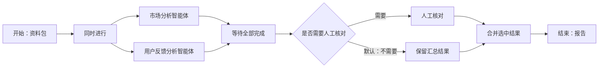
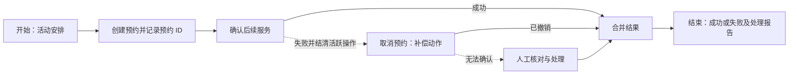
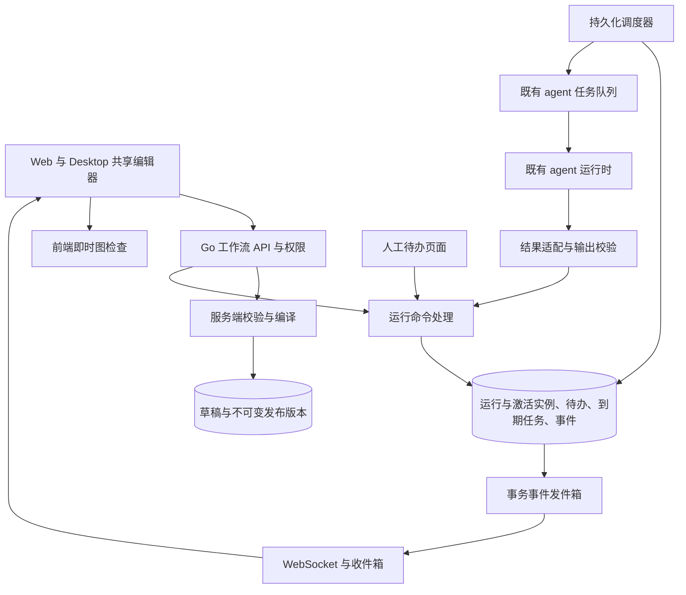
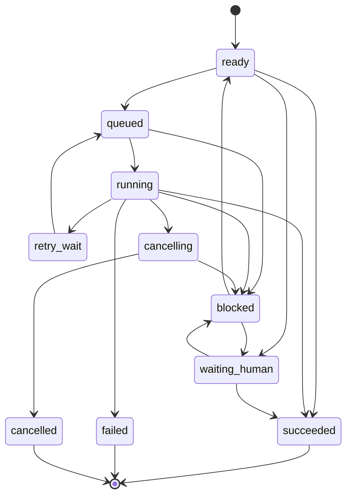
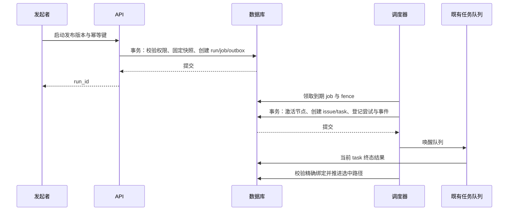
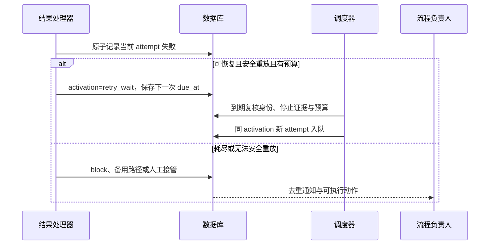
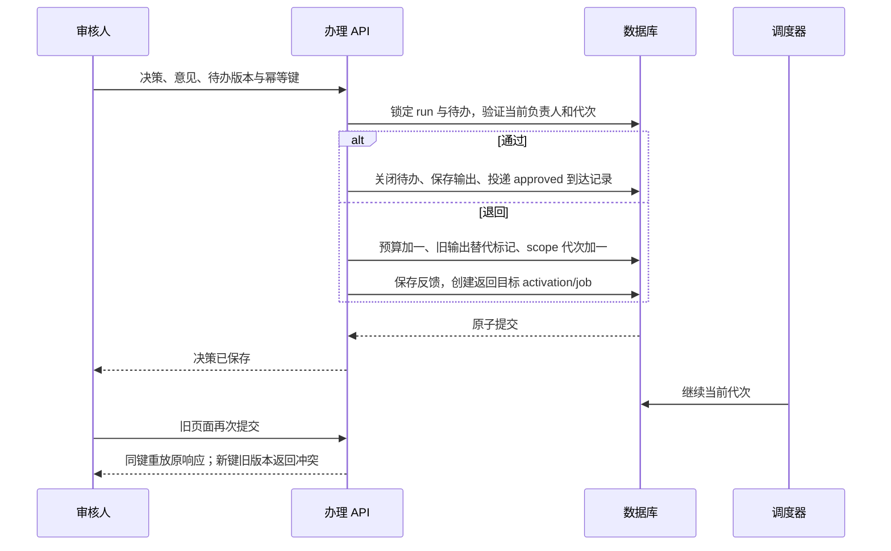
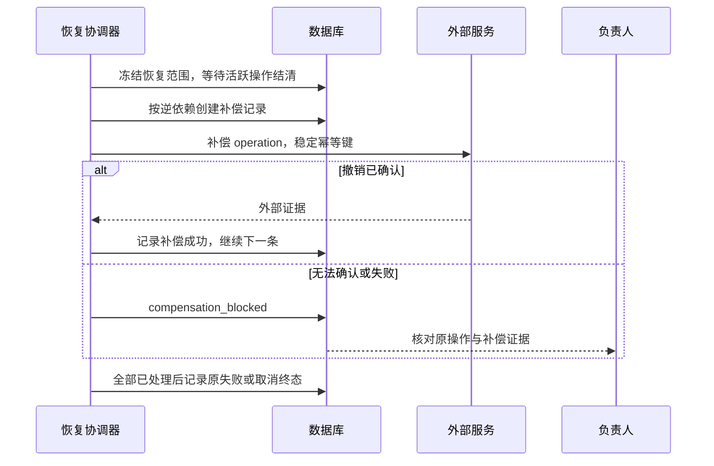
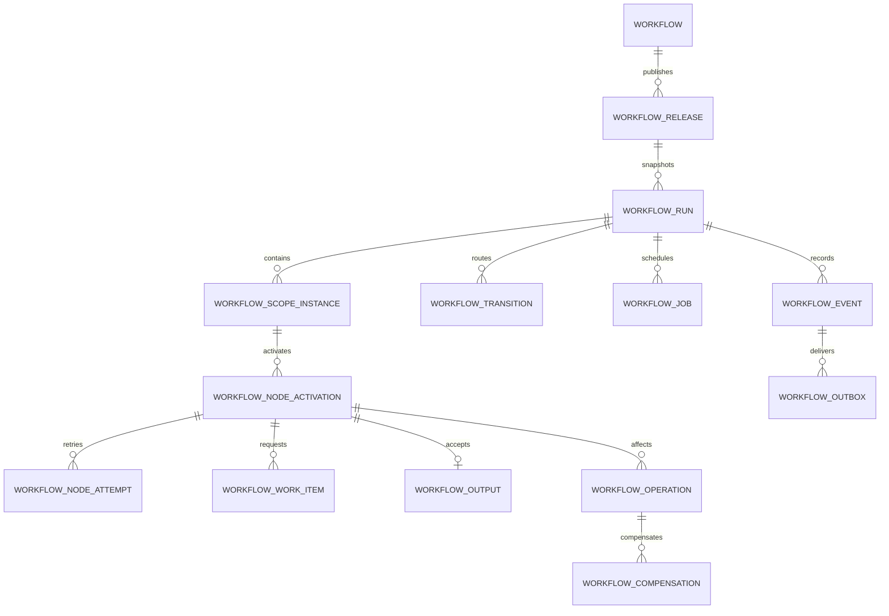

# Multica 智能体工作流编排：产品、技术与测试设计

状态：**设计契约；本分支已交付 W1 核心纵切，待完整 W1 验收**。设计日期：2026-09-11。目标用户：没有编程经验的个人与小团队。适用端：Web、Desktop。

本文是完整产品蓝图与分期实施契约。`codex/agent-workflows-delivery` 分支已按本文实现 W1 的核心纵切，包含图协议、模板、发布快照、手动／测试／模拟运行、条件与并行控制、重试与失败恢复、人工待办、返工、负责人操作、持久化调度租约／fence／outbox、关系化运行事实、附件鉴权、节点审计、v1 升级预览和共享客户端契约。代码仍为工作树交付，不能据此认定已部署到生产；文中未标记为“已验证”的功能和 T01–T45 仍需按验收环境执行。基线核查的 HEAD 为 `4aca890a29576f075dfc5584a1d41dbc507cdb41`。

本分支当前交付边界：服务端和 Web/Desktop 共享层已经可以保存 v2 草稿、选择模板、发布不可变 release、创建三种运行模式、推进人工／智能体节点，并用状态版本和幂等键保护主要工作流写命令；运行状态同时双写关系化 scope／activation／attempt／output／transition 事实，调度器使用持久化 job、租约 fence、事件序号和 outbox，并提供旧运行的关系化回填迁移。新增的 `workflow_command` 记录覆盖草稿、发布切换、运行管理、人工恢复、待办管理和删除等命令，启动／发布／人工提交继续使用各自资源上的幂等边界；工作流聊天的 turn、任务、用户消息和幂等响应也在同一事务内落库。旧 v1 图已提供预览、显式应用、串行自动转换和歧义图的不可发布草稿标记，未知节点及其字段在客户端／服务端按只读能力保留。仍未宣称完整 W1 发布就绪的部分包括真实数据库迁移／回填执行验证、竞争／重启／E2E／性能／可用性、真实 agent smoke 及灰度回退证据；这些是本文件的下一步验收与补齐项。

阅读顺序：产品与设计阅读第 1–6 节；研发继续阅读第 7–12 节；测试和交付阅读第 13–15 节。接口示例使用 `snake_case`，TypeScript 内部使用 `camelCase`。用户侧“任务”对应 `issue`，“运行”对应 `task`，工作流运行使用 `workflow_run`。

## 1. 产品目标与范围

### 1.1 要解决的问题

用户要把“交给谁、先后怎么做、交付什么、失败怎么办”直接搭在画布上。只填写标题和指令不能构成可运营的流程：人无法接收办理任务，结果无法可靠传递，遇到失败也不知道该等、该重试还是该找人。

产品承诺：用户不写代码即可从模板搭建一个人和智能体共同完成的流程；运行中能看懂当前位置和下一步动作；失败后可恢复并保留历史。画布表达真实执行规则，不能出现“连上了但不会执行”的静默状态。

### 1.2 需求基线

| 编号 | 需求与可见结果 | 阶段 |
| --- | --- | --- |
| R01 | 模板和画布优先，默认呈现清晰的开始与结束，检查问题可定位到节点 | W1 |
| R02 | 流程负责人和步骤执行人独立配置，人工与智能体均可参与 | W1 |
| R03 | 开始表单、上游结果选择、交付字段和最终结果完整贯通 | W1 |
| R04 | 串行、条件、并行及汇合有明确执行语义 | W1 |
| R05 | 排队、离线、超时、执行错误分别处理；支持额外重试 N 次 | W1 |
| R06 | 失败可停止并通知、走备用路径、由人接管，操作有记录 | W1 |
| R07 | 人工办理、审核、转交、超时，以及携带反馈的有限返工 | W1 |
| R08 | 草稿、试运行、发布版本和运行快照分开；AI 辅助修改可校验 | W1 |
| R09 | 运行可追踪，可取消，重启可恢复，重复消息不重复推进 | W1 |
| R10 | 工作区隔离、附件权限与旧客户端能力检查 | W1 |
| R11 | 定时、Webhook、事件等待以及跨区段恢复 | W2 |
| R12 | 外部操作有可执行的补偿、核对和人工处理路径 | W2 |
| R13 | 子流程、集合循环、多人会签、模板治理、运行分析 | W3 |

### 1.3 分期与默认选择

- **W1 可用闭环**：手动启动；人工单人负责；模板、画布、基础表单、智能体、人工办理／审核、条件、并行、自动重试、备用路径、人工接管、受限返工、试运行、发布、历史与通知必须一起交付。
- **W2 自动化与补偿**：在 W1 稳定运行基础上增加自动触发、事件等待、显式补偿和跨区段恢复。
- **W3 规模化复用**：子流程、批量循环、多人会签及运营分析。

第一期不引入外部工作流引擎，不支持 BPMN 导入导出，不提供任意代码节点和裸 SQL 节点，不允许任意循环。智能体继续使用平台既有运行时、skill 和工具能力。独立知识库不是工作流上线的前置依赖；未来知识库节点应单独设计授权与输入输出契约。

Mobile 本期不建设画布和人工办理界面；API 语义保持统一，手机用户可使用响应式 Web 待办页。Desktop 与 Web 业务功能同批验收。

### 1.4 成功指标

以下为计划验证的目标，不是现有数据：

| 指标 | 分母、口径与目标 |
| --- | --- |
| 首次可用 | 5 位没有编程经验、未参与设计的用户中至少 4 位，在 10 分钟内完成模板配置及模拟运行 |
| 异常可处理 | 同一批用户至少 4 位，无口头提示完成一次退回修改或失败恢复，并能说出下一步负责人 |
| 配置可解释 | 测试用户能区分“额外重试 2 次”与“返工 3 轮”，知道人工等待不会自动执行三遍 |
| 数据不丢失 | 强制断网、重启、重复提交的验收用例中，无已确认输入丢失、重复人工决策和旧结果推进 |
| 可追踪 | 每次真实节点尝试都可关联执行人、输入版本、结果、错误和恢复动作 |

## 2. 当前实现与标杆依据

### 2.1 代码现状及差距

以下仅是静态代码核查，没有对用户所见部署版本进行运行验证。用户报告“无法使用”作为产品问题成立；代码中存在某个字段不能代替易用性验收。

| 当前事实 | 证据 | 设计处理 |
| --- | --- | --- |
| 图类型只有 `start/agent/end`，默认创建 Start 与 End，最多 200 节点、1000 连接 | [图与校验](../../server/internal/workflow/graph.go) | 保留上限，扩展节点和语义校验；开始结束受保护 |
| 卡片使用图标；新增入口只有智能体；节点可删除，缺少开始结束修复入口 | [画布](../../packages/views/workflows/workflow-canvas.tsx) | 新建、复制、删除、AI 修改均维护边界节点；单击就显示配置 |
| 智能体配置有名称、智能体、指令和祖先输出引用 | [前端类型](../../packages/core/types/workflow.ts)、[画布](../../packages/views/workflows/workflow-canvas.tsx) | 不是完全没有智能体选择，但缺少人类执行人与结构化输入输出 |
| 保存有 revision、撤销／重做；运行保存图快照 | [持久化](../../server/internal/workflow/store.go)、[执行器](../../server/internal/workflow/run.go) | 编辑 revision 与发布版本分离，运行固定发布快照 |
| 执行要求所有上游成功；无环校验；失败阻断下游，独立分支可继续 | [执行器](../../server/internal/workflow/run.go) | 改为路径激活和结构化区段，不能仅新增连线颜色 |
| 手动重试只接受失败节点，保留任务，生成新运行并关联 retry lineage | [队列适配](../../server/internal/service/workflow_task.go) | 保留 lineage，增加自动策略、独立 activation 和返工代次 |
| 调度每 3 秒扫描至多 200 个活跃工作流，依赖事件唤醒 | [执行器](../../server/internal/workflow/run.go) | 改用有序到期队列；避免长期阻塞运行占据全部扫描名额 |
| 数据主要放 JSONB，已有节点 attempt 表及唯一索引 | [初始表](../../server/migrations/536_workflow.up.sql)、[attempt 索引](../../server/migrations/550_workflow_node_attempt.up.sql) | 可编辑图保留 JSON，运行控制字段和执行实例关系化 |
| 网络响应经 zod 解析；类型枚举目前封闭 | [Schema](../../packages/core/workflows/schemas.ts) | 图版本与能力协商先行，禁止旧客户端降级覆盖 |
| 对话以 `workflow_edit` 修改草稿，不运行流程 | [内置工作流说明](../../server/internal/service/builtin_skills/multica-platform/references/workflows.md) | 扩展结构化提案与可见差异，不让模型直接控制运行状态 |

平台约束以 [根规则](../../CLAUDE.md) 和 [命名及中文约定](../../apps/docs/content/docs/developers/conventions.zh.mdx) 为准。

### 2.2 官方参考与采用决策

资料核验日期：2026-09-11。下表是功能与设计参考，不是品牌排名或完整竞品评测；第三方后续改版不自动改变本文契约。

| 参考 | 官方可核验能力 | Multica 采用方式 |
| --- | --- | --- |
| [Dify Human Input](https://docs.dify.ai/en/cloud/use-dify/nodes/human-input) | 暂停请求人工输入，表单字段、决策出口、超时策略 | 审核材料和动作放在同一待办页；借鉴交互，不照搬匿名链接办理 |
| [Camunda User tasks](https://docs.camunda.io/docs/components/modeler/bpmn/user-tasks/) | 流程到达人工任务后等待完成；支持任务分配与表单 | 人工任务为持久化执行节点，不能只是给负责人发一条通知 |
| [Camunda Compensation](https://docs.camunda.io/docs/components/modeler/bpmn/compensation-handler/) | 为已执行动作定义补偿处理器 | 区分返工与撤销影响；每次补偿有独立执行结果 |
| [React Flow Validation](https://reactflow.dev/examples/interaction/validation) | 支持 `isValidConnection` 连接校验 | 拖线时即时解释非法连接，服务端重复进行权威校验 |

Camunda 无版本链接本次页面导航包含 `8.10 (unreleased)`，仅作为上述概念依据，不把预发布能力当作稳定版本承诺。n8n 的旧错误处理与等待文档地址本次访问返回不存在，因此不使用其不可核验页面支撑功能或限制。

设计判断：Multica 的优势应是“平台里的任务、人、智能体、结果属于同一个流程”。普通用户不需要认识网关、令牌或补偿事务这些内部名词；界面使用“按条件选择”“同时进行”“等待全部完成”“退回修改”“撤销已完成操作”。

## 3. 信息架构与交互设计

### 3.1 工作流列表与模板

```text
工作流                                          [从模板新建] [空白新建]
搜索流程...                状态：全部 ▼    负责人：全部 ▼
名称                 负责人      发布版本       最近运行       操作
内容生产与审核       王敏        v3             等待审核       [查看运行]
资料分析与汇总       李明        未发布         未运行         [继续编辑]

模板库
[内容生产与审核]     [资料分析与汇总]      [人工收集后智能体整理]
用途 + 预览小图      需配置：2 个智能体     需配置：1 位成员
                        [使用模板]
```

注：空白图自带“开始 Start → 待添加步骤 → 结束 End”，中间为不参与执行的添加占位。模板保存为平台内静态、版本化 JSON，W1 不建立社区市场。模板中的成员、智能体和凭据均为待绑定占位，不能拷贝模板作者的账号。选择模板后按未完成项逐步引导；空白图允许保存，不允许作为可执行发布。

列表区分草稿与已发布流程，可看“我的待办”和“需要处理”的运行。没有智能体时提供现有智能体管理入口；仍允许创建纯人工流程，不再强制至少一个智能体。

### 3.2 编辑画布

```text
← 内容生产与审核    已保存    草稿 r12／发布 v3    [撤销] [试运行] [发布]
┌步骤库─────────┬画布────────────────────────────┬配置：起草内容──────┐
│ 智能体执行    │ 开始 Start                     │ 谁来做 *          │
│ 人工办理      │   ↓                            │ [写作智能体 ▼]    │
│ 人工审核      │ 起草内容  [写作智能体]         │ 要完成什么 *      │
│ 按条件选择    │ 输出：草稿                     │ [说明与示例...]   │
│ 同时进行      │ 失败：重试 2 次 → 人工接管     │ 用哪些资料        │
│              │   ↓                            │ [+ 选择上一步结果]│
│ 模板片段      │ 人工审核 [王敏]                │ 交付什么          │
│              │   ├通过→ 结束 End              │ [草稿：长文本]    │
│              │   └退回↶ 起草内容              │ 高级设置 ▸        │
│              │                    [缩放/全览] │ 失败时怎么办      │
├──────────────┴────────────────────────────────┴───────────────────┤
│ 待完善 1 项：人工审核尚未设置负责人                    [定位并设置] │
└───────────────────────────────────────────────────────────────────┘
```

注：节点库位于左侧；配置面板单击即可打开，不把必要设置藏在双击或齿轮后。右侧 AI 助手通过切换页签替代配置面板，不能把主画布压缩为不可用宽度。小屏配置使用抽屉，保持选中节点可定位。

节点卡片统一显示类型、名称、执行人、交付摘要与异常策略。缺配置显示文字和标记，不只靠颜色。运行时叠加状态、等待多久及当前尝试次数，画布为只读；“编辑流程”打开草稿，不能拖动运行快照。

连接表现：正常连接为实线并带箭头；条件出口显示规则名称；异常连接为虚线并带“失败／超时”文字；返工连接带回返图标和“最多 3 轮”。选择出口时系统创建合法汇合结构；连线不允许隐藏语义。

### 3.3 画布操作契约

| 操作 | 行为 |
| --- | --- |
| 新增步骤 | 优先使用连线上的“+”，插入后自动重连并打开配置；拖入空白区域为待连接节点 |
| 开始／结束 | 一个 Start、一个 End；不能复制、删除或改类型；名称可改但固定类型标记常显 |
| 老图缺边界节点 | 展示“补齐开始／结束”修复动作并生成草稿 revision；不静默修改历史快照 |
| 删除普通节点 | 普通单入单出串行节点自动接续；其他情况先预览受影响连接和引用，确认后删除 |
| 删除引用源 | 将引用标为待修复，禁止发布；不静默将缺失资料替换为空文本 |
| 条件／并行分组 | 成对创建入口和汇合节点；删除整个分组显示范围，不能单独删除配对汇合 |
| 撤销／重做 | 一次用户操作为一个语义变更；连续拖动和文本输入合并，自动布局不覆盖并发编辑 |
| 自动保存 | 停止输入 800ms 后保存，发送 expected_revision；冲突保留本地草稿并展示差异 |
| 导航离开 | 有未确认保存时提示保存或保留草稿；失败不能显示“已保存” |
| 键盘与辅助功能 | Tab 遍历步骤和操作，Enter 配置，Delete 遵守相同删除规则；提供线性步骤列表替代拖拽 |

### 3.4 运行详情

```text
内容生产与审核 · 第 26 次运行 · v3     等待审核      [取消运行]
发起人 李明   流程负责人 王敏   运行 6 分钟    当前需要：王敏审核
┌实际路径─────────────────┬当前步骤─────────────────────────────────┐
│ 开始 ✓                  │ 人工审核 · 等待王敏                      │
│ 起草 ✓ 第 2 次成功       │ 草稿 [预览]   参考资料 [2 份]            │
│ 审核 ◷                  │ 截止：9 月 12 日 18:00                    │
│ 结束 未到达             │ [打开待办]                               │
├─────────────────────────┴──────────────────────────────────────────┤
│ 输入与结果 | 时间线 | 尝试记录 | 任务关联                           │
│ 10:01 起草失败：服务暂时不可用 → 10:02 自动重试 → 10:03 完成        │
└────────────────────────────────────────────────────────────────────┘
```

注：顶部始终回答“现在在哪、为什么等、找谁、能做什么”。节点详情按返工轮次和尝试分组，旧结果只读。展示预计下次重试时间，不把倒计时写成已经重试。相同运行的父任务、子任务和节点详情互相链接。

### 3.5 人工待办

```text
审核草稿                         来自：内容生产与审核／第 26 次运行
负责人 王敏          截止：明天 18:00         [转交]
需要你：核对事实与表达；通过后输出最终稿，退回后交由写作智能体修改。
待审核内容 [正文预览]       参考材料 [来源列表]
审核意见 [.......................................................]
                 [退回修改] [通过]
```

人工办理页使用“提交结果”，审核页使用“通过／退回修改”；不将两者混成“完成”。退回必须填写意见，目标从设计时允许的步骤中选择。办理人变更后旧页面提交返回冲突并显示新负责人。无权限者可按工作区权限查看流程，但不显示可提交按钮；后端仍须独立鉴权。

### 3.6 试运行、发布与历史

```text
发布流程
草稿 r12 → 新版本 v4
变化：替换起草智能体；审核退回上限 2 → 3；增加资料字段
检查：0 个错误，1 个提示（真实试运行尚未完成）
模拟运行：通过    真实试运行：未执行
版本说明 [.....................................]
                                      [返回编辑] [发布版本]

版本历史
v4 已发布 · 王敏 · 版本说明       [查看] [复制为草稿]
v3 历史版本 · 李明                [查看] [设为发布版本]
草稿 r12（可继续编辑，不影响现有运行）
```

结构错误阻止发布；未真实试运行是提示，不能强制用户为简单流程消耗模型额度。模拟运行完全不调用智能体和外部系统，使用输入样例、节点模拟输出和人工模拟决策；真实试运行会创建有 `test` 标记的运行，走正常权限和执行路径，其外部影响不会自动撤销。

历史版本可以重新设为当前发布版本，但需按当前成员和智能体可用性重新校验并留事件；不覆盖历史版本内容。运行页面永远显示它启动时使用的版本。

## 4. 节点、数据与业务规则

### 4.1 通用属性与默认值

| 属性 | 对用户的含义 | 默认与限制 |
| --- | --- | --- |
| 名称、说明 | 这一步做什么 | 名称必填，最多 80 字符；说明最多 20,000 字符 |
| 执行人 | 谁实际做这一步 | 智能体节点选一个 agent；人工节点选一个当前成员；无隐式随机分配 |
| 流程负责人 | 谁维护和处理异常 | 创建者默认负责，可由负责人或 workspace owner/admin 转交 |
| 输入 | 用什么资料 | 引用启动字段或已确定上游输出，常量和引用二选一；禁止任意代码 |
| 输出 | 完成后交付什么 | 默认 `text` 文本；可配置文本、数字、布尔、单选、附件及这些类型的列表 |
| 执行超时 | 一次智能体实际运行多久 | 默认 30 分钟，1–240 分钟；不包含排队或人工等待 |
| 排队等待 | 尚未取得运行资源多久 | 默认 10 分钟，1–120 分钟；超时进入需要处理，不扣技术重试次数 |
| 自动重试 | 出现暂时性错误后额外执行几次 | 默认 2，范围 0–10；重试与外部影响规则见第 5 节 |
| 人工办理期限 | 从待办激活起算 | 默认 72 小时，1–720 小时；转交不重置期限，负责人可延长并留原因 |
| 返工上限 | 一次运行中同一返工区段可退回几轮 | 默认 3，范围 1–10；0 表示禁用；达到上限转负责人处理 |
| 运行期限 | 防止无限等待和无限恢复 | 默认 30 天，1–90 天；到期先取消未完成工作，再记录 failed/expired |

节点默认额外重试 2 次不意味着任何错误都会重试：只有已知可恢复且可安全重放的失败符合策略。不能确认外部影响是否发生时暂停核对。

### 4.2 各类节点配置

| 类型标识 | 基础配置 | 高级配置 | 出口／完成条件 |
| --- | --- | --- | --- |
| `start` | 输入表单：标签、类型、必填、默认值、示例 | 字段长度、附件限制 | 表单校验通过后 `success`；无执行人 |
| `agent` | 智能体、指令、资料、交付字段 | 超时、重试、安全重放声明、异常策略 | 关联运行完成且输出校验通过后 `success`；可配置 `failure` |
| `human_task` | 成员、办理说明、结果表单 | 截止时间、超时处理 | 明确提交且校验通过后 `success`；可配置 `timeout` |
| `human_review` | 成员、待审核资料、审核说明 | 允许退回目标、返工上限、截止时间 | `approved`、`rework`、`timeout`；退回不是完成正常路径 |
| `condition` | 按顺序设置条件与默认分支 | 无自由表达式 | 首条命中出口，未命中走 `default`；只选择一路 |
| `parallel` | 至少 2 路，最多 10 路，配对汇合 | 每组智能体并发上限，默认 3 | 激活所有分支；人工待办不占执行并发槽 |
| `merge` | 随分组生成，配对入口 | `exclusive` 或 `all`，由入口类型确定 | 条件只等被选路径；并行等每个激活分支的有效结果 |
| `end` | 最终结果字段、结果状态映射 | 无执行人和重试 | 唯一普通入口；所有激活工作结清后给出成功或失败 |

任意执行节点不通过多条普通出边隐式创建并行；需使用 `parallel`。普通节点只有一个正常后继；条件／异常出口通过结构化 merge 汇回主线。`end` 的结果状态为常量 `succeeded/failed` 或来自 merge 的枚举字段；不能由自由文本“看起来成功”推断。

纯人工流程合法。智能体节点只选择平台 agent，不在每个节点重复设置模型供应商。模板中的“审核人”是待绑定字段，发布前必须解析成一个成员 UUID；W1 不做动态角色表达式。

### 4.3 条件与结果传递

- 字段选择器按“开始输入／某一步的结果／返工意见”分组，用业务标签显示，内部保存节点稳定 ID 与字段 key。
- 条件支持等于、不等于、数字大小、包含、为空；一个规则内支持 AND 或 OR 的一层条件组，不支持执行用户表达式。类型不匹配阻止发布；必需字段在运行时缺失进入 `output_invalid`，不偷偷走默认分支。
- `default` 用于有效输入未命中任何规则；可选字段缺失只允许显式的“为空”判断。规则按界面顺序首个命中，顺序变化属于版本变更。
- 输出 JSON 只接受声明字段和类型，不从任意聊天文本猜结构。默认文本节点可直接使用最终文本；结构化节点要求 runtime 返回明确结果对象，适配器校验失败后显示字段错误。
- 禁止读取未来节点、兄弟并行分支未汇合的结果、非激活分支结果，以及被返工替代的旧结果。条件分支输出通过 merge 显式映射为公共字段。
- 结束字段必需性在每个可达路径上校验。失败路径可返回 `error_summary`，不能被强制要求成功分支才有的 `final_text`；schema 使用按 outcome 区分的两套输出定义。
- 文本输入／单节点内联输出上限 100KB，整次启动 JSON 上限 1MB，超出部分使用附件引用；上限先按字节校验，再验证业务字段长度。附件复用平台允许的类型与大小，以两者更严格者为准。

### 4.4 附件、引用与通知

图中只保存附件字段定义，运行数据保存 `artifact_id`、名称、媒体类型、大小和内容摘要；访问时重新鉴权并换取内容流或短时下载地址。文件必须属于本工作区且发起者、执行者具备对应读取权；有工作流查看权不自动获得外部资料权限。

智能体在不同设备运行时必须将需要下游使用的文件上传为平台附件。`/Users/...`、临时目录或另一台机器的路径不作为成功交付文件。URL 类型只是引用，不自动获得抓取凭据。第一期不增加通用网页抓取节点。

默认通知使用平台收件箱与 WebSocket：人工待办激活通知办理人；到期通知办理人与流程负责人；无法自动恢复通知负责人；最终完成通知发起人。按事件 ID 去重，不按调度扫描次数重复通知。不为每次成功技术重试通知整组成员。邮件／飞书通道后续通过独立集成配置。

## 5. 异常恢复、返工和补偿

### 5.1 原因与处理矩阵

| 原因 | 展示状态 | 自动动作 | 用户动作／耗尽结果 |
| --- | --- | --- | --- |
| 等待上游 | 尚未开始 | 等待路径到达，不创建智能体运行 | 展示依赖节点，不提供无效“重试” |
| 智能体离线或无空闲资源 | 等待资源 | 保留排队，观察资源变化 | 超过排队期限通知负责人；可换人／换智能体后重新排队 |
| 人工未提交 | 等待办理／审核 | 到期前不重复生成任务 | 按 timeout 出口执行，未配置出口则转负责人处理 |
| 明确的网络临时错误、服务端暂时不可用、限流 | 等待重试 | 安全重放条件成立才递增技术尝试 | 达上限进入配置的失败动作 |
| 已开始执行后超时 | 正在停止 | 取消原尝试并确认停止，核对外部影响 | 确认可重放才重试；否则人工核对 |
| 成员离开、无权限、凭据失效、参数错误 | 需要处理 | 不按重试次数循环调用 | 修复后继续，或走已配置备用路径 |
| 输出缺失／格式错误 | 需要处理 | 默认不进行技术重试 | 人工重试或业务返工，不冒充临时网络错误 |
| 审核拒绝 | 退回修改 | 携带反馈创建新代次 | 达返工上限由负责人决定终止或另起运行 |
| 操作可能成功但未收到确认 | 需要核对结果 | 不盲目重复调用 | 核对已完成并补录证据，或确认未执行后重试 |
| 一路失败、其他并行仍执行 | 运行中，含异常步骤 | 独立分支可继续；汇合不通过 | 失败分支恢复前不能结束成功 |

### 5.2 自动重试的精确规则

`max_retries=N` 表示同一 activation 内首次尝试之外的最大自动尝试数。N=2 的轨迹为 attempt 1 → attempt 2 → attempt 3；首次失败后等 30 秒，第二次失败后等 60 秒。一般公式为 `min(30 × 2^(retry_index-1), 900)` 秒，增加 ±20% 抖动；测试注入确定性时钟和随机源。可信的 Retry-After 取更长等待，仍受运行期限约束。

等待与计时使用数据库 UTC 时间，界面以用户时区显示。默认策略可继承流程设置或由节点整体覆盖；不逐字段拼接半套策略。重试需满足错误分类、预算、当前身份和副作用条件，执行前再次校验。

W1 只读节点可声明 `read_only`；有可核验幂等支持的操作可声明 `idempotent`；其他默认为 `unknown`。声明本身不是证明：`idempotent` 必须由可信工具适配器提供稳定 operation key 与结果核对能力，自由执行的智能体不能仅靠提示词宣称安全。通用 agent 一旦可能触及外部影响且结果不确定，进入人工核对。

`read_only` 也须由运行时可强制执行的工具权限配置支持，且执行前检查该能力；仅有节点文本标签不成立。没有此能力的 agent 在界面显示“无法保证自动重放”，有效策略降为 unknown，发布检查给出可定位提示。平台内部幂等的结果附件上传不视为外部业务写操作。

手动“重试此步骤”在 blocked 运行中创建新的 activation，技术次数重新计算，保留旧尝试；但受总预算约束：W1 每次运行最多 1000 次 agent 派发、24 小时累计 agent 活跃执行时长，任一触发即停止新派发并要求负责人终止或另起运行，不提供无限重置预算。

### 5.3 失败动作与人工接管

节点 `on_failure` 三选一：`block`（默认，停止该路径并通知负责人）、`route`（走明确备用出口）、`takeover`（创建人工接管待办）。`block` 使运行可恢复地等待，不等于终态 failed；负责人选择“结束为失败”才终结该运行。达到硬性运行期限自动终结。

备用路径是可见的 agent 或人工步骤，必须与原正常路径在指定 merge 汇合，并映射同一个交付契约。原错误保留；备用交付有效时允许整体成功，运行详情标记“通过备用路径完成”。正常成功时备用路径跳过。失败信息仅在备用路径显式引用时传入。

人工接管不是把 agent UUID 改成人类 UUID：保留原失败尝试，创建同节点 recovery 类型的人工待办；处理者提交相同输出 schema 的结果后，该节点有效结果指向接管记录。负责人也可选择替代 agent，产生新的 activation；替换只影响本次运行，记录覆盖项，不改发布图。

“停止执行”和“撤销已完成操作”是两个按钮：取消不撤销历史外部影响。取消原尝试未确认前不启动替代尝试；超过 60 秒仍无法确认时显示“停止状态待核对”，由负责人核对，不能假装已安全停止。

### 5.4 受限返工

第一期支持同一串行区段或同一并行分支内部的串行段返工。编译器要求：返回目标支配审核源；目标至审核源唯一普通路径；路径上无 condition、parallel、merge、End 或已声明的不可重放外部动作；不允许交叠返工区段。界面只列出符合条件的目标并解释被排除原因。

审核退回时，单事务完成：校验待办当前版本 → 保存意见 → 关闭待办并记录 `decision=rework` → 原区段有效输出标为 superseded → 区段 generation 加一 → 返回目标新 activation 入队。源审核随后也会产生新 activation 和新待办。历史记录不可覆盖，原审批页面只能查看旧轮次。

返工输入固定为“原启动输入 + 当前有效上游资料 + 前一轮区段输出 + 本轮反馈”，其中前一轮输出是显式 `previous` 引用，不能混同当前输出。区段外成功的并行兄弟分支保留；旧审核尚未走正常出口，区段后的节点未激活。返工计数按 `(run_id, rework_scope_id)` 累计，不按 generation 重置，避免无限循环。

到第 3 次退回可产生第 4 轮产物；第 4 次退回被拒绝为 `rework_limit_reached`，待办保留可处理状态，由负责人终止或创建新运行。UI 显示“已退回 3 次，上限 3 次”，不把第一轮算作一次退回。

### 5.5 W2 外部补偿与跨区段恢复

补偿以声明的外部 operation 为单位，记录调用前意图、稳定 operation key、外部对象 ID、执行结果与核对证据。创建预约的补偿可以是取消该预约，不能用“请撤销”一句提示词当作完成凭据。自由 agent 内部未申报的外部操作只能人工核对，不能承诺自动全量回滚。

补偿触发后停止原区段新派发，等待活跃操作结清；对本次恢复范围内已确认成功且有补偿声明的 operation，按反向依赖顺序执行，W2 默认串行补偿。无依赖的同级操作按原完成序号逆序。每个补偿绑定原 operation ID，重复消息返回同一补偿结果。技术重试复用相同幂等 key。

补偿失败时停在 `compensation_blocked`，禁止继续正常路径；人工可修复后重试当前补偿或提交人工处理证据。全部补偿完成后原运行仍为 failed/cancelled，并额外显示“补偿完成”；不改写成业务成功。无补偿动作的既成影响显示未处理项，不能显示“全部撤销”。

W2 跨区段恢复只支持设计时声明的 checkpoint：计算依赖闭包，冻结影响范围，结清运行中操作，补偿或核对已经发生的外部影响，递增恢复范围代次，重新执行闭包。禁止用户随意拖一根线跨越任何汇合点。W3 的循环是独立容器，计数和预算不能复用返工边来模拟。

## 6. 三个端到端业务样例

### 6.1 A：内容生成与人工审核，W1 模板


输入 topic 必填、references 可选；起草交付 draft；审核通过映射 final_text；王敏可退回修改。模拟运行预设第一轮退回、第二轮通过；真实运行以成员实际操作为准。起草明确临时错误可按策略额外重试 2 次；若无法自动恢复则创建人工接管待办，提交 draft 后仍必须经过审核。工作流不包含对外发布动作。

验收轨迹：draft 第 1 轮 → 反馈“补充数据出处” → draft 第 2 轮 → 通过 → final_text。原审核链接重放不能批准第 2 轮结果。此例覆盖 R01、R02、R03、R05、R06、R07、R08。

### 6.2 B：并行资料分析与汇总，W1 模板



图中“保留汇总结果”为连线路径说明，不增加数据执行节点；实际 JSON 中 default 直接连接 M。J 输出 market、feedback 两个命名字段；条件读取已声明的布尔字段 needs_review，该字段通过 J 的输入映射获得，不能从文本临时猜测。

两路 agent 并发运行，B 重试期间 A 的结果保留。C 不选择人工路径时，人工节点 skipped，M 直接接收默认映射的报告，不等待不存在的审核。J 默认不让失败分支静默通过；需要部分结果时，设计者必须在失败分支配置交付缺失说明的备用步骤。

### 6.3 C：预约与确认失败后的补偿，W2 模板



成功路径返回预约结果；失败路径记录原错误与撤销证据，End outcome 为 failed。创建预约响应丢失时先按 operation key 查询，不直接创建第二个预约。补偿响应丢失时按原预约 ID 核对；不能查证时转人工。图中的补偿使用独立异常控制域，不计入普通 DAG 正常路径校验。

## 7. 技术架构与模块边界

### 7.1 架构决策

继续使用 React Flow 和 ELK 负责交互与布局，Go 服务负责图编译、运行推进和权限，PostgreSQL 负责持久化协调。现有 agent 队列负责实际派发，不新增平行的智能体执行系统。

选择增强现有引擎而非接入 Temporal/Camunda 的理由是：当前已有任务归属、队列、结果和通知基础，W1 的结构化控制流可在现有栈内实现；代价是需要自行实现并测试等待、恢复、并发与版本规则。本文不声称外部引擎能力等价；未来若出现多层循环、大量外部事件或跨系统长事务，再通过单独架构决策评估引擎替换。



### 7.2 分层职责

| 层 | 拟实现职责 | 必须遵守的边界 |
| --- | --- | --- |
| `packages/core/workflows` | 类型、wire schema、API、查询与 mutation、图校验纯函数、草稿 store | 不导入 DOM、UI、环境变量或框架路由 |
| `packages/views/workflows` | 节点注册、画布、表单、模板、运行详情与待办 | 使用共享导航；不创建 Zustand store；不自行解释服务器完成状态 |
| `packages/ui` | 通用选择器、表单、面板、状态徽标 | 不依赖工作流业务或 core |
| Web/Desktop platform | 同一路由的框架接入与窗口行为 | 业务逻辑保持共享；恢复选中运行时核对工作区 |
| `server/internal/workflow` | 定义校验器、编译器、命令处理器、调度器、持久化、事件 | 纯状态规则与数据库副作用分开；状态变化由命令入口收敛 |
| 既有 TaskService | workflow 专属事务入队、取消、结果引用 | 保留 task lineage，不允许普通任务入口启动 workflow 管理的步骤 |

服务端构建单一节点注册表：每类节点声明配置 schema、出口、校验器、激活器和结果处理器；UI 配置表单与其版本化契约对应。Go 与 TS 不共享运行时代码，通过同一组黄金 JSON fixtures 验证规则一致。第一期不建立第三方节点插件 API。

### 7.3 草稿、发布与编译

草稿允许未选负责人、未连通步骤，但必须有合法 ID、有限坐标、有效节点 schema，不能有悬空连接。新建与编辑固定 Start/End；旧数据修复通过显式转换执行。发布与真实／模拟试运行均调用可执行校验。

编译器输入版本化 graph，输出同样不可变的执行计划，包含节点索引、区段树、分支和汇合配对、依赖引用、异常路径、返工区段及输出映射。编译规则：

1. 校验节点、连接与引用 ID 唯一，节点数不超过 200、连接数不超过 1000。
2. 普通连接去掉返工／补偿控制边后必须无环；一个 Start、一个 End，所有普通节点在合法 Start–End 路径上。
3. 普通单步只有一个正常入口与出口；分支和异常恢复必须显式配对 merge，不允许隐式 fan-out/fan-in。W1 支持最多 3 层结构化分组嵌套，分组不能交叉。
4. condition 必有且仅有一个 default；parallel 至少两路；每个入口恰有配对 merge，分支在该 merge 前不跨组连接。
5. 校验数据引用在所有到达路径上的可用性和类型；只有 merge 可统一读取同组不同分支输出，并按分支选择映射。
6. 按第 5.4 节验证返工范围；按 scope 计算预算，不允许通过修改边 ID 绕过运行快照中的上限。
7. 检查当前成员、agent 可用权限、输出契约与全部异常出口。发布检查不保证运行时资源永远在线，运行仍需检查。

编译错误包含 `code/node_id/edge_id/field/message`，返回全部可独立定位的错误，按节点在画布中的顺序稳定排序。画布定位后直接打开问题字段。隐藏运行失败不能作为“高级配置”规避发布检查。

## 8. 执行语义与状态机

### 8.1 身份与作用域

| 概念 | 定义 | 不可混淆的对象 |
| --- | --- | --- |
| revision | 草稿每次保存的序号 | 不是发布版本号 |
| release | 一份已校验、不可变图与执行计划 | 不是当前可编辑草稿 |
| run | 一次工作流启动，固定 release 或测试快照 | 不是某个 agent 的 task |
| scope instance | 此次运行中某个分组／返工区段的实例 | 同组不同轮次不能共用到达标记 |
| generation | scope 有效结果代次，初始为 1 | 技术重试不增加 generation |
| activation | 节点在某代次的一次业务激活 | 手动重跑、重新审核需新 activation |
| attempt | 同一 activation 的一次 agent 技术尝试，从 1 起 | 人工等待不生成 attempt |
| operation | 可识别的外部影响及其稳定幂等身份，W2 | 重试 operation 不能换 key |

每个派发 task 精确绑定 `(run, scope_instance, generation, activation, attempt)`。结果处理只接受当前仍活跃的绑定，不能搜索“同一个任务最后一次运行”就推进工作流。现有 `retry_of_task_id` 作为审计链继续保留，控制权以精确绑定为准。

### 8.2 路径激活与汇合

编译计划把图转成嵌套区段。启动只激活 Start；普通节点成功解析指定出口，给后继产生持久化到达记录。condition 只给选中分支到达记录，其他分支实例标记 skipped。parallel 为每个分支分配稳定 branch ID，merge 按同一 scope instance/generation 匹配到达。

`exclusive` merge 等唯一被选择分支的有效结果；`all` merge 等全部激活分支完成，不等 skipped 分支。分组自身被上层条件跳过时，该组整体 skipped，不因内部 merge 没有输入而卡住。空分支可直接从入口连到对应 merge，产生显式空结果。

相同 source activation/outlet 的到达记录只能落库一次；同一 merge 在同代次只能激活一次。若异常路径接管了原失败路径，原失败记录被标记 `handled_by_activation_id`，该分支以恢复后的有效输出到达 merge，不删除原错误。

### 8.3 节点实例状态

画布未激活节点显示“尚未开始”，不预先为全部步骤创建待办或 agent task。实例状态如下；`status` 表示状态，`reason_code` 表示原因，两者分开。

| 状态 | 进入条件 | 允许的后续状态 |
| --- | --- | --- |
| `ready` | 收到合法到达记录 | queued、waiting_human、succeeded、failed、cancelled |
| `queued` | agent task 已持久化入队 | running、succeeded、retry_wait、blocked、failed、cancelling、cancelled |
| `running` | 当前尝试已开始 | succeeded、retry_wait、failed、blocked、cancelling |
| `retry_wait` | 可恢复错误且仍有自动预算 | queued、blocked、cancelled |
| `waiting_human` | 待办已建立 | succeeded、failed、blocked、cancelled |
| `blocked` | 需要处理资源、权限或不确定影响 | ready、queued、waiting_human、succeeded、failed、cancelled |
| `cancelling` | 正在停止当前尝试 | cancelled、blocked |
| `succeeded` | 有效输出或控制决定已提交 | 实例终态；可将输出标为 superseded，不能重写状态 |
| `failed` | 本实例失败且不再自动重试 | 实例终态；恢复必须创建新 activation |
| `cancelled` | 本实例取消 | 实例终态 |
| `skipped` | 本分支未选择 | 实例终态 |

技术失败的 attempt 可以是 failed，而其 activation 为 retry_wait。审核选择退回时审核 activation 为 succeeded、decision 为 rework，但不走 approved 出口；业务审核通过状态不从 succeeded 单独推断。ready 控制节点的规则错误归入 failed；已知权限缺失通过 blocked 显示，不能自动跳过。

若调度器未观察到 running 事件便读到 task 终态，queued 可直接进入相应成功、失败或重试状态，但仍须校验 task 精确绑定及输出。blocked → succeeded 仅允许经人类核对确认原操作已完成并提交合法输出的 resolve 命令；一般“继续”按钮无权直接设置成功。入队时分配 attempt_no，`automatic_retries_used` 单独记录已消耗自动重试数；仅等待资源或原任务重新排队不增加该计数。



图展示主要路径，完整允许转换以状态表为准。attempt 状态使用 queued/running/completed/failed/cancelled，并保存取消与结果核对信息，不能用 activation 状态覆盖历史 task 结果。

### 8.4 整次运行状态及结束规则

| 状态 | 含义／规则 |
| --- | --- |
| `queued` | 启动事务完成，尚未推进 |
| `running` | 存在可执行、排队、执行中或等待自动重试的工作；同时可有人工待办或失败分支 |
| `waiting` | 无自动工作，有人工待办或 W2 事件等待 |
| `blocked` | 无可自行推进工作，存在未处理失败、超时、权限问题或不确定外部影响 |
| `cancelling` | 停止新派发，取消活跃执行并关闭待办；停止意图已持久化 |
| `compensating` | W2 正在补偿，停止正常路径 |
| `compensation_blocked` | W2 补偿需要人工处理 |
| `succeeded` | End 成功路径已提交，所有激活工作均完成或已处理／跳过，无未决影响 |
| `failed` | End 失败结果或明确终止，活跃执行已结清；记录失败原因 |
| `cancelled` | 明确取消且活跃执行已结清；既成外部影响仍在报告中保留 |

优先级：停止／补偿意图 > 未决影响需要处理 > 可自动推进工作 > 未处理阻塞 > 纯人工等待 > End 结果。并行中一路 blocked、另一路 running 时整体 running，同时显示异常计数。未决外部影响涉及即将重放的范围时，该范围禁止派发；独立分支是否继续由其是否处于停止范围决定。

停止意图不等于已停止：若停止确认超时，run 从 cancelling 转 blocked 并保留 stop_intent，reason_code 为 stop_unconfirmed；核对完成后继续结清，而非重新启动正常路径。已确认发生的外部影响可以保留在取消报告中，未知影响必须先完成核对。数据库记录仍为 queued 但底层可能已经派发的任务，取消时先进入 cancelling，不直接假定 cancelled。

End 只能在结构化主线最终 merge 后激活。所有激活实例均须结清，未被处理的失败不能伪装成 skipped。意外出现“无待办、无到期工作、未到 End、无可解释阻塞”的组合，生成 `execution_stalled` 并通知负责人，不无限显示 running。

结束判断以当前代次的有效实例和所有未决外部影响为准，不将已被接管／手动重试替代的历史失败再次计为未处理失败。替代事务必须写入 handled_by_activation_id；返工以 scope generation 和 superseded_at 排除旧结果。仍未结清的旧执行不会因代次变更而被忽略。stop_intent 保存 `target_status=failed/cancelled` 和原因；两种终止都经 cancelling 结清流程，结果回调晚于停止意图时只能记录证据，不能重新派发下游。

已终态 run 不直接重新打开；“再次运行”创建新 run，保留原输入作为可编辑副本。blocked run 可通过重试、转交、人工接管继续。运行暂停不作为 W1 功能，以免混淆停止派发与中断执行；W1 提供取消和等待中的恢复。

### 8.5 持久化调度、事务与事件

`workflow_job` 保存 `due_at/status/lease_owner/lease_until/fence`。调度器按 due_at 与 ID 排序，以 `FOR UPDATE SKIP LOCKED` 领取到期工作，默认批次 100；每次领取获取递增 fence，30 秒租约、每 10 秒续租。租约只用于短时调度工作，不覆盖整个 agent 执行或人工等待。agent 的运行租约继续由既有队列负责。

领取事务短暂提交后处理；处理事务按 workspace（仅需分配任务编号时）→ run → scope → activation → work item/job 的一致锁顺序推进。写入必须检查 job fence 与运行 state_revision。事务内创建任务、派发队列行、更新 activation、写到达记录和 outbox；事务提交后才触发 runtime 唤醒。网络调用不持有数据库事务。

通知丢失由队列轮询和 outbox 重放恢复。事件总线只作唤醒，数据库结果才是事实。每个 agent 尝试创建一个低频结果检查 job；终态事件提前唤醒同一去重 job，不额外创建无限任务。无变更检查更新下一次 due_at，避免重试扫描一直占据最老一批。

重试到期、人工超时、运行期限均为数据库 job，重启后仍可被领取。重复 job 的唯一键由业务身份生成；不能每次随机生成导致重复调度。租约过期的旧 worker 以旧 fence 提交时更新零行，整个推进事务回滚。

### 8.6 核心时序









## 9. 数据模型与图协议

### 9.1 定义与运行分离

可编辑 graph 和编译 plan 使用 JSONB，关键运行状态、版本、到期时间和身份关系使用普通列。当前表中的 `body` 不再与这些列分别作为运行事实来源；新引擎的响应由关系化事实组装。旧 v1 body 只作为旧数据／历史快照保留，不进行永久双写。

所有新资源表包含 workspace_id；全局调度领取后也须带 workspace_id 回读与更新。下表的唯一性通过独立并发索引实现，不声明数据库外键，不使用内联 PRIMARY KEY/UNIQUE 隐式创建索引。

| 表 | 字段与含义 | 唯一性／检索 |
| --- | --- | --- |
| `workflow`（扩展） | id、workspace_id、creator_id；新增 owner_id、draft_revision、graph_schema_version、published_release_id、archived_at；body 保留草稿内容 | 复用 id 唯一索引；workspace 与更新时间检索 |
| `workflow_version`（保留） | workflow_id、revision、body、source_message_id、created_at；编辑历史，不作为发布历史 | 复用 workflow/revision 唯一性 |
| `workflow_release` | id、workspace_id、workflow_id、version_number、draft_revision、graph_schema_version、graph、compiled_plan、plan_version、content_hash、created_by、notes、created_at | workflow/version_number 唯一；id 唯一 |
| `workflow_run`（扩展） | id、workspace_id、workflow_id、creator_id；新增 engine_version、release_id、graph_snapshot、compiled_plan、mode、input_values、owner_id、state_revision、deadline_at、stop_intent、dispatch_count、active_execution_ms、finished_at、reason_code；已有 status | idempotency 唯一性复用并校验请求摘要；按 workflow/created_at/id 分页 |
| `workflow_scope_instance` | id、workspace_id、run_id、definition_scope_id、parent_scope_id、generation、rework_count、state、selected_branch、branch_states | run/definition_scope_id/父实例 唯一；id 唯一 |
| `workflow_node_activation` | id、workspace_id、run_id、node_id、scope_instance_id、generation、activation_no、automatic_retries_used、status、reason_code、issue_id、effective_output_id、handled_by_activation_id、assignee_snapshot、input_snapshot、override、created_at、finished_at | run/scope/node/generation/activation_no 唯一；run/status 检索 |
| `workflow_node_attempt` | id、workspace_id、activation_id、attempt_no、task_id、retry_of_attempt_id、status、error_class、error_detail、started_at、finished_at、effect_state | activation/attempt_no 唯一；task_id 唯一 |
| `workflow_work_item` | id、workspace_id、run_id、activation_id、kind、assignee_id、form_snapshot、input_snapshot、output_values、decision、feedback、version、status、due_at、submitted_by、submitted_at | activation/kind 的开放待办唯一；assignee/status/due_at 检索 |
| `workflow_output` | id、workspace_id、activation_id、schema_snapshot、values、artifact_refs、content_hash、superseded_at、created_at | activation 的已采纳输出唯一；旧输出不可更新正文 |
| `workflow_transition` | id、workspace_id、run_id、source_activation_id、outlet、target_scope_id、generation、branch_id、payload_ref | source_activation/outlet/target_scope/generation 唯一 |
| `workflow_job` | id、workspace_id、run_id、kind、logical_key、due_at、status、lease_owner、lease_until、fence、payload_ref | logical_key 唯一；status/due_at/id 部分索引、lease_until 回收索引 |
| `workflow_event` | id、workspace_id、run_id、sequence、event_type、actor_type、actor_id、payload、created_at | run/sequence 唯一；payload 不存凭据 |
| `workflow_outbox` | id、workspace_id、event_id、channel、recipient_id、due_at、delivered_at、delivery_attempt | event/channel/recipient 唯一；未投递 due_at 索引 |
| `workflow_command` | id、workspace_id、actor_id、operation、resource_id、idempotency_key、request_hash、status_code、response_body、created_at | workspace/actor/operation/resource/key 唯一 |
| `workflow_operation`（W2） | id、workspace_id、run_id、activation_id、operation_key、adapter_id、external_id、effect_status、request_hash、receipt、compensation_spec、credential_ref | adapter/operation_key/workspace 唯一 |
| `workflow_compensation`（W2） | id、workspace_id、operation_id、recovery_id、status、attempt、idempotency_key、receipt、last_error | operation/recovery 唯一 |

UUID 标识由服务端生成，节点 key 在同一 graph 内稳定。字段中的 JSON 快照必须同时保存 schema 版本；所有时间使用 timestamptz。原 `workflow_node_run` 按旧 engine_version 读取，不向新实例表伪造 activation 历史。

每个 run 显式创建一个 root scope；根 scope 的 definition_scope_id 固定为 root。含可空 parent_scope_id 的 scope 唯一索引使用 PostgreSQL 17 的 `NULLS NOT DISTINCT`，避免多条 NULL 根记录绕过唯一性。activation 和 transition 始终指向实际 scope UUID，不以 NULL 表示根作用域。



图表示应用逻辑关系，不要求创建数据库外键。真实试运行没有 release_id，直接固定 draft revision 与编译快照；其来源仍为同一 workflow。模拟运行不创建 issue、agent task 或真实收件箱通知，scope、结果、事件在标记为 simulation 的隔离运行记录中保存。

### 9.2 图 schema v2

通用结构为 `schema_version/nodes/edges/scopes/defaults`。节点公共字段：id/type/label/position/config；执行人存 `assignee={type,id}`，不再扩充零散 agent_id。控制边包含 source_port/target_port/kind，普通 flow、受限 rework、W2 compensation 三种；异常出口仍属于 flow，但端口名明确标识 failure/timeout。

引用结构采用 `{kind:"input",field}`、`{kind:"output",node_id,field}`、`{kind:"feedback",scope_id,field}`、`{kind:"previous",scope_id,node_id,field}`；常量为 `{kind:"literal",value}`。merge 的每个被选分支提供自己的 bindings，不允许解析表达式字符串。W2 增加 event 引用须升级能力声明。

以下为样例 A 的完整 v2 图；其中 UUID 为演示数据，真实发布必须绑定到当前工作区中可用的成员和智能体。开始为空白时的 feedback 对象默认 `{text:""}`，首次不会引用不存在的 previous 输出。

```json
{
  "schema_version": 2,
  "defaults": {
    "retry": {"max_retries": 2, "initial_delay_seconds": 30, "backoff_multiplier": 2, "max_delay_seconds": 900},
    "execution_timeout_seconds": 1800,
    "queue_timeout_seconds": 600,
    "human_timeout_seconds": 259200,
    "run_timeout_seconds": 2592000
  },
  "scopes": [
    {"id": "revision", "type": "rework", "entry_node_id": "draft", "exit_node_id": "review", "max_reworks": 3}
  ],
  "nodes": [
    {
      "id": "start", "type": "start", "label": "开始", "position": {"x": 0, "y": 100},
      "config": {"fields": [{"key": "topic", "label": "主题", "type": "text", "required": true, "max_length": 200, "example": "整理本周产品进展"}]}
    },
    {
      "id": "draft", "type": "agent", "label": "起草内容", "position": {"x": 320, "y": 100},
      "config": {
        "assignee": {"type": "agent", "id": "11111111-1111-4111-8111-111111111111"},
        "instructions": "根据主题起草内容，返工时根据意见修改。交付 draft 字段。",
        "inputs": {"topic": {"kind": "input", "field": "topic"}, "feedback": {"kind": "feedback", "scope_id": "revision", "field": "text"}},
        "outputs": [{"key": "draft", "label": "草稿", "type": "text", "required": true}],
        "effect_policy": "read_only",
        "on_failure": {"action": "takeover", "assignee": {"type": "workflow_owner"}}
      }
    },
    {
      "id": "review", "type": "human_review", "label": "审核内容", "position": {"x": 640, "y": 100},
      "config": {
        "assignee": {"type": "member", "id": "22222222-2222-4222-8222-222222222222"},
        "instructions": "核对事实与表达；需要修改时填写意见并退回。",
        "inputs": {"draft": {"kind": "output", "node_id": "draft", "field": "draft"}},
        "outputs": [{"key": "final_text", "label": "最终稿", "type": "text", "required": true}],
        "approved_bindings": {"final_text": {"kind": "output", "node_id": "draft", "field": "draft"}},
        "rework_scope_id": "revision",
        "on_timeout": {"action": "block"}
      }
    },
    {
      "id": "end", "type": "end", "label": "结束", "position": {"x": 960, "y": 100},
      "config": {"outcome": {"kind": "literal", "value": "succeeded"}, "outputs": {"final_text": {"kind": "output", "node_id": "review", "field": "final_text"}}}
    }
  ],
  "edges": [
    {"id": "e1", "source": "start", "source_port": "success", "target": "draft", "target_port": "input", "kind": "flow"},
    {"id": "e2", "source": "draft", "source_port": "success", "target": "review", "target_port": "input", "kind": "flow"},
    {"id": "e3", "source": "review", "source_port": "approved", "target": "end", "target_port": "input", "kind": "flow"},
    {"id": "e4", "source": "review", "source_port": "rework", "target": "draft", "target_port": "rework", "kind": "rework", "scope_id": "revision"}
  ]
}
```

### 9.3 其他节点配置片段

下面是 `condition` 与对应 `merge` 的 config 示例，不是完整图。`needs_review` 必须来自合法上游；direct 默认路径到 merge 时仍保留 source condition 的选路身份。

```json
{
  "condition_config": {
    "merge_node_id": "decision_merge",
    "branches": [
      {"id": "review_required", "label": "需要核对", "rule": {"operator": "and", "clauses": [{"left": {"kind": "output", "node_id": "analysis_merge", "field": "needs_review"}, "comparison": "equals", "right": {"kind": "literal", "value": true}}]}}
    ],
    "default_branch_id": "no_review"
  },
  "merge_config": {
    "entry_node_id": "decision", "mode": "exclusive",
    "outputs": [{"key": "report", "label": "报告", "type": "text", "required": true}],
    "branch_bindings": {
      "review_required": {"report": {"kind": "output", "node_id": "human_check", "field": "report"}},
      "no_review": {"report": {"kind": "output", "node_id": "analysis_merge", "field": "report"}}
    }
  }
}
```

parallel 的 config 使用 `branches:[{id,label}]`、`merge_node_id`、`max_concurrency`；merge mode 为 all，输出 bindings 可引用每条已完成分支的字段，不支持 W1 的“最先完成即通过”。人工办理 config 的 `outputs` 同时生成结果表单；人工审核 `approved_bindings` 默认透传审核材料，意见独立保存，不通过改正文暗中取代 agent 输出。

### 9.4 保留与清理

W1 默认真实运行、人工决策、输出和外部影响记录保留至显式删除；模拟运行和 job/outbox 已投递操作日志保留 30 天，清理不删除发布版本和真实运行事件。幂等命令响应与运行同寿命，不能在仍可重试请求时清掉键导致重复创建。

归档只隐藏新启动入口。删除 workflow 必须无非终态运行，由负责人或管理员执行；服务端在事务中显式清理关联记录。附件按引用计数清理，不删除仍被其他业务引用的文件。W2 有未决 operation 或 compensation 时禁止删除影响记录，先完成人工结案；此规则是防止丢失正在处理的工作，不是任意保留全部日志。

## 10. API、事件与客户端契约

### 10.1 通用规则

所有接口携带经认证的身份与 `X-Workspace-ID`。路径内资源先通过工作区 loader 解析，后续查询和写入使用解析后的 UUID，不把任意字符串交给忽略错误的 UUID helper。读取权限每次检查，幂等重放也不能绕过已撤销的资源读取权。

v2 客户端声明 `X-Workflow-Schema-Version: 2`；服务端不依赖 user-agent 猜能力。保存同时带 graph.schema_version 和 expected_revision，发布带 expected_revision，运行操作带 expected_state_revision，人工办理再带 expected_item_version。每个写命令 body 包含 idempotency_key；同作用域同键同摘要重放原响应，同键不同正文返回 409。请求摘要包含业务正文与目标资源、版本，不包含幂等键本身。

幂等判断优先于旧版本冲突判断，但在身份与读取权限校验之后；否则成功请求因响应丢失重试时会被误报冲突。并发同键事务通过唯一索引与行锁串行化；首次事务失败则没有成功响应可重放。

### 10.2 接口清单

基路径 `/api/workflows`。表中的 `{w}` 为 workflow UUID，`{r}` 为 run UUID，`{a}` 为 activation UUID，`{i}` 为 work item UUID。

| 方法与路径 | 请求关键字段／行为 | 成功响应 |
| --- | --- | --- |
| `GET /capabilities` | 支持的 schema、节点类型、engine 版本与限制 | 能力对象 |
| `GET /templates` | W1 静态模板 metadata，按语言显示 | 模板列表与版本 |
| `GET /templates/{id}` | 返回模板 graph 和待绑定槽位 | 模板定义 |
| `GET /` | 游标、负责人、状态筛选；v2 仅返回列表摘要 | items、next_cursor |
| `POST /` | name、description、template_id 或 graph | workflow 与 revision |
| `GET /{w}` | 草稿详情 | workflow 与权限、图版本 |
| `PATCH /{w}` | expected_revision、graph/name/description/owner_id | 保存后的完整草稿 |
| `POST /{w}/history/{undo-or-redo}` | expected_revision | 撤销／重做后的新 revision |
| `POST /{w}/validate` | expected_revision、target=publish/test | errors、warnings、content_hash |
| `POST /{w}/releases` | expected_revision、notes | 不可变 release，更新 published_release_id |
| `GET /{w}/releases` | 游标 | 发布历史 |
| `GET /{w}/releases/{releaseId}` | 历史版本详情 | graph、plan_version、元数据 |
| `POST /{w}/releases/{releaseId}/activate` | expected_revision；重新校验能力与权限 | 当前 published_release_id |
| `POST /{w}/releases/{releaseId}/copy-to-draft` | expected_revision | 历史内容成为新草稿 revision |
| `POST /{w}/test-runs` | draft_revision、mode=simulation/test、input_values、simulation fixtures | 固定草稿快照的 run |
| `POST /{w}/runs` | release_id、input_values | 正式 run，仅执行指定已发布历史版本 |
| `GET /{w}/runs` | 游标、状态、mode 筛选，默认 production | 运行摘要列表 |
| `GET /{w}/runs/{r}` | 运行及当前代次 | run、state_revision、可执行操作 |
| `PATCH /{w}/runs/{r}` | expected_state_revision、owner_id、reason；仅转交运行负责人 | 更新后的运行元数据 |
| `GET /{w}/runs/{r}/events` | after_sequence、limit≤200 | 连续事件页与下一游标 |
| `GET /{w}/runs/{r}/nodes/{a}` | activation 及尝试、输出历史 | 完整节点明细 |
| `POST /{w}/runs/{r}/cancel` | expected_state_revision、reason | cancelling 或原终态 |
| `POST /{w}/runs/{r}/terminate` | expected_state_revision、reason | 以 failed 为目标的停止意图 |
| `POST /{w}/runs/{r}/nodes/{a}/retry` | expected_state_revision、reason、可选 replacement_assignee | 新 activation；不修改发布版本 |
| `POST /{w}/runs/{r}/nodes/{a}/takeover` | expected_state_revision、member_id、reason | recovery work item |
| `GET /work-items` | 本人成员身份、状态／到期筛选 | 本人待办，跨 workflow 但不跨工作区 |
| `GET /{w}/runs/{r}/work-items/{i}` | 当前待办或只读旧待办 | 表单、资料、version、actions |
| `POST /{w}/runs/{r}/work-items/{i}/submit` | 双版本、action、values、feedback；退回是 action=rework | 已保存决策与新 state_revision |
| `POST /{w}/runs/{r}/work-items/{i}/transfer` | 双版本、member_id、reason | 更新负责人并使旧版本失效 |
| `POST /{w}/runs/{r}/work-items/{i}/extend` | 双版本、due_at、reason | 新期限，不重置返工或重试预算 |
| `POST /{w}/runs/{r}/nodes/{a}/resolve` | state revision、resolution、evidence | 不确定影响的核对记录；仅允许显式列举的恢复动作 |
| `POST /{w}/runs/{r}/compensations`（W2） | 恢复范围、原因、state revision | 恢复计划与补偿记录 |
| `POST /{w}/runs/{r}/compensations/{c}/retry`（W2） | state revision、reason | 当前补偿的新尝试 |
| `POST /{w}/archive` | expected_revision、archived 布尔 | 新工作流元数据；不改运行快照 |
| `DELETE /{w}` | expected_revision、idempotency_key | 204；无在途工作才允许 |

`resolve` 的 resolution 为 `confirmed_not_executed`、`confirmed_completed`、`confirmed_stopped`；completed 要求匹配输出 schema 的 values 和证据，stopped 只解除替代派发限制，不假定外部影响已撤销。不能接受任意目标状态。对应人工核对操作必须关联原 attempt，操作者不能借此批准另一个待办。

工作流负责人转交默认只影响新运行；在途运行通过 PATCH run 显式单独转交，不暗中批量替换。若原成员离开，由 workspace owner/admin 接管，UI 显示该待处理项。正式启动历史 release_id 必须仍属于本工作流并通过当前权限与资源校验，默认 UI 选 published_release_id。

图编辑保留既有聊天会话接口，但模型提交的修改先成为提案，用户点击“应用修改”后调用同一草稿保存命令。提案包含 base_revision、结构化操作与解释；不能包含 run 状态、凭据或机器权限覆盖。任务中的不可信文本不是编辑授权来源。

### 10.3 请求与响应示例

公共 DTO：列表返回 `items/next_cursor`，游标包含 created_at 和 id；单页默认 50、最多 100。RunDetail 返回 id、workflow_id、release_id（测试可为空）、mode、status、reason_code、owner_id、input_values、state_revision、created_at、deadline_at、finished_at、current_activations、pending_work_items、allowed_actions；节点详情另取尝试与大结果。草稿 detail 保留 revision/graph/can_undo/can_redo，补充 graph_schema_version/published_release_id/owner_id。allowed_actions 为可执行操作标识数组，服务端执行仍重新鉴权。

capabilities 返回 `graph_schema_versions/engine_versions/node_types/limits`；simulation fixtures 为按节点 ID 索引的对象，每节点有按 generation 排列的结果／决策数组。模拟缺少 fixture 时停在该节点要求填模拟结果，不调用真实 agent 补齐；超过给定数组范围同样停下。模拟的转交、通知和外部结果写入 simulation 事件，不产生生产副作用。

发布请求：

```json
{
  "expected_revision": 12,
  "notes": "增加人工审核及最多 3 次退回修改",
  "idempotency_key": "publish-20260911-content-v4"
}
```

发布响应：

```json
{
  "id": "33333333-3333-4333-8333-333333333333",
  "workflow_id": "44444444-4444-4444-8444-444444444444",
  "version_number": 4,
  "draft_revision": 12,
  "graph_schema_version": 2,
  "plan_version": 2,
  "created_at": "2026-09-11T03:00:00Z",
  "published": true
}
```

正式启动请求：

```json
{
  "release_id": "33333333-3333-4333-8333-333333333333",
  "input_values": {"topic": "整理本周产品进展"},
  "idempotency_key": "start-content-20260911-01"
}
```

人工退回请求：

```json
{
  "expected_state_revision": 18,
  "expected_item_version": 2,
  "action": "rework",
  "rework_scope_id": "revision",
  "feedback": "请补充数据出处，并删除没有来源的增长结论。",
  "values": {},
  "idempotency_key": "review-26-round1-return"
}
```

人工退回成功响应（run_id 与 activation_id 为演示身份）：

```json
{
  "run_id": "55555555-5555-4555-8555-555555555555",
  "state_revision": 19,
  "decision": "rework",
  "scope_generation": 2,
  "rework_count": 1,
  "new_activation_id": "66666666-6666-4666-8666-666666666666"
}
```

校验错误响应：

```json
{
  "error": {
    "code": "workflow_validation_failed",
    "message": "流程还有 1 项需要设置",
    "details": [{"code": "assignee_required", "node_id": "review", "field": "config.assignee", "message": "请选择审核人"}],
    "request_id": "req-design-example"
  }
}
```

| HTTP | 错误码举例 | 客户端行为 |
| --- | --- | --- |
| 400 | invalid_json、invalid_uuid | 显示输入错误，不尝试保存空图 |
| 401 | unauthenticated | 使用平台登录流程，保留本地草稿 |
| 403 | action_forbidden、human_actor_required | 保留页面并解释不能办理，不改状态 |
| 404 | workflow_not_found、run_not_found | 跨工作区资源同样返回 404 |
| 409 | revision_conflict、item_already_resolved、invalid_transition、idempotency_conflict、rework_limit_reached、unsupported_graph_version | 刷新相关事实并保留用户输入；不能静默重发不同正文 |
| 422 | workflow_validation_failed、output_invalid | 定位具体节点或字段 |
| 429 | run_limit_exceeded | 显示可用容量或何时重试；不能自动重复创建 run |
| 503 | workflow_temporarily_unavailable | 用户重试沿用原幂等键，避免丢响应后重复执行 |

### 10.4 WebSocket 与界面状态

扩展现有工作流事件 payload：workspace_id、workflow_id、run_id、sequence、state_revision、changed_activation_ids；定义 `workflow:updated`、`workflow:run_updated`、`workflow:work_item_updated` 三类事件。结果正文和凭据不经广播发布，客户端按权限回读。

React Query key 包含 wsId；事件只 patch 可确定的计数／状态或 invalidate 查询，不把服务器数据复制到 Zustand。事件 sequence 缺口、重连、窗口重新激活时回读；倒序事件不回退 state_revision。接收了取消响应的客户端清理自己的临时选择时只执行一次，避免 WS 同一事件造成重复导航。

v2 客户端所有响应经 `parseWithFallback` 与 zod。未知节点保留原始只读数据并显示“当前版本暂不支持”，禁用保存／发布／运行；不能过滤未知节点后保存剩余图。格式错误的写响应不得确认保存成功。模拟或真实运行的状态不可被前端乐观预测；提交待办在服务器确认后再关闭面板。

## 11. 权限、身份与资源访问

### 11.1 W1 权限矩阵

工作流属于工作区，W1 沿用成员共享可见，不新增私有工作流权限模型。

| 操作 | 普通成员 | 步骤当前办理人 | 流程／运行负责人 | workspace owner/admin |
| --- | --- | --- | --- | --- |
| 查看工作流与运行 | 可以；资料另行鉴权 | 可以 | 可以 | 可以 |
| 新建、编辑草稿 | 可以，版本并发保护 | 同普通成员 | 可以 | 可以 |
| 发布、设为发布版本、归档、删除 | 不可以，创建者默认负责人除外 | 不因办理权限获得 | 可以 | 可以 |
| 启动、试运行 | 可以，须有相关 agent 与资料权限 | 同普通成员 | 可以 | 可以 |
| 提交人工结果／审核 | 不可以 | 可以，仅当前待办 | 不能直接代签，可先显式转交给自己 | 同负责人 |
| 转交当前待办 | 不可以 | 可以，须填写原因 | 可以，须填写原因 | 可以 |
| 延长期限、重试、替换执行人、人工接管 | 不可以 | 不因办理权限获得 | 可以 | 可以 |
| 取消运行 | 发起者可取消自己的运行 | 不因办理权限获得 | 可以 | 可以 |
| 终止为失败、补录外部证据、补偿 | 不可以 | 已转交的核对待办可提交证据 | 可以 | 可以 |

权限与 allowed_actions 都由服务端计算；UI 不能只信一个可缺失的 boolean。角色变化在操作时实时校验；发布时的权限快照用于审计，不授予永久权限。

### 11.2 人类与机器身份

人工 submit、transfer、extend、resolve，以及发布和恢复命令使用 [RequireHumanActor](../../server/internal/handler/actor_guards.go) 等既有身份机制，拒绝 `mat_` task token 和 cloud runtime 凭据冒充人类。不能仅因为请求被映射到 `X-User-ID` 就认定是审核人本人。

agent 执行结果只通过可信任务完成路径接收，验证 task 与当前 activation 的精确绑定。执行中的 agent 无权调用“批准审核”“推进下一步”“创建返工”来跳过编排。构建器聊天的模型输出只形成编辑提案，其关联会话、工作区、用户、base_revision 和消息去重必须校验。

W2 自动触发使用显式配置的执行主体与凭据引用；不能默认借用最后编辑者的个人会话。成员离开或权限撤销后停止新的受影响派发，转负责人处理，既有记录保留原归属。

### 11.3 任务集成

真实 run 启动创建一个父 issue；节点首次实际激活时创建 agent／人工子 issue，未选择分支不提前产生任务噪音。控制节点不创建 issue。技术重试和返工继续关联同一逻辑步骤 issue，但每次运行／待办的 activation 独立；历史时间线展示多次尝试。

人工与 agent 的 assignee 使用平台已有多态字段，但 workflow_work_item 是人工办理的事实来源。对 workflow 管理的 issue，普通“改为 done”不能推进工作流；界面引导到办理入口，后端拒绝绕过。控制器事务写 issue 状态并标记来源，避免任务事件又反馈成第二次推进。

映射：queued → todo，agent running／人工办理中 → in_progress，人工审核 → in_review，需要处理 → blocked，当前有效结果通过 → done，取消 → cancelled。返工时同一步 issue 可重新进入 in_progress，不抹掉前一轮完成事件。工作流自身状态使用用户可读中文，issue 的 schema 状态按项目约定展示。

## 12. 容量、观测与运维

### 12.1 资源预算

W1 默认每次运行最多 3 个活跃 agent 尝试、每个工作区最多 10 个；以平台既有配额更小值为准。parallel 节点可将本组并发进一步降低到 1–3，不能提升工作区上限。待办与 retry_wait 不占 agent 活跃槽；取消未确认的尝试仍占槽，防止实际并发失控。

调度先按 due_at、再按工作区和运行做轮转，不能让一个超大工作流长期饿死其他运行。每轮处理控制节点最多 100 次转换，未完成则投递同 run 的下一 job；仍受节点、返工和派发预算限制。金额只展示实际 provider 可提供的消耗；没有计价依据时显示未知，不估造费用。第一期硬预算以派发次数与活跃时长为准。

### 12.2 监控指标与事件

至少记录：启动成功率、校验失败码、队列等待时长、调度到期延迟、节点活跃执行时长、自动重试次数、人工等待时长、返工轮数、无法恢复运行数、迟到结果拒绝数、租约回收次数、outbox 待投递年龄、补偿待处理数。高基数 run/node ID 放日志与 trace，不作为指标标签。

业务指标区分 production/test/simulation；测试不进入真实业务成功率。统计成功率分母为已终态 production run，另外报告仍在运行／等待的数量，避免把长时间卡住的流程从报表里隐藏。

W1 告警建议：到期调度延迟 p95 超过 10 秒持续 5 分钟、outbox 最老待投递超过 60 秒持续 5 分钟、出现 execution_stalled；阈值是初始配置，性能测试后调整并记录。人工正常等待不触发系统故障告警。

### 12.3 故障处理手册

| 症状 | 排查与恢复 |
| --- | --- |
| UI 未更新 | 检查 state_revision 与事件 sequence，回读运行；查 outbox；不得手工把节点改成功 |
| job 无推进 | 检查 due_at、lease_until、fence 和处理日志；释放已过期租约由新 worker 领取 |
| agent 显示离线 | 查看原 task 排队与取消状态；换运行资源前检查原尝试是否仍可能执行 |
| 人工链接过期／已转交 | 回读 work item；显示当前版本和处理人，不重新开放旧待办 |
| 回退后输出错乱 | 检查 scope generation、output_id、superseded_at；暂停受影响范围并保留证据 |
| 补偿未完成 | 根据 operation key 核对原操作和撤销证据，不直接将 compensation 标成功 |
| 数据库恢复 | 从一致性备份恢复运行与队列；所有非终态外部操作先核对，不能因表回滚而重放影响 |

备份覆盖定义、运行事实、agent 队列和附件元数据；恢复演练包含持久化等待和外部影响未知场景。跨服务备份点不一致时，标记受影响 operation 为需核对后才能重新派发。

## 13. 实施拆分、迁移与回退

### 13.1 工作包与验收出口

以下工作包可拆为研发任务，但一次 W1 对外发布必须覆盖全部 W1 包，不能只上线漂亮画布而缺少恢复能力。实际工期在团队容量与任务拆分后估算，本文不编造交付日期。

| 包 | 交付内容 | 依赖 | 验收出口 |
| --- | --- | --- | --- |
| W1-A 契约与存储 | schema v2、编译 fixtures、版本能力、迁移、命令幂等 | 本文规则确认 | v1/v2 分流、字段及图规则测试通过 |
| W1-B 持久化执行 | activation/attempt、条件并行、job/fence、任务事务与 outbox | W1-A | 假 agent 下重启、竞争、取消、重试闭环 |
| W1-C 人工与恢复 | 待办、转交、受限返工、备用路径、接管、附件授权 | W1-B | 样例 A/B 全路径与权限测试通过 |
| W1-D 共享界面 | 模板、节点库、配置、校验、试运行、版本页、运行页、待办 | W1-A；运行联调依赖 B/C | Web/Desktop 端到端及无编程用户验收通过 |
| W1-E 发布准备 | 数据转换、观测、故障手册、内置 skill 和用户帮助更新 | W1-A–D | 灰度／回退演练与下列 W1 验收矩阵通过 |
| W2-A 自动触发 | 调度时区、Webhook 去重／验签、事件等待、执行主体 | W1 | 重复事件、错过调度、凭据撤销、超时用例通过 |
| W2-B 补偿与范围恢复 | operation/receipt、可信适配器、补偿调度、checkpoint 恢复 | W1、外部适配器幂等契约 | 样例 C 和补偿故障注入通过 |
| W3-A 复用与治理 | 固定版本子流程、集合循环、多人会签、模板维护与分析 | W2 稳定数据 | 独立 W3 细化方案与新增测试通过 |

W2 自动触发蓝图默认：定时使用 IANA 时区，春季不存在的本地时间跳过、秋季重复时间仅执行一次；停机期间错过调度只补最近一次。Webhook 验签、时间窗校验，以 trigger_id/external_event_id 去重；事件等待以关联键匹配并持久化超时，不采用占用 worker 的 sleep。

W3 蓝图默认：子流程固定 release，禁止递归调用；集合循环冻结输入集合并独立计数；会签冻结发起时的审核人名单，选择全部通过或任一通过，拒绝优先并取消剩余待办；模板升级先展示差异，不自动改现有流程。这些不属于 W1 接口承诺，实施前单独细化子流程取消传播、集合输出和多人竞态契约。

### 13.2 旧数据和客户端迁移

1. **先盘点**：读取各环境 workflow 数量、图形状、在途 run、engine/schema 版本及客户端使用情况；目前只核对工作树，未访问生产数据库。迁移编号由实施当时迁移目录分配，不能预占当前之后的编号。
2. **先能力检查**：服务器上线 v2 能力识别与写保护，旧端继续操作 v1；无版本头的客户端读取 v2 详情或写入 v2 资源返回 unsupported_graph_version。v1 列表保持旧契约，只列 v1 可操作项；v2 列表可看到全部摘要。旧端可能只能显示通用错误，不能承诺不更新客户端就出现新提示。
3. **增量建表与回填**：添加新表和 nullable 列，逐批将旧图标为 schema 1、旧 run 标为 engine 1；新调度器仅领取 engine 2。每个索引单独一条 `CREATE [UNIQUE] INDEX CONCURRENTLY` 迁移，双向迁移且不引入外键。回填幂等并记录批次进度。
4. **转换草稿**：用户点击“升级工作流”生成转换预览；start/end 转为固定边界，agent_id 转 assignee，旧字符串输入转 `input_values.text`，旧输出转 `text` 字段。普通串行自动转换；原隐式并行仅在可识别为结构化分组时生成 fork/merge；不规则交叉图列出需人工重连的位置，保存为不可发布草稿。
5. **保持旧运行**：已启动的 engine 1 run 由旧执行器完成，仍读旧图和旧 attempt 表；不在运行中转换。旧 blocked run 可继续恢复或取消，不能悄悄丢弃；迁移工具报告剩余数量。升级后新运行只走 v2，旧客户端不得创建新 v1 运行。
6. **发布新版本**：v2 草稿通过检查后首次发布，开启新运行。旧历史永久可只读查看；旧引擎仅为真实存量在途任务暂时保留，清零后移除调度和写路径，不建立永久双写兼容层。

若盘点确认没有存量 v1 数据和部署客户端，则跳过旧引擎并行保留，直接切换新路径；这是由可验证数据决定的迁移分支，不增加无用兼容代码。

转换旧图时显式映射 direct upstream 与 input_refs 的 text 输出，使用原节点顺序拼接且去重，保留旧 prompt 的资料来源；不能只保留直接前一步而漏掉祖先资料。旧图迁移的自动重试设为 0，effect_policy 为 unknown，流程负责人设为原创建者；新增人工期限等仅作用于新增节点。用户在转换预览中主动开启新策略后才采用 W1 新建流程默认值。缺失引用、不可用 agent、旧 End 拼接结果无法等价表达时列为必须修复项。

### 13.3 发布顺序与回退

功能开关使用项目既有 feature flag 管理，不以单一前端开关承担后端保护。顺序：迁移／能力识别 → v2 后端禁用新建 → 新客户端 → 内部测试工作区 → 少量工作区 → 全量。

W1 灰度至少覆盖样例 A/B、一个并发重复审批、一次服务重启和一次资源离线恢复。出现重复派发、越权办理、旧结果推进、无法停止副作用任一问题，立即关闭 v2 新启动／发布入口，保留现有运行的查看和恢复服务。

回退不得把二期数据交给只懂 v1 的旧二进制。优先回退 UI 和新启动开关，保留能读取 v2 的最近可用服务器让在途任务结清；若调度器本身有缺陷则暂停其领取，保存数据库状态并修复后恢复，不删除运行表。Down migration 仅在无 v2 数据的开发／演练环境使用；生产有数据时采用前向修复。

实施需同步内置 [工作流说明](../../server/internal/service/builtin_skills/multica-platform/references/workflows.md)，明确 agent 只执行当前节点。新增用户帮助覆盖模板配置、重试与返工、待办处理、模拟与真实试运行；不要把本文的未实施设计直接放入“已上线功能”帮助。

## 14. 测试与需求验收矩阵

### 14.1 分层与环境

| 层 | 放置位置与方法 | 负责验证 |
| --- | --- | --- |
| Go 纯规则 | workflow 包内表驱动测试与黄金 fixtures | 编译、路由、状态、重试、返工边界 |
| Go 数据库集成 | workflow／handler 邻近测试，使用 testutil fixtures 与真实 PostgreSQL | 事务、锁、租约、幂等、权限、迁移 |
| TS 纯函数 | core/workflows 邻近 `.test.ts`，node 环境 | 图规则、schema、字段映射与错误解析 |
| UI | views/workflows 邻近 `.test.tsx` | 表单接线、状态呈现、键盘可用性及回归 |
| E2E | e2e 下独立工作流 spec，TestApiClient 建立和清理数据 | Web/Desktop 真实路由及完整用户旅程 |
| 可靠性与负载 | 独立测试 harness，假 agent、可控时钟、网络故障注入 | 竞争、重启、吞吐和资源边界 |

每条业务规则只选一个规范测试层，UI 不重新跑全部状态矩阵。Go 与 TS 的图编译边界用共享 JSON 输入与错误码 fixtures 对照，避免前端允许而后端拒绝。默认测试绝不查找或执行用户安装的 agent CLI；真实 agent smoke 另行显式运行，不能混入常规测试。

### 14.2 用例矩阵

以下均为**待实施、待执行**，不是已通过结果。每行测试应断言数据库与用户可见结果，不能只断言接口返回 200。

| 用例 | 需求 | 场景与操作 | 预期结果 | 规范层／阶段 |
| --- | --- | --- | --- | --- |
| T01 | R01 | 新建空白流程；删除／复制 Start/End | 始终各一个边界；空图可存但不可执行发布 | 图校验／W1 |
| T02 | R01、R02 | 模板含未绑定人员；单击节点 | 配置面板可发现；发布列出缺失执行人并定位 | UI／W1 |
| T03 | R02 | 纯人工流程，没有 agent | 合法发布并通过办理完成，不要求 agent 节点 | 引擎／W1 |
| T04 | R01、R04 | 孤立节点、悬空边、普通环、重复 ID | 返回稳定错误码；不得启动半张图 | 图校验／W1 |
| T05 | R03 | 必填启动输入为空／类型不符 | 422 定位字段，不创建 run 或父任务 | API／W1 |
| T06 | R03 | 引用未来、兄弟分支或非选中结果 | 发布失败；不以空字符串替代 | 图校验／W1 |
| T07 | R03 | agent 返回缺字段或错误 JSON | attempt 留证；节点 output_invalid，下游不派发 | 引擎／W1 |
| T08 | R04 | 条件两条均命中／均不命中 | 首条命中或走 default，仅选一路 | 引擎／W1 |
| T09 | R04 | 条件必需输入缺失 | 错误进入需要处理；不误走 default | 引擎／W1 |
| T10 | R04 | 非选中分支含人工节点和并行分组 | 全部 skipped，不创建待办，不阻塞 merge | 引擎／W1 |
| T11 | R04 | 并行两路、一路慢，重复完成消息 | 等待两路有效结果，merge 只激活一次 | DB 集成／W1 |
| T12 | R04、R06 | 并行一路失败后恢复 | 成功兄弟输出保留；失败未处理前不结束成功 | 引擎／W1 |
| T13 | R05 | max_retries 为 0、2、10 | 各最多 1、3、11 次自动尝试；边界数值校验 | 引擎／W1 |
| T14 | R05 | 连续临时失败与 Retry-After | 到期才派发；退避、抖动和运行期限正确 | 引擎／W1 |
| T15 | R05 | 离线、排队超时、权限错误、等待人工 | 状态和原因不同；均不消耗技术尝试预算 | 引擎／W1 |
| T16 | R05、R06 | 外部影响未知／取消未确认后点击重试 | 不启动第二个执行；进入人工核对 | DB 集成／W1 |
| T17 | R06 | 失败走备用 agent／人工路径 | 原错误留存，备用成功交付映射正确 | 引擎／W1 |
| T18 | R06 | 人工接管提交错误／正确结果 | 错误输出不能继续；正确结果仍需后续审核 | API／W1 |
| T19 | R07 | 审核通过、填写意见退回 | 提交原子保存；退回重新生成起草及后续待办 | DB 集成／W1 |
| T20 | R07 | 退回 3 次后再退回 | 第 4 次拒绝；原待办保持可处理，不丢意见 | 引擎／W1 |
| T21 | R07 | 回跳跨并行汇合、跨分支或交叠区段 | 编译拒绝，返回允许范围解释 | 图校验／W1 |
| T22 | R07、R09 | 返工后提交旧审批／收到旧 agent 结果 | 不推进新代次；历史可查，迟到事件有记录 | DB 集成／W1 |
| T23 | R07 | 转交后旧人提交；延长期限与超时并发 | 一个版本获胜；不重复办理、不重置返工预算 | DB 集成／W1 |
| T24 | R07 | 人工超时与提交同时到达 | 事务串行化，只执行一个决策出口 | DB 集成／W1 |
| T25 | R08 | 正在运行时修改／发布草稿 | 当前 run 快照与行为不变，新运行用选定 release | DB 集成／W1 |
| T26 | R08 | 模拟运行包含外部操作意图 | 无真实 agent task、外部调用、真实待办和收件箱通知 | API／W1 |
| T27 | R08 | 真实试运行后筛选业务指标 | test 标记清晰；真实影响可见但不进入 production 成功率 | API／W1 |
| T28 | R08 | AI 提案期间用户修改；重复应用提案 | 版本冲突不覆盖；同键应用一次；不能修改 run | API／W1 |
| T29 | R09 | 同启动幂等键并发请求／同键不同正文 | 只生成一个 run 和父任务；不同正文 409 | DB 集成／W1 |
| T30 | R09 | 两个调度器同时领取、租约超时后旧 worker 提交 | 只有有效 fence 可推进，任务不重复入队 | DB 集成／W1 |
| T31 | R09 | 提交事务前后崩溃，事件唤醒丢失 | 数据库结果与队列一致；轮询/outbox 自动恢复 | DB 集成／W1 |
| T32 | R09 | retry_wait／waiting_human 时服务重启 | 原期限、预算、资料和待办仍在，不从头运行 | DB 集成／W1 |
| T33 | R09 | 取消与成功同时提交 | 锁顺序决定单一结果；停止意图获胜则禁止新派发 | DB 集成／W1 |
| T34 | R09 | >200 个活跃／阻塞运行并存 | 到期任务公平推进，不被最老阻塞记录占满 | 负载／W1 |
| T35 | R10 | 工作区 A 访问 B 的 workflow/run/item/artifact | 404 或对应鉴权拒绝，无数据泄漏和副作用 | API／W1 |
| T36 | R10 | mat_ 或 cloud 凭据提交人工通过、恢复命令 | 拒绝机器冒充人类，即使映射到负责人的 user_id | API／W1 |
| T37 | R02、R10 | 办理人／负责人离开工作区 | 原身份不能提交；管理员显式接管，新事件可追踪 | API／W1 |
| T38 | R10 | 旧客户端读写 v2；v2 收到未知节点或非法响应 | 不丢弃未知数据再保存；不误报保存成功 | API/schema／W1 |
| T39 | R09、R10 | 切换工作区、WS 乱序／重连 | 查询键隔离；不串写工作区；旧序号不回退状态 | core／W1 |
| T40 | R03、R10 | 本地路径交付、附件撤权、过期下载地址 | 不把本地路径当共享文件；鉴权失败可解释 | API／W1 |
| T41 | R01、R08 | 从模板到模拟、发布、真实假 agent 执行，长文本／缩放／键盘 | 全链路可操作，文字不遮挡；Web/Desktop 一致 | E2E／W1 |
| T42 | R01、R06、R07 | 5 位目标用户执行首次搭建及一次异常处理 | 满足第 1.4 节目标并记录失败原因 | 可用性／W1 |
| T43 | R09 | 总派发预算、活跃时长预算、运行期限触顶 | 不再派发；通知负责人；期限触顶结清后失败 | 引擎／W1 |
| T44 | R08、R09 | 旧图串行／结构化并行／交叉图转换，v1 运行排空 | 合法图转换；歧义图待修复；在途无语义改变 | 迁移／W1 |
| T45 | R09 | 灰度回退、恢复备份、数据库与外部状态不一致 | 关闭新启动保留数据；未知影响先核对 | 演练／W1 |
| T46 | R11 | 同 Webhook 重放、验签失败、事件超时、夏令时变化 | 不重复启动；无效事件拒绝；调度符合第 13.1 节 | API/引擎／W2 |
| T47 | R12 | 成功操作补偿、部分成功、补偿失败与重启 | 反依赖执行；恢复原补偿，不漏项或标业务成功 | DB 集成／W2 |
| T48 | R12 | 原操作或补偿响应丢失、重复补偿命令 | 稳定 operation key 核对，不能重复创建外部资源 | 适配器集成／W2 |
| T49 | R11、R12 | checkpoint 跨区段恢复含并行在途工作 | 冻结闭包、结清／核对外部影响后换代，不混旧结果 | 引擎／W2 |
| T50 | R13 | 子流程版本固定、循环预算、多人同时审批、模板升级 | 不递归失控、不重复结案、不自动改现有流程 | W3 专项 |

### 14.3 性能验收方案

基准环境：8 vCPU、16GB RAM，PostgreSQL 17 与一个 Go API 实例同机，第二个 API 实例用于竞争测试；报告记录数据库参数、提交号、浏览器与机器配置。使用假 agent 固定 1 秒响应，另设慢响应／失败比例注入；不将模型耗时混入调度性能。

数据集：1 万条历史 run；100 个并发 production 假运行；每运行 20 节点、20% 人工等待；额外单流程 200 节点／1000 边边界校验，以及 1000 条到期 job 的突发场景。1000 边只用于图校验极限，合法结构化图不强行凑到此数量。

W1 目标：常规详情 API p95≤500ms；启动事务 p95≤1s；无资源限流时到期 job 至派发 p95≤5s；服务恢复后 60 秒内重新领取可运行工作；100 节点画布首屏≤2 秒、常规拖动中位帧率≥45fps。测试至少 10 分钟，报告 p50/p95/p99、错误率、峰值内存和 DB 锁等待。目标失败须给出瓶颈和修复，不以平均值掩盖长尾。

### 14.4 完成定义与实际验证记录

W1 功能完成需 T01–T45 全部有执行证据，业务规则无 P0/P1 未解决问题；可用性、Web/Desktop、数据库恢复、旧数据回填和灰度回退均不能由纯单元测试替代。W2/W3 用例单独验收，不能在 W1 发布页展示为已支持。

本次文档验收：检查本地链接与锚点、JSON 解析、表格列数、Mermaid 语法、R01–R13 与 T01–T50 覆盖，以及关键状态／示例一致性。记录见第 15 节。本分支另外完成了核心 Go／TypeScript 编译与规则测试，但没有把局部通过结果扩展为 T01–T45 全部通过；真实 agent、数据库竞争／重启、E2E、性能、旧图转换验收场景、迁移／回填执行和灰度回退仍待执行。

## 15. 文档交付检查

| 检查项 | 交付要求 |
| --- | --- |
| 内容完整 | 产品目标、现状、官方参考、交互、节点、恢复、样例、架构、数据、API、权限、运维、迁移、测试完整 |
| 来源边界 | 当前代码、第三方资料、本文设计与未来验收目标分别标明；没有上线声明 |
| 示例合法 | JSON 可解析；完整图可对照节点／边／引用；片段明确标注不独立执行 |
| 图表与链接 | Mermaid 可解析；本地链接存在；表格列数匹配 |
| 语义自洽 | 返工和重试分计数；未选中分支不等待；旧代次不推进；补偿成功不等于业务成功 |
| 工作区边界 | 本分支修改工作流实现、共享客户端、迁移、帮助说明及本文；保留其他未提交工作，不把无关变更纳入本次结论；不生成未使用临时文件 |

实际文档检查（2026-09-11）：8 段 JSON 均可解析；10 张 Mermaid 图由本地 Mermaid 11.14.0 配合 jsdom 成功解析；21 张 Markdown 表格列数一致；17 处本地引用路径存在；R01–R13 均有验收用例，T01–T50 编号完整且唯一；完整 JSON 图的边端点与 Start/End 数量检查通过。上述属于文档静态检查。

本分支工程验证（2026-09-12 当前工作树）：`pnpm typecheck` 全部 9/9 workspace 通过；`pnpm test` 中 core 1,716、web 266、desktop 626、docs 15 个用例通过，views 4,940/4,944 个用例通过，剩余 4 个失败集中在既有 MCP 设置和 issue detail UI 用例；`/usr/local/go/bin/go test ./internal/workflow` 通过（含 activation 代次、活跃执行预算、command hash、v1 升级与未知节点保留规则）；`go test -c ./internal/handler` 与 `go test -c ./cmd/server` 编译通过；并发索引清理钩子一致性测试通过；`git diff --check` 通过。新增迁移 564–568 的 SQL 尚未在本地真实 PostgreSQL 执行。`go test ./...` 的迁移测试受本地 `pg_statistic` 权限及 `pg_bigm` 环境限制；handler/server 集成测试另因当前本地 fixture 缺少 `workspace` 表而无法启动。上述结果不等同于代码通过集成验收，也不把 T01–T45 标为完成。外部参考的访问边界见第 2.2 节。
