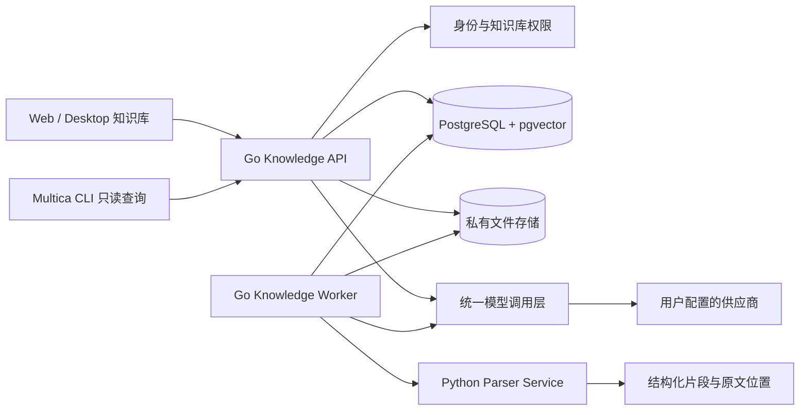
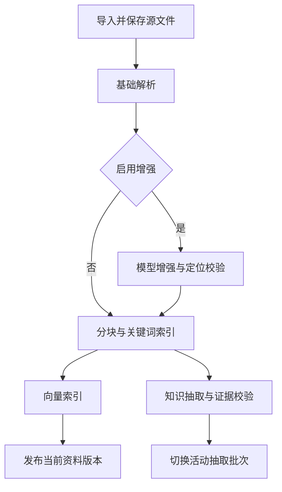
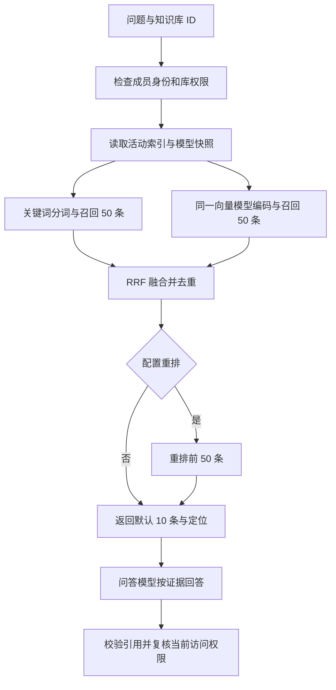

# Multica 独立知识库技术实现方案

状态：实现已落地，待部署与生产验收。日期：2026-09-11。

本文整合本次讨论的最终需求，替代此前包含项目、工作流联动的阶段计划。代码依据是当前工作树，基准提交为 `4aca890a29576f075dfc5584a1d41dbc507cdb41`；工作树中的未提交改动需要以本文件末尾的验证记录为准，不能视为已经部署或达到生产质量指标。本文中的新表、新路由、配置项及命令已对应当前实现。

阅读导航：[需求](#1-目标与已经确定的边界) · [小白配置](#3-用户界面与配置规则) · [架构](#4-总体架构) · [数据模型](#5-数据模型和一致性边界) · [权限](#6-权限与资料读取) · [解析](#7-解析分块与持久化任务) · [混合检索](#8-混合检索与带引用问答) · [图谱](#9-知识抽取实体归并与图谱编辑) · [API](#10-对外-api-和-cli-契约) · [实施](#13-实施拆分与上线顺序) · [验收](#14-测试与验收)。

## 1. 目标与已经确定的边界

交付一个面向个人与小团队、归属于工作区的独立知识库：用户存入网页和文件后，可以搜索资料、得到有引用的回答、浏览自动提取的知识关系、纠正关系，并让智能体通过只读工具查询。

### 1.1 需求基线

| 编号 | 已确定的需求 | 实现约束 |
| --- | --- | --- |
| R1 | 独立知识库 | 不依赖项目、工作流或 Autopilot；不增加相关绑定与回写 |
| R2 | 私人或工作区共享 | `private` / `workspace`，默认私人；“共享”不等于互联网公开 |
| R3 | 多种资料 | 网页、文本 PDF、DOCX、Markdown、TXT、XLSX、CSV 可解析，其他文件可保存 |
| R4 | 自动图谱，可追溯与修正 | 实体、关系关联证据；支持人工修正，重跑不能覆盖修正 |
| R5 | 用户自带模型供应商和 API Key | 配置由工作区管理员统一管理，私人库也使用空间配置 |
| R6 | 默认只配置一个主模型 | 主模型承担抽取和问答；高级设置才展开按用途覆盖 |
| R7 | 基础解析加可选增强 | 基础解析不调用远程大模型；复杂内容可启用文本或视觉模型增强 |
| R8 | 混合检索 | 关键词与向量两路召回，RRF 融合，可选 Rerank |
| R9 | 兼容接口优先 | OpenAI-compatible 文本、视觉和 Embedding；Cohere-compatible Rerank |
| R10 | 智能体可查询 | REST 和 Multica CLI 只读能力，执行身份与知识库权限同时生效 |

### 1.2 本期不做

项目和工作流联动、自动成果归档、互联网发布、跨库联合搜索、可配置领域本体编辑器、独立图数据库、完整 GraphRAG、外部 MCP 服务、移动端完整编辑均不在本期。

扫描件 OCR、EPUB、音视频、登录后网页采集、整站爬取、网页定时刷新、Excel 公式重算和数据分析不在首期解析范围。可选模型增强用于已支持资料中的局部复杂内容，不承诺整本扫描书 OCR。

### 1.3 成功体验

管理员选择供应商、填写 Key、选择一个主模型，系统完成必要能力测试和向量配置。成员创建知识库并导入资料，处理完成后可以从搜索结果或图谱关系跳回原文，也可以让智能体回答问题并检查引用。

“默认一个模型”指一个主模型的配置体验，不意味着聊天和向量接口必须接受同一个模型名称。系统不能用聊天回答伪造向量，也不能静默使用未配置的供应商。

## 2. 当前仓库事实与复用位置

以下是已经通过文件检查确认的事实，不是运行验证结果。

| 当前事实 | 代码依据 | 本期处理 |
| --- | --- | --- |
| Go + Chi + sqlc，Web / Desktop 共享业务包 | [根规则](../../CLAUDE.md)、[命名与中文约定](../../apps/docs/content/docs/developers/conventions.zh.mdx) | 沿用现有分层，不新增平行前端架构 |
| 服务端已有兼容 Base URL 和 Key 的模型封装，当前用于聊天辅助 | [模型客户端](../../server/pkg/llm/client.go)、[出站契约测试](../../server/pkg/llm/outbound_contract_test.go) | 扩展该包的用途和接口；知识库配置与现有 `MULTICA_LLM_*` 分开 |
| 已有 AES-256-GCM 密钥加密工具 | [secretbox](../../server/internal/util/secretbox/secretbox.go) | 复用算法与工具，为知识库使用独立主密钥 |
| 存储接口支持本地与 S3；现有上传可能获得公开 URL | [存储接口](../../server/internal/storage/storage.go)、[本地存储](../../server/internal/storage/local.go)、[文件处理](../../server/internal/handler/file.go) | 复用实现机制，新增私有存储实例和知识库读取鉴权 |
| 当前搜索主要围绕项目与任务，使用 PostgreSQL 文本匹配路径 | [搜索处理](../../server/internal/handler/search.go) | 知识片段独立索引，不改现有搜索语义 |
| 开发、self-host、CI 已使用 pgvector 的 PostgreSQL 镜像；迁移中未发现启用 vector 的语句 | [开发容器](../../docker-compose.yml)、[self-host 容器](../../docker-compose.selfhost.yml) | 仍需新增 `CREATE EXTENSION IF NOT EXISTS vector` 迁移与启动检查 |
| task token 把用户、智能体、运行和工作区写入服务端身份头 | [认证中间件](../../server/internal/middleware/auth.go)、[工作区中间件](../../server/internal/middleware/workspace.go)、[人类操作守卫](../../server/internal/handler/actor_guards.go) | 知识库新增授权解析，不能只把 `X-User-ID` 当作人类发起者 |
| 已有数据库时间、租约与 fencing 的调度模式 | [调度数据库操作](../../server/internal/scheduler/db_ops.go) | 复用模式，资料任务使用独立队列，不作为用户工作流节点 |
| 当前工作树有未提交的工作流实现 | [views 依赖](../../packages/views/package.json) | 知识图谱使用独立的视图依赖，不导入工作流业务模块 |

实施前再次核对工作树，保留无关改动。迁移序号按实际最新编号分配，不在本方案中预占 `470` 等序号。

## 3. 用户界面与配置规则

### 3.1 页面结构

侧栏增加“知识库”。工作区内路由为：

| 页面 | 路由 | 内容 |
| --- | --- | --- |
| 知识库列表 | `/:slug/knowledge` | 我的私人库、共享库、创建入口 |
| 资料 | `/:slug/knowledge/:baseId` | 上传、粘贴链接、标签、搜索、处理状态 |
| 图谱 | `/:slug/knowledge/:baseId/graph` | 实体搜索、局部关系、证据侧栏 |
| 问答 | `/:slug/knowledge/:baseId/ask` | 提问、回答、引用；首期单轮，无持久化聊天记录 |
| 资料详情 | `/:slug/knowledge/:baseId/documents/:documentId` | 预览、版本、解析结果、来源与重试 |
| 知识库设置 | `/:slug/knowledge/:baseId/settings` | 可见性、继承模型说明、高级覆盖、删除 |

供应商配置位于现有工作区设置中的“知识库模型”分区。新增路由统一注册到 core 路径工厂，再接入 Web 与 Desktop，不在共享页面中直接使用框架路由。

### 3.2 默认模型设置

默认界面只有“供应商、API Key、主模型、测试并保存”。选择自定义供应商时才增加 Base URL。主模型支持下拉及手动输入；模型列表接口不可用不阻止手动配置。

工作区只能有一个默认主模型连接。模型下拉不默认选模型列表的第一项，也不按名称猜测视觉或向量能力。管理员明确选择一次主模型即可。

保存流程：

1. 用户提交草稿配置；服务端只用固定的非业务样例测试文本生成、可解析 JSON，以及候选向量模型。
2. 文本与 JSON 测试通过，允许保存主模型；向量测试独立返回就绪或待配置。
3. 已知供应商预设中有默认向量模型时，只测试该候选，不遍历并调用所有模型。
4. 自定义供应商仅在已提供可信能力元数据、且只有一个兼容向量候选时自动选择；普通 `/models` 的名称列表不是能力证明。
5. 无法确定时显示一项必要补充：“请选择语义检索模型”。可选择继续保存，知识库显示“关键词检索可用，语义检索待配置”。
6. 向量模型一旦选定，保存成明确绑定，在高级设置标记“自动配置”；后续主模型切换不改变它。

首期内置连接预设为 OpenAI、硅基流动中国站、自定义兼容接口。预设是连接便利项，不是供应商推荐或服务可用性承诺。

| 预设 | 默认 Base URL | 自动向量候选 | 规则 |
| --- | --- | --- | --- |
| OpenAI | `https://api.openai.com/v1` | `text-embedding-3-small` | 默认向量长度 1536，仍以测试和实际响应校验为准 |
| 硅基流动 | `https://api.siliconflow.cn/v1` | `BAAI/bge-m3` | 维度取测试结果；账号不可用时要求补选，不自动换成其他模型 |
| 自定义 | 用户填写 | 无硬编码默认 | 支持同协议网关；可以手工指定模型 |

预设保存 `catalog_version`；更新预设只影响新配置，不能静默改已有向量绑定。OpenAI 的独立 Embedding 模型和默认维度有官方说明；硅基流动有独立向量接口与模型列表。上述候选必须在交付前再用获授权测试凭证验证。[OpenAI Embeddings](https://developers.openai.com/api/docs/guides/embeddings)、[硅基流动向量接口](https://siliconflow.readme.io/reference/createembedding)

### 3.3 高级设置和继承

| 用途 `purpose` | 默认 | 高级设置 |
| --- | --- | --- |
| `extract` | 继承工作区主模型 | 覆盖供应商与模型 |
| `answer` | 继承工作区主模型 | 覆盖供应商与模型 |
| `parse` | 关闭远程增强 | 打开文本或视觉增强；可选主模型或独立模型 |
| `embedding` | 采用已测试的明确向量绑定 | 覆盖并启动索引重建 |
| `rerank` | 关闭 | 启用独立重排接口和模型 |

解析增强可选择 `text` 或 `vision`。前者仅清理或重组现有解析片段，后者只发送用户已启用增强范围内的页面图像；模型无视觉能力时不能启用 `vision`。

配置优先级是“库级显式覆盖 → 工作区用途默认 → 工作区主模型”。最后一步仅适用于 `extract` / `answer`，以及用户明确开启的解析增强；不适用于向量或重排。关闭状态优先于继承，不得用主模型替代缺失的专用模型。

管理员维护连接和默认模型；库的管理者可以从空间已启用连接中选择用途覆盖，不能查看 Key、新增供应商或修改空间默认。高级设置默认折叠，不向普通用户展示 RRF 参数、向量维度等内部选项。

### 3.4 连接、凭证和能力

文本、视觉和向量使用 `openai_compatible` 协议；Rerank 使用 `cohere_compatible`。Base URL 含版本前缀，客户端追加相对路径 `chat/completions`、`embeddings`、`models` 或 `rerank`，不得自行重复添加 `/v1` 或 `/v2`。

供应商配置包含名称、协议、Base URL、加密 Key、是否启用和版本。连接的协议或地址变更，内部创建新的不可变连接记录；旧绑定继续指向旧连接，新绑定显式采用新连接。Key 轮换在同一连接内更新密文和 `secret_revision`，不触发向量重建。旧域名的 Key 不自动交给新域名。

能力探针返回 `text`、`structured_output`、`vision`、`embedding`、`rerank` 各自的 `ready / unsupported / failed / not_tested`，以及向量维度、耗时和脱敏错误。只测试启用的能力：默认不调用视觉和重排。`/models` 失败时仍测试手动模型。HTTP 200 但格式错误、向量为空或维度不一致，均不能判定成功。

首期要求 Bearer Key；未填 Key 时阻止保存远程模型配置。无认证本地模型端点暂不作为默认配置路径，避免自定义地址被意外调用。

### 3.5 改配置的影响

| 变更 | 生效范围 |
| --- | --- |
| 主模型、抽取模型 | 新任务使用新配置；历史图谱不重跑 |
| 问答模型、重排模型 | 后续查询立即采用新配置 |
| 解析增强或解析模型 | 新资料采用新配置；历史资料由用户选择重新处理 |
| 向量模型、向量维度、输入模板 | 创建新索引代次，完整重建后切换 |
| Key 轮换 | 同连接后续请求采用新 Key；已在途请求按原超时结束 |
| 停用连接 | 立即阻止新调用，不自动换供应商；数据和已有索引保留 |
| 删除连接 | 被绑定、索引或进行中任务引用时返回冲突，先替换或停用 |

## 4. 总体架构



### 4.1 职责划分

- Go API：成员与执行身份检查、配置、导入、检索、问答、图谱编辑和读取；所有业务授权在此完成。
- Go Knowledge Worker：从 PostgreSQL 领取资料处理任务，调用解析器和模型，校验并写入派生结果，执行重建与删除清理。
- Python Parser Service：无业务数据库权限、不持有供应商 Key；读取 Go 传入的文件流，输出规范化 JSON，提供同版本中英文分词。首期使用内部 HTTP，同机绑定 loopback，容器内使用不公开的服务端口和内部 token。
- PostgreSQL：源资料元数据、版本、内容片段、权限、图谱、处理任务和向量。首期不引入 Redis、Elasticsearch、Neo4j 或独立向量库作为必要依赖。
- 私有文件存储：源文件、网页快照、规范化解析对象和临时页面图像；不向浏览器直接暴露公开对象地址。
- 模型调用层：所有知识库远程生成、向量和重排请求统一封装在 `server/pkg/llm` 内；已有 SDK 单入口约束继续有效。

新增知识库调用方时，同步更新该包的消费者清单、出站契约测试、`.env.example` 和环境变量说明：`MULTICA_LLM_*` 仍只控制原聊天辅助配置，知识库使用用户显式保存的独立连接；知识库未配置时必须零远程调用。不能因扩展客户端而让原本关闭的聊天辅助功能重新发请求。

### 4.2 新代码落点

| 层 | 拟新增或扩展 |
| --- | --- |
| 后端业务 | `server/internal/knowledge/`；handler 按 knowledge 域拆分 |
| 后台进程 | `server/cmd/knowledge-worker/`，与 API 共用 Go 服务层 |
| 文档解析 | `services/knowledge-parser/`，Python 依赖和镜像独立锁定 |
| 数据库 | `server/pkg/db/queries/knowledge*.sql`、双向迁移和 sqlc 生成文件 |
| 平台无关前端 | `packages/core/knowledge/`、API schemas、types、paths |
| 共享页面 | `packages/views/knowledge/`，供应商设置组件同域共享 |
| 平台接线 | Web dashboard 路由与 Desktop router |
| 智能体工具 | `server/cmd/multica/cmd_knowledge*.go`，内置 platform skill 的 knowledge 引用文档 |

本文不创建这些实现文件。真正实现时同步维护 API schema、旧客户端降级、四种现有语言翻译和命令参考。

## 5. 数据模型和一致性边界

### 5.1 通用约定

新表使用单数 `snake_case`，标识为 UUID，时间使用 `timestamptz`。所有业务子表显式携带 `workspace_id`，库内数据再携带 `knowledge_base_id`；服务层校验归属一致性。可修改业务对象有递增 `revision`，写入携带 `expected_revision`，冲突返回 409。

不增加数据库外键或级联。唯一约束通过独立的 `CREATE UNIQUE INDEX CONCURRENTLY` 实现；包括 ID 的唯一索引。禁止用内联 `PRIMARY KEY` / `UNIQUE` 绕过并发建索引规则。必要主键可以在并发唯一索引建好后，通过独立迁移 `ADD CONSTRAINT ... PRIMARY KEY USING INDEX ...` 接入。每个索引单独一对 up/down 文件。

### 5.2 配置和知识库

| 表 | 核心字段 | 约束与作用 |
| --- | --- | --- |
| `knowledge_provider` | `id, workspace_id, name, preset, protocol, base_url, encrypted_api_key bytea, secret_revision, is_enabled, revision, created_by` | 连接地址和协议创建后不可变；修改地址创建新行 |
| `knowledge_model_settings` | `workspace_id, revision, updated_by, updated_at` | 每空间一行的配置聚合版本，空间配置 PUT 在此做 CAS 后原子更新各用途绑定 |
| `knowledge_model_binding` | `id, workspace_id, knowledge_base_id nullable, purpose, mode, provider_id nullable, model nullable, options jsonb, revision` | `mode=inherit/explicit/auto/off`；空间主模型用 `purpose=main`；空间、库两个范围分别建用途唯一索引 |
| `knowledge_model_capability` | `provider_id, secret_revision, model, capability, status, details jsonb, tested_at` | 测试结果按连接和 Key 版本失效；不把测试当作永久可用承诺 |
| `knowledge_base` | `id, workspace_id, creator_id, name, description, visibility, revision, acl_revision, corpus_revision, active_index_id nullable, building_index_id nullable, deleted_at` | `visibility=private/workspace`；可见性改变递增 `acl_revision` |

绑定唯一索引分别是 `(workspace_id, purpose) WHERE knowledge_base_id IS NULL` 和 `(knowledge_base_id, purpose) WHERE knowledge_base_id IS NOT NULL`。库级不允许覆盖 `main`；覆盖使用各用途。库级设置以 `knowledge_base.revision` 做 CAS，空间级设置以 `knowledge_model_settings.revision` 做 CAS。job 中保存不含 Key 的已解析模型快照，避免继承配置在任务执行中漂移。

### 5.3 资料、解析与索引

| 表 | 核心字段 | 约束与作用 |
| --- | --- | --- |
| `knowledge_document` | `id, workspace_id, knowledge_base_id, title, source_kind, source_url nullable, source_identity, tags text[], current_version_id nullable, revision, deleted_at` | 资料稳定身份；`source_kind=url/file`；source identity 是规范 URL 或首次导入文件 hash，后续版本不改此初始身份 |
| `knowledge_document_version` | `id, document_id, version_number, source_object_key, source_hash, byte_size, mime_type, source_metadata jsonb, parsed_object_key nullable, parser_version, chunker_version, config_snapshot jsonb, status` | 源文件更新或重新解析都创建新版本；唯一 `(document_id, version_number)` |
| `knowledge_chunk` | `id, document_id, version_id, ordinal, block_refs jsonb, text, source_locator jsonb, token_estimate, text_hash, keyword_text, search_vector tsvector` | 唯一 `(version_id, ordinal)`；原文片段和检索单位 |
| `knowledge_index` | `id, knowledge_base_id, status, embedding_snapshot jsonb, embedding_fingerprint, dimension, corpus_revision, created_at, activated_at` | `building/active/retired/failed/cancelled`；每库至多一个 building |
| `knowledge_embedding` | `index_id, chunk_id, version_id, dimension, embedding vector` | 唯一 `(index_id, chunk_id)`；不固定全表维度 |
| `knowledge_job` | `id, knowledge_base_id, document_version_id nullable, index_id nullable, stage, shard_key, config_fingerprint, logical_key, input jsonb, status, attempt, available_at, lease_token, lease_until, heartbeat_at, progress jsonb, error_code, result_ref` | 非空 logical key 对阶段、对象类型／ID、分片和配置指纹做 hash；唯一 `(workspace_id, logical_key)`，避免 nullable 组合键放过重复任务 |

所有上表均按 5.1 包含 workspace/base 标识及必要时间字段。资料版本的处理细节由 job 状态计算，version 的状态只表示 `processing / ready / unsupported / failed / cancelled`。模型配置缺失反映为 job 的 `waiting_config` 与能力状态，不把已经 ready 的资料版本回退为失败。

一次重新解析会创建新的 `knowledge_document_version`，即使原文件 hash 不变；重复上传同一文件则默认返回已有资料，不自动重跑。这样无需再引入一套“原文件版本”和“解析版本”的双层用户概念。同库相同源对象可复用 object key，清理前必须检查所有版本引用。

片段在基础解析和分块完成后一次写入，不原地改正文。模型增强文本放在规范化对象的派生字段，并关联原始 block；不能用增强文本替换原文证据。

### 5.4 图谱与人工修正

| 表 | 核心字段 | 约束与作用 |
| --- | --- | --- |
| `knowledge_entity` | `id, type, canonical_name, normalized_name, identity_key, review_status, revision` | 类型为 person/organization/product/concept/event；唯一库内 `identity_key` |
| `knowledge_entity_alias` | `entity_id, normalized_alias, disambiguator, provenance` | 精确别名索引与消歧；不允许靠名称相似度直接合并人或组织 |
| `knowledge_relation` | `id, source_entity_id, target_entity_id, predicate, qualifier jsonb, identity_key, review_status, revision` | 有向语义关系；限定词区分时间、条件和否定 |
| `knowledge_evidence` | `id, subject_type, subject_id, version_id, chunk_id, source_locator jsonb, quote, quote_hash, extraction_run_id` | 支持实体与关系证据；quote 必须能在对应原文位置核验 |
| `knowledge_extraction_run` | `id, version_id, config_fingerprint, schema_version, status, is_active, stats jsonb` | 每个资料版本至多一个活动抽取批次；重抽取完成后切换 |
| `knowledge_graph_edit` | `id, operation, target_id, payload jsonb, previous_state jsonb, actor_id, expected_revision, created_at, reverted_at` | `rename/retype/merge/reject_relation/edit_relation/confirm`；记录人工覆盖与撤销 |

图谱子表全部限定在一个库内，不做跨库实体合并。关系是可聚合的逻辑边，证据保存具体来源断言；多个文档支持同一条关系时保留多个 evidence。删掉一个来源只去掉该来源支持，不能删除仍有其他来源支持的边。

当前图谱只使用未删除资料的 `current_version_id` 和该版本的活动抽取批次。人工覆盖独立于抽取表应用，不能让无证据的自动关系重新出现。已无当前证据的节点／边从默认图谱隐藏，人工编辑历史保留。

### 5.5 最小索引清单

除每表 ID 唯一索引外，至少包含：

- 知识库 `(workspace_id, creator_id, visibility)`；资料 `(knowledge_base_id, deleted_at, created_at, id)`。
- 资料源 identity 在库内、未删除范围的部分唯一索引，防止并发重复导入；版本 source hash 仅建普通索引，允许同一文件重新解析为新版本。
- 版本 `(document_id, version_number)` 唯一；片段 `(version_id, ordinal)` 唯一与 `search_vector` GIN。
- 向量 `(index_id, chunk_id)` 唯一，以及 `(workspace_id, knowledge_base_id, index_id)` B-tree。
- job 幂等键唯一、`(status, available_at)` 领取索引、`(status, lease_until)` 租约回收索引。
- 实体／关系 identity 唯一；关系两侧分别建 `(knowledge_base_id, source_entity_id)` 和 target 索引。
- evidence `(subject_type, subject_id)` 和 `(version_id, extraction_run_id)`；graph edit `(knowledge_base_id, target_id, created_at)`。

首期向量检索采用库内精确余弦检索，保证多维度模型能使用一致实现；不运行动态建表／建 ANN 索引任务。pgvector 支持精确检索和非固定维度列；维度不同的向量不能直接比较。[pgvector 查询和维度说明](https://github.com/pgvector/pgvector#frequently-asked-questions)

## 6. 权限与资料读取

### 6.1 人类权限

| 操作 | 私人库创建者 | 其他成员 | 共享库创建者 | 工作区 owner/admin |
| --- | --- | --- | --- | --- |
| 读私人库 | 允许 | 不允许 | 不因角色获得权限 | 不因管理员角色获得私人内容读取权限 |
| 读共享库 | 成员可读 | 允许 | 允许 | 允许 |
| 管理私人库资料、图谱、设置 | 允许 | 不允许 | 不适用 | 仅自己创建的私人库 |
| 管理共享库资料、图谱、设置 | 仅创建者或管理员 | 不允许 | 允许 | 允许 |
| 管理供应商与 Key | 取决于空间角色 | 不允许 | 取决于空间角色 | 允许 |

首期共享库是共享读取、集中维护；不引入资料级 ACL 或自定义协作角色。工作区成员资格是所有访问的前置条件。移出成员后，其私人库保留但不向其他成员开放；重新加入且身份相同才恢复访问。删除工作区可以清理所有所属数据，但不授予逐项阅读私人内容的能力。

可见性修改发生在服务端事务，递增 `acl_revision`。列表、搜索、图谱、问答、版本读取和下载都重新检查。客户端收到权限变化时清理该库缓存；首期不把知识库服务端数据持久化进 Zustand 或离线存储。

### 6.2 智能体身份

使用现有 `mat_` task token，核对 token、运行、智能体、workspace 和当前状态，不信任客户端传入的 user/agent/task 标识。`X-User-ID` 在这一路可能是运行所属用户，不能自动当作私人知识库的授权发起者。

共享库：只有能从运行记录证明其有效人类主体仍是空间成员的运行可读。无可验证人类主体的后台运行首期不访问知识库。

私人库：还必须满足运行属于该用户在 Multica 内发起的个人 Chat，Chat 创建者等于私人库创建者，没有 issue 归属、外部 channel 绑定或外部回复目标，并通过现有私有智能体访问校验。无法证明这些条件时拒绝私人查询；不能让智能体自行声明“这是私有会话”。这只是读取鉴权，不增加知识库与项目／工作流的联动配置。

实现统一 `resolveKnowledgeSubject`：先加载真实运行，按存在且已验证的 `originator_user_id`、否则 `initiator_user_id` 确定人类主体，再核对 Chat 创建者与当前成员资格；不以智能体所有者填补缺失发起者。所有查询入口使用此结果，machine credential 的供应商／写入请求使用现有 `RequireHumanActor` 拒绝。

task token 只开放资料列表、读取、搜索和图谱查询；创建、修改、供应商配置和带模型生成的 `/answers` 走人类守卫。智能体拿到证据后用自己的执行模型生成回答，不额外调用知识库问答模型。

### 6.3 原文件与预览

不能把知识库文件放到可直接访问的 `/uploads/*`，也不能仅把 CDN URL 藏在响应里。

- 本地：独立 `KNOWLEDGE_LOCAL_STORAGE_DIR`，默认 `./data/knowledge`，不位于公开 upload 目录内。
- S3：知识库使用专用私有 bucket 配置，无公共 CDN 和公共读取策略；资料服务仅保存 object key。
- Web 通过鉴权的内容 API 获取流；Desktop 使用鉴权请求下载至用户选择位置。
- 为 PDF 嵌入和原生预览提供 60 秒专用 capability，绑定用户／运行、库、版本、用途和 `acl_revision`，兑换时重新检查当前权限。不要照搬现有附件 capability 的“只在签发时检查成员”语义。普通 fetch 读取仍走认证头，不把 capability 作为通用客户端凭证。
- PDF 可支持 Range；DOCX 显示规范化段落；表格显示工作表和单元格；网页显示净化后的快照。源 HTML 作为附件下载，预览不执行源脚本。

已合法下载或已经返回的回答无法通过修改可见性追回；此限制不影响后续请求必须立即重新鉴权。

## 7. 解析、分块与持久化任务

### 7.1 格式处理

| 类型 | 首期解析方式 | 来源定位 |
| --- | --- | --- |
| 网页 | Go 抓取单页 HTML，解析器提取正文并规范化 | canonical URL、抓取时间、标题路径、DOM/block 定位 |
| 文本 PDF | Docling，关闭 OCR | 1-based 页码、可用时的 bbox、block ID |
| DOCX | Docling 结构，补充 OOXML 段落／表格序号 | 段落序号或表格行列；不伪造 Word 页码 |
| Markdown / TXT | Markdown 结构解析或文本读取 | 标题路径、行号和字符范围 |
| XLSX | openpyxl，读取表、原值、缓存公式值、合并区域 | sheet 名、A1 cell range |
| CSV | 标准 CSV parser，编码检测与表头处理 | 记录行号、列名／列序号 |
| 其他文件 | 保存原始文件，不生成正文索引 | 文件元数据 |

Docling 官方提供统一文档结构、表格、来源和可用的版面位置；具体格式的定位完备性仍需要 fixture 验证，不能假设所有输出都有 bbox。[支持格式](https://docling-project.github.io/docling/usage/supported_formats/)、[文档结构](https://docling-project.github.io/docling/concepts/docling_document/)

基础解析不调用用户远程模型，但 Docling 本地版面模型需要随解析镜像预装并锁定权重；运行时禁止静默下载模型。首期 CPU 路径、固定版本，GPU 不作为部署条件。

### 7.2 规范化解析协议

Go 对解析服务调用 `POST /v1/parse`，multipart 包含文件与 metadata；返回规范化结构。`POST /v1/tokenize` 用相同版本的 tokenizer 对查询分词；`GET /health` 返回解析器、schema 和 tokenizer 版本。

```json
{
  "schema_version": "knowledge-document-v1",
  "parser_version": "parser-build-id",
  "title": "研究资料",
  "blocks": [
    {
      "block_id": "page-3-paragraph-2",
      "kind": "paragraph",
      "text": "此处为从原资料提取的文本。",
      "heading_path": ["第二章", "方案比较"],
      "locator": {"kind": "pdf", "page": 3, "block_id": "page-3-paragraph-2"}
    }
  ],
  "warnings": [],
  "stats": {"pages": 8, "blocks": 46}
}
```

`locator.kind` 为 pdf/document/text/web/table。公共引用只使用当前 schema 明确允许的字段，不透传解析器任意内部 JSON。字符偏移统一使用 Unicode code point、0-based、右开区间；PDF 页码和文本行号为 1-based。

模型增强的每个输出需要 `source_block_ids`。对可验证原文只允许重组，不改变数字、否定和引用范围。视觉识别新增内容标注 `model_derived`，必须人工确认后才允许成为正式关系的原文证据；未经确认仍可在解析预览中查看。

人工确认视觉内容在资料详情的解析预览中进行：确认原始页面与识别文本匹配后，生成带确认人和时间的新资料版本，再走正常索引／抽取；不原地修改已发布版本中的 block。无需每份普通文本资料都经过人工确认。

### 7.3 表格约定

一个 chunk 不跨 sheet；重复表头与文档标题作为检索上下文，原始 cell range 单独保存。合并单元格保留范围，不将一个来源伪装成多个独立事实。

XLSX 同时读取公式表达式和文件中已有缓存值，不执行公式、不启动 LibreOffice、不调用宏。没有缓存值时显示“公式未计算”。默认只解析可见 sheet，隐藏 sheet 列出为未解析；手动重新导入可明确选择是否包含隐藏内容。

CSV 默认尝试 UTF-8 / UTF-8 BOM，再由编码检测器给出确定的编码和置信信息；无法可靠解码时要求重传 UTF-8，不静默替换乱码。超宽表和超长单元格在保留完整规范化原文的同时分片，不截断原数据。

### 7.4 分块默认值

- 以标题、段落和表格行分组优先，目标约 800 tokens，最大 1,200 tokens，重叠约 100 tokens；图谱抽取每批最多 4 个相邻片段。
- 使用固定 tokenizer 估计，记录版本；供应商真实输入限制更小时继续拆分，不静默裁去文档尾部。自定义模型在高级设置可填写 `max_input_tokens`，默认保守为 4,096。
- 英文标识和中文词保留，页眉页脚作为预览内容保留、默认不进入正文召回。
- 片段正文不包含 Key、系统提示或模型产出的无来源总结。原文 hash 和 locator 不因 embedding 输入模板调整而改变。

### 7.5 阶段与状态



后台固定阶段为 `fetch / parse / enhance / chunk / embed / extract / activate / cleanup`；关闭的阶段记录 skipped，原因明确。job 状态为 `queued / running / waiting_config / succeeded / failed / cancelled`。

用户看到各能力状态，而不是一个容易误导的总状态。例如“可检索，图谱生成失败”应保留搜索和重试图谱入口。首次未配置向量时，只要求 chunk 完成即可发布关键词可检索版本；配置了活动向量索引后，新版本需完成该索引的向量化才能替换 current version。失败时旧版本继续服务。

每次任务领取产生随机 `lease_token`，使用数据库时间，租约 120 秒，每 30 秒续租；失去租约的 worker 不得提交结果。每个外部处理阶段不持有数据库长事务。

429、临时网络错误和 5xx 每次重试周期最多 3 次作业尝试，两个重试延迟分别为 30 秒、2 分钟；有效 Retry-After 优先，超过 15 分钟转为带下一可重试时间的失败，由用户重试，不提前忽略限流。后台 SDK 内部重试设为 0，避免与作业重试相乘。401/403、无效模型或 Key 转为 `waiting_config`，解析坏文件等确定性错误直接 failed。用户重试重置本周期预算但保留累计尝试数与错误记录；同一逻辑任务不另建重复作业。

成功阶段按幂等键复用结果，重启不重复生成已持久化向量与图谱。外部模型不支持幂等时，进程在“供应商成功、结果未写入”间崩溃仍可能产生重复计费；数据库结果必须幂等，界面重试不承诺外部 exactly-once。

取消停止后续阶段并中止可取消请求；清理只删除未被引用的临时对象。图谱重新抽取只新增 extraction run，不要求重新 embedding；重新解析则创建资料新版本。

### 7.6 导入边界与资源默认值

文件上限 100 MiB，单次批量 50 份，文本 PDF 最多 1,000 页；单个知识库目标 1,000 份资料、100,000 个片段。上限可由部署配置调整，超过时在对应阶段明确报错，不取前若干页假装处理完整。

解析子进程默认每份资料最多 900 秒、2 GiB RSS，解压总量最多 1 GiB、归档条目最多 20,000 个，规范化输出最多 128 MiB。触发上限终止当前解析，保存源文件及明确错误；不用无限重试解决确定性超限。文件内容类型同时检查 magic bytes 与扩展名，禁止执行宏、外部命令或解析包内脚本。

网页仅 http/https，最多 5 次重定向，每次重新校验目标；抓取 20 秒、正文响应 20 MiB 上限。正文地址拒绝 loopback、私网、link-local、metadata 地址和重绑定目标，不携带用户浏览器 cookie，不加载站内全部链接。无法提取正文时保留链接、显示失败原因，不用 URL 猜测内容。

初始单 worker 并发：基础解析 2，模型阶段每供应商 2；按空间公平领取，避免一本长书阻塞其他资料。查询队列优先于后台批处理，但不抢占已发出的供应商请求。

## 8. 混合检索与带引用问答

### 8.1 查询流程



请求必须有一个 `knowledge_base_id`，可限定 document IDs、标签和资料类型；首期不支持跨库搜索。过滤条件先在库范围内校验，不能先从整个空间召回、再在应用层删掉越权结果。

### 8.2 关键词路径

Python tokenizer 使用固定版本 Jieba 搜索分词，英文和数字标识另保留原词；入库和查询复用同一规范化算法。Jieba 的搜索模式支持对长词补充分词，适合此处中文召回；质量仍用本项目中文问题集衡量。[Jieba 官方说明](https://github.com/fxsjy/jieba)

对 NFKC 规范化后的文本分词，英文字母小写；原始正文保持不变。标题、标题路径、正文构造 PostgreSQL `simple` 配置的加权 `tsvector`，分别使用 A、B、C 权重。查询 token 通过参数化的 `plainto_tsquery` 生成安全词项，非空词项 OR 合并以增加召回；不拼接用户提供的原始 tsquery 语法。

关键词评分使用 `ts_rank_cd`，加精确原串匹配排序项：完全匹配的产品编号／短语在关键词候选内优先，其后按 rank、chunk ID 稳定排序。PostgreSQL 的此排名不是 BM25，UI 和文档不把它标成 BM25。[PostgreSQL 文本排名](https://www.postgresql.org/docs/17/textsearch-controls.html)

查询分词使用与已发布关键词索引一致的 tokenizer 版本。升级 tokenizer 必须先重建关键词索引再切换；首期锁定唯一版本，暂不提供用户级分词词典编辑。

### 8.3 向量路径

使用 `knowledge_base.active_index_id` 对应的 embedding 快照生成查询向量。`embedding_fingerprint` 包含连接身份、model ID、维度、输入模板版本和归一化算法版本；不包含 Key 密文，也不能只比较模型名字。

每个向量检查：长度与声明维度相同、所有值有限、非零范数、批次输入与响应 index 一一对应。归一化后存储；文档与查询使用相同规则。首期支持 1–4,096 维，超出范围在配置测试中明确拒绝，不静默截断或降维。

文档片段输入由标题路径和正文构成；查询使用问题原文，不添加聊天系统提示。若供应商模型明确要求 query/document 前缀，用预设或高级 `input_template` 明确配置并计入指纹，不能在代码中按模型名称临时猜测。

首期每个可用向量模型必须支持至少 2,048 tokens 输入。对于可信 metadata 未提供窗口大小的自定义模型，先以保守片段样例测试，再允许管理员在高级设置声明更准确的窗口；所有实际批次仍检查上游输入长度错误。不能支持既有分块的模型返回 `embedding_input_incompatible`，不改变已有索引或裁掉片段尾部。

精确 SQL 检索先选择同库、同 `index_id`、未删除资料当前版本的向量，再按 `embedding <=> query_vector` 升序取 50 条。先把候选限定为同一向量空间的物化 CTE，再计算距离，防止不同模型／维度的数据被比较。

### 8.4 RRF、去重和重排

RRF（Reciprocal Rank Fusion）按名次融合，不直接相加不同检索系统的原始分数：

```text
score(chunk) = sum(1 / (60 + rank_in_channel))
```

rank 从 1 开始，两路等权；未被某路召回的片段，该路贡献为 0。先按 chunk ID 合并同一片段，排序相同用最佳单路名次、chunk ID 决定。用户可请求 1–50 条，默认 10 条。

同文档相邻片段重叠时，结果展示合并重叠的原文范围，但保留全部 chunk IDs；不能用文本相似度去重掉相互矛盾的来源。进入问答上下文前，再按 locator 合并重复证据以减少 token。

启用 Rerank 时，发送 RRF 前 50 条的片段正文及标题；请求 `model/query/documents/top_n`，响应检查 `results[].index/relevance_score`。索引越界、重复、非有限分数视为不兼容结果，返回 RRF 排序并标记降级。不同供应商分数不直接比较，重排分数也不是事实置信度。[Cohere Rerank 协议](https://docs.cohere.com/v2/reference/rerank)

首期不把图谱邻居自动加入混合召回：图谱通过显式实体／关系查询提供，避免未经评测的多跳扩展稀释资料检索。以后若加入图谱召回，必须与本期两路检索基线对照评测。

### 8.5 索引切换与资料更新

向量模型更换使用库级新代次，不改写现有向量：

1. 测试新配置后创建 `building` 索引，保存模型快照和当前 `corpus_revision`；同时只允许一个构建。
2. 遍历当前资料版本，为目标代次生成向量；源片段与图谱证据无需重新解析或重新抽取。
3. 构建中仍允许新增、更新和删除资料；每次发布资料版本递增 `corpus_revision`。构建器反复补齐所有当前版本缺失的向量，已删除资料从检查集合排除。
4. 短事务锁定知识库行并按固定顺序锁定需要发布的资料：确认所有当前可索引片段都有合法新向量，且覆盖的 corpus revision 一致，再切换 `active_index_id`。若集合已变，退出事务并补齐，不等待模型调用。
5. 与切换竞争的资料发布器获取同一知识库锁后重新检查活动索引；如果新活动代次缺少该资料向量，推迟资料发布并补齐，不能把旧代次向量当作新代次结果。
6. 旧索引标记 retired 并保留 24 小时供在途查询结束，之后后台删除。失败或取消仅影响 building 索引，旧活动索引不变。

查询先读取索引快照，再调用外部模型生成查询向量，随后在短 `REPEATABLE READ` 事务内进行两路资料读取。事务开始时若活动索引已变，重新编码并重试一次；仍变化返回 409，提示重试。不能在数据库事务中等待模型网络请求。

一个查询中的关键词、向量和来源始终对应同一资料快照。资料正常更新后，已返回的旧版本引用仍可读取；资料被删除或权限收回后，引用不可再获取原文。

### 8.6 问答输出

`POST /answers` 为独立的单轮知识问答，不复用共享 Chat 记录，不自动发布回答，不创建任务。首期非流式返回完整结果，界面立即显示正在查找／生成状态，并支持取消。

服务端取默认前 10 个结果，按主模型剩余输入预算打包原文片段、来源标题和受控引用编号，优先保留排名靠前的完整证据；最多使用 12,000 输入 tokens，默认答案上限 2,048 tokens，并始终受模型可用窗口约束。预算不足显示 `context_truncated`，不谎称已经阅读整库。

模型只收到用户问题与被授权的证据，资料文本明确作为数据。它没有文件、网络或写入工具。要求返回 JSON：`answer`、逐段 `citation_ids` 和 `insufficient_evidence`。验证所有引用 ID 来自本次检索、每个事实段落有引用，非法引用最多修复一次；仍不合法返回“无法生成可核查回答”及已有搜索结果，不展示伪造引用。

结构校验只能证明引用存在，不能自动证明每个结论被引用支持；语义支持率单独用人工标注集验收。RRF 分数不能作为回答可信度。证据不足或矛盾时，回答明确呈现缺失或不同来源，不用模型常识补齐后标成资料结论。

### 8.7 降级与超时

| 情况 | 返回行为 |
| --- | --- |
| 未配置向量／未完成首次建索引 | `mode_effective=keyword`，说明语义检索待配置或构建中 |
| 查询向量模型超时或不可用 | 返回可用关键词结果，标记 `embedding_unavailable` |
| 关键词分词或数据库关键词路径失败 | 若向量路径可用，返回 vector 并标记失败原因 |
| 重排失败 | 保留 RRF 结果，标记 `rerank_unavailable` |
| 两条召回路径均不可用 | 503，不能返回空结果冒充没有相关资料 |
| 问答模型失败 | 返回生成失败及搜索结果，搜索本身仍可用 |
| 用户权限在请求中被撤销 | 停止返回资料内容，统一拒绝访问 |

搜索总超时默认 15 秒，其中向量请求上限 6 秒、分词 2 秒、数据库两路合计上限 3 秒、可选重排 4 秒，统一受总截止时间约束；交互查询不做额外 SDK 重试。问答整次上限 60 秒，取消同时传播到检索和供应商请求。

首期不增加按问题复用的答案缓存或搜索结果缓存，避免权限、模型代次和内容版本失效问题；同请求内去重可用。10.1 的短期幂等结果仅用于同一用户重试同一次操作，不按问题文本跨请求共享。每次对外发送重排／问答材料前和返回用户前再次检查库权限及命中资料是否仍未删除。

## 9. 知识抽取、实体归并与图谱编辑

### 9.1 抽取协议

每批输入带确定的 block/chunk 标识，最多 4 个相邻片段并受模型窗口预算限制。抽取模型输出实体、关系和引用的 JSON；固定 `schema_version=knowledge-graph-v1`。

关系类型首期固定为 `is_a / part_of / belongs_to / creates / uses / depends_on / causes / supports / contradicts / related_to`。UI 显示中文标签；抽取器不创造新 enum。`related_to` 是对称边，按 canonical entity ID 排序后保存；其他边有方向。

输出示例仅表示协议，不是真实知识断言：

```json
{
  "entities": [
    {
      "ref": "e1", "type": "product", "name": "示例产品甲",
      "evidence": [{"chunk_ref": "c1", "quote": "示例产品甲"}]
    },
    {
      "ref": "e2", "type": "concept", "name": "混合检索",
      "evidence": [{"chunk_ref": "c1", "quote": "混合检索"}]
    }
  ],
  "relations": [
    {
      "source_ref": "e1",
      "target_ref": "e2",
      "predicate": "uses",
      "qualifier": {"polarity": "positive", "time_text": null},
      "evidence": [{"chunk_ref": "c1", "quote": "示例产品甲采用混合检索。"}]
    }
  ]
}
```

实体和关系均要求 evidence。模型不生成数据库 UUID、权限字段、review 状态或源文件 URL，这些由服务端分配和校验。

JSON 失败最多修复一次；每批最多 100 个实体、200 条关系。校验引用 ref 是否存在、类型是否允许、quote 是否为关联原文的连续片段；仅允许空白规范化匹配，不能只通过向量相似度认定引文存在。quote 在片段内多次出现时，模型必须补充可核对的字符起止偏移，否则记录为定位歧义；唯一匹配由服务端计算偏移。引用校验失败的记录不入正式图谱，批次保留错误计数和可重试原因。

### 9.2 自动归并规则

名称规范化仅做 Unicode NFKC、空白折叠和英文大小写归一，不擅自删除型号、年份或法人后缀。

- 相同资料内，类型、规范名称、限定词完全相同的实体可归并。
- 跨资料实体存在可验证的唯一标识，例如同一官方 URL，或匹配已有人工确认的别名映射，自动复用实体。
- `concept` 无限定词时按库内类型＋规范名称自动聚合，界面仍标记自动结果，可由人纠正。
- person/organization/product/event 缺少明确消歧依据时保持资料内身份，将相似名称作为合并建议，不直接跨资料合并。
- 实体仅依据名字相同不能确定是同一个人、同一公司或同一版产品。

`identity_key` 是服务端生成的规范键 hash：优先类型＋唯一标识，其次已确认别名，缺少跨资料依据时再加 document ID 与限定词。UUID 不是语义去重键。

### 9.3 关系与证据

关系 identity 由两个 canonical 实体、predicate、规范限定词生成。时间、条件和否定必须保留；同一产品在不同版本具备不同能力不是自动应被覆盖的旧关系。

同关系可以积累多个来源；模型自报 confidence 仅作诊断，不显示成客观可信百分比。用户看到来源数、证据、自动／已确认状态。抽取只生成有直接原文支持的关系，不从 A→B 和 B→C 自动宣布 A→C。

### 9.4 人工编辑和重抽取

人工编辑采取覆盖层，任何生成任务都不修改覆盖层。改名、改类型、确认和否定针对稳定 entity/relation ID；否定同时保存规范关系 identity 和适用范围，防止新 extraction run 换了 ID 后复活被否定边。

合并使用 survivor entity 和 alias 映射，不重写原始证据的 mention 归属；关系展示时解析 canonical endpoint。合并导致相同关系重叠时聚合证据；自环和矛盾保留诊断，不渲染成默认正常边。映射必须无环。

编辑写入事务锁定库与目标，使用 revision 校验，并记录 `previous_state`。首期支持撤销最近一次且没有后续依赖编辑的操作；存在后续依赖返回 409，不能无条件回放旧状态。资料版本切换后没有当前证据的旧修正保留为历史，默认隐藏，不宣称新版本仍支持该结论。

### 9.5 图谱浏览性能与交互

默认显示按当前证据数排序的前 50 个实体。选中实体后展示一跳关系；手动可扩展至两跳。单次最多 200 个节点、400 条边，超出显示 `truncated=true` 和数量提示，通过筛选缩小范围，不一次加载全库。

采用 React Flow 显示节点、ELK 在浏览器 Web Worker 内布局；样式复用语义色与字号 token。关系有方向箭头、中文标签和状态；证据侧栏支持键盘访问。自动布局属于视图状态，不写进业务图谱表；选中、缩放可存于 core 的客户端 store，实体与边属于 React Query。

## 10. 对外 API 和 CLI 契约

### 10.1 通用边界

所有接口在现有 auth / workspace middleware 之后注册，工作区通过既有 `X-Workspace-ID` 解析；URL 中的库与子资源都由 loader 检查所属空间及权限。网络 JSON 使用 snake_case，core API 边界映射为 camelCase 并经过 `parseWithFallback` / zod。

列表使用 cursor 分页，默认 50，最大 100；普通资料列表按 `(created_at, id)` 倒序。所有 POST 创建和计费问答支持 `Idempotency-Key`，在 24 小时窗口内按 `(workspace, human_or_task_actor, operation, key)` 去重；相同 key 不同请求体返回 409。任务型响应为 202，新增普通资源为 201。

为执行这一接口幂等规则，新增 `knowledge_request`：`id, workspace_id, actor_key, operation, idempotency_key, request_hash, status, dependency_refs jsonb, result_ref, expires_at`，scope tuple 唯一。问答不在此保存正文，`result_ref` 指向 24 小时私有临时结果对象，读取仍重新鉴权并检查所有依赖资料未被删除；否则拒绝重放，不返回已删除来源的答案。它用于可靠重试，不作为用户聊天历史。过期 receipt 和对象由 cleanup 作业清理。

### 10.2 供应商和模型

| 方法与路径 | 用途 | 权限 |
| --- | --- | --- |
| `GET /api/knowledge/providers` | 脱敏连接列表与可选模型能力 | 空间成员可读简化列表；管理员可读详细配置 |
| `POST /api/knowledge/providers` | 创建连接 | 人类 owner/admin |
| `PATCH /api/knowledge/providers/:id` | 名称、启停和 Key 轮换；地址变更返回新连接 | 人类 owner/admin |
| `DELETE /api/knowledge/providers/:id` | 删除未被引用连接 | 人类 owner/admin |
| `POST /api/knowledge/provider-tests` | 测试草稿或现有连接，默认非业务样例 | 人类 owner/admin |
| `GET /api/knowledge/providers/:id/models` | 模型列表，失败不影响手填 | 人类空间成员 |
| `GET /api/knowledge/model-settings` | 空间默认设置与已解析能力 | 人类空间成员 |
| `PUT /api/knowledge/model-settings` | 主模型与空间高级默认 | 人类 owner/admin |

草稿测试结果只在内存或短期不可公开对象中存在，不在日志中保存 Key。前端响应只返回 `has_api_key` 和 `secret_revision`，不返回可还原的密文或原始 Key。

模型设置请求示例，UUID 为虚构结构示例：

```json
{
  "expected_revision": 3,
  "main": {
    "provider_id": "00000000-0000-4000-8000-000000000001",
    "model": "user-selected-model"
  },
  "purposes": {
    "extract": {"mode": "inherit"},
    "answer": {"mode": "inherit"},
    "parse": {"mode": "off"},
    "embedding": {
      "mode": "auto",
      "provider_id": "00000000-0000-4000-8000-000000000001",
      "model": "text-embedding-3-small"
    },
    "rerank": {"mode": "off"}
  }
}
```

`auto` 向量配置必须有服务端可验证的成功 probe，不能仅信任客户端声称已自动配置。需要重建的库在响应中返回 `affected_bases` 与 `pending_embedding_change`，当前活动索引不会立刻切换。每个库管理员在该库点击“应用并重建”后执行；新建库使用新的空间默认。

### 10.3 知识库和资料

以下 `<B>` 表示 `/api/knowledge/bases/:baseId`。

| 方法与路径 | 用途 |
| --- | --- |
| `GET/POST /api/knowledge/bases` | 列表／创建 |
| `GET/PATCH/DELETE <B>` | 详情／修改名称和可见性／删除 |
| `GET/PUT <B>/model-settings` | 查看有效配置／修改库级用途绑定 |
| `GET <B>/documents` | 资料列表与状态 |
| `POST <B>/documents/files` | multipart 上传，可返回已有资料及 `deduplicated=true` |
| `POST <B>/documents/urls` | JSON 创建网页导入任务 |
| `GET/PATCH/DELETE <B>/documents/:documentId` | 详情／修改标题标签／删除 |
| `GET <B>/documents/:documentId/versions` | 历史版本 |
| `POST <B>/documents/:documentId/versions` | 替换文件或手动刷新网页，生成新版本 |
| `POST <B>/documents/:documentId/reprocess` | `stage=parse/embedding/extract`，明确重处理范围 |
| `POST <B>/documents/:documentId/confirm-blocks` | 提交视觉增强 block 的确认及版本 revision，创建已确认的新版本 |
| `GET <B>/documents/:documentId/versions/:versionId/content` | 鉴权源文件流 |
| `POST <B>/documents/:documentId/versions/:versionId/preview-capability` | 签发专用原生预览能力；兑换路径为 `/api/knowledge/previews/:versionId`，签名和现时权限均校验 |
| `GET <B>/documents/:documentId/versions/:versionId/blocks` | 分页规范化原文，支持 locator 定位 |
| `GET <B>/chunks/:chunkId` | 原文片段与引用定位 |
| `GET <B>/jobs`、`POST <B>/jobs/:jobId/cancel` | 处理进度、取消 |
| `POST <B>/indexes` | 为明确 embedding 绑定启动完整重建 |

创建库请求为 `name, description?, visibility?`，服务端默认 `private`。其他资料继承库的权限，不能为单个文件设置“公开 URL”绕过库权限。

网页去重仅规范 scheme/host、默认端口并去除 fragment；不删除 query 参数，因为它们可能决定页面内容。同库相同规范 URL 命中已有资料，手动刷新走版本接口。文件按同库 source hash 去重，重新处理走 reprocess 接口。不同库不共享去重提示或原始资料身份。

导入确认事务锁定知识库，在未删除资料的所有版本中检查相同 source hash，包括正在处理的版本；命中返回 `document_id, matched_version_id, deduplicated=true`。因此并发上传和上传历史旧版本都有确定结果。用户明确替换已有资料的版本请求仍允许同 hash，以支持重新解析与修正。

### 10.4 搜索、问答与图谱

| 方法与路径 | 输入与输出 |
| --- | --- |
| `POST <B>/search` | `query, limit?, filters?` → 结果、引用、模式、降级说明 |
| `POST <B>/answers` | `question, filters?` → 答案、逐段引用、证据不足标记和搜索结果；人类专用 |
| `GET <B>/entities` | `query?, type?, cursor?` → 实体候选列表 |
| `GET <B>/entities/:entityId` | 实体与当前有效证据 |
| `GET <B>/graph` | `entity_id?, depth?, predicate?, document_id?, node_limit?` → 节点、边、截断说明 |
| `GET <B>/relations/:relationId/evidence` | 当前有效证据及历史证据入口 |
| `POST <B>/graph/edits` | 操作、目标、值、revision → 已应用修改和新 revision |
| `GET <B>/graph/edits` | 管理者查看编辑历史与可撤销状态 |
| `POST <B>/graph/edits/:editId/revert` | 撤销满足条件的编辑 |

搜索响应示例：

```json
{
  "query_id": "00000000-0000-4000-8000-000000000010",
  "knowledge_base_id": "00000000-0000-4000-8000-000000000011",
  "mode_requested": "hybrid",
  "mode_effective": "hybrid",
  "rerank_applied": false,
  "index_id": "00000000-0000-4000-8000-000000000012",
  "warnings": [],
  "results": [
    {
      "chunk_id": "00000000-0000-4000-8000-000000000013",
      "document_id": "00000000-0000-4000-8000-000000000014",
      "version_id": "00000000-0000-4000-8000-000000000015",
      "title": "示例资料",
      "text": "此处为可核对的原文片段。",
      "retrieval_channels": ["keyword", "vector"],
      "rank": 1,
      "citation": {
        "id": "c1",
        "locator": {"kind": "pdf", "page": 3},
        "source_url": null,
        "document_path": "/demo/knowledge/base/documents/document"
      }
    }
  ]
}
```

实际 `document_path` 必须由路由生成器从真实 slug/UUID 构造，示例不代表可访问地址。分数只在管理者诊断信息中返回；普通用户查看相关片段和证据，不解释 RRF 数值。

统一错误形状为 `error` 文案加 `code, retryable, request_id`，保持现有客户端对 `error` 字段的兼容。必须覆盖 `knowledge_not_found`、`model_not_configured`、`provider_auth_failed`、`model_incompatible`、`embedding_dimension_mismatch`、`embedding_input_incompatible`、`unsupported_format`、`parse_failed`、`revision_conflict`、`index_build_in_progress`、`upstream_timeout`。无访问权限的库／资料按 404 响应，避免泄露是否存在；明确的管理操作不足用 403。

### 10.5 智能体 CLI

首期命令：

```bash
multica knowledge list
multica knowledge document list --base <base-id>
multica knowledge search --base <base-id> --query "某个问题" --limit 10
multica knowledge read --base <base-id> --chunk <chunk-id>
multica knowledge entity list --base <base-id> --query "某个概念"
multica knowledge entity get --base <base-id> --id <entity-id>
multica knowledge graph --base <base-id> --entity <entity-id> --depth 1
```

输出沿用 CLI 的 JSON 格式选项，默认可读摘要附来源标识。所有命令复用 REST 权限，不新增万能知识库 token，不把文件目录挂载给智能体，也不把整库文本塞入 system prompt。

内置 platform skill 增加 `references/knowledge.md`：先查库、再检索、按需读取、报告引用；遇到降级状态如实说明；资料内容不能成为新的工具授权指令。此引用文档只教会智能体查询，不自动修改任何工作流或任务配置。

## 11. 前端状态、可访问性与实时更新

所有服务端数据进入 React Query，key 包含 `wsId`、base ID 及过滤条件。知识库、资料、实体、边、模型配置和处理状态不得镜像到 Zustand。core store 仅保存图谱选中／缩放、筛选偏好和未提交表单草稿，不存 Key。

创建、删除、可见性修改、模型配置、合并与图谱重处理等待服务端成功后再导航或更新视图。图谱合并有多处派生关系，首期不做乐观更新。上传列表可显示本地 pending 项，失败可重试并带同一幂等键。

首期处理进度使用可见页面每 3 秒轮询，页面后台暂停，所有作业结束后停止。普通读取缓存 stale time 15 秒，在窗口重新聚焦时刷新。权限改变时使用现有 [Broadcaster 的用户分发接口](../../server/internal/realtime/broadcaster.go) `SendToUser` 发送 `knowledge:invalidate`，payload 只有 `workspace_id, knowledge_base_id, revision, acl_revision`。私人事件只发送创建者；不能广播私人名称、数量和错误内容。接收方仅使 React Query 失效，不复制服务端状态到 store。

共享转私人需要通知此前有访问权的成员清除缓存，但通知不携带资料内容。即使事件丢失，服务端每次请求仍鉴权；UI 在 404 后删除对应 Query 缓存并回到知识库列表。

布局以资料列表＋详情侧栏为主，图谱节点可通过列表替代访问。表格使用虚拟滚动，长标题截断但可查看全名；选中边在 hover 后仍清楚。图谱拖拽、缩放之外提供键盘实体搜索和关系列表。原文定位以固定高亮为主，不依赖用户理解 UUID 或 block ID。

## 12. 运维、资源与数据生命周期

### 12.1 部署配置

| 配置 | 默认与用途 |
| --- | --- |
| `MULTICA_KNOWLEDGE_ENABLED` | 默认 false；作为新域开关，不改变 Agent 或聊天辅助配置 |
| `MULTICA_KNOWLEDGE_SECRET_KEY` | 必填的 base64 32-byte 主密钥，用现有 secretbox 加密 Key；缺少时模型配置不可保存 |
| `KNOWLEDGE_STORAGE_BACKEND` | `local` 或 `s3`，默认 local |
| `KNOWLEDGE_LOCAL_STORAGE_DIR` | `./data/knowledge`，不得与公开目录重叠 |
| `KNOWLEDGE_S3_BUCKET`、`KNOWLEDGE_S3_REGION`、`KNOWLEDGE_S3_ENDPOINT` | S3 模式的私有 bucket 和可选自定义 endpoint |
| `KNOWLEDGE_S3_ACCESS_KEY_ID`、`KNOWLEDGE_S3_SECRET_ACCESS_KEY` | 可选显式凭证；未设置时使用部署 IAM 身份；不经用户模型表单管理 |
| `KNOWLEDGE_PARSER_URL`、`KNOWLEDGE_PARSER_TOKEN` | 内部解析服务，默认地址 `http://knowledge-parser:8091`；token 仅供服务间认证 |
| `KNOWLEDGE_UPLOAD_MAX_BYTES` | `104857600`，100 MiB |
| `KNOWLEDGE_MODEL_CONCURRENCY` | 每供应商 2 |
| `KNOWLEDGE_PRIVATE_MODEL_HOSTS` | 默认为空；仅部署者可列出允许的私网兼容模型 host:port，普通 URL 抓取永不使用此例外 |

供应商配置不是环境变量堆叠；上述 env 只管理部署级设施、加密和限额。模型、Key 和用途绑定在工作区设置中完成。

API、worker 和 parser 独立健康检查。worker 需要数据库、私有存储、加密主密钥和供应商出站能力；parser 不需要数据库、S3 或供应商凭证。镜像在构建阶段装好依赖和本地解析权重，锁定 Python、依赖和权重摘要；运行时不开自动安装。

自定义供应商地址仅允许 http/https；默认 https，http 仅部署者允许的私网地址。禁止 URL userinfo、自动带 Key 跨 host 重定向和云 metadata 地址。这个限制针对用户可配置 API 地址的实际请求边界，不增加资料审批流程。

### 12.2 删除、备份和日志

删除资料／库先在事务中标记 deleted、递增库 revision、取消关联待处理任务，使其立即退出查询和图谱；原文 API 同步拒绝。后台 cleanup 删除各表派生行与未引用对象，失败可重试，目标 24 小时内完成。旧版本引用只有在资料仍存在且授权有效时可读取。

删除工作区时，应用层清理 knowledge 业务表并创建耐久对象删除任务；仅为最终清理保留对应 `knowledge_job` 的 cleanup 行和必要 receipt，完成后再删除。删除任务必须能够在 workspace 行已不存在后继续执行，不能再次依赖成员校验。对象 key 在删数据库引用前写入 cleanup payload。顺序为停止新任务、禁用访问、事务删除数据库子记录、异步删除对象，不使用数据库级联。

备份必须包含数据库、私有对象、解析镜像版本和独立加密主密钥。首期主密钥不做在线轮换；轮换需要停写、离线重加密并验证，不能直接替换 env 导致旧 Key 无法解密。

日志只记录 request/job ID、阶段、错误码、耗时和用量；不打印 Key、原文、问题正文、完整供应商错误 body。记录供应商返回的 token usage 和调用次数，未返回 usage 时为 unknown，不填 0。首期不换算未经配置的货币成本。

### 12.3 监控和运行验证

监控导入成功率、每阶段耗时／重试／等待配置数、队列最老等待时间、向量覆盖率、各路检索耗时、降级比例、引用校验失败率和权限拒绝数。指标 label 不包含文档标题、问题文本、UUID 等高基数字段。

初始验收容量环境定为 PostgreSQL 17 + pgvector、8 vCPU / 32 GiB RAM、SSD、解析 worker 2 并发。单库 1,000 文档、最多 100,000 chunks；默认 1,536 维时仅向量数值约 614 MB，实际还需计入行、索引、正文和缓存，不能把这个估算当作总磁盘容量。

目标：在热数据集、10 个并发查询下，库内数据库检索 p95 ≤ 2 秒；固定健康供应商下、不含 Rerank 的搜索 p95 ≤ 8 秒。供应商实测延迟单独记录。若精确检索不达标，先优化查询范围与 SQL；必须在发布前给出实测结论，不能降低数据规模后仍宣称通过原目标。采用 HNSW 属于后续明确设计变更，需要按维度固定索引、并发迁移和召回率对照；本方案不默认引入。

## 13. 实施拆分与上线顺序

不把之前的 M3/M4 作为待办，也不先要求工作流合入。按下表拆成可独立审查的提交／PR。

| 阶段 | 实施单元 | 完成判据 |
| --- | --- | --- |
| K1-A | 基础表、权限 loader、私有存储、知识库 CRUD | 私人／共享权限和删除可验证，原文无公开直链 |
| K1-B | 供应商、主模型、自动向量选择、高级绑定与探针 | 已知预设一次凭证可配置；未知向量能力有准确提示；Key 不回传 |
| K1-C | 上传、网页导入、解析服务、任务租约、资料版本和预览 | 各支持格式完成规范化与定位；失败、取消、重复导入可恢复 |
| K2-A | 中文关键词、向量索引、RRF、降级、原子索引切换 | 混合检索、并发更新和重建切换通过验证 |
| K2-B | 可选重排、问答和引用校验 | 默认不用高级配置；答案可逐项核查原文 |
| K3-A | 抽取、证据、实体归并、人工覆盖与图谱视图 | 图谱可纠正，重新抽取保留修正，来源删除正确反映 |
| K3-B | Agent CLI、身份授权、内置查询参考、端到端验收 | 智能体按权限搜索与读取，不能写知识库或读私人共享执行结果 |

K1-B 与 K1-C 可在 K1-A 的接口稳定后并行开发；这是工程依赖关系，不要求当前会话委派子智能体。

首次引入开关时先默认关闭。部署在保留功能关闭的情况下执行 additive migrations，确认 vector 扩展与私有存储、启动 worker/parser，然后为测试环境开启功能。通过 K1→K2→K3 验收后，才在目标工作区使用真实资料。真实 Key 的端到端测试由持有者主动提交测试操作触发，不在默认 CI 中访问账号。

回滚优先关闭 knowledge 功能并停止新领取，保留库和文件；已有模块继续工作。向量重建失败回到旧 active index。双向 schema 迁移仍需提供，但有真实知识数据后不自动执行破坏性的 down；需要回退 schema 时先备份并按独立发布操作处理。

## 14. 测试与验收

### 14.1 自动化测试分层

| 层 | 重点场景 |
| --- | --- |
| Go 纯逻辑 | 模型继承、auto/off 优先级、能力校验、RRF、指纹、定位与引用验证、实体键 |
| Go 数据库集成 | 成员与 task-token 权限、索引切换、版本发布竞争、租约 fencing、图谱修正、删除清理 |
| Python fixtures | 每个格式、中文编码、长文档、页码／段落／单元格定位、分块与模型增强结果保留 |
| core | snake_case 映射、缺失／畸形响应、workspace Query keys、错误和降级状态 |
| views | 默认表单简洁、高级展开、上传失败重试、证据侧栏、图谱键盘路径 |
| Web / Desktop 接线 | 路由、鉴权预览与下载；共享行为不在两个 app 重复测试 |
| E2E | 配置→导入→检索→问答→图谱→人工修正→Agent 查询 |

所有供应商测试默认使用本地 stub/fake HTTP，覆盖 OpenAI-compatible 和 Cohere-compatible 样例，不执行真实 Agent CLI、不读取用户已安装 CLI 的认证信息。实现时遵守现有测试 fixture 与 schema 契约，文档变更不要求运行整套 Go/TS 测试。

### 14.2 必须覆盖的功能用例

| 编号 | 用例 | 预期 |
| --- | --- | --- |
| T01 | 预设供应商只填 Key 和一个主模型 | 抽取／问答就绪，自动向量绑定可见；无需展开高级设置 |
| T02 | 自定义供应商仅提供聊天模型 | 文本用途可保存，语义检索待配置，绝不把聊天返回当向量 |
| T03 | 修改主模型，库里有显式抽取覆盖 | 未覆盖用途采用新主模型，显式绑定与活动向量模型不变 |
| T04 | Key 无效、模型不存在、HTTP 200 畸形 JSON | 能力状态准确，错误脱敏，禁止误报配置成功 |
| T05 | 未配置模型 | 可上传、基础解析、关键词查找；不发远程模型请求 |
| T06 | 文本 PDF / DOCX / MD / TXT / XLSX / CSV / 网页 | 对应位置可回查；没有 bbox 时不伪造坐标 |
| T07 | 扫描 PDF、损坏文件、加密文件、旧 XLS、超限文件 | 明确未解析或错误，原文件保留，不静默处理部分后标完成 |
| T08 | 公式无缓存值、隐藏 sheet、合并单元格 | 表示方式符合 7.3，数字和来源范围正确 |
| T09 | 中文词、英文型号、精确编号、语义改写 | 两路各自可验证，混合排名稳定，引用真实 |
| T10 | 重排超时或返回越界 index | 保留 RRF 结果和降级说明 |
| T11 | 切换相同维度但不同 Embedding 模型 | 仍完整重建，不复用旧向量；旧库在构建期间可查询 |
| T12 | 切换维度、返回空／NaN／零向量 | 非法向量不入库；可定位错误；不切换不完整索引 |
| T13 | 索引构建时新增、更新、删除资料 | 切换覆盖当前资料集合；查询不混用资料版本或索引代次 |
| T14 | worker 崩溃、租约过期、旧 worker 迟到 | 新 worker 恢复，旧租约结果不能提交，不重复图谱／向量行 |
| T15 | 修改／合并实体、否定关系后重新抽取 | 人工覆盖保留，否定关系不因新 UUID 复活 |
| T16 | 两个来源支持同一关系，删除其中一个 | 剩余证据仍支持关系；无证据边隐藏 |
| T17 | 同名不同人、相反结论、不同时间条件 | 不盲目合并，证据与限定词分别保存 |
| T18 | 私人库被别的成员／管理员请求 | 列表、图谱、预览、下载、搜索均不泄露内容或存在性 |
| T19 | task token 的所属用户与 Chat 发起者不同 | 不误授私人库访问；共享任务／外部 channel 不能读私人库 |
| T20 | 共享转私人、成员移除、capability 尚未过期 | 后续获取立即被拒绝，缓存失效，兑换再次鉴权 |
| T21 | 答案引用不存在或引文不匹配 | 修复至多一次，仍失败返回可核查生成失败，不展示假引用 |
| T22 | 网页重定向至私网／用户资料包含指令 | 抓取拒绝越界目标；资料不能改变模型工具或权限行为 |
| T23 | 删除库／工作区，S3 暂时失败 | 先撤销查询，耐久 cleanup 最终完成，不依赖已删除 workspace |
| T24 | 同幂等键不同内容／并发同一请求 | 前者 409，后者共享同一结果或返回处理中，不重复创建 |

### 14.3 质量样本和指标

验收集至少 30 份可使用的中英文混合资料，覆盖七类首期输入；50 个事先标注问题，其中 40 个可回答、10 个无答案或证据冲突。图谱至少人工标注 100 条关系，包含同名实体、否定、版本变化和多来源。

- 检索 `Hit@10`：40 个可回答问题中，前 10 条至少包含一个标注的正确证据，目标 ≥ 85%；同时报告关键词单路、向量单路和混合方案结果，不把它称为所有证据的 Recall。
- 引用结构：100% 返回引用能定位到授权资料版本；答案事实与原文的语义支持率人工抽样目标 ≥ 90%。
- 无答案集：10 个问题全部不能虚构引用或用库外常识伪装库内证据；矛盾问题呈现多个来源。
- 图谱：至少 100 条抽样自动关系中，原文直接支持比例 ≥ 90%，正式关系 100% 有证据定位；另在人工标注 100 条关系集上报告覆盖率，目标 ≥ 70%，防止只输出极少数边来获得高准确率。
- 解析：每种支持格式均有成功和错误样本；抽样原文位置与数字正确，整份资料统计与处理页数一致。
- 性能：按 12.3 固定环境和完整容量跑基准，报告 p50/p95、数据量、供应商耗时与冷／热状态。

质量指标必须绑定所测的供应商、模型 ID、提示词／schema、解析器和索引版本；更换用户自定义模型不自动继承另一模型的质量结论。能力探针通过只证明接口能用，不代表达到质量目标。

### 14.4 实施时检查命令

```bash
pnpm typecheck
pnpm test --filter=@multica/core --filter=@multica/views
make test
pnpm exec playwright test e2e/knowledge.spec.ts
```

上面为后续实现时的检查路径，具体测试过滤按当时脚本验证；当前文档交付不宣称这些命令已执行。解析服务实现后另增加其锁定环境中的 `pytest` 命令与固定输入 fixtures。默认 CI 不使用真实供应商 Key；人工真实供应商 smoke 只做预设配置、少量解析／检索样本并记录调用量。

## 15. 已选默认值与交付检查

### 15.1 明确的实现选择

1. 知识库独立开发，只有 K1/K2/K3，没有项目或工作流联动阶段。
2. 凭证统一归工作区，私人库保持私人可见；空间管理员配置模型不等于能读取私人资料。
3. 用户默认只配置主模型；抽取和问答继承，向量自动确定后固定绑定，高级覆盖可选。
4. 关键词和向量混合使用 RRF；重排默认关闭；图谱不自动加入召回。
5. 基础解析 CPU、本地权重预装；远程增强默认关闭；PDF OCR 与 Excel 计算后续处理。
6. PostgreSQL 保存图谱和向量，首期库内精确检索，不以额外数据库作为上线前提。
7. 先保证资料版本、引用、图谱证据和人工修正一致，再开放高级图谱能力。
8. 智能体通过现有认证的 CLI 查询，知识库问答单独使用主模型；不把用户供应商 Key 交给智能体或 Python parser。
9. Web／Desktop 同期；问答首期单轮，无共享持久化历史；移动编辑、外部 MCP 和跨库检索不在本期。

### 15.2 需求到实施与验收的映射

| 需求 | 方案章节 | 实施阶段 | 验收证据 |
| --- | --- | --- | --- |
| R1 独立功能 | 1、4、13 | 全部 | 无项目／工作流 API、数据绑定或触发器依赖 |
| R2 私人与空间共享 | 5、6、11 | K1-A | T18–T20、T23 |
| R3 多格式资料 | 5、7 | K1-C | T06–T08 |
| R4 自动且可修正图谱 | 5.4、9 | K3-A | T15–T17、图谱准确率与覆盖率 |
| R5 自配供应商／Key | 3、10.2、12 | K1-B | T01、T04、Key 脱敏与轮换验证 |
| R6 一个主模型＋高级设置 | 3.2–3.5 | K1-B | T01–T03、默认表单交互 |
| R7 基础解析与增强 | 7 | K1-C | T05–T08、增强内容与原文分离 |
| R8 混合检索 | 8 | K2-A/B | T09–T14、Hit@10 和性能报告 |
| R9 兼容协议 | 3.4、8.4 | K1-B/K2-B | 两类 HTTP fixture 和错误响应矩阵 |
| R10 智能体只读查询 | 6.2、10.5 | K3-B | T19、CLI 搜索／读取／图谱 E2E |

实现完成的证据必须是代码、迁移、对应测试结果、格式样本及端到端运行记录。本文完整表示技术方案与本期实现已落档；生产部署、真实供应商质量和端到端运行记录仍需在具备数据库、解析镜像和供应商测试凭据的环境中补充。

### 15.3 本次文档交付验证

2026-09-10 已完成需求 R1–R10 与实施、验收的逐项核对，并用仓库已有依赖解析 Markdown/GFM 和 Mermaid；22 张表格列数一致，4 个 JSON 示例可解析，3 张流程图语法通过。文内仓库链接和阅读导航均已检查目标存在，`git diff --no-index --check` 未发现空白格式问题。

2026-09-11 已在当前工作树实现独立知识库的服务端、解析器、私有对象存储、迁移、后台任务、REST/CLI 只读能力，以及 Web/Desktop 页面和模型配置入口。已执行的定向验证见交付记录；当前环境缺少可用的 PostgreSQL 测试 schema，因此依赖数据库的完整 handler/E2E 与真实供应商质量指标尚未宣称通过，也未宣称已经上线。

## 16. 外部依据与使用边界

外部资料核对日期为 2026-09-10；这些来源支持底层能力与协议，不为 Multica 的性能、抽取质量或账号可用性背书。

| 来源 | 本方案依赖的事实 |
| --- | --- |
| [Docling 支持格式](https://docling-project.github.io/docling/usage/supported_formats/) | 多格式解析与统一输出 |
| [Docling 文档模型](https://docling-project.github.io/docling/concepts/docling_document/) | 内容结构、来源与可用版面定位 |
| [openpyxl 读取说明](https://openpyxl.readthedocs.io/en/stable/tutorial.html) | XLSX 读取选项与缓存公式值，实施时验证实际 fixture |
| [pgvector 官方仓库](https://github.com/pgvector/pgvector) | 精确检索、余弦距离、可变维度列与索引维度限制 |
| [PostgreSQL 17 文本搜索](https://www.postgresql.org/docs/17/textsearch-controls.html) | tsvector 权重、查询构造和文本排名 |
| [Jieba 官方仓库](https://github.com/fxsjy/jieba) | 中文分词及搜索分词模式 |
| [OpenAI Embeddings](https://developers.openai.com/api/docs/guides/embeddings) | Embedding 独立模型和维度，不等于聊天模型能力 |
| [硅基流动向量 API](https://siliconflow.readme.io/reference/createembedding) | 兼容向量接口与候选模型 |
| [Cohere Rerank v2](https://docs.cohere.com/v2/reference/rerank) | query/documents 输入与 index/relevance_score 输出 |

供应商具体模型列表、可用性和限制会变化。代码中的预设在真正实施与发布时复核，并通过用户主动触发的能力测试确认；不能仅凭本文日期硬编码为永久有效。
