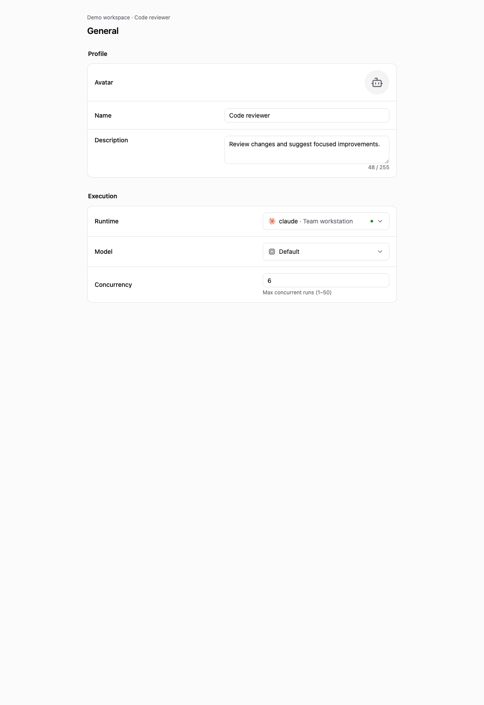
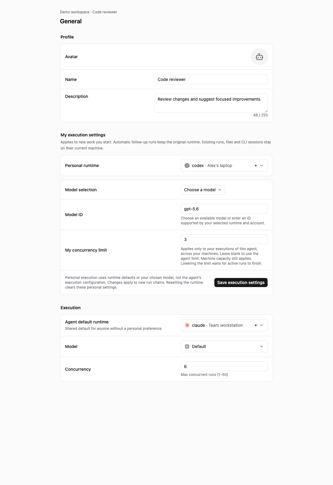

# Personal runtime routing for shared agents

## Problem and bounded scope

A team should be able to share an agent's identity, instructions, and skills while each member explicitly chooses their own execution environment. Binding every invocation to the agent's default runtime can put another member's work on the default owner's machine and tool account.

This proposal adds an explicit override keyed by `(workspace, agent, user)`. A member can select a runtime they own in that workspace, regardless of whether its provider matches the shared default. Without an override, the agent's default remains in effect, including the existing rule that an authorized agent invocation may use the agent owner's private default runtime. The preference changes execution routing; it neither grants agent invocation rights nor edits the shared agent configuration.

Related discussions:

- [#6650: Decouple agent identity from runtime](https://github.com/multica-ai/multica/issues/6650) proposes a broader architecture involving bindings, execution policies, and quota-aware recovery. This change implements the narrower per-member selection case; it does not introduce those broader policies or claim to complete that RFC.
- [#2970: Add per-user agent runtime binding](https://github.com/multica-ai/multica/pull/2970) overlaps directly with preference ownership. This proposal also carries execution identity through descendants and retries, freezes model choices, and guards machine/session/credential boundaries. It should be reviewed alongside that work before either implementation is merged.
- [#4513: Runtime token quota attribution in team workspaces](https://github.com/multica-ai/multica/issues/4513) reports consumption through a shared runtime owner's account. Explicitly selecting one's own runtime avoids that route for personal executions. This is not a quota accounting system: members without an override still use the shared default, and the executing tool account remains responsible for its provider usage.

This is not a runtime pool, automatic load balancer, or failover mechanism. There is no provider selection by price, capacity, or remaining quota. Existing local files and sessions are not migrated.

## Stored preference and public contract

`GET` and `PUT /api/agents/{id}/runtime-preference` operate on the authenticated member in an explicit workspace. The payload contains `runtime_id`, `model_mode`, `model`, and `max_concurrent_tasks`; reads may also describe the provider. A null runtime restores the agent default and clears personal execution settings. Preference writes require live membership, agent invocation access, and ownership of the selected workspace runtime.

A personal model is either `runtime_default` or `custom`. The accepted legacy `inherit` spelling is normalized to runtime default; personal execution does not inherit the shared agent's model. An explicit model ID is limited to 256 characters. Personal concurrency is null to inherit the configured agent limit, or an integer from 1 through 100. It applies per execution user and agent across runtimes. Daemon capacity remains an independent ceiling; lowering the limit allows existing work to finish and queues further work.

The agent keeps its shared `runtime_id`, `runtime_bound`, and `runtime_availability`. Authenticated reads add the viewer's `personal_runtime_id` and `personal_runtime_availability` without broadcasting those fields to other members. The client prefers a visible selected runtime, then its viewer-specific availability projection. A missing projection must not fall back to the shared machine's liveness.

## Root selection and descendant behavior

A new root execution records a server-owned routing snapshot containing the execution user and the workspace agent routes visible to the routing resolver at that point. Each route includes runtime ID, runtime owner, provider, source (`personal` or `default`), and model selection. Invalid personal choices stay invalid instead of being replaced by a default.

The explicit custom model string is frozen. A frozen runtime-default choice contains no explicit model, so the selected runtime still determines its default at execution time; this does not pin a provider's future default model version. Other agent configuration is not described as an immutable full configuration snapshot.

Automatic descendants and eligible automatic retries carry the root routing evidence. A member-triggered manual rerun starts a new root and resolves that member's current preferences. Runs predating routing evidence retain their existing default-routing behavior rather than adopting a new personal preference midway through a chain. Audit attribution and execution identity remain distinct: an attribution fallback alone does not authorize use of a personal machine.

For autopilots, schedule and webhook roots use the trigger creator (`created_by`), who may differ from the autopilot creator. Manual execution uses the clicking member. The rest of each chain follows the same inheritance rules.

## Live authorization and failure behavior

An immutable selection is not an immutable permission grant. Admission and claim paths still validate current membership, agent invocation access, runtime ownership or sharing, and scope. A deleted runtime, revoked permission, or unavailable personal selection fails explicitly. It never chooses the agent owner's runtime or an arbitrary provider as recovery.

A frozen route also prevents a preference edit from moving a queued run. The member must change/reset the preference and start new work to select another route. The existing shared-default queue/reconnect behavior remains applicable to that default route.

## Local and credential boundaries

Local workdir and provider-session reuse requires the same runtime and execution user. Crossing either boundary starts from shared issue history and committed repository artifacts; it does not transfer uncommitted files, local-directory resources, or CLI sessions. Machine paths must be valid on the selected runtime.

The selected runtime's CLI runs under its local tool account. Personal execution does not forward the shared agent owner's custom environment or private MCP credentials. Integration overlays are resolved under the execution user's authorization. This preserves shared collaboration context without using an unrelated audit identity as credential authority.

## Review and validation

The client exposes the personal choice separately from the shared default, uses runtime-default/custom model controls, validates concurrency, and keeps unavailable saved choices visible for explicit reset. Run details render the actual runtime, selection source, and execution user.

Relevant coverage includes malformed preference/projection responses, cross-account late mutation publication, independent viewer availability, unbound defaults with personal selections, own-provider selection, model/concurrency persistence, transcript evidence, and existing chat/quick-create behavior. Backend tests cover routing snapshot inheritance, authorization at claim, retry/manual-rerun identity, concurrency partitioning, and local reuse boundaries. Live tool smoke tests are a separate opt-in activity.

## UI review

These screenshots render the official shared React components and styles with synthetic users, runtimes, and API responses. They compare the upstream inspector with the new personal settings; they do not represent a live provider execution.

| Before | After |
| --- | --- |
|  |  |
