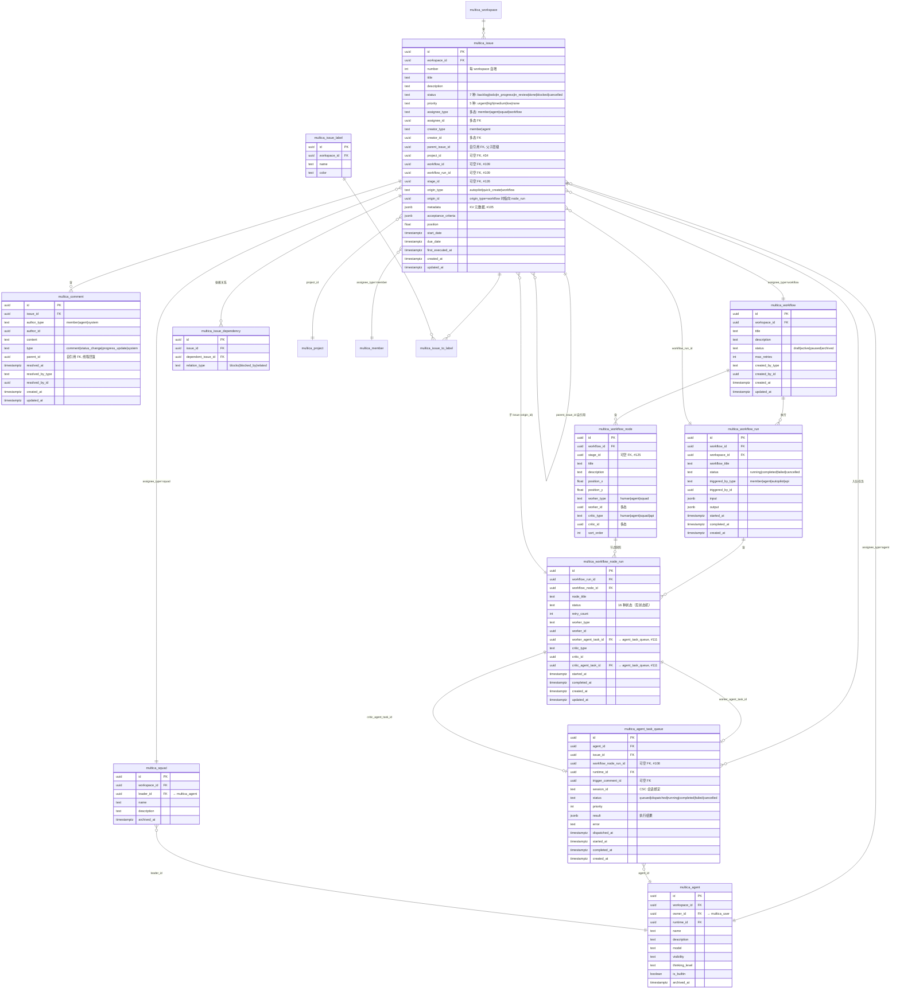
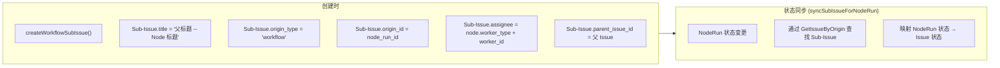
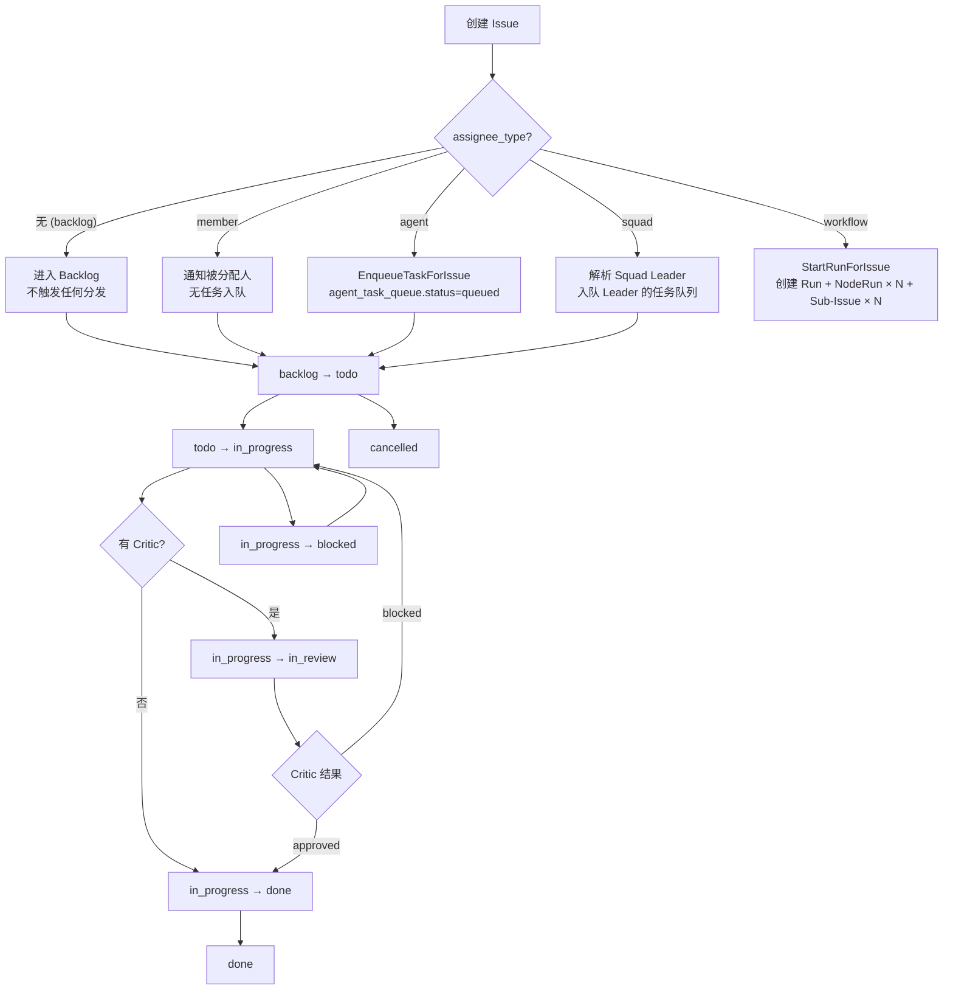
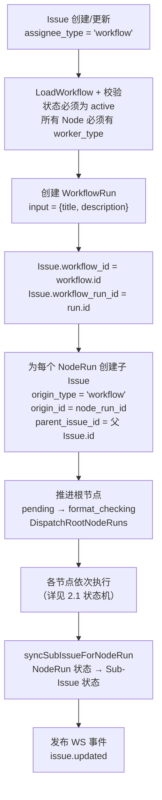
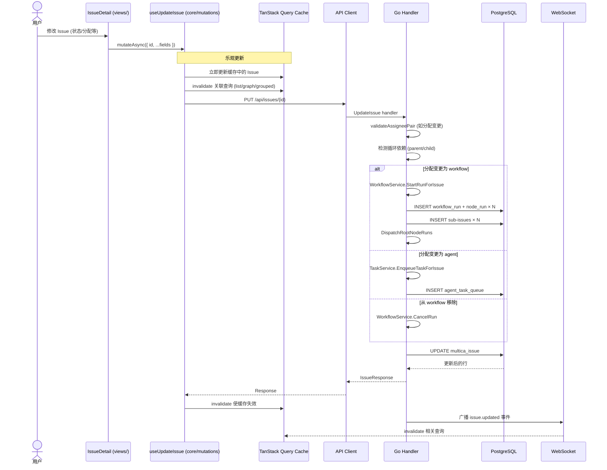
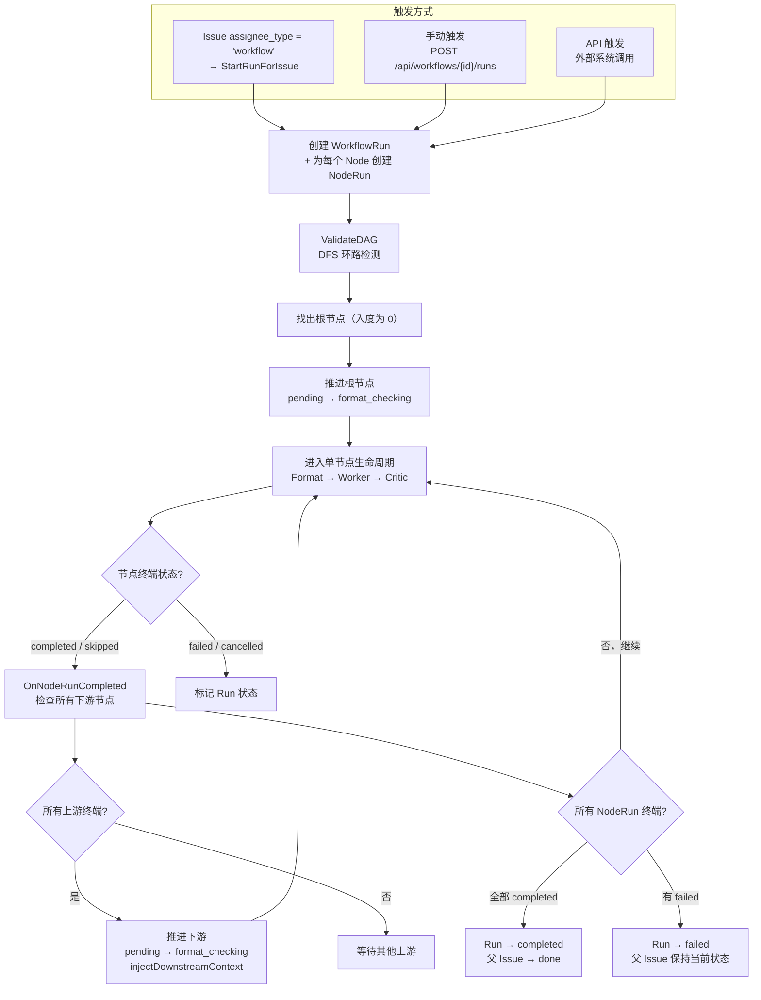

# Issue 数据模型分析

> 生成时间: 2026-06-25 | 基于 `multica` 仓库 `main` 分支

## 一、整体架构概览

Issue 是 Multica 的核心任务实体，承载"人+AI 混合协作"的分配模型。每个 Issue 支持四种分配类型（member / agent / squad / workflow），其中 **workflow 分配会触发完整 DAG 编排**——自动创建子 Issue、驱动 NodeRun 状态机、同步执行结果。

涉及 **6 张核心数据库表** + 10 张关联表：

| 表名（迁移后） | 用途 | 迁移编号 |
|---|---|---|
| `multica_issue` | 核心任务实体 | #1（+ #20/34/42/50/91/105/109/126 逐步扩展） |
| `multica_comment` | 评论、状态变更、进度更新 | #1（+ #107 加 system 作者类型） |
| `multica_agent_task_queue` | Agent 任务调度队列 | #1（+ #20/61/108 逐步扩展） |
| `multica_issue_dependency` | Issue 间依赖关系（blocks / blocked_by / related） | #1 |
| `multica_issue_label` / `multica_issue_to_label` | 标签多对多 | #1 |
| `multica_issue_subscriber` | Issue 订阅者 | #15 |
| `multica_issue_reaction` | Emoji 反应 | #27 |
| `multica_attachment` | 附件 | #1 |
| `multica_workflow` | 工作流 DAG 定义 | #108（+ #109 关联 Issue） |
| `multica_workflow_run` | 工作流执行实例 | #108 |
| `multica_workflow_node_run` | 单节点执行状态（16 状态机） | #108（+ #111/122） |
| `multica_agent` | AI Agent 定义 | #2（+ 多次扩展） |
| `multica_squad` | Agent + 人类小组 | #84 |
| `multica_project` | 项目分组 | #34 |
| `multica_inbox_item` | 收件箱项 | #1 |
| `multica_activity_log` | 活动日志 | #1 |

### 1.1 实体关系图（ER Diagram）



### 1.2 多态分配者模式（Polymorphic Assignee）

Issue 的 `assignee_type` + `assignee_id` 是一对多态关联，每次新增分配类型需同步修改五层：

| assignee_type | id 指向表 | 分配时触发的动作 |
|---|---|---|
| `member` | `multica_member` | 直接分配，无自动任务入队 |
| `agent` | `multica_agent` | `EnqueueTaskForIssue` → 创建 agent_task_queue 记录，状态 `queued` |
| `squad` | `multica_squad` | 解析 squad leader agent → `EnqueueTaskForIssue` 给 leader |
| `workflow` | `multica_workflow` | `StartRunForIssue` → 创建 WorkflowRun + NodeRun × N + Sub-Issue × N |
| `null` (取消分配) | — | 取消活跃任务，取消运行中的 WorkflowRun |

**扩展时需改动的五层：**

```
SQL CHECK 约束 → validateAssigneePair (handler) → 分发逻辑 (EnqueueTask/StartRun/SquadLeader)
→ AssigneePicker (前端) → involves_user_id 过滤器 (sqlc UNION)
```

### 1.3 Issue ↔ Workflow ↔ Agent 关联链路

```
Issue (assignee_type=workflow)
  ├── workflow_id ──→ Workflow (DAG 定义)
  ├── workflow_run_id ──→ WorkflowRun (执行实例)
  │     └── NodeRun × N (每个节点)
  │           ├── worker_agent_task_id ──→ AgentTaskQueue ──→ Agent ──→ Agent Runtime (local daemon / cloud)
  │           └── critic_agent_task_id ──→ AgentTaskQueue ──→ Agent ──→ Agent Runtime
  └── Sub-Issue × N (origin_type=workflow, origin_id=node_run_id)
        └── 状态由 syncSubIssueForNodeRun 自动同步
```

---

## 二、核心数据模型详解

### 2.1 NodeRun 状态机（16 种状态）

当 Issue 分配给 Workflow 时，每个 WorkflowNode 对应一个 NodeRun，经历严格的 **Format → Worker → Critic** 三阶段流水线：

```mermaid
stateDiagram-v2
    [*] --> pending

    pending --> format_checking : 自动触发
    pending --> skipped : 跳过
    pending --> cancelled : 取消

    format_checking --> format_ok : 校验通过
    format_checking --> format_failed : 校验失败
    format_checking --> cancelled : 取消

    format_ok --> worker_assigned : 人类任务
    format_ok --> working : Agent/Squad
    format_ok --> cancelled : 取消
    format_ok --> skipped : 跳过

    worker_assigned --> working : 开始处理
    worker_assigned --> cancelled : 取消
    worker_assigned --> skipped : 跳过

    working --> awaiting_input : 暂停等输入
    working --> awaiting_critic : 提交输出
    working --> failed : 执行失败
    working --> cancelled : 取消

    awaiting_input --> working : 恢复执行
    awaiting_input --> cancelled : 取消
    awaiting_input --> skipped : 跳过

    awaiting_critic --> critic_reviewing : 开始审核
    awaiting_critic --> cancelled : 取消
    awaiting_critic --> skipped : 跳过

    critic_reviewing --> critic_approved : 通过
    critic_reviewing --> critic_rework : 驳回
    critic_reviewing --> cancelled : 取消

    critic_approved --> completed : 完成

    critic_rework --> format_ok : retry < max_retries
    critic_rework --> blocked : retry >= max_retries

    blocked --> format_ok : 解除阻塞
    blocked --> skipped : 跳过

    format_failed --> [*]
    completed --> [*]
    failed --> [*]
    skipped --> [*]
    cancelled --> [*]

    note right of pending
        根节点（入度=0）自动触发
        非根节点等待所有上游完成
    end

    note right of critic_rework
        #122 新增状态
        awaiting_input 同为 #122 新增
    end
```

**状态归属：**

| 阶段 | 状态 | 含义 |
|---|---|---|
| **就绪** | `pending` | 等待上游节点完成 |
| **Format** | `format_checking` | 校验 format_schema |
| | `format_ok` | 格式校验通过 |
| | `format_failed` | 格式校验失败（终端） |
| **Worker** | `worker_assigned` | 人类任务已分配 |
| | `working` | Agent/Squad/人类执行中 |
| | `awaiting_input` | Worker 暂停等待人类输入 |
| **Critic** | `awaiting_critic` | Worker 完成，等待 Critic |
| | `critic_reviewing` | Critic 审核中 |
| | `critic_approved` | 审核通过 |
| | `critic_rework` | 驳回重做 |
| **终端** | `completed` | 成功完成 |
| | `failed` | 执行失败 |
| | `blocked` | 超最大重试，需人工介入 |
| | `skipped` | 被跳过 |
| | `cancelled` | 被取消 |

### 2.2 Sub-Issue 同步机制

Workflow 分配创建的子 Issue 通过 `origin_type` + `origin_id` 与 NodeRun 双向绑定：



**状态映射表：**

| NodeRun 状态 | Sub-Issue 状态 |
|---|---|
| `pending` / `format_checking` | `backlog` |
| `format_ok` / `worker_assigned` | `todo` |
| `working` | `in_progress` |
| `awaiting_input` | `blocked` |
| `awaiting_critic` / `critic_reviewing` | `in_review` |
| `completed` | `done` |
| `failed` / `cancelled` | `cancelled` |

### 2.3 下游上下文注入

上游节点完成时，`injectDownstreamContext` 沿 Edge 遍历下游，将上游 `NodeRun.output` 追加到下游 Sub-Issue 的 `description`，实现流水线上下文传递。

---

## 三、前后端模型对应关系

| 概念 | Go 后端 | TypeScript 前端 |
|---|---|---|
| 表前缀 | `multica_`（迁移 #114） | 无（通过 REST API 通信） |
| 核心类型 | `IssueResponse` / `CreateIssueRequest`（handler 层 struct） | `Issue` / `CreateIssueRequest`（`packages/core/types/issue.ts`） |
| API 类型 | `generated/models.go`（sqlc） | `packages/core/types/api.ts` |
| 状态枚举 | SQL CHECK 约束（7 种） | TypeScript union type（完全匹配） |
| 运行时验证 | Go handler 内联校验 + `validateAssigneePair` | `parseWithFallback(zodSchema, fallback)` — 桌面端防崩溃边界 |
| 服务端状态缓存 | TanStack Query（缓存 + 失效） | `packages/core/issues/queries.ts` |
| 客户端 UI 状态 | Zustand（筛选/草稿/视图模式） | `packages/core/issues/store.ts` + `stores/` |
| 实时同步 | WebSocket（gorilla/websocket） | WS 事件 → `queryClient.invalidateQueries` |
| API 契约 | Chi router + handler 层 req/res | `packages/core/api/client.ts` 方法签名 |

### 3.1 API 响应安全边界

```
                         ┌──────────────────────────────────┐
                         │       API 响应 (不可信 JSON)       │
                         └──────────────┬───────────────────┘
                                        ▼
                         ┌──────────────────────────────────┐
                         │  parseWithFallback(zodSchema,     │
                         │  fallback)                       │
                         │                                  │
                         │  成功 → 类型安全的 TS 对象         │
                         │  失败 → console.warn + fallback   │
                         │  (绝不抛异常到 UI)                 │
                         └──────────────────────────────────┘
```

> **为什么？** 桌面客户端可能比后端旧多个版本。`parseWithFallback` 确保枚举漂移、字段缺失、类型错误等场景下 UI 不会白屏，这是 #2143、#2147、#2192 三个线上事故的教训。

---

## 四、数据流与流程图

### 4.1 Issue 完整生命周期



### 4.2 Workflow 分配时的 Issue 创建流程



### 4.3 Update Issue 时序图（乐观更新 + WS 失效）



### 4.4 Workflow Run 完整执行流



---

## 五、关键文件索引

### 后端（Go）

| 文件 | 说明 |
|---|---|
| `server/migrations/001_init.up.sql` | Issue 核心表 + Comment + TaskQueue + Dependency + Label + Attachment |
| `server/migrations/020_issue_number.up.sql` | Issue 编号 (MUL-NNN) |
| `server/migrations/034_projects.up.sql` | Project 关联 |
| `server/migrations/042_autopilot.up.sql` | Autopilot origin 追踪 |
| `server/migrations/050_issue_first_executed_at.up.sql` | 首次执行时间 |
| `server/migrations/091_issue_start_date.up.sql` | 开始日期 |
| `server/migrations/105_issue_metadata.up.sql` | JSONB 元数据 (KV) |
| `server/migrations/108_workflow.up.sql` | Workflow + Node + Edge + Run + NodeRun（核心 5 表） |
| `server/migrations/109_issue_workflow.up.sql` | Issue 关联 workflow_id + workflow_run_id |
| `server/migrations/125_workflow_stage.up.sql` | Stage 阶段表和 node.stage_id |
| `server/migrations/126_issue_stage_id.up.sql` | Issue 关联 stage_id |
| `server/migrations/084_squad.up.sql` | Squad + SquadMember |
| `server/pkg/db/queries/issue.sql` | 20 个命名查询（CRUD + 过滤 + 聚合 + 元数据操作） |
| `server/pkg/db/queries/comment.sql` | 评论 CRUD |
| `server/pkg/db/queries/workflow.sql` | Workflow CRUD |
| `server/pkg/db/queries/workflow_node_run.sql` | NodeRun 查询（状态机 + 任务链接） |
| `server/pkg/db/generated/models.go` | sqlc 生成的 Go 结构体 |
| `server/internal/handler/issue.go` | Issue handler（约 3300 行，含 CRUD + Workflow 生命周期） |
| `server/internal/handler/comment.go` | 评论 handler |
| `server/internal/handler/workflow.go` | Workflow CRUD handler |
| `server/internal/handler/workflow_run.go` | WorkflowRun handler |
| `server/internal/service/workflow.go` | 核心编排引擎（状态机 + DAG 验证 + 下游传播） |
| `server/cmd/server/router.go` | 路由注册（约 35 个 Issue 相关路由） |

### 前端（TypeScript）

| 文件 | 说明 |
|---|---|
| `packages/core/types/issue.ts` | `Issue`, `IssueStatus`, `IssuePriority` 等核心 TS 类型 |
| `packages/core/types/api.ts` | API 请求/响应类型 (`CreateIssueRequest`, `ListIssuesParams` 等) |
| `packages/core/types/workflow.ts` | Workflow 相关 TS 类型 |
| `packages/core/types/agent.ts` | Agent/AgentTask 类型 |
| `packages/core/types/comment.ts` | Comment 类型 |
| `packages/core/api/schemas.ts` | Zod 验证 schema + `parseWithFallback` |
| `packages/core/api/client.ts` | API 客户端方法（全部 Issue CRUD 方法） |
| `packages/core/issues/queries.ts` | TanStack Query cache keys + fetch 函数 |
| `packages/core/issues/mutations.ts` | 乐观更新 mutation hooks（~800 行） |
| `packages/core/issues/store.ts` | Active issue Zustand store |
| `packages/core/issues/stores/` | 视图/草稿/筛选/最近 Issue 等 client state stores |
| `packages/views/issues/components/issue-detail.tsx` | Issue 详情页（含 WorkflowDagViewer + StagePicker） |
| `packages/views/issues/components/pickers/assignee-picker.tsx` | 多态分配选择器（Workflow/Agent/Member/Squad 四组） |
| `packages/views/issues/components/workflow-dag-viewer.tsx` | 嵌入式 DAG 查看器（状态可视化 + 会话打开） |
| `packages/views/workflows/components/overview/workflow-panorama-page.tsx` | Panorama 阶段概览页（泳道视图） |

---