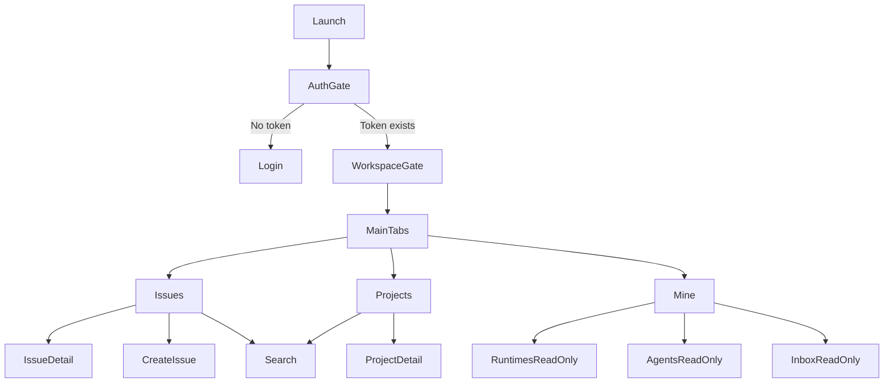

# Multicam Mobile PRD

> Status: Draft
> Owner: Mobile project
> Source issue: OPE-115 / OPE-119
> Last updated: 2026-04-27

## 1. Background

Multica already provides web and desktop clients. The existing web UI can be opened in a mobile browser, but the layout and interactions are not optimized for phone-sized screens. Multicam Mobile will provide a React Native client for core day-to-day review and operation workflows.

The first validation target is an Android build artifact. iOS, TestFlight, App Store, Apple Developer account, Team ID, certificates, and provisioning profiles are intentionally deferred until the mobile product direction is validated.

## 2. Product Goals

1. Provide a mobile-first client for viewing and operating workspace issues and projects.
2. Preserve the current web product model: workspace, issue, project, agent, runtime, inbox.
3. Reuse existing backend APIs and `@multica/core` business logic where practical.
4. Keep UI visually aligned with the current web/desktop Multica style while adapting layout and interaction to mobile.
5. Support mobile-specific capabilities: secure token storage, offline read cache, push notifications, deep links, and attachment upload.

## 3. Non-Goals

1. Apple account setup, iOS signing, TestFlight, App Store submission, and enterprise iOS distribution in the validation phase.
2. Full mobile management flows for Runtimes, Agents, and Inbox. These are read-only in the first version.
3. Google login, SSO, token refresh, or mobile-specific token lifecycle. Email verification code login is the only first-version login path.
4. Complete command palette parity. Search initially covers issues and projects only.
5. iPhone small-screen and dynamic-font exhaustive validation in the first validation phase.

## 4. App Identity

| Item | Decision |
|---|---|
| Product name | Multicam |
| Android package name | `com.wujieai.multica` |
| Icon | Reuse desktop icon from `apps/desktop/resources/icon.png` |
| Primary validation artifact | Android build |
| Android signing | Can be unsigned initially; signing strategy can be added later |
| URL scheme | `wujieai_multicam://` |

## 5. User Scope

The first version targets existing Multica users who need to check, triage, and respond to workspace activity from a phone.

Primary users:

- Workspace members reviewing issue boards and project status.
- Members responding to comments, reactions, and assignments.
- Members monitoring agents, runtimes, and inbox notifications in read-only mode.

## 6. Navigation Model

The app uses a bottom tab structure:

1. Issues
2. Projects
3. Mine

Global stack routes sit above tabs:

- Login
- Workspace switcher
- Search
- Issue detail
- Project detail
- Create issue
- Filter sheets
- Attachment preview
- Deep-link landing and error states

## 7. Functional Requirements

### 7.1 Authentication

Requirements:

- Continue using email verification code login.
- Store token in SecureStore/Keychain via Expo secure storage.
- On logout, clear token and auth identity.
- User data and non-sensitive cached workspace data can remain after logout.
- Token refresh and expiry policy are delegated to the server or later product work.

Acceptance criteria:

- User can request an email code.
- User can verify the code and enter the workspace experience.
- Closing and reopening the app keeps the user logged in if the token remains valid.
- Logging out removes the token and returns to Login.

### 7.2 Workspace

Requirements:

- Top header on Issues and Projects shows current workspace name.
- Tapping workspace name opens a mobile-friendly workspace switcher.
- Switching workspace updates API headers, query cache scope, filters, and local workspace-aware preferences.
- Deep links to workspace-scoped resources resolve the workspace first.

Acceptance criteria:

- User can switch among accessible workspaces.
- Current workspace state is consistent across Issues, Projects, Search, Mine, and deep links.
- Unauthorized or inaccessible workspace deep links show an explicit no-access state.

### 7.3 Issues

Requirements:

- Issues is a first-class tab.
- Header includes workspace switcher, issue filters, and search entry.
- First version supports board view.
- Board must follow mobile interaction patterns. It must not require horizontal scrolling to read a vertical card list.
- Floating action button creates a new issue.
- Current filter capabilities should remain aligned with web:
  - scope: all, members, agents
  - status
  - priority
  - assignee
  - creator
  - project / no project
  - sort settings where applicable

Recommended mobile board interaction:

- Use a status segmented control or status tabs at the top.
- Show one status lane at a time as a vertical card list.
- Cards are single-column, wrap secondary metadata, and never require horizontal scrolling for full content.
- Status changes can be performed from card detail or a quick action sheet.
- Drag and drop can be added only if it remains stable and touch-friendly.

Acceptance criteria:

- User can view issues grouped by status.
- User can filter issues with the same business dimensions as web.
- User can search issues from the header.
- User can open issue detail.
- User can create a new issue from the FAB.
- Long titles, labels, assignees, priorities, due dates, and project names wrap or collapse gracefully.

### 7.4 Issue Detail

The first official release must support the complete issue detail scope. Implementation can be phased before the official release.

Requirements:

- Issue summary: title, identifier, status, priority, assignee, creator, project, due date, description.
- Complete comment flow:
  - list comments
  - create comment
  - reply to comment if supported by current API
  - update/delete when permitted
- Attachments:
  - upload file/image
  - attach to issue or comment
  - list attachments
  - preview/download where practical
- Reactions:
  - issue reactions
  - comment reactions
- Child issues:
  - list child issues
  - show child progress
  - navigate to child issue
- Agent run transcript:
  - list task runs
  - list task messages
  - display transcript in a readable mobile layout
- Realtime:
  - issue updates
  - new comments
  - reactions
  - task progress/messages

Acceptance criteria:

- User can read and respond to the same issue context that is available on web.
- Realtime updates do not create duplicate visible records.
- Attachments uploaded from mobile are visible in web/desktop.
- Agent transcripts remain readable on a narrow screen.

### 7.5 Projects

Requirements:

- Projects is a first-class tab.
- Header structure mirrors Issues: workspace switcher, project filter/sort, search entry.
- Project filter/sort behavior stays aligned with current web capability.
- Project rows/cards must be single-column and readable without horizontal scrolling.
- Project detail is available.

Current web baseline:

- Sorting by priority, status, created date, updated date, title.
- Inline project fields include priority, status, progress, lead, created date.
- API currently supports `GET /api/projects?status=` and project search.

Acceptance criteria:

- User can view project list.
- User can sort/filter according to current web-supported behavior.
- User can open project detail.
- User can search projects.

### 7.6 Search

Requirements:

- Search is a standalone route opened from Issues or Projects header.
- First version searches issues and projects only.
- Other command palette features are explicitly deferred.

Acceptance criteria:

- Querying text returns issue and project results.
- Selecting an issue navigates to issue detail.
- Selecting a project navigates to project detail.
- Empty, loading, and error states are mobile-friendly.

### 7.7 Mine

Requirements:

- Mine is the aggregation tab for account and secondary product areas.
- Include entry points for:
  - account/logout
  - Runtimes read-only
  - Agents read-only
  - Inbox read-only
- Runtimes, Agents, and Inbox are read-only in the first version.

Acceptance criteria:

- User can view current account and logout.
- User can view runtime list/status.
- User can view agent list/status.
- User can view inbox items.
- No management action is exposed for these read-only areas in the first version.

### 7.8 Offline Cache and Failure Retry

Requirements:

- Support offline read cache for issue list, project list, search results where practical, issue detail, and Mine read-only data.
- Write operations should have explicit failure handling and retry affordances.
- First version does not need full offline editing with automatic conflict resolution.

Policy:

- Read cache can show stale data with a clear sync state.
- Comments, issue mutations, attachment uploads, and reactions fail fast or enter a retry queue depending on implementation complexity.
- Failed writes must be visible to the user and retryable.

Acceptance criteria:

- Previously loaded issues/projects/details can be viewed without network.
- Failed writes are not silently lost.
- User can retry failed comment/attachment/reaction/status operations.

### 7.9 Realtime and Compensation

Requirements:

- Use existing WebSocket realtime channel where possible.
- Reconnect with exponential backoff.
- If compensation pull does not exist, add or stub an API that can fetch events/messages after the local last `msgID`.
- Deduplicate using a sliding window of the latest 200 message IDs.
- This assumes server message IDs are globally increasing. If that assumption is false, the server contract must be corrected before relying on this strategy.

Acceptance criteria:

- App reconnects automatically after transient network loss.
- Duplicate realtime events do not create duplicate comments, task messages, reactions, or inbox rows.
- After reconnection, missed messages are recovered if the server supports compensation.

### 7.10 Push Notifications

Requirements:

- Use Expo Notifications.
- Register device push token after login when permission is granted.
- If existing login/user endpoint cannot store device token, the server should add a mobile device registration endpoint.
- Push trigger scenarios:
  - assigned to an issue
  - mentioned/commented
  - agent run completed
  - new inbox item
  - runtime status change

Acceptance criteria:

- Device token registration path is defined.
- Tapping a push opens the correct workspace/resource when authorized.
- Unauthenticated users are routed to login and then resumed to the intended destination if possible.

### 7.11 Deep Links

URL scheme: `wujieai_multicam://`

Recommended structure:

| Target | Deep link |
|---|---|
| Workspace | `wujieai_multicam://workspace/{workspaceSlug}` |
| Issue | `wujieai_multicam://workspace/{workspaceSlug}/issue/{issueId}` |
| Project | `wujieai_multicam://workspace/{workspaceSlug}/project/{projectId}` |
| Comment | `wujieai_multicam://workspace/{workspaceSlug}/issue/{issueId}/comment/{commentId}` |

Requirements:

- Support workspace, issue, project, and comment links.
- If not logged in, show login and continue after successful login.
- If logged in but unauthorized, show a clear no-access state.
- If resource is missing, show a clear not-found state.

Acceptance criteria:

- Links can be opened from notifications and external apps.
- Links resolve consistently across cold start, warm start, and foreground state.

### 7.12 Attachments

Requirements:

- User can upload attachments to issue/comment flows.
- Use mobile document/image pickers.
- Reuse existing `/api/upload-file` and attachment APIs where possible.
- Missing server support can be stubbed in mobile and implemented later on server.

Acceptance criteria:

- Upload progress/error state is visible.
- User can retry failed uploads.
- Uploaded attachments appear in issue/comment detail.

## 8. UI Requirements

The mobile UI must follow Multica's current design language:

- Neutral surfaces.
- Color as semantic signal.
- Compact typography.
- Clear borders and restrained solid backgrounds.
- No decorative gradients.
- Board can use bolder lines and solid backgrounds to improve status separation.

Mobile-specific constraints:

- Vertical lists must not require horizontal scrolling to see full information.
- Metadata wraps, stacks, or collapses into tags.
- Touch targets must be comfortable for common actions.
- Safe area should be respected.
- Empty, loading, permission, no-access, and offline states must be explicit.

## 9. API and Backend Dependencies

Existing likely reusable APIs:

- Auth: `/auth/send-code`, `/auth/verify-code`
- Workspace: `/api/workspaces`, `/api/workspaces/{id}`
- Issues: `/api/issues`, `/api/issues/search`, `/api/issues/{id}`, comments, timeline, reactions, subscribers, child issues, task runs/messages
- Projects: `/api/projects`, `/api/projects/search`
- Attachments: `/api/upload-file`, `/api/issues/{id}/attachments`, `/api/attachments/{id}`
- Agents/Runtimes/Inbox read-only APIs
- WebSocket: existing realtime channel

Potential missing or incomplete APIs:

- Mobile push device registration.
- Realtime compensation pull after `msgID`.
- Deep-link target resolver if client cannot reliably resolve slug/resource pairs.
- Attachment upload compatibility for React Native `FormData` file objects.

## 10. Success Metrics

Validation-phase metrics:

- Android build can be installed and used against the fixed cloud service.
- Login success rate.
- Issue board initial load success rate and load time.
- Issue detail load success rate and load time.
- Comment/reaction/attachment failure rate.
- WebSocket reconnect success rate.
- Push open-to-resource success rate.

## 11. Rollout

Phase 1 validates Android artifact and core product workflows.
Phase 2 adds formal iOS signing/distribution and store-readiness.
Phase 3 hardens offline write queue, push delivery, and release automation.

## 12. Risks

| Risk | Impact | Mitigation |
|---|---|---|
| Existing web UI cannot be reused directly | More RN UI work | Reuse `@multica/core`; rebuild RN views |
| Push token API missing | Push delayed | Stub interface; add server endpoint later |
| Realtime msgID is not globally increasing | Dedup/compensation unreliable | Confirm server contract before implementation |
| Attachment upload differs on RN | Upload failures | Add RN upload adapter and test with backend |
| Board interaction is too dense for phone | Poor usability | One-status-at-a-time board with vertical cards |

