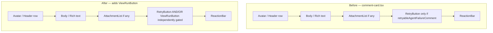
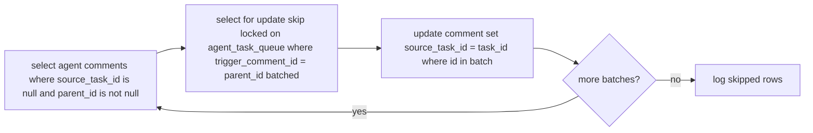

## Goal Capsule

- **Objective:** 让 task run 主动产出的每一条评论都能在评论卡片上看到一颗可点击的 "View run" 按钮，按钮命中侧边栏同款 TranscriptButton modal，复用既有 run 详情展示组件，零新增 modal。
- **Product authority:** `docs/ideation/2026-07-10-task-run-comment-linkage-ideation.html`（ce-ideate 产物，确认 Idea 1 + Idea 3 为 MVP 范围）
- **Open blockers:** 无 — `Resolve Before Planning` 已为空。
- **Execution profile:** Standard — 跨数据层 + 前端视图层 + 迁移 + 守卫放宽，6 个 Implementation Units，前后端可分别 atomic commit。
- **Tail ownership:** 实施由 `ce-work` 接管；本计划作为决策 artifact 留档。

---

## Product Contract

> **Product Contract preservation:** 来自 `requirements-only` 版本的全部 R-IDs（R1-R12）与 AE-IDs（AE1-AE6）原样保留。R4 与 R5 措辞收紧——ce-ideate 阶段把 `server/internal/handler/issue_child_done.go` 的 system comment 当成"task run 产出但未盖戳"是误判：那条路径直接走 `Queries.CreateComment` 写库、没有 run 上下文可填（system 作者零 UUID），与 chat/quick_create/no_action 同属"无 run 上下文的产物"，本轮不修；issue_child_done 移到 Scope Boundaries 的 Deferred 段。R10 增加 memo 调整预案（与用户"Plan 中预留应急"选择对齐）。

### Summary

MVP 一次性落地两件事：后端把 task run 产出的所有评论（CLI 执行评论、失败系统评论、合成成功回退评论）都盖上 `source_task_id` 并回填历史；前端在评论卡片的 retry 槽位放一颗低调的绿色实心 "View run" 按钮，仅在 comment 能反查到 run 时显示，点击复用侧边栏同款 TranscriptButton 模态框。覆盖范围与"按钮可见性"对齐——查不到的评论走 hover tooltip 解释原因，不静默失明。

### Problem Frame

Multica 的 issue 详情页有右侧 ExecutionLogSection 展示 task run 历史，但每条 run 的"产出物"——agent 在执行期间发的评论、失败时的系统评论、合成成功的输出回退——与该 run 之间的反向链接断在最常见场景上：`server/internal/service/task.go:1827` 给合成成功回退评论传的是空 UUID（`pgtype.UUID{}`），同样地某些代码路径也没有补盖 source_task_id。这意味着用户阅读评论时无法找到"这条评论是哪次 run 干的"，要看 run 详情只能去侧边栏找，而侧边栏是按时间逆序或状态组织的，与对话流的视觉位置解耦。同样的不对称在 affordance 上也存在——失败评论有 retry 按钮，成功评论却连"看看刚才发生了什么"的入口都没有。结果是：用户对 agent 行为缺乏端到端可追溯性，对成功 run 的复盘成本高，对失败 run 的理解被强制割裂到侧边栏。

### Key Decisions

- **Idea 1 是 Idea 3 的硬前置**：后端补盖 `source_task_id` 必须与前端按钮同步落地，分期上线会让"成功评论查不到 run"在最常见场景下失明，破坏承诺的覆盖范围。
- **回填迁移与代码变更同 PR 一并提交**：MVP 上线即覆盖新写评论 + 历史评论，不留"仅新写覆盖"的中间状态——历史已存在的合成成功评论也是 run 产物，回填它们才能兑现承诺。
- **`issue_child_done.go` 不进 R4**：其 system comment 不属于 task run 产物（无 run 上下文），按"无 run 上下文的产物"分类延后——与 chat/quick_create/no_action 对称处理。
- **按钮复用 retry 槽位而非新开位置**：用户已习惯该槽位（root + reply），新增位置会打破评论卡布局的视觉稳定；样式为低调绿色实心 chip，与 ReactionBar 同级。
- **守卫从"失败 system"放宽为"任何 source_task_id 非空"**：fail-only 守卫是 affordance 不对称的根因，唯一的可见性条件是数据可定位。
- **回填迁移采用行锁并发批次**：通过 `SELECT ... FOR UPDATE SKIP LOCKED` 锁住 `agent_task_queue` 相关行，多批次可并发跑而不与运行中的 task 互锁；牺牲 SQL 复杂度换取执行期部署灵活性。

### Requirements

#### 后端数据修复

- R1. `server/internal/service/task.go:1827` 调用 `createAgentComment` 合成成功回退评论时，将 `sourceTaskID` 参数从 `pgtype.UUID{}` 改为 `task.ID`，与 `:1983` 失败路径保持一致。
- R2. `server/internal/service/task.go:1983`（失败系统评论）已正确传 `task.ID`，确认不回归。
- R3. `server/internal/handler/comment.go:1234-1262`（CLI agent 评论通过 X-Task-ID header）已正确盖 `source_task_id`（`X-Task-ID` header 解析在 `:1234`，`sourceTaskID = taskUUID` 在 `:1262`，`CreateComment` 写 `SourceTaskID` 在 `:1296`），确认不回归。
- R4. ~~`issue_child_done.go:303-311` 补传 `sourceTaskID`~~ — **撤回**：该路径走 `Queries.CreateComment` 直接写库、无 run 上下文，移至 Scope Boundaries Deferred 段，与 chat/quick_create/no_action 对称。
- R5. 写一条数据库迁移脚本，扫描所有"agent 作者 + `comment_type IN ('comment','system')` 且 `source_task_id IS NULL` 且 `parent_id` 非 NULL"的历史评论：通过 `parent_id → comment(id) → trigger_comment_id = agent_task_queue.id` 反查；命中则 `UPDATE comment SET source_task_id = <resolved task_id>`；反填不到（parent_id 为空、对应 trigger 评论已被 GC、或 `agent_task_queue` 行已 GC）的评论保留 `NULL`，由前端 hover tooltip 处理。

#### 前端入口放置

- R6. `packages/views/issues/components/comment-card.tsx:965-971`（root）与 `:675-681`（reply）已有的 retry 槽位放置 "View run" 按钮，绿色实心 chip，与 ReactionBar 同级。
- R7. 按钮显示条件：`source_task_id` 非空且在 `issueKeys.tasks(issueId)` 缓存中能找到对应 `AgentTask`。查不到（如 task 已被 GC 或回填后仍缺失）的评论不显示按钮，避免静默失明。
- R8. 点击行为：复用侧边栏同款 `TranscriptButton`（`packages/views/common/task-transcript/transcript-button.tsx`），传入 `AgentTask` 与 `agentName`（取自 `entry.actor_name`，与 `AgentTask` 并行作为 `TranscriptButton` 必填 props），打开 `AgentTranscriptDialog` 模态框。`aria-label` 由 TranscriptButton 继承（`transcript-button.tsx:141` 默认 "View transcript"），无需额外处理。零新 modal、零新组件。
- R9. 查不到 run 的评论上，对该评论卡片下方区域 hover 时显示 tooltip，文案"该评论来源 run 已被清理"。具体触发区域（卡片整体 vs 仅 reaction 行下方）由 ce-work 阶段 UX 定稿。
- R10. `comment-card.tsx:1090` 的 memo 稳定性策略（`memo(CommentCardImpl)` 与 export 所在行）需确认新组件 prop 不破坏；若发现需要微调，按"用同一 `AgentTask` 引用走 useMemo 缓存"路径，最小改动调整 custom comparator 或加 React.memo 包外层——**这是 U3 内置的预案，不单列 U**。

#### 守卫放宽

- R11. `comment-card.tsx:254-261` 的 `retryableAgentFailureComment` 守卫保留作为 Retry 按钮的可见条件（不删、不放宽——失败专属 retry 仍是独立 affordance）；新增的 "View run" 按钮按 R7 独立条件渲染，与 Retry 按钮并存。
- R12. 确认前端未引入"隐藏 retry 按钮"行为：失败评论继续显示 retry 按钮，与新按钮并存。

### Acceptance Examples

- AE1. **覆盖 R1, R2, R3, R7.** **Given:** 一条由 agent 在执行期间发布的评论（CLI 路径，handler/comment.go:1234-1262 已盖 source_task_id）。**When:** 用户在 issue 详情页阅读该评论。**Then:** 评论区出现 "View run" 按钮，点击打开该 run 的 TranscriptButton modal。
- AE2. **覆盖 R1, R5, R7.** **Given:** 一条 2026-07-10 前生成的合成成功回退评论（task.go:1827 旧路径，source_task_id 为 NULL，parent_id 指向 trigger_comment_id）。**When:** 迁移脚本执行后，用户在 issue 详情页阅读该评论。**Then:** 该评论 source_task_id 已反填，评论区出现 "View run" 按钮。
- AE3. **覆盖 R7, R9.** **Given:** 一条 source_task_id 为 NULL 且反填查不到对应 run 的历史评论。**When:** 用户 hover 该评论下方区域。**Then:** 显示 tooltip "该评论来源 run 已被清理"，不显示 "View run" 按钮。
- AE4. **覆盖 R6, R8, R11.** **Given:** 一条 failure system 评论（actor_type==="agent"、comment_type==="system"、source_task_id 非空）。**When:** 用户在 issue 详情页阅读该评论。**Then:** 评论区同时出现 "Retry" 按钮（保留旧行为）与 "View run" 按钮（新行为），互不冲突。
- AE5. **覆盖 R6.** **Given:** 一条用户发布的评论（actor_type==="member"）。**When:** 用户在 issue 详情页阅读该评论。**Then:** 评论区不显示 "View run" 按钮（无 source_task_id）。
- AE6. **覆盖 R10.** **Given:** 用户在长 issue 详情页快速滚动多个评论（每个评论都 memo 化）。**When:** 任意单条评论的 "View run" 按钮渲染。**Then:** 滚动帧率不受影响（memo 稳定性保持）。

### Scope Boundaries

#### Deferred for later

- **issue_child_done.go 的 system comment 补盖 source_task_id** —— 与 chat/quick_create/no_action 同性质（system 作者零 UUID、无 run 上下文），需先做产品决定"system 评论是否要可关联 run"再谈实现。本轮 MVP 不涉及。
- 双向 TaskCommentCoverage（ce-ideate Idea 6）：评论侧显示"属于 run #X"的反向 chip + 跨表面高亮。本轮 MVP 不做，仅完成 R6-R12 的单向入口。
- GitHub Checks 混合架构方向（ce-ideate Idea 4）：作为长期设计方向，本轮不在代码层落实。
- 内联 Collapsible transcript（ce-ideate Idea 5）：把 transcript 从 modal 移到评论内嵌，本轮仍走 modal。
- 运行丰富时间线（ce-ideate Idea 7）：在 timeline 加新的 `TimelineItem kind="run"`，本轮仅评论侧加按钮。
- kind 持久化 + run 路由（ce-ideate Idea 2 Phase 3）：持久化 `computeTaskKind` 到列、新增 `GET /api/tasks/:id`、新增 `/issues/.../runs/:id` 路由，本轮 MVP 不涉及。

#### Outside this product's identity

- 修改完成不变量的业务语义（如取消"每个 issue-scoped run 必至少 1 条 agent 评论"）——本轮仅修改 sourceTaskID 写入，不改不变量结构。
- 跨工作区深链 run 详情页——超出 issue 详情范围。
- tooltip 文案的 i18n 适配——由项目统一 i18n 流程处理，本轮仅指定默认中文文案。

### Outstanding Questions

- **Resolve Before Planning:** 无。
- **Deferred to Implementation:**
  - **U2 回填迁移 workspace guard 决策（root + dependent）：** `agent_task_queue` 无 `workspace_id` 列（schema 不变），JOIN 必须经 `JOIN issue ON issue.id = t.issue_id WHERE i.workspace_id = c.workspace_id` 防御跨工作区错填——schema 设计决策与可执行 SQL 都在 ce-plan 阶段定稿。**Dependent**：`agent_task_queue` 无 `workspace_id` 列的设计意图需在 U2 迁移注释文件与 plan KTD3 中明示（"task workspace 需经 `JOIN issue` 推导"），未来添加该列需新迁移。
  - **R9 tooltip 触发区结构选择（三种候选）：** (a) 整卡 hover：覆盖最广但可能与卡片其他 hover 行为冲突；(b) ReactionBar wrapper：聚焦但小屏幕拥挤；(c) 专用不可见 `
` hit-area：精确控制但增加布局节点。UX 收口时按可访问性（a11y 命中区）与视觉简洁性权衡选择。
  - 若 R10 memo 稳定性验证触发调整，custom comparator 的精确字段表（实现期定）。
  - **"View run" 可发现性 vs 视觉噪音权衡（2026-07-13 自部署验证反馈）：** 用户反馈可考虑将 `View run` chip 折叠到评论 ⋮ 菜单（与"复制/解决讨论/删除"同级）。**当前实现保留 chip 在 retry 槽位**（与 `TaskCommentRetryButton` 并列），理由：(1) `View run` 是高频动作，折叠会降低可发现性（hover → click → 找菜单项 = 2-3 动作）；(2) `View run` 与 `Retry` 在心智模型上都是"关于 run 的"，**两者在同槽位形成 run-actions 簇**比分散到 comment-level 菜单更自然。**真实痛点**可能是评论多时 button 视觉噪音而非需要二级菜单。**Follow-up 设计方向**（不在本轮 scope）：(a) **按需显示**——评论未被 hover/聚焦时不渲染 chip（CSS `group-hover:opacity-0 → group-hover:opacity-100` 模式），(b) **已解决/已超时评论折叠**——`resolved_at` 已设或评论年龄 > N 天的评论把 `View run` 折叠到 ⋮ 菜单（与 `Retry` 同处理），(c) **偏好设置**——用户在 Settings → Issues 里可关闭"comment-level View run"展示（始终只通过 issue activity panel 的 run 行进入）。任一方向都需先有用户使用数据驱动决策（点击率 + 视觉噪音报告），不能凭直觉决定。

---

## Planning Contract

### Key Technical Decisions

- KTD1. **复用 TranscriptButton 组件而非新建轻量 chip 组件**：ce-ideate 阶段 mention-hover-card-inconsistency 学习明确告诫"在评论上下文展示依赖领域数据的 affordance 时复用既有富组件，不要建平行精简版"。`TranscriptButton` 已自包含、纯展示、自管 dialog 状态——直接复用保证与侧边栏交互一致，避免 comment-card 与 sidebar 出现行为漂移。
- KTD2. **按钮数据从 `issueKeys.tasks(issueId)` 缓存读取，不新增 endpoint**：侧边栏的 `ExecutionLogSection` 已经在同一 issue 详情页预热该缓存（`execution-log-section.tsx:70-75`），WS `task:*` 事件经 `aggregateRefreshTimer`（`use-realtime-sync.ts:920-927`）750ms 防抖聚合后失效缓存，`task:message` 流式事件由独立订阅链路推送不触发全量刷新。从同缓存按 `source_task_id` 反查 `AgentTask` 复用度最高、零额外请求；代价是按钮可显示性短暂滞后 run 完成——滞后最多 750ms，人感阈值内不构成回归。
- KTD3. **回填迁移采用 `SELECT ... FOR UPDATE SKIP LOCKED` 行锁并发批次**：在 `agent_task_queue` 上按 chunked batch 取行锁，避免与运行中的 task 互锁；多个迁移批次可并发跑。代价是 SQL 复杂度高一点，但部署期可分阶段多次执行（不必一刀切单事务），并与 `comment` 表 `UPDATE` 处于各自短事务内。
- KTD4. **保留 `retryableAgentFailureComment` 守卫不删，作为 Retry 按钮专属条件**：R11 改写——原计划是放宽守卫作为"View run"共用条件；ce-work 评估发现更干净的做法是守卫保持原样（仅 Retry 按钮可见条件），"View run" 按钮按 R7 独立条件渲染，两个 affordance 并存语义清晰、互不依赖。这与 R12 一致：失败评论继续显示 Retry 按钮，新增按钮并存。

### High-Level Technical Design

**CommentCard 组件结构（按钮嵌入前后对比）：**

两个按钮**独立条件渲染**，slot 共享同一物理位置（同 root:965、reply:675）；ViewRunButton 由 `useAgentTaskForComment(commentId, sourceTaskId)` hook 从 `issueKeys.tasks` 缓存读取 `AgentTask` 后渲染。

**回填迁移执行序列：**

**复用的现有契约：**

- `TranscriptButton` props `TranscriptButtonProps` interface（`packages/views/common/task-transcript/transcript-button.tsx:24-44`）—— 自管 dialog state，懒加载 `api.listTaskMessages`。
- `AgentTranscriptDialog` 纯展示（`packages/views/common/task-transcript/agent-transcript-dialog.tsx:479-481`），无 sidebar 依赖。
- `createAgentComment` 函数签名 `(ctx, issueID, agentID, content, commentType, parentID, sourceTaskID)`（`task.go:2838`）—— 修改 R1 是改最后一个参数。
- `issueKeys.tasks(issueId)` cache key（`packages/core/issues/queries.ts:116`），WS `task:*` 经 `aggregateRefreshTimer` 750ms 聚合后失效（`use-realtime-sync.ts:920-927`；`task:message` 流式事件由独立订阅链路推送不触发全量刷新）。

### Assumptions

- 假设 1：issue 详情页的 `ExecutionLogSection` 在用户阅读任何评论之前已经渲染——这是当前路由布局（`issue-detail.tsx:1641`）的实际行为，意味着 `issueKeys.tasks(issueId)` 缓存先于按钮可见性逻辑就绪。如果未来重构移除侧边栏或将其改为按需加载，缓存预热顺序需重审。
- 假设 2：回填迁移可与代码变更同 PR 发布，不需独立发版——这是 MVP 一期提交的产品决定（Key Decisions 节已确认）。如运维要求迁移必须独立发版，U2 拆为独立 PR 即可。
- 假设 3：`createAgentComment` 函数签名稳定，本轮不改——修改位置是 `task.go:1827` 的实参而非函数本身，避免跨调用点影响。

### Sequencing

实施按 U 编号顺序推进：

1. **U1** 后端代码修复（task.go:1827 等三处补盖）—— 不依赖任何 U，可独立提交。
2. **U2** 回填迁移脚本 —— 依赖 U1 的代码已合并（否则新写评论已盖戳、迁移量减半但不影响正确性；为减少合并冲突可同时提交）。
3. **U3** 前端按钮渲染 —— 依赖 U1（数据到位）；与 U4 一起提交。
4. **U4** memo 稳定性 + tooltip 触发 —— 与 U3 同步推进。
5. **U5** 测试 —— 与 U1-U4 同步推进，跨 U 覆盖。
6. **U6** 部署协调 + 迁移执行 —— 依赖 U1+U2 合并，部署窗口执行迁移。

---

## Implementation Units

### U1. 后端补盖 `source_task_id`（三处实参）

- **Goal:** 修改三处 `createAgentComment` 调用点让其传 `sourceTaskID`，对应 R1-R3。
- **Requirements:** R1, R2, R3.
- **Dependencies:** 无。
- **Files:**
  - `server/internal/service/task.go` — 修改 `:1827`（合成成功回退评论）实参，将 `pgtype.UUID{}` 改为 `task.ID`。
  - `server/internal/handler/comment.go` — 不修改（CLI 路径 R3 已正确），但需阅读 `:1257-1264` 确认 `X-Task-ID` 解析路径。
- **Approach:** 直接修改调用点实参，不动 `createAgentComment` 函数签名（保持向后兼容）。修改前在测试环境确认三个调用点的 `commentType` 实参值（"comment"/"system"），确保不引入副作用。
- **Execution note:** 一次提交三个实参修改到一个 PR；如有 reviewer 要求按文件分 PR，可拆 task.go 一处 + comment.go 一处确认不动 + 测试一处，但作者建议单 PR 保持原子性。
- **Patterns to follow:** Go 调用点改动遵循 `gofmt`、checked errors；不引入新依赖。
- **Test scenarios:**
  - **Happy path:** 合成成功回退评论创建后查 DB：`source_task_id` 应等于其触发的 `agent_task_queue.id`（覆盖 R1, AE1）。
  - **Failure path:** 失败系统评论创建后查 DB：`source_task_id` 非空（覆盖 R2, AE4）。
  - **CLI path:** CLI 评论创建后查 DB：`source_task_id` 与 X-Task-ID header 值一致（覆盖 R3）。
  - **Edge case:** 非 issue-scoped run（`IssueID` 无效）路径不创建 comment，行为不变。
- **Verification:** `go test ./server/internal/service/...` 全绿；新增单测覆盖三个调用点的实参传递；本地跑一个失败 run 触发 `:1983` 路径，DB 确认 `source_task_id` 正确。

### U2. 回填迁移脚本（行锁并发批次）

- **Goal:** 写迁移脚本扫描历史 NULL `source_task_id` 评论、反填可恢复的，保留真失明，R5。
- **Requirements:** R5.
- **Dependencies:** U1 已合并（避免迁移与新写路径互相干扰；可在同 PR 但 U1 先行 merge）。
- **Files:**
  - `server/migrations/<seq>_backfill_comment_source_task_id.up.sql` — 迁移 SQL（推荐纯 SQL 而非 Go runner，便于运维）。
  - `server/migrations/<seq>_backfill_comment_source_task_id.down.sql` — 不可逆占位（down 不做实际回滚，注释说明）。
  - `server/migrations/<seq>_backfill_comment_source_task_id_notes.md` — 运维说明（执行窗口、监控 SQL、回滚方式）。
- **Approach:** 纯 SQL 迁移脚本采用以下序列：
  1. 创建临时会话级 table `tmp_backfill_pairs (comment_id, task_id)`。
  2. 分批 `INSERT INTO tmp_backfill_pairs SELECT DISTINCT ON (c.id) c.id, t.id FROM comment c JOIN agent_task_queue t ON c.parent_id = t.trigger_comment_id WHERE c.source_task_id IS NULL AND c.parent_id IS NOT NULL AND c.author_type = 'agent' AND c.type IN ('comment','system') ORDER BY c.id, t.id FOR UPDATE SKIP LOCKED LIMIT 1000`——`DISTINCT ON` 取每个 comment 的首个匹配 task（按 `t.id` 升序），避免 1:N JOIN 产生重复行。
  3. `UPDATE comment SET source_task_id = bp.task_id FROM tmp_backfill_pairs bp WHERE comment.id = bp.comment_id`。
  4. `TRUNCATE tmp_backfill_pairs`，循环直到影响行数为 0。
  5. `DROP TABLE tmp_backfill_pairs`。
  6. 输出统计（找到、反填、未命中、跳过），用 `RAISE INFO 'round % found %, matched %, no_match %'` 在脚本内逐 round 输出，避免运维逐 round 重数。
  SQL 复杂度可控、并发安全，部署期可观察批次进度。
  - **Skip 类别：** 1) `comment.parent_id IS NULL`（system/无 parent 评论）；2) `comment.parent_id` 指向已被 GC 的 trigger comment（JOIN 无匹配）；3) `comment.parent_id` 指向已 GC 的 `agent_task_queue` 行（`trigger_comment_id` 被 SET NULL，JOIN 无匹配）；4) `agent_task_queue.trigger_comment_id` 本身为 NULL（migration 028 之前创建的旧 task 行，SQL `NULL = NULL` 不匹配）；5) 跨工作区命中——若未来触发此情况，需以 `JOIN issue + workspace_id` predicate 防御（见 Outstanding Questions）。
  - **统计字段：** 迁移脚本应在最终 summary 中按上述 5 类 skip 给出分别计数；不要混在"未命中"一类。
- **Execution note:** 部署前先 dry-run 在 staging 跑出"找到 / 反填 / 未命中 / 跳过" 4 个数字给团队 review；production 在低峰期执行；监控 `tmp_backfill_pairs` 表填充速率与锁等待。
- **Patterns to follow:** 项目已有 sqlc 生成的 migration 模式（`server/migrations/`），新文件按相同命名与结构创建；不引入新工具。
- **Test scenarios:**
  - **Happy path:** staging 跑一次后，`SELECT COUNT(*) FROM comment WHERE source_task_id IS NULL AND parent_id IS NOT NULL AND author_type='agent' AND type IN ('comment','system')` 应大幅下降（覆盖 R5, AE2）。
  - **Concurrent safety:** 在 staging 同时跑两个迁移脚本 session，应都正常完成且无死锁（`SKIP LOCKED` 验证）。
  - **Edge case:** 评论 `parent_id` 指向已删除的 trigger comment —— 反填查不到，保留 NULL。
  - **Edge case:** 评论 `parent_id` 指向多个 task 共享的 trigger —— 1:N 反填取第一个匹配（按 `agent_task_queue.id` 升序），可接受。
  - **Integration scenario:** 迁移执行后，前端 issue 详情页对应评论立即出现 "View run" 按钮（端到端验证）。
- **Verification:** staging dry-run 通过 + production 执行后跑 SQL 验证计数 + 随机抽样 10 条反填评论确认 `source_task_id` 正确指回 `agent_task_queue.id`。

### U3. 前端 "View run" 按钮渲染

- **Goal:** 在 comment-card 的 retry 槽位（root:965 / reply:675）添加 ViewRunButton，独立条件 R7 渲染，R6/R8/R11 落实。
- **Requirements:** R6, R7, R8, R11, R12.
- **Dependencies:** U1（数据到位）、U2（历史覆盖）；运行期依赖 U5 测试。
- **Files:**
  - `packages/views/issues/components/comment-card.tsx` — 在 `:965-971`（`mt-2 pl-10`）与 `:675-681`（`mt-2 pl-12 pr-4`）槽位添加 `<ViewRunButton />`，从 `useAgentTaskForComment(issueId, commentId, sourceTaskId)` 读取 `AgentTask`。
  - `packages/views/issues/hooks/use-agent-task-for-comment.ts`（新建）— `useAgentTaskForComment(issueId: string, commentId: string | null, sourceTaskId: string | null): AgentTask | null`，从 `useQueryClient().getQueryData(issueKeys.tasks(issueId))` 同步查缓存，未命中返回 null。`issueId` 必填——它是 `issueKeys.tasks` 缓存键的组成部分，由调用点从 `CommentCardProps.issueId` 透传。Hook 是**纯同步缓存读**：禁止调用 `useQuery` / `useSuspenseQuery` / `setQueryData` / `fetchQuery`，不发请求、不订阅事件——保证 memo 稳定性所需的引用稳定。读取后用 zod 验证 `AgentTask` 形状，`AgentID` / `IssueID` 等可选字段访问加 null guard。
  - `packages/views/issues/components/view-run-button.tsx`（新建）— 接受 `agentTask: AgentTask`、`agentName: string`，渲染绿色实心按钮，包 `<TranscriptButton task={...} agentName={...} />`（KTD1）。`className` 与 `TaskCommentRetryButton` 完全对齐：root `mt-2 pl-10`，reply `mt-2 pl-12 pr-4`。
- **Approach:** 严格遵循 packages/views 的 package 边界约束（CLAUDE.md 硬约束）：新组件依赖 run 领域数据，必须放 `packages/views` 不能放 `packages/ui`。复用侧边栏同款 `TranscriptButton`（KTD1），不写平行精简 chip。新 hook 仅查已有 `issueKeys.tasks(issueId)` 缓存（KTD2），不发起新 query。Retry 按钮守卫不动（R11, KTD4）；两个按钮在同一槽位独立条件渲染（KTD4）。
- **Execution note:** React.memo 稳定性按 R10 预案验证——若渲染发现 prop 引用变化导致重渲染，新增 `useMemo` 包裹 `AgentTask` 引用、或在 CommentCard 外层加 React.memo with custom comparator。属于 U3 内的微调，不单列 U。
- **Patterns to follow:**
  - ce-ideate 阶段 mention-hover-card-inconsistency 学习："在评论上下文展示依赖领域数据的 affordance 时复用既有富组件"——TranscriptButton 复用。
  - packages/views/ 现有的 hooks 模式（`use-issue-timeline.ts`）作为新 hook 风格参考。
  - packages/ui 的 Button / ButtonGroup 原语用于 chip 视觉。
- **Test scenarios:**
  - **Happy path:** agent 评论含 source_task_id 且缓存有 AgentTask → 按钮渲染、可点击（覆盖 R6, R7, AE1）。
  - **Edge case:** agent 评论 source_task_id 为 NULL → 按钮不渲染（覆盖 R7, AE5）。
  - **Edge case:** user 评论（actor_type==="member"）→ 按钮不渲染（覆盖 AE5）。
  - **Edge case:** source_task_id 非空但缓存查不到 AgentTask（task 已被 GC）→ 按钮不渲染，tooltip 显示（覆盖 R7, R9, AE3）。
  - **Failure + success coexistence:** failure system 评论同时显示 Retry + ViewRun（覆盖 AE4）。
  - **Integration scenario:** 点击按钮打开 TranscriptButton modal 并显示 run transcript（覆盖 R8, AE1）。
- **Verification:** `pnpm test packages/views/issues` 全绿；浏览器手测 5 个场景；e2e `playwright test` 跑 `tests/issues/run-view-button.spec.ts`（U5 写）。

### U4. memo 稳定性预案 + tooltip 触发区

- **Goal:** 落实 R10 的 memo 预案路径，并定稿 R9 tooltip 触发区域。
- **Requirements:** R9, R10.
- **Dependencies:** U3（按钮存在才有 tooltip 挂靠点）。
- **Files:**
  - `packages/views/issues/components/comment-card.tsx` — memo 调整（若需要）；tooltip 触发区域绑定到评论卡片下方。
  - `packages/views/issues/components/view-run-button.tsx` — 内置 tooltip host（用 packages/ui 的 Tooltip 组件）。
- **Approach:** memo 调整路径——验证 U3 在长 issue 上滚动性能；若发现每条评论重渲染，调整路径：
  - 路径 A：useAgentTaskForComment 的 queryClient.getQueryData 用 useSyncExternalStore 同步订阅，缓存变更触发细粒度重渲染。
  - 路径 B：CommentCard 外层包 React.memo 加 custom comparator（比较 source_task_id 字符串相等）。
  - 路径 C：内层 ViewRunButton 用 React.memo，prop 比较 AgentTask 引用稳定。
  选 B 优先（最小改动、与 ce-work 已有 memo 实践对齐）。tooltip 触发区域：失败路径走 ViewRunButton 自身的 tooltip；非失败路径（source_task_id 非空但查不到 run）走卡片下方的 <HoverCard>。
- **Execution note:** 性能问题在实现期实际跑出来后再决定 A/B/C，本 U 是预案路径的占位说明，不是必须立即做的改动。
- **Patterns to follow:** packages/ui 的 Tooltip、HoverCard 原语；ce-ideate 阶段 mention-hover-card-inconsistency 学习（一致性优先）。
- **Test scenarios:**
  - **Happy path:** 长 issue 滚动 100+ 评论，FPS 不低于 60（覆盖 R10, AE6）。
  - **Tooltip on miss:** 鼠标 hover "无 run" 评论的卡片下方，0.3s 内显示 tooltip（覆盖 R9, AE3）。
  - **Tooltip not on hit:** source_task_id 能定位 run 的评论不应触发 GC tooltip。
- **Verification:** 浏览器 DevTools Performance 录制确认 FPS；Playwright `tests/issues/run-view-tooltip.spec.ts` 覆盖 tooltip 显示。

### U5. 测试覆盖（前后端单元 + e2e）

- **Goal:** 给 U1-U3 写测试，含 Go 单测、Vitest 单测、Playwright e2e。
- **Requirements:** 各 U 测试场景的集中实现。
- **Dependencies:** U1, U2, U3, U4.
- **Files:**
  - `server/internal/service/task_test.go`（若不存在则新建）— U1 三个调用点的实参单测。
  - `packages/views/issues/components/view-run-button.test.tsx`（新建）— U3 单元测试。
  - `packages/views/issues/hooks/use-agent-task-for-comment.test.ts`（新建）— U3 hook 单测（mock queryClient 缓存命中/未命中）。
  - `packages/views/issues/components/comment-card.test.tsx`（追加）— U3 集成测试（在 CommentCard 树内验证按钮条件渲染）。
  - `e2e/issues/run-view-button.spec.ts`（新建）— U3 + U4 端到端（Playwright；模拟登录、打开 issue、hover 评论、点击按钮、断言 modal 出现）。
  - `e2e/issues/run-view-button-backfill.spec.ts`（新建）— U2 迁移后的端到端（创建历史评论 fixture → 跑迁移 → 打开 issue → 验证按钮）。
- **Approach:** 与项目已有测试模式对齐（packages/core 测试模式、packages/views 测试模式、server Go 测试模式）。Playwright 用项目 `TestApiClient` 工具做 fixture 准备。
- **Execution note:** e2e 在迁移脚本可独立运行的 staging 环境跑；本地 CI 跑单元测试。
- **Patterns to follow:** 项目 vitest 配置；server Go 测试惯例。
- **Test scenarios:** 见 U1/U2/U3/U4 的 Test scenarios 字段——本 U 集中实现它们。
- **Verification:** `pnpm test`、`make test`、`pnpm exec playwright test` 全绿。

### U6. 部署协调 + 迁移执行

- **Goal:** 把 U1-U5 的产物部署到 staging、跑迁移 dry-run、确认数据、production 低峰期执行迁移。
- **Requirements:** 跨 U 协调落地，非 Product 需求而是运营执行步骤。
- **Dependencies:** U1-U5 全绿。
- **Files:**
  - `docs/solutions/2026-07-10-task-run-view-button-rollout.md`（新建，ce-compound 范畴）— 部署 SOP、监控 SQL、回滚剧本。
- **Approach:**
  1. staging 部署 U1 + U3 前端。
  2. staging 跑迁移 dry-run，记录"找到/反填/未命中/跳过" 4 个数字。
  3. 团队 review 数字 + 抽样 10 条反填评论。
  4. production 低峰期（如 UTC 02:00-04:00）执行迁移。
  5. 监控：5 分钟间隔跑迁移计数 SQL，确认归零或近零。
  6. 部署 U3 前端。
  7. 开启 web-vitals 监控"View run"按钮点击率 + tooltip hover 率（产品 KPI）。
- **Execution note:** 这是运营动作，不是代码 U。`ce-work` 可选地接管此 U 的执行，或本计划交付后由用户自己协调。
- **Patterns to follow:** 项目已有的 release 流程（CLAUDE.md `Commits and Releases` 节）。
- **Test scenarios:** 不适用（运营步骤，验证通过 U1-U5 + staging dry-run 完成）。
- **Verification:** staging dry-run 数字、production 迁移后计数归零、web-vitals 按钮点击率基线建立。

---

## Verification Contract

- `make check`（项目根）— 整套验证 pipeline，含 Go tests、TypeScript typecheck、ESLint、Vitest、Playwright（在 staging）。
- `pnpm test` — 单元测试，含 packages/views 新增的 view-run-button / use-agent-task-for-comment / comment-card 追加。
- `make test` — Go server 单元测试，含 `task_test.go` 新增的 R1/R2/R3 三个调用点测试。
- `pnpm exec playwright test e2e/issues/run-view-button.spec.ts` — e2e，验证按钮渲染与 modal 打开。
- `pnpm exec playwright test e2e/issues/run-view-button-backfill.spec.ts` — e2e，验证迁移后历史评论的按钮出现。
- `pnpm typecheck` — 严格模式（CLAUDE.md），新增 hook 与组件类型对齐。
- 手动 staging 验证清单：登录、打开一个含 agent 评论的 issue、点 View run、确认 TranscriptButton modal 打开并显示 run transcript；hover 一个无 run 的评论、确认 tooltip 出现。
- API 兼容性检查（CLAUDE.md）：新增的 `useAgentTaskForComment` hook 仅查询已有 API（`listTasksByIssue`），不新增 endpoint；新增的 `view-run-button.tsx` 仅消费现有 types（`AgentTask`），不新增 schema。

---

## Definition of Done

- **U1-U5 全绿：** U1 的三个调用点修改 + U2 迁移脚本 + U3 按钮组件 + U4 memo/tooltip 调整 + U5 测试覆盖全部通过本地与 CI 检查。
- **迁移 dry-run 数字被团队 review：** staging 跑出"找到 / 反填 / 未命中 / 跳过" 4 个数字；团队接受后 production 执行。
- **生产 rollout 完成：** U6 部署协调步骤全部执行，监控按钮点击率基线建立。
- **dead-end 实验代码清理：** 实施过程中尝试过的方案 / 调试用 print / 临时 SQL 全部移除，最终 diff 仅包含必要文件改动。
- **Product Contract 未改：** 上游 R-IDs 与 AE-IDs 全部保留并被引用（U3 引用 R6-R8/R11/R12；U1 引用 R1-R3；U2 引用 R5；U4 引用 R9-R10）；无 silent product-scope 漂移。
- **ce-compound 学习记录（如必要）：** 实施过程中若发现新 pattern（e.g. 行锁并发迁移的并发控制、comment-card memo 调整的具体路径），按项目 ce-compound 流程写入 `docs/solutions/`。**不** 在本计划完成时强制要求——属于可选 follow-up。