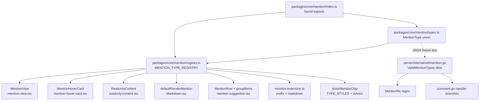

# MentionType Registry - Plan

## Goal Capsule

**Objective:** Refactor Multica's @ mention system from 10+ hardcoded type-dispatch sites into a declarative `MentionTypeRegistry`, then register "skill" as the first new type to prove the pattern. Fix existing type-alignment bugs along the way.

**Product authority:** User-confirmed scope (registry + skill type + bug fixes), approach (full registry refactor, `Record<MentionType, Config>` pattern), @skill behavior (trigger agent execution), routing (assignee > recency > online), and visual identity (purple + BookOpenText icon).

**Open blockers:** None.

**Product Contract preservation:** Product Contract unchanged from brainstorm source. Planning sections added by ce-plan.

---

## Product Contract

### Summary

Establish a single-source-of-truth `MentionTypeRegistry` in `packages/core/mention/` that defines every mention type's metadata (label, prefix, chip style, group, behavior, renderer). Replace all 10+ hardcoded dispatch sites in frontend, Go backend, and mobile with registry lookups. Register "skill" as the first new type with agent-triggering behavior, smart routing, a distinct SkillChip, and a HoverCard showing agent affinity. Fix the existing `Markdown.tsx` bug that omits `squad` from its type alternation.

### Problem Frame

The mention system grew organically — each new type added parallel if/else chains across `MentionView`, `MentionHoverCard`, `ReadonlyContent`, `defaultRenderMention`, `MentionRow`, `groupItems`, `TYPE_STYLES`, `isActorMentionType`, `@` prefix logic, mobile serialization, and Go backend regex/handlers. The result: 4+ divergent type unions (ActorMentionType = 4 types, mobile MentionType = 5, MentionItem = 6, Go regex = 5), a bug where `Markdown.tsx` omits `squad`, and adding any new type requires coordinated edits across 15+ files. Skills — the product's primary reusable instruction packages — are invisible to the mention system despite being first-class workspace entities.

### Key Decisions

**1. Record<MentionType, Config> pattern.** The registry follows the codebase's established idiom (`STATUS_CONFIG` in `packages/core/issues/config/status.ts`, `PROJECT_STATUS_CONFIG` in `packages/core/projects/config.ts`). Each mention type is a key in a `Record` whose value carries metadata (display label, @-prefix rule, chip variant, group label, behavior type, renderer reference). This is not a new pattern — it is the existing Multica convention applied to a new domain.

**2. Single authoritative type union.** One `MentionType` union in `packages/core/mention/` replaces the current 4+ divergent unions. Every consumer imports from this one location. The union includes all current types (`member | agent | squad | issue | project | all`) plus `skill`.

**3. Skill triggers agent execution.** @skill in a comment is semantically equivalent to @agent — it enqueues a task. The difference: instead of addressing a specific agent, the system resolves which agent to trigger via the skill-to-agent binding. This parallels the existing @squad → leader resolution pattern.

**4. Smart routing for skill mentions — frontend resolves, backend enqueues.** When multiple agents have the same skill, the frontend resolves the best agent using: (1) issue assignee if they have the skill, (2) most recently used agent for this skill (from localStorage recency data), (3) any online agent with the skill. The resolved `agent_id` is passed as comment metadata to the backend, which enqueues directly. When a skill has zero assigned agents, the frontend falls back to the issue's assignee agent. This leverages `selectSkillAssignments` (`packages/core/workspace/queries.ts:101-115`) and the existing recency tracking system. The existing `hasPendingTaskForIssueAndAgent` dedup prevents double-triggering.

**5. Go backend uses a constant list + regex generation.** A Go slice of valid type strings is the single source for the compiled `MentionRe` regex. Frontend and backend type lists are kept in sync by tests, not by shared code generation. This is simpler than a cross-language build step and matches how other Go ↔ TS boundaries in the codebase work.

**6. Purple + BookOpenText for skill visual identity.** SkillChip uses a violet/purple tint (consistent with the skill-import-search ideation) and the `BookOpenText` Lucide icon. Skills are documents/instructions, not actors — the visual language reflects this.

### Key Flows

**Flow 1: Registering a new mention type (after refactor)**

1. Add the type string to the `MentionType` union in `packages/core/mention/`.
2. Add a registry entry with `{ label, prefix, chipVariant, groupLabel, behavior, hoverCard }`.
3. Add the type string to the Go constant list in `server/internal/util/mention.go`.
4. If the type triggers agent behavior, add a handler branch in `comment.go`.
5. Run tests — all dispatch sites automatically pick up the new type from the registry.

**Flow 2: User @mentions a skill in a comment**

1. User types `@` in the Tiptap editor. The suggestion popup shows grouped items including a new "Skills" group sourced from `workspaceKeys.skills(wsId)`.
2. User selects a skill. A mention node is inserted with `type: "skill"`, `id: skill-uuid`, `label: skill-name`.
3. On save, the mention serializes as `[@skill-name](mention://skill/uuid)` (with `@` prefix, since it triggers like @agent).
4. On comment submit, the backend `ParseMentions` extracts the skill mention. `computeCommentAgentTriggers` routes to the new `skill` handler: resolve agents via `selectSkillAssignments`, apply smart routing (assignee > recency > online), enqueue task for the resolved agent.
5. The SkillChip renders inline with purple tint + BookOpenText icon. Hovering shows a SkillProfileCard with name, description, and bound agents.

**Flow 3: Reading a skill mention in read-only context**

1. `ReadonlyContent` looks up the skill type in the registry → renders a navigable SkillChip linking to the skill detail page.
2. `defaultRenderMention` in `Markdown.tsx` looks up the registry → renders a `SkillMentionCard` (or falls through to a generic chip if the registry entry has a renderer).
3. Mobile `mention-serialize.ts` recognizes "skill" from the registry → serializes consistently with web.

### Requirements

**Registry Infrastructure**

- R1. A `MentionType` union in `packages/core/mention/` is the single authoritative source for all mention types, including `"skill"`.
- R2. A `MENTION_TYPE_REGISTRY` constant in `packages/core/mention/` maps each `MentionType` to its configuration: display label, @-prefix rule (`true`/`false`), chip component reference, group label for the suggestion dropdown, behavior type (`"link"` | `"trigger"`), and hover card component reference.
- R3. All existing frontend dispatch sites (`MentionView`, `MentionHoverCard`, `ReadonlyContent`, `defaultRenderMention`, `MentionRow`, `groupItems`, `TYPE_STYLES`, `isActorMentionType`, `@` prefix logic) look up the registry instead of switching on hardcoded type literals.
- R4. The Go backend maintains a `ValidMentionTypes` string slice in `server/internal/util/mention.go` that generates `MentionRe` programmatically.
- R5. A test in `packages/core/mention/` verifies that the TS type union and the Go constant list contain the same set of types (via a JSON fixture or shared constant).

**Skill Type**

- R6. "skill" is registered in the `MentionType` union and the `MENTION_TYPE_REGISTRY` with behavior type `"trigger"`, @-prefix `true`, group label "Skills", and purple BookOpenText chip styling.
- R7. The `buildSyncItems()` function in `mention-suggestion.tsx` reads workspace skills from `workspaceKeys.skills(wsId)` cache and includes them in the suggestion list.
- R8. The `groupItems()` function creates a "Skills" group for skill-type items in the suggestion dropdown.
- R9. A `SkillChip` component in `packages/ui/` renders skill mentions with purple tint, BookOpenText icon, and text-xs typography, following the `ActorMentionChip` pattern.
- R10. A `SkillProfileCard` in the hover card system shows the skill's name, description, and bound agents (from `selectSkillAssignments`).

**Backend Behavior**

- R11. The Go `ValidMentionTypes` slice includes `"skill"`, making `MentionRe` accept skill mentions.
- R12. The frontend resolves skill-to-agent routing (assignee > recency > online) using `selectSkillAssignments` and localStorage recency data, then passes the resolved `agent_id` as comment metadata. The backend `computeCommentAgentTriggers` reads the pre-resolved agent ID and enqueues via `EnqueueTaskForMention`. Reuses the existing `hasPendingTaskForIssueAndAgent` dedup to avoid double-triggering.
- R13. When a skill has zero assigned agents, the routing falls back to the issue's current assignee agent. The skill is still insertable and renderable in the @ dropdown (not hidden or disabled).
- R14. The skill trigger source is a new constant (e.g., `TriggerSourceMentionSkill`) in the trigger source enum.

**Bug Fixes**

- R15. `Markdown.tsx` includes `"squad"` in its mention type regex alternation (currently omitted).

**Serialization & Cross-Surface**

- R16. The Tiptap `mention-extension.ts` tokenizer and `renderMarkdown` correctly handle `"skill"` type — tokenize parses it, render serializes it with `@` prefix.
- R17. The `ReadonlyContent` renderer shows skill mentions as navigable SkillChips linking to the skill detail page.
- R18. Mobile `mention-serialize.ts` recognizes `"skill"` as a valid type and serializes/deserializes consistently with web.

### Acceptance Examples

**AE1. Skill appears in @ dropdown.** User types `@` in a comment. The suggestion popup shows members, agents, squads, issues, and — in a new "Skills" group — workspace skills. Each skill row shows name and description.

**AE2. Skill mention triggers agent.** User inserts `@code-review` skill mention and submits the comment. The backend resolves which agent has the `code-review` skill. If the issue's assignee has it, that agent is triggered. Otherwise, the most recently used agent with that skill is triggered. If the skill has zero assigned agents, the issue's assignee agent is used as fallback. A task is enqueued for the resolved agent. Existing dedup logic prevents double-triggering if the agent is already queued.

**AE3. Skill chip renders inline.** After submitting a comment with `@code-review`, the skill mention renders as a purple chip with a BookOpenText icon. Hovering shows a card with the skill's name, description, and "Bound to: Agent-Alpha, Agent-Beta".

**AE4. Squad mention renders in Markdown.** After R15 fix, a `[@DevTeam](mention://squad/uuid)` mention in `MemoizedMarkdown` (chat history, skill output) renders correctly as a squad chip instead of disappearing.

**AE5. Adding a new type is one registration.** To add "document" as a mention type: add `"document"` to the TS union, add one registry entry, add to Go constant list, optionally add a handler. Zero existing dispatch sites need modification.

### Scope Boundaries

**Deferred for later:**

- Mobile sentinel approach refactor (`mention-serialize.ts` uses U+2063 sentinel characters; this is a separate reliability initiative)
- Unified slash/mention dropdown (merging `/` and `@` into one trigger surface)
- @member notification behavior (currently inert; real pain but separate feature)
- @all trigger suppression warning UI
- Live trigger composer (real-time preview of which agents will be triggered)
- Multi-skill composition and parameterized skill invocation
- Skill backlink index ("Referenced in" on skill detail page)

**Outside scope:**

- New mention types beyond "skill" (the registry makes them cheap; this PR proves the pattern with one)
- Changes to the agent-skill binding model itself

### Dependencies / Assumptions

- `workspaceKeys.skills(wsId)` query and `skillListOptions(wsId)` already exist with realtime invalidation — no new data fetching needed.
- `selectSkillAssignments` (`packages/core/workspace/queries.ts:101-115`) already builds the `Map<skillId, Agent[]>` needed for smart routing.
- The recency tracking system (`mention-recency.ts`) uses `type:id` keys that are natively extensible to `skill:uuid`.
- Go-TS type sync is maintained by tests, not by shared code generation. If a developer adds a type to one side but forgets the other, a test fails.

### Outstanding Questions

**Deferred to Planning:**

- Q1. Test strategy for the Go handler branch — unit test vs. integration test with the comment edit flow.
- Q2. How to handle the `packages/ui/` package boundary: ActorMentionChip cannot import from `@multica/core`. Options: (a) keep TYPE_STYLES and isActorMentionType in `packages/ui/` with a string-key mapping, or (b) move ActorMentionChip to `packages/views/`.
- Q3. Smart routing implementation: the recency priority (#2) requires backend-side recency data that doesn't exist. Options: (a) add a `mention_trigger_log` table, (b) simplify to assignee > online (drop recency), or (c) have frontend resolve agent and pass as comment metadata.
- Q4. Whether `project` should be added to the Go `ValidMentionTypes` (currently absent from Go regex, present in TS union). Adding it is a behavioral change (ParseMentions would start extracting project mentions).
- Q5. U4 scope: whether to migrate all 25+ dispatch files or only the primary 8, with the rest as follow-up.

**Resolved by KTD1:** File structure (split into types.ts + registry.ts + helpers.ts).
**Resolved by KTD2:** SkillChip in `packages/ui/`, SkillProfileCard in `packages/views/`.

### Sources / Research

- Ideation artifact: `docs/ideation/2026-07-13-skill-mention-ideation.html` — 7 ranked ideas with evidence dossiers
- Evidence dossiers: `evidence-autocomplete-discovery.md`, `evidence-rendering-visual.md`, `evidence-semantic-behavior.md`, `evidence-cross-surface.md` — 62 verbatim code entries with file:line pointers
- Grounding dossier: `grounding.md` — confirmed 10+ frontend dispatch sites, 5+ Go backend sites, 4+ divergent type unions, 9 test files
- Existing registry precedents: `packages/core/issues/config/status.ts` (STATUS_CONFIG), `packages/core/projects/config.ts` (PROJECT_STATUS_CONFIG)
- Mention system tests: `server/internal/util/mention_test.go`, `packages/views/editor/extensions/mention-extension.test.ts`, `packages/views/editor/extensions/mention-suggestion.test.tsx`, and 6 others

---

## Planning Contract

### Key Technical Decisions

**KTD1. Registry file structure: split into types.ts + registry.ts + helpers.ts in `packages/core/mention/`.** The `Record<EnumType, Config>` pattern used by `STATUS_CONFIG` keeps types and config in one file, but the mention registry has more moving parts (type union, config record, helper functions like `getMentionPrefix`, `isActorMentionType`, `getMentionGroupLabel`). Splitting keeps each file focused: `types.ts` holds the `MentionType` union and `MentionTypeConfig` interface; `registry.ts` holds the `MENTION_TYPE_REGISTRY` constant; `helpers.ts` holds pure functions that derive behavior from the registry. All three export from a barrel `index.ts`.

**KTD2. SkillChip in `packages/ui/`, SkillProfileCard in `packages/views/`.** The chip is a pure presentational component with no business logic — it belongs in `packages/ui/` alongside `ActorMentionChip`. The profile card reads `selectSkillAssignments` from Query cache (business logic) — it belongs in `packages/views/` alongside `MentionHoverCard`.

**KTD2b. Package boundary: `packages/ui/` owns its own type styles.** `TYPE_STYLES`, `isActorMentionType`, and related styling logic stay in `packages/ui/components/common/actor-mention-chip.tsx`. The registry in `packages/core/mention/` uses a `chipVariant: string` key (e.g., `"member"`, `"agent"`, `"skill"`) — the UI component maps this key to its own Tailwind classes. This keeps `packages/core/` and `packages/ui/` independent per the hard package boundary constraint.

**KTD3. Go-TS sync via JSON fixture test.** A JSON file in `packages/core/mention/__tests__/valid-mention-types.json` lists all valid type strings. A TS test verifies the `MentionType` union matches. A Go test reads the same file (or a copy at `server/internal/util/testdata/valid-mention-types.json`) and verifies the `ValidMentionTypes` slice matches. This is simpler than code generation and matches how the codebase handles cross-language enum validation.

**KTD4. Skill routing: frontend resolves agent, passes as comment metadata.** The smart routing (assignee > recency > online) happens on the frontend where localStorage recency data is available. When the user submits a comment with @skill mentions, the frontend resolves each skill to the best agent using `selectSkillAssignments` + recency data + assignee check, then attaches the resolved `agent_id` as metadata on the comment submission. The backend receives the pre-resolved agent ID and enqueues the task directly — no new sqlc query needed for agent resolution. This avoids creating a backend recency table and keeps the routing logic in one place.

**KTD5. Dispatch migration: atomic, not incremental.** All 10+ frontend dispatch sites migrate to registry lookups in one pass. Incremental migration would create a transition period where some sites use the registry and others use hardcoded literals, increasing the chance of type-set divergence. The existing 9 test files provide safety net coverage.

**KTD6. TriggerSourceMentionSkill extends existing trigger source enum.** The trigger source at `comment.go:999-1007` is a simple string enum. Adding `"mention_skill"` follows the existing pattern (`"mention_agent"`, `"mention_squad_leader"`). No architectural change needed.

### Assumptions

- The `SkillSummary` type (`packages/core/types/agent.ts:628-639`) with `id`, `name`, `description`, `config` provides sufficient data for the suggestion dropdown and SkillProfileCard.
- The `selectSkillAssignments` function returns a `Map<string, Agent[]>` that is available in the Query cache at comment-submit time (not just at render time).
- Mobile's `mention-serialize.ts` adding "skill" to its type list is sufficient — no sentinel logic changes needed.
- The existing `PreviewCommentTriggers` endpoint at `comment.go:1080-1156` will correctly list skill-triggered agents in its preview without modification (it calls `computeCommentAgentTriggers` which will include the new handler).

---

## High-Level Technical Design

The registry pattern fans out from one source of truth to all consumers:



The TS side (`packages/core/mention/`) is the primary registry. The Go side (`server/internal/util/mention.go`) maintains a parallel constant list. A JSON fixture test keeps them in sync. All frontend consumers import from `@multica/core/mention` — no direct type-literal switching.

---

## Implementation Units

### U1. Core Registry — Type, Config, and Helpers

**Goal:** Establish the `MentionType` union, `MentionTypeConfig` interface, `MENTION_TYPE_REGISTRY` constant, and helper functions in `packages/core/mention/`.

**Requirements:** R1, R2

**Dependencies:** None

**Files:**
- `packages/core/mention/types.ts` — create
- `packages/core/mention/registry.ts` — create
- `packages/core/mention/helpers.ts` — create
- `packages/core/mention/index.ts` — create (barrel export)
- `packages/core/package.json` — add `./mention` subpath export

**Approach:** Define `MentionType` as `"member" | "agent" | "squad" | "issue" | "project" | "all" | "skill"`. Define `MentionTypeConfig` with fields: `label: string`, `prefix: boolean` (whether to render `@`), `groupLabel: string`, `behavior: "link" | "trigger"`, `chipVariant: string` (string key mapped to Tailwind classes by `packages/ui/` components — see KTD2b), `actorType: boolean` (replaces `isActorMentionType` within core; `packages/ui/` keeps its own version). Populate `MENTION_TYPE_REGISTRY` with all 7 types. Implement helpers: `getMentionPrefix(type)`, `getMentionGroupLabel(type)`.

**Patterns to follow:** `packages/core/issues/config/status.ts` (STATUS_CONFIG Record pattern), `packages/core/projects/config.ts` (PROJECT_STATUS_CONFIG).

**Test scenarios:**
- Registry contains all 7 expected types.
- Each type's config has all required fields populated.
- `isActorMentionType` returns true for member/agent/squad/all, false for issue/project/skill.
- `getMentionPrefix` returns `true` for member/agent/squad/all/skill, `false` for issue/project.
- `getMentionGroupLabel` returns correct group labels ("Users" for actors, "Issues" for issue/project, "Skills" for skill).

**Verification:** `pnpm typecheck` passes. Import from `@multica/core/mention` works from `packages/views/`.

### U2. Go Backend — Constant List + Regex Generation

**Goal:** Replace the hardcoded `MentionRe` regex with a constant-driven build that includes `"skill"`.

**Requirements:** R4, R11

**Dependencies:** None

**Files:**
- `server/internal/util/mention.go` — modify
- `server/internal/util/mention_test.go` — modify
- `server/internal/util/testdata/valid-mention-types.json` — create

**Approach:** Add `var ValidMentionTypes = []string{"member", "agent", "squad", "issue", "project", "all", "skill"}` to `mention.go`. This also fixes the pre-existing Go/TS divergence where `project` was absent from the Go regex. Build `MentionRe` by joining the slice with `|` and inserting into the regex template string. Update the stale doc comment on the `Mention` struct to include "skill" and "project". Create the JSON fixture file that mirrors the Go list. Add a test that reads the JSON fixture and verifies it matches `ValidMentionTypes`.

**Patterns to follow:** Current `mention.go` structure. The `ParseMentions` function and `Mention` struct remain unchanged.

**Test scenarios:**
- `MentionRe` matches `[@SkillName](mention://skill/uuid-here)`.
- `MentionRe` still matches all existing types (member, agent, squad, issue, all).
- `ParseMentions` correctly extracts skill mentions with deduplication.
- JSON fixture matches `ValidMentionTypes` (self-test).

**Verification:** `make test` passes. `go vet ./server/...` clean.

### U3. TS-Go Type Sync Test

**Goal:** Ensure the TS `MentionType` union and Go `ValidMentionTypes` slice stay in sync.

**Requirements:** R5

**Dependencies:** U1, U2

**Files:**
- `packages/core/mention/__tests__/type-sync.test.ts` — create
- `packages/core/mention/__tests__/valid-mention-types.json` — create (canonical source)

**Approach:** The canonical type list lives as a JSON file in `packages/core/mention/__tests__/`. The TS test imports the `MentionType` union and compares its runtime representation against the JSON file. The Go test at `server/internal/util/testdata/valid-mention-types.json` is a copy (or symlink) of the same list. When a developer adds a type to one side but not the other, the test fails.

**Test scenarios:**
- TS `MentionType` union values exactly match the JSON file entries.
- Adding a type to the JSON file but not to the TS union causes a test failure.
- Adding a type to the TS union but not to the JSON file causes a test failure.

**Verification:** `pnpm test` passes for the new test file.

### U4. Frontend Dispatch Migration

**Goal:** Replace all 10+ hardcoded type-dispatch sites with registry lookups.

**Requirements:** R3, R15, R17

**Dependencies:** U1

**Files:**
- `packages/views/editor/extensions/mention-view.tsx` — modify
- `packages/views/editor/mention-hover-card.tsx` — modify
- `packages/views/editor/readonly-content.tsx` — modify
- `packages/views/common/markdown.tsx` — modify (defaultRenderMention: registry lookup)
- `packages/ui/markdown/Markdown.tsx` — modify (fix R15: add 'squad' to mention regex at line 212)
- `packages/views/editor/extensions/mention-suggestion.tsx` — modify
- `packages/views/editor/extensions/mention-extension.ts` — modify
- `packages/ui/components/common/actor-mention-chip.tsx` — modify
- `packages/core/workspace/hooks.ts` — modify (getActorName/getActorAvatarUrl)

**Approach:** Each dispatch site replaces its hardcoded if/else or type union with a registry lookup:
- `mention-view.tsx`: Replace `if (type === "issue") ... else if (isActorMentionType(type))` with `const config = MENTION_TYPE_REGISTRY[type]` and dispatch to `config.renderer` or fall through to a generic chip.
- `mention-hover-card.tsx`: Replace ternary chain with `const CardComponent = MENTION_TYPE_REGISTRY[type]?.hoverCard`.
- `readonly-content.tsx`: Replace regex alternation and if/else with registry-driven rendering.
- `Markdown.tsx:63-82`: Replace `if (type === "issue") ... else if (type === "project") ... else return null` with registry lookup. This also fixes R15 — the new code uses the registry's type set, so `squad` is automatically included.
- `mention-suggestion.tsx`: `groupItems()` uses `getMentionGroupLabel(type)` from registry. `MentionRow` dispatches based on registry config instead of hardcoded type checks.
- `mention-extension.ts`: `@` prefix logic uses `getMentionPrefix(type)` from registry.
- `actor-mention-chip.tsx`: `TYPE_STYLES` and `isActorMentionType` stay in `packages/ui/` (package boundary). The registry's `chipVariant` string key maps to the existing `TYPE_STYLES` record. No import from `@multica/core`.

**Patterns to follow:** Current dispatch site structure — keep the same component boundaries, only change the dispatch mechanism.

**Test scenarios:**
- Covers AE4. `[@DevTeam](mention://squad/uuid)` in `MemoizedMarkdown` renders as a squad chip (verifies R15 fix).
- All existing mention types render identically to before the migration (regression).
- `MentionView` renders `IssueChip` for issues, `ProjectChip` for projects, `ActorMentionChip` for actors, and falls through to generic for unknown types.
- `groupItems()` produces "Users", "Issues", and "Skills" groups.
- `@` prefix is present for member/agent/squad/all/skill, absent for issue/project.
- Covers R17. `ReadonlyContent` renders skill mentions as navigable SkillChips linking to skill detail page.

**Verification:** `pnpm typecheck` and `pnpm test` pass. Existing mention tests (`mention-view.test.tsx`, `mention-suggestion.test.tsx`, `mention-hover-card.test.tsx`, `actor-mention-chip.test.tsx`, `mention-extension.test.ts`) pass without modification (or with minimal import updates).

### U5. SkillChip and SkillProfileCard

**Goal:** Create the visual components for skill mentions.

**Requirements:** R9, R10

**Dependencies:** U1, U4

**Files:**
- `packages/ui/components/common/skill-mention-chip.tsx` — create
- `packages/ui/components/common/skill-mention-chip.test.tsx` — create
- `packages/views/editor/skill-profile-card.tsx` — create
- `packages/views/editor/mention-hover-card.tsx` — modify (add skill case)

**Approach:** `SkillChip` follows the `ActorMentionChip` pattern: a `rounded-full` inline chip with `text-xs` typography, a tinted background using a violet/purple Tailwind class, and the `BookOpenText` Lucide icon. The component accepts `name`, `description?`, and `focusable?` props. `SkillProfileCard` follows the `AgentProfileCard` pattern: shows skill name, description, and a list of bound agents from `selectSkillAssignments`. Each agent name links to the agent detail page.

**Patterns to follow:** `packages/ui/components/common/actor-mention-chip.tsx` (component structure, TYPE_STYLES pattern), `packages/views/editor/mention-hover-card.tsx` (hover card dispatch).

**Test scenarios:**
- SkillChip renders with purple tint and BookOpenText icon.
- SkillChip displays the skill name.
- SkillChip is focusable when `focusable` prop is true.
- SkillProfileCard renders skill name and description.
- SkillProfileCard lists bound agents with links.
- SkillProfileCard handles zero agents gracefully (shows "No agents assigned" or similar).

**Verification:** `pnpm test` passes for the new test files.

### U6. Skill Registration, Autocomplete, and Frontend Routing

**Goal:** Register "skill" in the registry, wire up the @ dropdown, and implement frontend agent resolution for skill mentions.

**Requirements:** R6, R7, R8, R12, R13

**Dependencies:** U1, U4, U5

**Files:**
- `packages/core/mention/registry.ts` — modify (add skill entry)
- `packages/views/editor/extensions/mention-suggestion.tsx` — modify (buildSyncItems, groupItems)

**Approach:** Add `"skill"` entry to `MENTION_TYPE_REGISTRY` with: `label: "Skill"`, `prefix: true`, `groupLabel: "Skills"`, `behavior: "trigger"`, `chipVariant: "skill"` (purple), `actorType: false`. In `buildSyncItems()`, add a new block that reads from `workspaceKeys.skills(wsId)` cache and maps `SkillSummary` items to `MentionItem` objects with `type: "skill"`. In `groupItems()`, the registry's `groupLabel` drives the grouping — "Skills" group appears automatically. Also add frontend routing logic: before comment submission, for each @skill mention, resolve the target agent using `selectSkillAssignments` + localStorage recency + assignee check (per KTD4), and attach the resolved `agent_id` as comment metadata (`skill_mention_agents` field).

**Patterns to follow:** Existing `buildSyncItems()` blocks for members/agents/squads/issues. `workspaceKeys.skills(wsId)` from `packages/core/workspace/queries.ts:18`.

**Test scenarios:**
- Covers AE1. `@` dropdown shows a "Skills" group with workspace skills.
- Each skill row displays name and description.
- Selecting a skill inserts a mention node with `type: "skill"`.
- Skills with no description still render (empty description handled gracefully).
- Empty workspace (no skills) produces no "Skills" group.

**Verification:** `pnpm test` passes. Manual verification: typing `@` in a comment shows skills in the dropdown.

### U7. Backend Skill Mention Handler

**Goal:** Add the Go handler that processes @skill mentions and triggers agent execution.

**Requirements:** R12, R13, R14

**Dependencies:** U2, U6

**Files:**
- `server/internal/handler/comment.go` — modify
- `server/internal/handler/comment_test.go` — modify (or create mention_skill_trigger_test.go)
- `server/internal/handler/mention_self_trigger_test.go` — modify

**Approach:** Add `TriggerSourceMentionSkill = "mention_skill"` to the trigger source enum. Update `hasAgentOrSquadMention` at line 1617 to also recognize "skill" type. In `computeCommentAgentTriggers`, add a handler that reads the pre-resolved `agent_id` from the `skill_mention_agents` comment metadata (set by the frontend in U6) and enqueues via `EnqueueTaskForMention`. Reuse `hasPendingTaskForIssueAndAgent` for dedup. When metadata is absent (e.g., legacy clients), skill mentions are silently ignored (no-op). **Prerequisite:** add `skill_mention_agents` field to the comment submission API handler.

**Patterns to follow:** Existing `case "squad":` branch in `resolveMentionedAgentCommentTriggers` (comment.go:1938-1977). The squad handler resolves leader → enqueues; the skill handler resolves best agent → enqueues.

**Test scenarios:**
- Covers AE2. @skill mention with assigned agents triggers the assignee if they have the skill.
- @skill mention where assignee lacks the skill triggers the most recently used agent.
- @skill mention with zero assigned agents falls back to issue assignee (R13).
- Dedup prevents double-triggering when agent is already queued.
- @skill mention with invalid/unknown skill UUID is silently ignored (no crash).
- Multiple @skill mentions in one comment each trigger independently.

**Verification:** `make test` passes. Integration test with comment edit flow confirms end-to-end.

### U8. Cross-Surface and Mobile

**Goal:** Ensure skill mentions serialize/deserialize correctly on mobile and in read-only contexts.

**Requirements:** R16, R18

**Dependencies:** U1, U4

**Files:**
- `apps/mobile/lib/mention-serialize.ts` — modify (add "skill" to type handling)
- `apps/mobile/lib/markdown/markdown.tsx` — modify (add skill navigation or rendering)
- `packages/views/editor/extensions/mention-extension.test.ts` — modify (add skill tokenizer test)

**Approach:** In `mention-serialize.ts`, add "skill" to the recognized type list. In the label serialization logic, skill mentions use `@` prefix (same as agents). In mobile markdown renderer, add skill to the `onLinkPress` handler — navigate to skill detail page (or no-op if skill detail route doesn't exist on mobile yet). In `mention-extension.test.ts`, add a test case for skill mention round-trip: tokenize `[@SkillName](mention://skill/uuid)` → render → verify output matches.

**Patterns to follow:** Existing handling for "agent" and "squad" types in `mention-serialize.ts`. Existing test cases in `mention-extension.test.ts`.

**Test scenarios:**
- Covers AE3. Skill mention serializes as `[@name](mention://skill/uuid)` with @ prefix.
- Skill mention round-trips through tokenize → render without data loss.
- Mobile serializes skill mentions consistently with web.

**Verification:** `pnpm test` passes. Mobile TypeScript compiles without errors.

---

## Verification Contract

**Test commands:**

```bash
pnpm typecheck                    # TypeScript compilation across all packages
pnpm test                         # Vitest tests through Turborepo
make test                         # Go tests
pnpm exec playwright test         # E2E tests (mention-related)
```

**Quality gates:**

- All existing mention tests pass without behavioral changes (regression gate).
- New tests for registry, SkillChip, SkillProfileCard, and Go handler pass.
- TypeScript-Go type sync test passes.
- Manual verification: `@` dropdown shows "Skills" group, skill mention renders as purple chip, hover card shows agent affinity.
- `go vet ./server/...` clean.

**Behavioral verification:**

- AE1-AE5 from the Product Contract are demonstrably true.
- Existing mention types (member, agent, squad, issue, project, all) behave identically to before the refactor.

---

## Definition of Done

- All 8 implementation units are complete and their test scenarios pass.
- `pnpm typecheck`, `pnpm test`, `make test` all green.
- The `MentionTypeRegistry` is the single source of truth — no hardcoded type dispatch remains in the migrated files.
- "skill" is a fully functional mention type: autocomplete, rendering, hover card, backend trigger, mobile serialization.
- The squad omission bug in `Markdown.tsx` is fixed (R15).
- Dead code from the old dispatch approach is removed (no orphaned `isActorMentionType` literals, no unused type unions).
- No abandoned experimental code remains in the diff.
