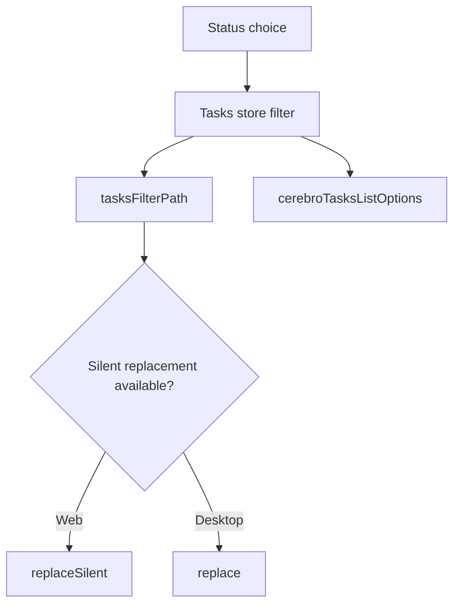

# Tasks Status Filters - Plan

## Goal Capsule

- **Objective:** Make each status choice in Tasks update the selected state, the task-list request, and the shareable URL.
- **Authority:** The FIR-3663 report and its desktop screenshot define the affected view and controls.
- **Stop conditions:** Do not change task-status semantics, the Tasks layout, navigation APIs, or unrelated server CI failures.
- **Execution profile:** Rebase the existing PR onto current `main`, retain only the necessary Tasks change, and prove the behavior with focused package checks and fresh PR CI.

---

## Product Contract

### Summary

The Tasks page has status controls for All, Queued, Dispatched, Running, Completed, Failed, and Cancelled.
Selecting a status must filter the visible task-list request without a web route reload and must preserve a URL that can be shared.

### Problem Frame

The current implementation writes browser history directly before asking the navigation adapter to replace the route.
That sequence differs from the adapter contract used by web and desktop hosts, so status choices can appear not to work.

### Requirements

- R1. Selecting a status updates the selected Tasks control and the list request's status filter.
- R2. Web hosts update the status query through the navigation adapter's silent replacement API.
- R3. Hosts without silent replacement use ordinary route replacement.
- R4. Existing Tasks URL parsing and serialization remain the source of truth for filter parameters.

### Acceptance Examples

- AE1. Given All is selected, when Queued is chosen, then Queued is selected, the list request contains `queued`, and the URL contains `status=queued`.
- AE2. Given a host lacks silent replacement, when Running is chosen, then it receives the normal replacement path with `status=running`.

### Scope Boundaries

- **In scope:** The Tasks page's filter-to-navigation synchronization and direct regression coverage.
- **Out of scope:** Task-status definitions, other filter controls, task-table layout, and unrelated backend CI failures that also reproduce on `main`.

---

## Planning Contract

### Key Technical Decisions

- **KTD1. Use the navigation adapter for URL synchronization.** Call its optional silent replacement method when present and its standard replacement method otherwise. This matches the established Inbox pattern and keeps web and desktop behavior within their supported navigation contracts.
- **KTD2. Keep URL state in the existing Tasks helpers.** `tasksFilterPath` remains responsible for serializing the selected filter, while `parseTasksFilterFromSearchParams` remains responsible for hydration.
- **KTD3. Exclude generated graph output from the feature change.** Rebase it to `main` rather than preserving a stale generated artifact that does not affect status-filter behavior.

### High-Level Technical Design

### Assumptions

- The existing `replaceSilent` adapter contract remains available on web and intentionally optional on desktop.
- Current `main` is the correct integration baseline for resolving PR #2610.

---

## Implementation Units

### U1. Align Tasks navigation with the adapter contract

- **Goal:** Synchronize a changed Tasks filter through the host navigation adapter without a direct browser-history mutation.
- **Requirements:** R1, R2, R3, R4; KTD1 and KTD2.
- **Dependencies:** None.
- **Files:** `packages/cerebro-tasks/views/tasks-page.tsx`, `packages/cerebro-tasks/core/url-state.ts`, `packages/cerebro-tasks/core/url-state.test.ts`.
- **Approach:** Rebase onto current `main`, remove the page-specific history helper, and select the silent adapter method with the standard adapter method as the desktop fallback. Preserve filter serialization and hydration behavior.
- **Patterns to follow:** `packages/views/inbox/components/inbox-page.tsx` uses the same optional silent replacement contract.
- **Test scenarios:** Preserve URL serialization for active and default filters; do not rewrite URL state outside the navigation adapter.
- **Verification:** The targeted Tasks package checks pass and the rebased diff contains no direct browser-history helper.

### U2. Cover the status-filter interaction

- **Goal:** Prevent the Tasks status controls from regressing to an unresponsive state.
- **Requirements:** R1, R2, R3; Covers AE1 and AE2.
- **Dependencies:** U1.
- **Files:** `packages/cerebro-tasks/views/tasks-page.test.tsx`.
- **Approach:** Render TasksPage with controlled navigation and query dependencies, then exercise a status radio control for both host capability variants.
- **Test scenarios:** Selecting Queued marks it selected, sends `queued` in the list query, and invokes silent replacement without normal replacement; selecting Running without silent replacement invokes normal replacement with `status=running`.
- **Verification:** The focused page test passes with both navigation variants.

---

## Verification Contract

| Gate | Applies to | Done signal |
| --- | --- | --- |
| Focused unit test | U2 | The Tasks page test passes for silent and fallback navigation. |
| Package type check | U1, U2 | `@multica/cerebro-tasks` reports no TypeScript errors. |
| Lint | U1, U2 | The changed TypeScript files meet the repository lint rules. |
| Pull-request CI | U1, U2 | All required checks on the rebased PR are green. |
| Browser smoke | U1, U2 | Delegated or omitted only when the focused interaction proof and green PR CI make it unnecessary. |

---

## Definition of Done

- U1 is done when a status change uses the navigation adapter and preserves the existing URL-state contract.
- U2 is done when web and desktop fallback behavior have direct regression coverage.
- The PR is rebased and mergeable, excludes stale generated graph output, has green required CI, and contains no abandoned conflict-resolution code.
