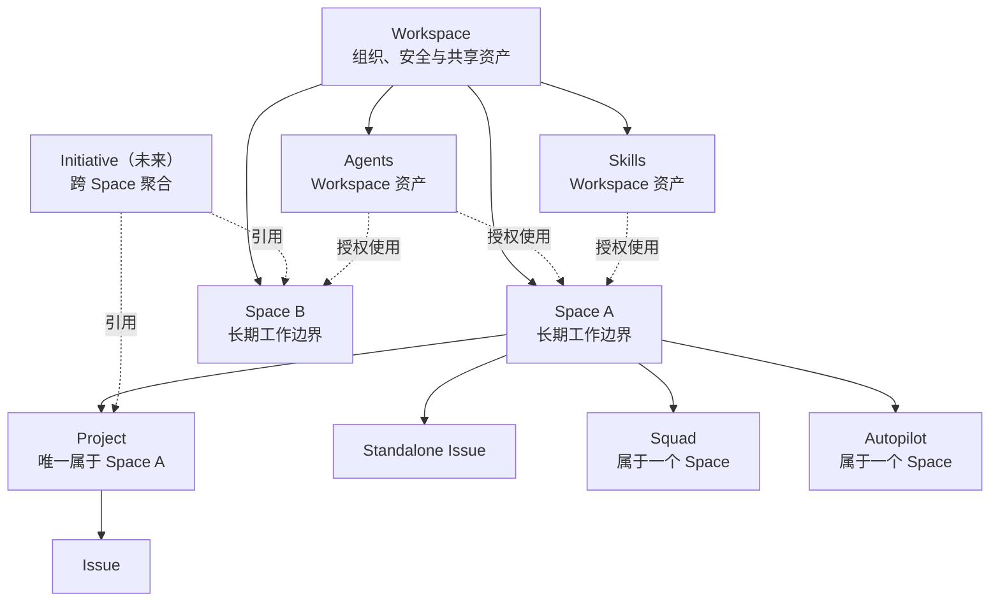

# Space-first 产品架构

> 状态：已确定的产品方向，具体实现可以分阶段完成。
>
> 更新时间：2026-07-10。
>
> 范围：定义 Workspace、Space、Project、Issue、Agent、Skill、Squad、Autopilot 和未来跨 Space 协作层之间的产品关系。本文描述目标模型，不代表当前代码已经完全实现。

## 一句话结论

Multica 应采用「一个对象只有一个清晰的 home，复用和跨团队协作通过显式关系完成」的模型：

- Workspace 是组织、身份、安全和共享能力的边界；
- Space 是长期工作的边界；
- Project 只能属于一个 Space；
- Issue 只能属于一个 Space，属于 Project 时必须和 Project 在同一 Space；
- Agent 和 Skill 属于 Workspace，可以开放给一个或多个 Space 使用；
- Squad 和 Autopilot 属于一个 Space；
- 将来用 Workspace 级的 Initiative 聚合多个 Space 的 Project，而不是让 Project 本身跨 Space。

常见场景保持简单，少数跨团队场景由专门的产品对象承载，不让所有用户为少数复杂需求承担长期认知成本。

## 设计原则

### 1. 归属、访问和展示是三件不同的事

- **归属（ownership）**：对象的唯一 home，决定生命周期、默认权限、编号和主要导航位置。
- **访问（access）**：哪些人或 Agent 能查看、编辑、调用或执行。
- **展示（appearance）**：对象可以出现在搜索、My Work、Dashboard、Initiative 等多个视图中。

一个对象可以出现在很多地方，但不因此拥有多个 home。

### 2. 高频路径必须是树，跨团队关系可以是图

日常工作使用一条稳定、可解释的主路径：

```text
Workspace → Space → Project → Issue
                    └────────→ Issue（也可不属于 Project）
```

依赖、引用、全局视图和未来 Initiative 可以形成关系图，但不能反过来破坏主路径。

### 3. 复用不等于归属

Agent、Skill、模板和 Integration 的价值来自跨 Space 复用。如果把它们强制放入某个 Space，会产生重复、迁移和「哪个副本才是真的」的问题。因此它们的定义位于 Workspace，使用范围再单独授权。

### 4. 权限默认继承，只允许收紧

Project 和 Issue 默认继承所在 Space 的访问范围。局部对象可以变得更严格，但不能绕过 Space 将内容分享给更大范围。这样用户只需理解一条权限链，避免隐式扩大可见性。

### 5. 复杂需求使用显式概念

跨团队项目是真实需求，但不是每个 Project 的基础属性。未来引入 Initiative 作为跨 Space 聚合层，比同时维护普通 Project、Shared Project 和各种例外规则更容易理解。

## 核心产品模型



## 对象归属表

| 对象 | 唯一 home | 是否可以跨 Space 使用 | 核心产品语义 |
| --- | --- | --- | --- |
| Workspace | 无上级 | 不适用 | 组织、成员、计费、安全、共享资产和 Integration 边界 |
| Space | Workspace | 不跨 | 长期团队或工作域，承载成员、权限和工作上下文 |
| Project | 一个 Space | 不跨 | 有明确目标、负责人和生命周期的工作容器 |
| Issue | 一个 Space | 不跨；可在全局视图展示 | 最小工作单元，可属于零个或一个 Project |
| Initiative（未来） | Workspace | 可以 | 聚合多个 Space 的 Project，表达跨团队目标 |
| Agent | Workspace | 可以，需授权 | 可复用的数字成员 |
| Skill | Workspace 或个人私有区 | 可以，需分享 | 可复用能力定义，不携带隐式数据权限 |
| Squad | 一个 Space | 不跨 | Space 内稳定的协作与派工组合 |
| Autopilot | 一个 Space | 不跨 | 在明确工作域中持续运行的自动化实例 |
| Autopilot Template | Workspace | 可以 | 创建 Autopilot 的可复用起点，不是运行实例 |
| Integration / Connection | Workspace | 可以，需绑定 | 凭据和外部系统连接，由 Space、Project 等消费 |
| Resource / Context | Workspace 中登记 | 可以被多个上下文引用 | 外部资源的身份与权限不因被引用而转移 |

## Workspace

Workspace 是组织级边界，负责：

- 成员、Guest、Workspace Owner 和安全策略；
- Agent、Skill、模板等共享能力目录；
- Integration、外部凭据和审计；
- 全局搜索、My Work、Inbox、报表和未来 Initiative；
- Space 的创建、归档和治理。

Workspace 不应该直接承载普通 Project 和 Issue。所有实际工作必须有明确 Space，避免形成无法治理的「Workspace 根目录工作」。

每个 Workspace 必须有一个 Default Space，作为导入、全局创建和兼容旧数据时的确定性 fallback。创建 Workspace 时，初始 Space 自动成为 Default Space；Workspace Owner / Admin 可以在 Settings 中切换。个人 Sidebar 排序、Join、Follow 或 Pin 都不能改变 Default Space。界面仍应明确展示最终 Space，不能悄悄把工作放进用户不知道的位置。

## Space

Space 表示一个长期稳定的工作域，可以对应产品线、职能团队、业务域或持续运营单元。它不是临时标签，也不只是 Sidebar 分组。

Space 负责：

- 成员与角色；
- Open / Private 可见性；
- Project、Issue、Squad 和 Autopilot 的归属；
- Issue identifier 的命名空间；
- Space 级默认上下文、资源入口和工作视图；
- 归档后的整体生命周期。

不建议为一次短期跨团队项目创建新的 Space。短期目标应由 Project 承载；真正跨多个 Space 的目标将来由 Initiative 承载。

### Space 类型与角色

- **Open Space**：Workspace 成员可以发现和浏览，并可主动 Join。
- **Private Space**：只有被邀请的成员能够发现和访问。
- **Space Lead / Admin**：管理成员、权限、Project、Squad、Autopilot 和归档。
- **Member**：参与日常工作，可按权限创建和更新内容。
- **Guest**：受限参与者，仅获得被授予的 Space 访问能力。

Open Space 的非成员可以浏览，但 Join 后才成为正式参与者并获得默认协作能力。Private Space 不允许通过单个 Project 或 Issue 绕过 Space 扩大访问范围。

### Join、Follow、Pin 和 Reorder

这些行为必须分开：

- **Join**：建立正式成员关系和协作角色；
- **Follow**：控制通知订阅；
- **Pin / Favorite**：添加个人导航快捷入口；
- **Reorder**：仅改变个人 Sidebar 顺序。

Pin 不授予权限，Follow 不代表成员身份，拖动顺序也不改变任何对象归属。

## Project

### 核心规则

每个 Project 必须且只能属于一个 Space。

这意味着：

- 创建 Project 时必须确定 Space；
- 从 Space 内创建时自动使用当前 Space；
- Project 内的 Issue 不再单独选择其他 Space；
- Project 的成员、默认上下文、编号和可见范围都可以从 Space 推导；
- 全局 Projects 页面只是跨 Space 索引，不是新的归属层。

### 为什么不让 Project 跨 Space

跨 Space Project 会立刻引入一组无法独立回答的问题：

- 哪个 Space 对 Project 的结果负责；
- 新 Issue 默认进入哪个 Space；
- 不同 Space 的成员看到什么；
- Space 归档时 Project 是否继续存在；
- Autopilot、Squad、资源和 identifier 应跟随哪个 Space；
- Project 设置到底由谁管理。

允许多归属看似灵活，实际会把「负责方、参与方、访问方」混成一个关系。单一 owning Space 让这些答案保持确定。

### 跨团队参与

跨团队成员可以加入 owning Space，或在 Open Space 中直接协作。他们来自哪个组织团队，不会改变 Project 的归属。这里区分的是「谁参与」和「工作属于哪里」。

### 移动 Project

首个 Space-first 版本不提供 Move Project。创建后 Space 只读，避免在权限、Autopilot 和 identifier 的完整迁移语义尚未就绪时提供半成品入口。以下规则保留为未来支持移动时的产品契约。

Move Project 是显式的高影响操作：

- Project 和其全部 Issue、sub-issue 一起移入目标 Space；
- Issue 的内部 ID 不变，可见 identifier 按目标 Space 重建；
- 旧 identifier 继续作为 alias 跳转；
- Project 绑定的 Autopilot 必须一起移动或在确认页中解除绑定；
- 操作前展示影响数量、访问变化和 identifier 变化。

不支持只把 Project 的一部分 Issue 留在旧 Space。如果工作确实已经分成两个长期责任域，应拆成两个 Project，再用 Initiative 或依赖关系连接。

## Issue

每个 Issue 必须属于一个 Space，可以不属于 Project。

### 归属约束

- Standalone Issue 直接属于 Space；
- Issue 属于 Project 时，Space 自动等于 Project 的 Space；
- parent issue 和 sub-issue 必须位于同一 Space；
- Issue 可以被搜索、My Work、Dashboard 和 Initiative 视图引用，但不会因此改变 home。

### 创建默认值

- 从 Space 创建：使用当前 Space；
- 从 Project 创建：使用 Project 的 Space，并隐藏重复选择；
- 从 parent issue 创建：继承 parent 的 Space 和 Project；
- 从全局 Quick Create 创建：优先使用当前工作上下文，否则使用 Default Space，同时始终展示可修改的 Space 选择；
- Agent 或 Autopilot 创建：必须使用触发上下文的 Space，不能依赖模糊推断。

### 移动 Issue

首个 Space-first 版本不提供 Move Issue。创建后 Space 只读；需要改变归属时先新建到目标 Space，再由用户自行处理旧工作。以下规则保留为未来支持移动时的产品契约。

- Standalone Issue 可以移动到另一个 Space；
- Project 内的 Issue 不能单独移动到其他 Space；用户需先移出 Project，或移动整个 Project；
- parent issue 和 sub-issue 作为一个树移动，不能形成跨 Space 的父子关系；
- 移动后内部 ID 不变，旧 identifier 作为 alias 保留；
- 依赖、关联和评论历史不因移动而丢失。

## Agent

Agent 是 Workspace 级数字成员，不属于某一个 Space。一个 Agent 可以服务多个 Space，避免为每个团队复制配置、记忆和运行环境。

Agent 必须有两套独立范围：

1. **Availability**：哪些人或 Space 可以发现、@mention、分配和调用 Agent；
2. **Work access**：Agent 可以读取或修改哪些 Space、Project、Issue、Integration 和 Resource。

调用权限不自动授予数据权限。一次执行的有效范围应是「调用者权限、Agent 权限和当前工作上下文」的安全交集，不能因为 Agent 被分享给某个 Space 就泄露其他 Space 的内容。

建议支持三种 Availability：

- Private：仅创建者或维护者；
- Selected Spaces：明确授权给若干 Space；
- Workspace：全 Workspace 可用。

Agent 只有在目标 Space 可用时，才能成为该 Space Issue、Autopilot 或 Squad 的执行者。

## Skill

Skill 是可复用能力，不是工作容器。Skill 定义保存在 Workspace 能力目录或创建者的私有区域，并通过分享范围供 Agent 或成员使用。

建议支持：

- Private Skill；
- 分享给 Selected Spaces；
- 分享给整个 Workspace；
- 明确的 Owner、Editor、User 角色；
- 版本和更新记录。

Skill 被 Agent 安装或在 Space 中启用，不会改变 Skill 的唯一来源，也不会自动获得该 Space 的数据、Secret 或 Integration 权限。需要外部能力时，Skill 只声明依赖，实际授权仍由 Agent 和 Integration 模型处理。

## Squad

Squad 属于一个 Space。它表达该 Space 内稳定的角色组合、协作方式和派工策略，而不是全 Workspace 的通用资产。

- Squad 成员可以是 Workspace Member 或 Agent；
- 同一个 Agent 可以加入多个 Space 的不同 Squad；
- Squad 只能接收本 Space 的 Issue；
- Space 归档时，其 Squad 一并归档；
- 需要在多个 Space 复用时，复用成员和模板，而不是让同一个 Squad 多归属。

这样既保留 Agent 的跨 Space 复用，也让具体协作组织拥有清晰责任边界。

## Autopilot

Autopilot 是一个 Space 内持续运行的自动化实例，不是 Agent 本身。

- 每个 Autopilot 必须属于一个 Space；
- 可以选择绑定同一 Space 的 Project；
- 创建的 Issue 必须进入 Autopilot 所在 Space；
- 使用的 Agent 必须对该 Space 可用，并拥有所需资源权限；
- Space 归档时 Autopilot 自动暂停；
- Project 移出 Space 时，绑定的 Autopilot 必须随 Project 移动或解除绑定。

Autopilot Template 则属于 Workspace，只负责复用配置。由模板创建出的每个 Autopilot 都是独立的 Space 实例。

## Integration、Resource 与 Context

Integration 的凭据和连接生命周期属于 Workspace，避免个人离职或 Space 归档导致连接失效。具体工作域通过 binding 使用连接：

- Integration / Connection：Workspace 级连接和凭据；
- Space Binding：哪些 Space 可以使用；
- Project Resource：某个 Project 的代码库、文档、频道或数据源；
- Issue Context：某次工作的具体引用和附件。

资源可以被多个 Space 或 Project 引用，但引用不改变资源所有权，也不自动扩大第三方系统权限。

上下文采用逐层组合：

```text
Workspace policy
  + Space bindings
  + Project resources
  + Issue-specific context
  ∩ 当前成员或 Agent 的实际权限
```

## Initiative：未来的跨 Space 协作层

当跨团队项目需求明确出现时，优先新增 Workspace 级 **Initiative**，而不是让 Project 变成多 Space 对象。

Initiative 可以包含：

- 跨 Space 的多个 Project；
- 目标、Owner、时间范围、状态和里程碑；
- Project 之间的依赖和总体进度；
- 各 Space 的责任和参与关系。

Initiative 只聚合和呈现，不接管 Project 或 Issue 的归属。看到 Initiative 也不自动获得其中 Private Space 的访问权；无权查看的 Project 只显示受限占位或汇总信息。

推荐使用 Initiative，而不是 Shared Project 或 Epic：

- Shared Project 会制造两种 Project 语义，并让创建入口和迁移规则分叉；
- Epic 通常被理解为大型 Issue，容易和 Project、parent issue 混淆；
- Initiative 清楚表达「跨团队目标和项目组合」，不会破坏 Project 的单一 home。

## 导航架构

### Workspace 级导航

- Home / My Work；
- Inbox；
- Search；
- Agents；
- Skills；
- Initiatives（未来）；
- Integrations / Settings。

### Space 级导航

- Space Home；
- Issues；
- Projects；
- Autopilots；
- Squads；
- Members；
- Space Settings。

Sidebar 中只显示用户已加入或主动 Pin 的 Space。项目只在所属 Space 下作为工作入口，不在 Workspace Sidebar 中重复出现。跨 Space 的项目索引可以通过搜索、报表或未来的聚合视图提供，但它只是展示层，不改变项目归属，也不成为 Workspace 根目录下的第二套项目入口。

## 生命周期规则

### Archive Space

- 停止创建新 Project、Issue、Squad 和 Autopilot；
- 暂停所有 Autopilot；
- Project 和 Issue 保持可读，便于审计和恢复；
- Workspace 级 Agent、Skill 和 Integration 不受影响；
- 恢复 Space 时恢复其结构，但 Autopilot 由管理员确认后再运行。

### Archive Project

- Project 保留在原 Space；
- Issue 保持历史归属，不自动变成 Standalone；
- 停止 Project 级 Autopilot 和新增工作；
- 不影响同一 Space 的其他 Project。

### Delete

Space 和 Project 默认先 Archive。仍包含工作记录时不提供直接永久删除；永久删除属于管理员的数据治理流程，而不是日常操作。

## 权限模型

权限从外到内推导：

```text
Workspace membership
  → Space visibility and role
    → Project access（可进一步收紧）
      → Issue access（默认继承）
```

产品规则：

- Private Space 的 Project 和 Issue 不能单独公开；
- Project 可以限制为部分 Space 成员，但不能分享给 Space 外部来绕过 Space；
- Issue 默认不提供独立的广泛分享开关；
- Workspace Owner 可以执行治理和恢复操作，审计访问应有明确记录；
- Agent 的 Availability 与 Work access 始终分开计算；
- Initiative、搜索结果和 Dashboard 不授予底层对象权限。

## 必须长期成立的产品不变量

1. 每个 Project 恰好有一个 Space。
2. 每个 Issue 恰好有一个 Space。
3. Issue 有 Project 时，二者 Space 必须相同。
4. parent issue 和 sub-issue 必须位于同一 Space。
5. 每个 Autopilot 恰好有一个 Space；绑定 Project 时必须同 Space。
6. 每个 Squad 恰好有一个 Space。
7. Agent 和 Skill 不以 Space 作为唯一 home。
8. 一个对象出现在多个视图中，不代表它拥有多个 home。
9. 分享 Agent 或 Skill 不授予数据和 Integration 权限。
10. Initiative 只聚合，不改变底层 Project 的归属或权限。

如果一个新功能违反这些不变量，应先判断它是否应该成为新的 Workspace 级聚合对象，而不是给现有对象增加隐式多归属。

## 从当前跨 Space Project 模型迁移

现有 Project 如果关联多个 Space，需要一次明确的产品迁移，不能静默任选一个 Space。

建议流程：

1. 为每个 Project 选择 owning Space；
2. 已在 owning Space 的 Issue 保持不变；
3. 其他 Space 的 Issue 由用户选择：移动到 owning Space、移出 Project 成为 Standalone Issue，或按 Space 拆成新的 Project；
4. 默认推荐「按 Space 拆 Project」，因为它最少改变现有权限和责任边界；
5. 迁移完成后移除 Project 的多 Space 编辑入口；
6. 全局视图继续允许跨 Space 查看和筛选 Project，避免用户误以为能力消失。

迁移工具应展示每个选项对 Issue identifier、成员访问、Autopilot 和资源绑定的影响。

## 分阶段落地

### Phase 1：收紧核心工作模型

- Project 强制选择一个 Space；
- Project Issue 与 sub-issue 强制同 Space；
- 完成现有多 Space Project 迁移；
- 统一创建、筛选和全局索引体验；移动能力明确延后，不展示不可完成的入口。

### Phase 2：成员与共享能力

- 完整区分 Join、Follow、Pin 和 Reorder；
- 补齐 Open / Private Space 与角色；
- 为 Agent 和 Skill 增加 Selected Spaces / Workspace 的分享范围；
- 分离 Agent Availability 与 Work access。

### Phase 3：Space 运行能力

- Squad 单 Space 化；
- Autopilot 单 Space 化及 Workspace Template；
- Integration binding 和分层 Context；
- 完整归档、恢复和审计体验。

### Phase 4：跨团队目标

- 在真实需求和使用数据明确后引入 Initiative；
- 先聚合 Project、依赖和进度，不让 Initiative 直接拥有 Issue；
- 保持 Initiative 不授予底层访问权限。

## 明确不做

在上述模型稳定前，不做：

- Project 多 Space 归属；
- Issue 多 home 或 multi-homing；
- Shared Project 这一第二种 Project 类型；
- 通过 Pin、Follow 或全局视图改变权限；
- 通过分享 Agent、Skill 或 Initiative 隐式扩大数据权限；
- 为一次临时跨团队协作自动创建 Space。

## 外部产品研究带来的启示

- Notion 的 Teamspace 说明「一个主位置、多个 linked views」能够避免多重 ownership；同时 Join、Favorite 和页面分享的分离值得借鉴。
- Asana 为跨团队协作逐步放松了 Project 与 Team 的强绑定，但也因此产生 associated team、shared teams、project members 等多套关系。Multica 当前更适合先保持单一 owning Space，再用 Initiative 解决高阶聚合。
- 两者都在区分自动化实例和可复用能力：Autopilot 应贴近具体工作域，Agent、Skill 和 Template 则应在 Workspace 复用。

参考资料：

- [Notion：Intro to teamspaces](https://www.notion.com/help/intro-to-teamspaces)
- [Notion：Sharing & permissions](https://www.notion.com/help/sharing-and-permissions)
- [Asana：Teamless projects](https://help.asana.com/s/article/teamless-projects?language=en_US)
- [Asana：Portfolios overview](https://help.asana.com/s/article/portfolios-overview)
