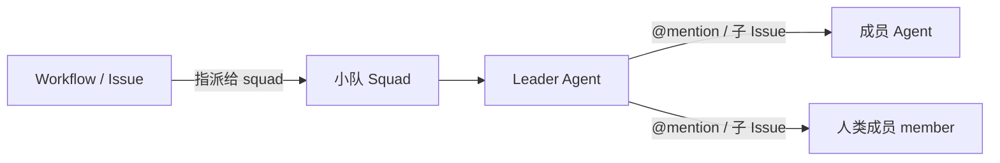
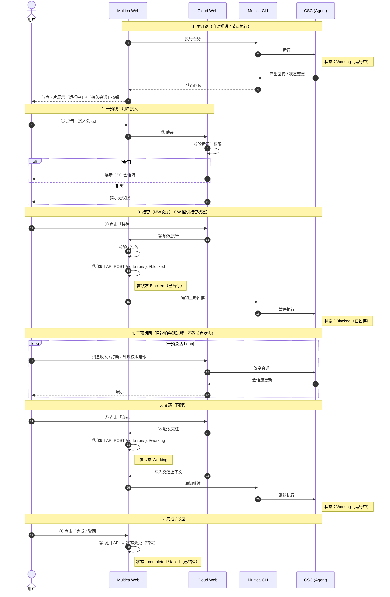

# 人机协作机制概要设计方案

> 本文档由 `人机协作设计方案.pdf` 转换而来，用于工程实施参考。原始为概要设计，详细 schema 留待详细设计阶段展开。

| 项目 | 内容 |
| --- | --- |
| 文档编号 | MC-001 |
| 版本 | v1.2 |
| 状态 | 待评审 |
| 日期 | 2026-06-14 |

---

## 1. 设计目标与落点

Multica 已具备 Workflow、Agent 任务队列、Issue、评论、Inbox、Multica CLI / Runtime daemon、Cloud 设备通道等基础能力。设计重点**不是另起一套协作系统**，而是补齐人、Agent、小队围绕**同一条 Workflow** 和**同一个 CSC 会话**协同工作的机制。

概要设计只回答两件事：

1. **人如何进入 Workflow**
2. **用户如何接入正在运行的 CSC 会话**

### 设计目标对照

| 设计目标 | 当前差距 | 本方案落点 |
| --- | --- | --- |
| 把人编排进 Workflow | 人或小队可以被指派，但接手、提醒、上抛、小队路由和把关机制不完整 | 人、小队、Agent 都成为节点执行者；小队可把 Agent 和人编排进同一任务；关键节点（审核）必须有人把关 |
| 实时可干预的协作体验 | 人更多通过评论或事后回复影响 Agent，不能直接进入运行中的会话 | 用户通过 Cloud / CoStrict Web 接入有权限的 CSC 会话，直接对话、打断或处理权限请求 |

---

## 2. 设计一：把人编排进 Workflow

人不是 Workflow 外部的提醒对象，而是节点模型中的**执行者、把关人或小队成员**。流程是否继续，最终仍由 Multica 的 `node-run` 状态决定。

### 2.1 设计点与机制

| 设计点 | 机制 |
| --- | --- |
| 执行者 | 沿用 `worker_type` / `worker_id`，执行者可以是人、小队或 Agent |
| 把关人 | 沿用 `critic_type` / `critic_id`，关键产出必须由人确认 |
| 人节点闭环 | 人节点需要明确**送达、提醒、上抛和完成**入口，不能只是一条静态指派记录 |
| 小队执行 | Workflow 只看到 `squad` 这个执行者；Multica 现有小队机制将任务先路由给 leader agent，由 leader agent 再协调成员 |
| 小队成员 | 小队成员可以是 `agent` 或 `member`，并带有成员角色；leader agent 可同时把 Agent 和人编排进同一任务 |
| 人的画像 | 复用用户个人资料中的 `profile_description` 作为分派上下文，帮助 leader agent 判断人的责任田、技术栈、偏好和协作方式 |

### 2.2 节点主链路

节点主链路保持简单：

```
执行中 → 产出就绪 → 人工把关 → 完成 / 返工
```

### 2.3 小队如何把 Agent 和人编排进 Workflow

> Workflow 只需要知道任务交给了小队；小队内部决定由 Agent 还是人来处理。

小队不是一个抽象通知组，而是 Multica 已有的**任务路由单元**：



| 小队能力 | 设计含义 |
| --- | --- |
| 小队负责人（Leader Agent） | 小队必须有 leader agent；Workflow 或 Issue 指派给小队时，先由 leader agent 接收任务 |
| 人机混编成员 | 成员类型支持 `agent` 和 `member`，因此小队可以天然混编 Agent 与人 |
| 成员角色 | 成员在小队内可以有角色描述，供 leader agent 分派时参考 |
| 小队协作约定 | 小队级指令会注入 leader agent 的任务上下文，形成稳定的分派原则和协作约定 |
| 人员画像 | 人的个人资料作为人类成员画像，补充"擅长什么、偏好怎么协作、适合执行还是把关"等软信息 |

### 2.4 关键约束

1. **人节点必须责任闭环** — 人节点指派后需明确负责人；若无人接手，上抛提醒 Workflow 负责人处理，避免任务悬停。
2. **小队对 Workflow 保持透明** — 小队内部如何路由、由谁执行，不改变 Workflow 看到的节点状态和完成规则。对 Workflow 而言，`squad` 仍是一个普通的 worker 或 critic。
3. **任务分派走点对点，不走广播** — 小队任务不广播给全员。由 leader agent 评估后，通过 `@mention` 或子 Issue 明确分派给一个或多个 Agent / 人，避免重复触发。
4. **画像辅助决策，状态机掌握最终决定权** — 人的画像只辅助分派，不替代人工确认；leader agent 可以引用画像判断候选人，但节点的完成、驳回、取消必须回到 Multica 节点状态机。
5. **会话动作与节点状态分离** — 用户接入 CSC 会话后，普通动作（发消息、打断、处理权限请求）只影响会话过程；接管、交还、完成、驳回、取消等节点级动作，必须通过 Multica 节点 API。

---

## 3. 设计二：围绕 CSC 会话实时协作

这里的"干预"，**不是**在 Multica 评论，**不是**单独审批，也**不是** Cloud 自己改节点状态。它指用户通过 Cloud / CoStrict Web **直接进入正在运行的 CSC 会话**，继续对话、打断当前回合或处理权限请求。

### 3.1 协作链路（阶段 / 责任方 / 关键动作）

| 阶段 | 责任方 | 关键动作 |
| --- | --- | --- |
| 节点进入执行 | Multica | 将 Workflow `node-run` 交给 Multica CLI / Runtime daemon |
| 会话创建 | Multica CLI / Runtime daemon + CSC / CoStrict CLI | 在用户本地创建或复用 CSC 会话，让 Agent 执行节点任务 |
| 写回绑定 | Multica CLI / Runtime daemon → Multica | 将运行时、设备、会话和 `node-run` 关联起来 |
| 用户接入 | Cloud / CoStrict Web | 校验运行时权限，通过 device-gateway / runtime proxy 接入 CSC 会话 |
| Cloud 接管 | Cloud / CoStrict Web → Multica | 用户接管会话控制权时，将 `node-run` 从 `Working` 置为 `Blocked`，避免 Workflow 继续自动推进 |
| Cloud 交还 | Cloud / CoStrict Web → Multica + Multica CLI / Runtime daemon | 用户交还控制权时，将 `node-run` 从 `Blocked` 恢复为 `Working`，并触发 Multica CLI / Runtime daemon 基于当前 CSC 会话继续执行任务 |
| 结果回流 | Multica CLI / Runtime daemon 或 Cloud → Multica | 回传产出、完成信号，或调用节点 API 显式处理 |

### 3.2 会话绑定

会话绑定是三方定位同一个运行时会话的索引。没有这份绑定，Cloud 只能看到"有任务在跑"，但无法把用户准确接入正在执行该节点的 CSC 会话。

| 信息 | 含义 | 使用方 |
| --- | --- | --- |
| `node_run_id` | 对应的 Workflow 节点运行实例 | Multica、CSC |
| `runtime_id` | 哪个运行时承载该节点 | Multica、Cloud |
| `device_id` | 运行时所在的 Cloud 设备 | Cloud |
| `session_id` | CSC 本地会话 ID | Cloud、CSC |

### 3.3 用户动作边界

> 用户只能干预自己有权限的运行时。**Workspace 成员身份不等于运行时权限。**

| 用户动作 | 作用对象 | 是否直接改 Workflow 状态 |
| --- | --- | --- |
| 查看会话 | CSC 会话流 | 否 |
| 发送消息 | CSC 会话 | 否 |
| 打断会话 | CSC 当前回合 | 否 |
| 处理权限请求 | CSC 工具调用权限 | 否 |
| 接管会话 | Multica `node-run` + CSC 会话 | **是**，必须调用 Multica 节点 API 将 `node-run` 置为 `Blocked` |
| 交还会话 | Multica `node-run` + Multica CLI / Runtime daemon 任务 | **是**，必须调用 Multica 节点 API 将 `node-run` 从 `Blocked` 恢复为 `Working` 并触发任务 |
| 完成 / 驳回 / 取消节点 | Multica `node-run` | **是**，必须调用 Multica 节点 API |

### 3.4 Cloud 接管与交还

Cloud 接管会话**不是新增一类 Workflow 状态**，而是复用 Multica 已有的 `Working` 和 `Blocked` 两个节点状态来表达控制权变化：

- **接管** = `Working` → `Blocked`
- **交还** = `Blocked` → `Working`

| 动作 | Multica 状态处理 | 会话与任务处理 |
| --- | --- | --- |
| Cloud 接管会话 | 将对应 `node-run` 从 `Working` 置为 `Blocked` | Cloud 获得会话写入和打断入口；CSC 当前回合可被用户接续、修正或处理权限请求；Multica CLI / Runtime daemon 不再把该节点按无人干预的结果继续推进 |
| Cloud 交还会话 | 将对应 `node-run` 从 `Blocked` 恢复为 `Working` | Cloud 写入交还事件和必要上下文；Multica 触发一个继续执行任务，由 Multica CLI / Runtime daemon 基于当前 CSC 会话继续运行 |

> 因此，用户在会话里说"这个节点完成了"**不会**自动推进 Workflow。只有 Multica CLI / Runtime daemon 回传完成信号，或 Cloud 调用 Multica 节点 API，节点状态才会变化。

### 3.5 接管 / 交还时序图

下图展示用户从 Multica Web 发起接入、在 Cloud Web 中接管 / 干预 / 交还的完整交互过程（Multica Web 触发，Cloud Web 回调变更状态）：



### 3.6 核心状态流转

| 动作 | 状态变更 | 触发主体 | 说明 |
| --- | --- | --- | --- |
| 节点启动 | → `Working` | 系统自动（MW → CSC） | 系统分流并执行节点 |
| 接管 | `Working` → `Blocked` | Multica Web ← Cloud Web | `POST /node-run/{id}/blocked`；CLI 暂停执行 |
| 交还 | `Blocked` → `Working` | Multica Web ← Cloud Web | `POST /node-run/{id}/working`；CLI 继续执行 |
| 节点结束 | `Working` / `Blocked` → `completed` / `failed` | 用户或系统 → 调用 API | 流程结束 |

### 3.7 状态与事件归属

| 内容 | 归属 | 说明 |
| --- | --- | --- |
| 会话过程 | CSC | 包括用户消息、Agent 回复、工具调用、权限请求 |
| 接入通道 | Cloud / CoStrict Web | 负责鉴权、代理连接、展示会话流 |
| 节点状态 | Multica | 负责 `node-run` 状态、人工把关和下游推进 |

> 接管期间，Multica 仍是节点状态源。用户在 Cloud 中发送消息、打断回合或处理权限请求，只影响 CSC 会话过程；只有接管、交还、完成、驳回、取消这类节点级动作会调用 Multica 节点 API。

**关键事件类型**（概要设计需统一，schema 留待详细设计）：
`message`、`tool_use`、`permission_request`、`status`、`error`、`result`。

> ⚠️ **落地备注**：`Blocked → Working` 这条恢复转换当前**不在** Multica 节点状态机的合法转换内（`Blocked` 目前只能转为 `format_ok` 或 `skipped`）。落地时需在 Multica 侧补一条 `Blocked → Working` 的恢复转换，使交还能够复用当前 CSC 会话继续执行。

---

## 4. 运行时权限与会话干预边界

> 用户只能干预自己有权限的运行时。**Workspace 成员身份不等于运行时权限。**
> 运行时权限按 runtime / device 的归属或显式授权关系判断。无权限时，Cloud 不能对该 CSC 会话发起任何写操作。

### 4.1 能力与权限要求

| 能力 | 权限要求 |
| --- | --- |
| 查看节点状态 | 有 Workspace 任务可见权限 |
| 查看会话摘要或只读流 | 可按产品策略开放，但不能包含敏感本地信息 |
| 发送消息 / 打断会话 / 处理权限请求 | 必须有该运行时权限 |
| 完成 / 驳回 / 取消节点 | 同时满足节点处理权限和运行时权限 |

### 4.2 无权限场景处理

| 无权限场景 | 处理方式 |
| --- | --- |
| 用户需要参与会话 | 申请运行时权限，或 @运行时归属人处理 |
| 当前节点必须由该用户处理 | 将节点重派到该用户有权限的运行时 |
| 节点无法继续 | Workflow 负责人取消或调整节点 |

> 系统**不自动**把任务迁移到别人的运行时。是否重派必须由人确认。

---

## 5. 工作量评估

**目标**：本周四（6 月 18 日）完成可联调走通的最小可用版本。按 2 名全栈工程师、3–4 个工作日估算。

实际排期按 **4 个工作日 × 2 人 = 8 人·天** 硬上限倒排，超出项顺延至下周。建议周一上午先对齐 Multica 后端状态机与 Cloud Web 会话接入的可行性，避免阻塞。

| 粗项 | 开发内容 | 工作量 |
| --- | --- | --- |
| Multica 后端 – 审查者角色 | 把关人（critic）限制为"人"的角色；状态校验与权限兜底 | 1 人·天 |
| Multica 后端 – 小队与画像路由 | 验证小队 leader agent 按用户画像分派任务的路由逻辑；人节点指派闭环 | 2 人·天 |
| 实时协作链路 | 打通 Multica Web ↔ Cloud Web 的会话实时协作；接管/交还状态同步；事件透传 | 2 人·天 |
| 智能体 Skill 支持 | 智能体执行节点时支持选定 Skill；Skill 上下文注入与调用链路 | 1.5 人·天 |
| Cloud 前端 – 阶段 Workflow | 阶段 Workflow 嵌套呈现与状态联动；节点展开/收起交互 | 1.5 人·天 |
| PR 能力 | 支持从 Workflow 产出创建 PR / 关联 PR；PR 状态回写节点 | 1 人·天 |
| 联调验收 | 端到端主链路验证；阻塞问题处理 | 1 人·天 |
| **合计** | | **约 10 人·天** |

### 阻塞风险

1. `Blocked → Working` 状态转换需 Multica 侧确认可落地。
2. Multica Web 与 Cloud Web 的会话通道需提前验证连通性。

---

## 附录：实施要点速查（给工程工具 / Agent）

- [ ] **后端**：critic 限制为"人"角色 + 状态校验与权限兜底。
- [ ] **后端**：补 `Blocked → Working` 节点状态机转换（当前仅允许 `Blocked → format_ok | skipped`）。
- [ ] **后端**：节点 API `POST /node-run/{id}/blocked`（接管）、`POST /node-run/{id}/working`（交还）。
- [ ] **后端**：会话绑定索引 = `{ node_run_id, runtime_id, device_id, session_id }`。
- [ ] **后端**：小队 leader agent 按 `profile_description` 画像分派；点对点 `@mention` / 子 Issue，不广播；人节点无人接手则上抛 Workflow 负责人。
- [ ] **权限**：运行时权限独立于 Workspace 成员身份，按 runtime/device 归属或显式授权判断；无权限禁止任何写操作。
- [ ] **前端 Cloud**：阶段 Workflow 嵌套呈现 + 节点展开/收起 + 接入会话入口。
- [ ] **链路**：Multica Web ↔ Cloud Web 会话实时透传，事件类型 `message | tool_use | permission_request | status | error | result`。
- [ ] **Skill**：智能体执行节点时选定 Skill + 上下文注入。
- [ ] **PR**：从 Workflow 产出创建/关联 PR，状态回写节点。
- [ ] **不变量**：会话动作（消息/打断/权限）不改节点状态；只有 CLI 回传完成信号或 Cloud 调用节点 API 才改 `node-run` 状态。
