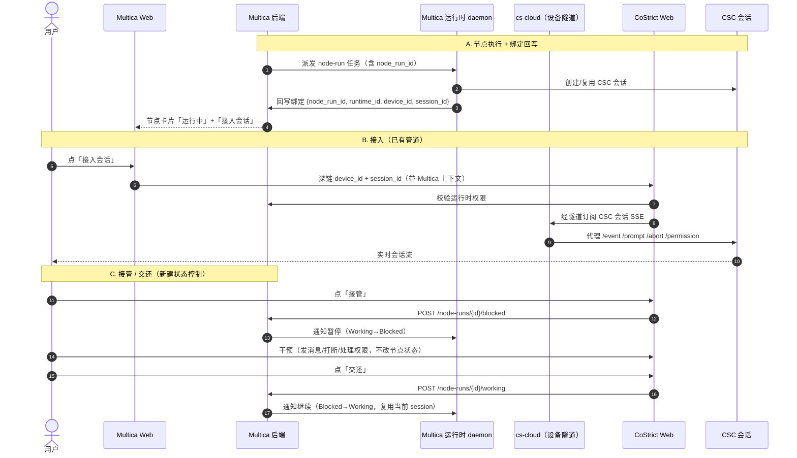

# 设计二实施方案：围绕 CSC 会话的实时协作

> 配套文档：`2026-06-14-human-agent-collaboration-design.md`（概要设计）。
> 本文是**设计二**（围绕 CSC 会话实时协作）的跨仓库差距分析与任务拆解，用于工程实施排期。

| 项目 | 内容 |
| --- | --- |
| 文档编号 | MC-002 |
| 版本 | v0.1（待评审） |
| 日期 | 2026-06-24 |
| 涉及仓库 | `multica`（后端+Web）、`csc`、`cs-cloud`、`costrict-web/portal/packages/app-ai-native` |
| 方法 | 对照设计二，逐仓库盘点现状 → 差距 → 任务拆解 → 关键路径 |

---

## 0. 一句话结论

**设计二的实时会话链路（看流 / 发消息 / 打断 / 处理权限）所需的底层管道，在 CoStrict 自有技术栈里大部分已经存在。** 真正要新建的是四类"接缝"工作：

1. **节点状态控制**：接管 = `Working → Blocked`，交还 = `Blocked → Working`，两条转换 + 两个 API 都没有。
2. **会话绑定接线**：`node_run` 上的 `runtime_id/device_id/session_id` 三列已存在但没有任何写入逻辑，运行时也没有回写入口。
3. **跨系统集成**：`cs-cloud` 完全不认识 Multica；需要一条"从 Multica node-run → 定位到某 device 上的某 CSC session"的寻址 + 鉴权链路。
4. **运行时权限 + 工作流 UI**：运行时级权限模型、CoStrict Web 的阶段/节点呈现与"接入会话/接管/交还"控件均缺失。

---

## 1. 现状盘点（按仓库）

### 1.1 CSC（`/Users/linkai/code/csc`）— 实时会话能力**基本就绪**

CSC 已内建一个本地 HTTP server（Hono 框架），具备外部客户端实时接入单个会话所需的几乎全部原语：

| 设计二能力 | CSC 现状 | 关键位置 |
| --- | --- | --- |
| 稳定会话标识 | `sessionId`（UUID），内存 Map + `~/.claude/server-sessions.json` 持久化索引；支持 resume | `src/server/sessionManager.ts:215`、`routes/session.ts:134` |
| 看会话流 | SSE `GET /event`（按 `session_id` 过滤）+ `streamStateTracker` 规范化事件 | `src/server/routes/event.ts`、`eventBus.ts:102`、`streamStateTracker.ts:141` |
| 发消息 | `POST /session/:id/prompt`（同步 SSE）、`/prompt_async`（异步） | `routes/session.ts:424,462`、`sessionHandle.ts:668` |
| 打断回合 | `POST /session/:id/abort` → 向子进程发 `interrupt` control_request | `routes/session.ts:542`、`sessionHandle.ts:736` |
| 处理权限请求 | `GET /permission` + `POST /permission/:id/reply` | `routes/permission.ts`、`sessionHandle.ts:777` |
| 事件类型 | 已覆盖设计目标的 `message / tool_use(control_request) / permission_request / status / result`；`error` 部分覆盖 | `sessionMessageRouter.ts:166,739` |
| 远程桥（已有！） | `SessionsWebSocket` 主动外连 `wss://{apiHost}/v1/sessions/ws/{sessionId}/subscribe` + `RemoteSessionManager` | `src/remote/SessionsWebSocket.ts`、`RemoteSessionManager.ts` |

**CSC 缺口：** ① 本地 server 默认关闭 CORS、无鉴权，仅设计为本地访问；② 无"入站 WebSocket server"（现有 WS 是出站客户端）；③ SSE 无每客户端 attach 握手/在线状态；④ 无专为 Cloud Web 设计的会话级实时订阅协议。

> **结论**：CSC 不需要"从零造会话能力"，主要工作是**让既有 session API 能被云侧安全代理**（鉴权 + 跨源 + 会话级订阅）。设计文档把 CSC 当黑盒是对的。

### 1.2 cs-cloud（`/Users/linkai/code/cs-cloud`）— 隧道已就绪，但**完全不认识 Multica**

| 设计二能力 | cs-cloud 现状 | 关键位置 |
| --- | --- | --- |
| device 注册 | `DeviceInfo{DeviceID, DeviceToken, AuthUserID, BaseURL}` → `device.json` | `internal/device/storage.go:36`、`register.go` |
| 云 ↔ 设备连通 | **出站** yamux-over-WebSocket 反向隧道：设备连 `/device/{deviceID}/tunnel`，云侧多路复用回连 | `internal/tunnel/connect.go:29`、`proxy.go:15` |
| 会话代理 | localserver 把 `/conversations/{id}/...` 反代到 agent 后端（CSC/CS）；合并 SSE `GET /events` | `internal/localserver/proxy.go:17`、`handle_events.go:25` |
| 事件转发 | `notify_forwarder` 把 agent 的 permission/question/idle 事件转发上云 | `internal/cloud/notify_forwarder.go:27` |
| 权限/鉴权 | 仅 device-owner 单用户校验；**auth 中间件为空** | `device/storage.go:325`、`localserver/middleware.go:1`（空） |
| Multica 集成 | **零** —— 搜 `multica/node_run/workflow` 无结果 | — |
| 运行时注册表 | `Registry{}`、`SessionStore{}` 均为空占位 | `internal/runtime/registry.go:1`、`session_store.go:1` |

**cs-cloud 缺口（最大跨系统空白）：** ① 无运行时/会话级权限模型（"谁能接管这个 runtime 上的会话"无从表达）；② 无供云侧用户"接入指定 CSC 会话"的入口（现有代理假定调用方=本地 owner）；③ 无多用户/接管/在线协作语义；④ 与 Multica node-run 无任何映射、回调、状态上报。

### 1.3 costrict-web（`app-ai-native`, SolidJS）— 会话渲染已就绪，缺工作流与协作语义

| 设计二能力 | 前端现状 | 关键位置 |
| --- | --- | --- |
| 会话流渲染 | `device-session-view` + `message-timeline`，SSE 增量渲染 message/tool/部分 delta | `src/pages/workspace/components/device-session-view.tsx:53`、`pages/session/message-timeline.tsx:181` |
| 实时传输 | SSE（`device-client.event.stream()`）+ 自动重连；WS 仅用于 terminal | `src/client/device-client.ts:273`、`context/device-workspace.tsx:626` |
| 权限审批 UI | `session-permission-dock`（Deny/Allow Once/Always/Auto） | `src/pages/session/composer/session-permission-dock.tsx:8` |
| 鉴权 | Casdoor + 静态 menu/capability 权限 | `src/context/auth.tsx:91`、`routes.tsx:75` |
| 状态/路由 | SolidJS `createStore` + `@solidjs/router` | `src/routes.tsx:128` |

**前端缺口：** ① 无工作流/阶段/节点 UI（无嵌套呈现、展开收起、"接入会话"入口）；② 无协作类 SSE 事件（join/takeover/handback/complete）；③ 无运行时权限闸门，无 observer/participant/controller 模式；④ API client 无 join/takeover/handback/complete 方法；⑤ 无接管态/归属人展示；⑥ 无对应 i18n key；⑦ 无共享会话路由。

### 1.4 Multica 后端（本仓库）— 状态机与绑定是核心改动区

| 设计二能力 | Multica 现状 | 关键位置 |
| --- | --- | --- |
| 节点状态机 | `blocked → {format_ok, skipped}`、`critic_rework → blocked`；**无 `working → blocked`、无 `blocked → working`** | `internal/service/workflow.go:64-82` |
| 会话绑定列 | `node_run` 模型已有 `runtime_id/device_id/session_id` + `GetWorkflowNodeRunBySessionID` 查询；**但无迁移正式加列、无任何写入** | `pkg/db/generated/models.go:746`、`workflow_node_run.sql` |
| 节点动作 API | 仅 `/submit`、`/review`、`/skip`；**无 `/blocked`、`/working`、`/takeover`、`/handback`** | `cmd/server/router.go:557` |
| 运行时会话回写 | `PinTaskSession` 只写 `agent_task_queue`，**不写 `node_run`** | `internal/handler/task_lifecycle.go:58` |
| 运行时权限 | `canUseRuntimeForAgent`/`canEditRuntime`（owner/admin/public）；**无"接管"权限概念** | `internal/handler/runtime.go:474` |
| critic=人 约束 | 工作流激活校验 worker/critic 已分派，但**不校验 critic 必须为 human** | `internal/handler/workflow.go:422` |
| 实时 hub 作用域 | `ScopeWorkspace/User/Task/Chat`；daemonws 按 `runtimeID` 索引；**无 ScopeNodeRun/ScopeSession** | `internal/realtime/hub.go:136`、`daemonws/hub.go:74` |

---

## 2. 与概要设计的偏差校正

| 概要设计原假设 | 实际情况 | 影响 |
| --- | --- | --- |
| "补一条 `Blocked → Working` 恢复转换" | `working → blocked`（接管）**也不存在**；两条都要补 | 状态机改动从 1 条变 2 条；需重新审视终止/超时与接管的交互 |
| 会话绑定 = 待建索引 | 三列已在模型中，但**完全未接线** | 省去建模讨论，但要补迁移（正式加列）+ 写入 SQL + 回写 API |
| CSC/Cloud 实时链路待打通 | CoStrict 栈大部分管道已就绪 | 实时链路工作量更多是"集成与鉴权"而非"造轮子" |
| Cloud Web 接入 CSC 会话 | `cs-cloud` 对 Multica 零认知 | 需新增 Multica ↔ cs-cloud 的寻址/鉴权接缝，这是最大新建项 |

---

## 3. 端到端目标链路（实施目标态）



---

## 4. 任务拆解

按"先打通最小链路、再补权限与体验"的顺序组织。标注：**[新建]** / **[改造]** / **[接线]**。

### 模块 A：Multica 后端 —— 状态机 + 绑定 + 节点 API（关键路径）

| 编号 | 任务 | 类型 | 说明 | 估时 |
| --- | --- | --- | --- | --- |
| A1 | 状态机补两条转换 | [改造] | `validTransitions` 增加 `working → blocked`、`blocked → working`；同步 `UpdateWorkflowNodeRunStatus` 的 `started_at/completed_at` CASE 逻辑（`blocked` 当前会写 `completed_at`，接管态不应视为完成）| 0.5d |
| A2 | 会话绑定迁移 + 写入 SQL | [新建] | 补正式迁移落实 `runtime_id/device_id/session_id` 三列（与 generated 对齐）；新增 `UpdateWorkflowNodeRunBinding` 查询 | 0.5d |
| A3 | 运行时回写绑定 API | [新建] | daemon 侧 `POST /node-runs/{id}/session`（类比 `PinTaskSession`），写绑定列；走 `requireDaemonRuntimeAccess` | 0.5d |
| A4 | 接管/交还节点 API | [新建] | `POST /node-runs/{id}/blocked`（接管）、`POST /node-runs/{id}/working`（交还）；交还后触发 daemon 基于当前 session 继续 | 1d |
| A5 | 运行时接管权限校验 | [新建] | 新增"用户对该 runtime 是否有接管权"判断（独立于 workspace 成员）；接管/交还/完成/驳回都过此闸 | 1d |
| A6 | critic 限制为 human | [改造] | 工作流激活校验：关键节点 critic_type 必须为 `human` + 兜底 | 0.5d |
| A7 | 实时事件作用域 | [改造] | 事件总线/realtime hub 增加 node-run 作用域（或复用 runtime 作用域），向 Multica Web 推接管/交还/绑定变更 | 1d |

小计 ≈ **5 人·天**。A1→A2→A3→A4 为关键路径。

### 模块 B：Multica 运行时 daemon —— 会话创建 + 绑定回写 + 暂停/继续

| 编号 | 任务 | 类型 | 说明 | 估时 |
| --- | --- | --- | --- | --- |
| B1 | 节点执行经 CSC 会话 | [改造] | 运行时执行 node-run 时通过 CSC 会话承载 Agent，拿到 `session_id` | 1d |
| B2 | 回写绑定 | [接线] | 拿到 {session_id, device_id} 后调 A3 回写 | 0.5d |
| B3 | 响应暂停/继续 | [新建] | 收到 A4 的 blocked/working 通知后，暂停/恢复对应会话执行，且不把接管期产出当无人干预结果推进 | 1d |

小计 ≈ **2.5 人·天**。依赖 A2/A3/A4。

### 模块 C：cs-cloud —— Multica 寻址 + 运行时权限 + 会话代理鉴权（最大新建项）

| 编号 | 任务 | 类型 | 说明 | 估时 |
| --- | --- | --- | --- | --- |
| C1 | Casdoor subject → 运行时权限映射 | [新建] | 把已认证的 Casdoor 用户映射到"能否访问 device/runtime Y 的 session Z"；复用 Multica 运行时权限（A5）判定 | 1d |
| C2 | 会话接入端点 | [新建] | 供 CoStrict Web 经隧道订阅指定 `session_id` 的 SSE + 转发 prompt/abort/permission，带 Casdoor token 鉴权 | 1.5d |
| C3 | localserver auth 中间件 | [改造] | 填充当前为空的 auth 中间件，校验云侧转发请求的 Casdoor token | 0.75d |

小计 ≈ **3.25 人·天**（共用 Casdoor + costrictauth 已省去信任桥工作）。C 与 D 是实时链路的两端。

> **关键决策（已定）**：Multica 运行时 daemon 与 cs-cloud daemon 是**两套独立进程**。
> 因此分工明确：CSC session 的"设备隧道接入"走 cs-cloud；"节点状态 / 绑定 / 派发"走 Multica；二者通过 `{device_id, session_id}` 对齐。C 模块即为二者的接缝。
>
> **鉴权信任链（已大幅简化）**：双方共用 **Casdoor SSO**，且 Multica 已有 `internal/costrictauth`（读取 `~/.costrict/share/auth.json` 中 cs-cloud/csc 写入的 `access_token`）。所以：
> - **浏览器侧**：CoStrict Web 与 Multica Web 同属一个 Casdoor 身份；用户在 CoStrict Web 点「接管」时，可携带 Casdoor 签发的 token 直接调 Multica 节点 API，Multica 用既有 Casdoor 中间件校验，无需另造跨系统信任桥。
> - **运行时侧**：Multica 运行时 daemon 经 `costrictauth` 拿 CoStrict access_token，去 cs-cloud/CSC 访问会话与回写绑定。
>
> C1/C3 因此从"造信任桥"降级为"把 Casdoor subject 映射到运行时权限"。

### 模块 D：CoStrict Web 前端 —— 工作流 UI + 接管控件 + 协作态

| 编号 | 任务 | 类型 | 说明 | 估时 |
| --- | --- | --- | --- | --- |
| D1 | 阶段/节点嵌套呈现 | [新建] | 阶段 Workflow 嵌套 + 节点展开/收起 + 状态联动 | 1.5d |
| D2 | 「接入会话」入口 + 深链 | [新建] | 节点卡片入口；带 device_id/session_id/node_run 上下文进入会话视图 | 0.5d |
| D3 | 接管/交还/完成·驳回控件 | [新建] | 调 Multica 节点 API（A4）；按运行时权限禁用/提示 | 1d |
| D4 | 协作态与归属展示 | [新建] | observer/controller 模式、接管中标识、无权限提示 | 1d |
| D5 | 复用既有会话流 | [接线] | 复用 `device-session-view`/permission-dock 渲染 CSC 会话；接 C2 数据源 | 0.5d |
| D6 | i18n | [新建] | 接入会话/接管/交还/完成/驳回 等 zh+en | 0.25d |

小计 ≈ **4.75 人·天**。D1/D5 可与 C 并行；D3 依赖 A4。

### 模块 E：Multica Web 前端 —— 节点卡片入口

| 编号 | 任务 | 类型 | 说明 | 估时 |
| --- | --- | --- | --- | --- |
| E1 | 节点卡片「运行中」+「接入会话」按钮 | [新建] | 展示绑定状态；点击深链到 CoStrict Web（D2） | 0.75d |
| E2 | 接管/交还状态联动 | [接线] | 订阅 A7 事件，卡片实时反映 blocked/working | 0.5d |

小计 ≈ **1.25 人·天**。

### 模块 F：联调

| 编号 | 任务 | 估时 |
| --- | --- | --- |
| F1 | 端到端主链路联调（派发→绑定→接入→接管→交还→完成） | 1.5d |

---

## 5. 关键路径与排期

```
A1 ─┐
A2 ─┼─→ A3 ─→ A4 ─→ A5
    │           │
B1 ─┘           ├─→ B3
                │
            C1 ─┼─→ C2 ─→ C3
                │
            D1/D5 ──→ D3 ──→ D4
                            │
                        E1/E2 ──→ F1
```

- **关键路径**：`A2 → A3 → A4 →（C2 + D3）→ F1`。
- **可并行**：A6/A7（独立）、D1/D5（前端壳子）、C1（权限）可早启动。
- **总估时** ≈ **A 5 + B 2.5 + C 3.25 + D 4.75 + E 1.25 + F 1.5 ≈ 18.25 人·天**。
  - 与概要设计"约 10 人·天"的差异来自：本方案把 cs-cloud 跨系统接缝（模块 C）和前端协作态（D4）单列，而概要设计将其折叠在"实时协作链路 2 人·天"内。**建议据此重新对齐范围**：若周四 MVP 硬上限，需砍裁（见 §6）。

---

## 6. MVP 裁剪建议（若周四硬上限）

按"先证明链路可走通"取最小集：

- **保留**：A1、A2、A3、A4、B1、B2、B3、C2、D2、D3、D5、E1、F1。
- **降级/顺延**：A5（接管权限）先用 workspace 成员兜底，运行时权限下周补；C1/C3（细粒度鉴权）顺延；D1（阶段嵌套呈现）先用扁平节点列表；D4（协作态）顺延；A6（critic=human）独立顺延。
- **MVP 估时** ≈ **9–10 人·天**，与概要设计估算吻合，但**前提是不做完整权限与工作流嵌套 UI**。

---

## 7. 风险与待决项

1. ~~**【阻塞】运行时 daemon 归属**~~ —— **已定：两套独立进程**（Multica 运行时 daemon 与 cs-cloud daemon），通过 `{device_id, session_id}` 对齐。
2. **【阻塞】接管期状态语义** —— `working → blocked` 后 `completed_at` 不应置位（A1）；接管期间上游完成/超时如何处理需定义。
3. ~~**【阻塞】Multica ↔ cs-cloud 鉴权信任链**~~ —— **已大幅化解**：双方共用 Casdoor SSO，Multica 已有 `costrictauth` 读取 `~/.costrict/share/auth.json`。浏览器侧共享 Casdoor 身份直调 Multica 节点 API；运行时侧经 costrictauth 拿 CoStrict token 访问 cs-cloud/CSC。剩余工作仅为 Casdoor subject → 运行时权限的映射（C1/A5）。
4. **会话寻址唯一性** —— `{device_id, session_id}` 在 resume/warm-pool 场景下是否稳定（CSC 支持 resume，需确认接管期 session 不被回收）。
5. **CSC 安全暴露** —— CSC 本地 server 无 CORS/鉴权，必须只经 cs-cloud 隧道 + Casdoor token 鉴权代理访问，严禁直连。
6. **Casdoor 组织/应用一致性** —— 需确认 Multica 与 CoStrict Web 挂在同一 Casdoor org/app 下，subject（用户标识）可直接互认；若分属不同 app，需补一层 subject 映射。

---

## 附录：实施清单（给工程工具 / Agent）

- [ ] **A1** 状态机加 `working↔blocked` 两条转换 + 修正 `completed_at` CASE。
- [ ] **A2** 迁移正式加 `runtime_id/device_id/session_id` + `UpdateWorkflowNodeRunBinding`。
- [ ] **A3** daemon `POST /node-runs/{id}/session` 回写绑定。
- [ ] **A4** `POST /node-runs/{id}/blocked`（接管）、`/working`（交还）+ 交还触发继续。
- [ ] **A5** 运行时接管权限校验（独立于 workspace 成员）。
- [ ] **A6** critic 关键节点限制为 human + 兜底。
- [ ] **A7** node-run 实时作用域，推送接管/交还/绑定变更。
- [ ] **B1–B3** 运行时经 CSC 会话执行 + 回写绑定 + 响应暂停/继续。
- [ ] **C1–C3** cs-cloud 运行时权限 + 会话接入端点 + 填充 auth 中间件。
- [ ] **D1–D6** 阶段/节点 UI + 接入入口 + 接管控件 + 协作态 + 复用会话流 + i18n。
- [ ] **E1–E2** Multica Web 节点卡片入口 + 状态联动。
- [ ] **F1** 端到端联调。
- [ ] **不变量**：会话动作（消息/打断/权限）不改节点状态；只有 daemon 回传完成信号或调用节点 API 才改 `node-run`。
