# Platform Extension 到 Multica Squad 运行态设计

## 1. 需求分析

### 1.1 业务目标

将平台中的 `Agent + Skill + Command = Extension` 接入 Multica，形成一条可以在桌面客户端验证的完整链路：

1. Multica 客户端随安装包内置 `platform-agent-cli` 。
2. 本机 Daemon 自动发现并注册 `platform-agent-cli` Runtime。
3. 用户在 Multica 导入一个 Extension Release。
4. Multica 将 Release 转换为原生 Agent、Skill 和 Squad。
5. 导入时自动选择一个可用且当前空闲的 `platform-agent-cli` Runtime，不要求用户手工绑定。
6. Leader 根据 Squad Instructions 在运行时动态决定是否委派给成员。
7. 每个 Agent 的任务由 Multica 单独启动 `platform-agent-cli app-server --listen stdio://` 执行。
8. CLI 使用 Codex App Server 兼容的生命周期、JSON-RPC 方法和事件语义。

### 1.2 领域约束

- Agent 只是名称、描述和提示词，平台当前没有 Agent 到 Skill 的细粒度关联。
- Extension 中的全部 Skill 必须绑定到全部 Agent。
- Skill 保持标准 `SKILL.md` 与支持文件，不增加平台私有的 Skill 注册方法。
- Command 保持平台现有的名称、内容和元数据格式。
- Command 类别只使用平台已有的命名后缀判定，不增加自定义 `kind`、frontmatter 或标签语义。
- 流程 Command 转换为 Squad Instructions 片段。
- 普通 Command 进入运行时 Command Bundle，不转换为 Squad Instructions。
- 需要工具执行的 Command 在本阶段导入失败；本阶段不考虑 MCP 工具。
- Extension 不作为一个整体交给 CLI 执行。它只在导入时转换，运行时仍然是 Multica Native Squad 中的单 Agent 任务。

### 1.3 验收场景

1. 启动 Multica Desktop 和本机 Daemon。
2. Runtimes 页面能看到内置的 `Platform Agent CLI` Runtime 为 Online。
3. 在 Extensions 页面导入示例 Extension JSON。
4. 导入结果显示选中 Runtime、Release、Squad、Leader、成员和 Skill 映射。
5. Agents、Skills、Squads 页面可以查看真实创建的原生资源。
6. 向 Leader 发起任务后，Daemon 通过选中 Runtime 启动 CLI。
7. CLI 真实读取 Multica 生成的 `AGENTS.md`、Extension 侧车上下文与 Skill 目录，返回包含 Agent、Release、Skill 数量和 Command 数量的 Mock 结果。
8. Multica 将该结果按原有任务生命周期持久化并展示。

## 2. 方案比较

### 2.1 方案 A：任务入队时动态选 Runtime

每一次任务入队时按 Provider 和负载选择 Runtime，Agent 不保存固定 `runtime_id`。

优点是可以按每次任务做全局负载均衡。缺点是 Multica 当前 Agent Readiness、全部任务入队路径、Daemon Claim、Chat Session 和 Provider Session 都依赖固定 `runtime_id`。该方案需要改写大量核心生命周期，且容易破坏会话粘性。

### 2.2 方案 B：Extension 导入时选择空闲 Runtime

导入事务内选择一个 Online、心跳有效、当前无活动任务且调用者有权使用的 `platform-agent-cli` Runtime，将该 Release 的全部 Agent 绑定到它。

优点是满足“导入后自动分配到可用且空闲运行态”，同时保留 Multica 的 Agent Readiness、Task Queue、Daemon Claim、Session Resume 和 Squad 委派机制。缺点是不实现每任务负载均衡，但 Daemon 原有并发限流仍然有效。

### 2.3 方案 C：导入后为 Extension 启动独占 Runtime

每个 Extension Release 启动一个独立 CLI 常驻进程并注册新 Runtime。

优点是资源隔离直观。缺点是违背 Multica 现有“Runtime 代表某台 Daemon 上的 Provider 执行能力”模型，并会造成进程、心跳和安装包管理膘胀。

### 2.4 决策

采用方案 B。运行时分配是 Extension 导入的一部分，不改写 Multica 的任务路由模型。未找到空闲 Runtime 时返回 `409 PLATFORM_RUNTIME_UNAVAILABLE`，不选择忙碌 Runtime，不降级到 Codex 或其他 Provider。

## 3. 总体架构

```mermaid
flowchart LR
  subgraph Control["平台控制面"]
    Assets["Agent + Skill + Command"] --> Extension["Extension"]
    Extension --> Compiler["Extension Compiler"]
    Compiler --> Bundle["不可变 Extension Bundle"]
  end

  subgraph Multica["Multica 编排面"]
    Importer["Extension Importer"] --> Allocator["空闲 Runtime Allocator"]
    Importer --> Native["Agent + Skill + Native Squad"]
    Native --> Queue["Task Queue / Session"]
    Queue --> Daemon["Multica Daemon"]
  end

  subgraph Runtime["Platform Agent CLI 执行面"]
    AppServer["Codex-compatible app-server"] --> Bootstrap["AGENTS.md + Skills + Command Registry"]
    Bootstrap --> Adapter["Mock / Platform HTTP Adapter"]
  end

  Bundle --> Importer
  Allocator --> Native
  Daemon --> AppServer
  Adapter --> Events["Codex App Server events"]
  Events --> Daemon
```



### 3.1 职责边界

| 组件 | 负责 | 不负责 |
| --- | --- | --- |
| 平台控制面 | 资产管理、Extension 组装、Release 导出 | Multica Squad 运行时委派 |
| Extension Compiler | 校验输入、按已有后缀分类 Command、生成确定性 Bundle 和 digest | 创建 Multica 资源 |
| Multica Importer | 幂等导入、选 Runtime、事务性创建 Release/Agent/Skill/Squad | 单 Agent 模型执行 |
| Multica Native Squad | Leader 身份、成员能力、动态委派和成员生命周期 | 重复实现第二套调度器 |
| Multica Daemon | 准备工作目录、物化 Skill/侧车、启动 CLI、处理任务生命周期 | Extension 编译 |
| `platform-agent-cli` | Codex App Server 协议、Thread/Turn、运行上下文、Command Registry、平台请求和事件适配 | Squad 委派 |

## 4. Extension 契约

### 4.1 平台 Extension Source

```json
{
  "schema_version": "platform.extension/v1",
  "extension": {
    "key": "research-team",
    "name": "Research Team",
    "version": "1.0.0",
    "description": "Research and summarize a topic.",
    "instructions": "Return an evidence-backed answer."
  },
  "leader": "lead-researcher",
  "agents": [
    {
      "key": "lead-researcher",
      "name": "Lead Researcher",
      "description": "Plans and delegates research.",
      "prompt": "Understand the request and delegate when useful."
    }
  ],
  "skills": [
    {
      "key": "source-review",
      "name": "Source Review",
      "description": "Review source quality.",
      "files": [
        {
          "path": "SKILL.md",
          "content": "---\nname: source-review\ndescription: Review source quality.\n---\n\nCheck evidence quality."
        }
      ]
    }
  ],
  "commands": [
    {
      "name": "delegate.flow",
      "description": "Delegation policy.",
      "content": "Delegate independent investigations and synthesize the results.",
      "metadata": {}
    },
    {
      "name": "summarize",
      "description": "Summary command.",
      "content": "Summarize findings with sources.",
      "metadata": {}
    }
  ],
  "command_suffixes": {
    "flow": [".flow"],
    "tool": [".tool"]
  }
}
```

`command_suffixes` 是导出契约对平台已有命名规则的声明，不是 Command 自身的新字段或新标准。它不是可信输入：编译和导入时必须与调用方注入的可信 Policy 完全一致（包括稳定顺序），不允许文档通过清空或改写 suffix 绕过 tool Command 阻断。Mock V1 默认 Policy 固定为 `flow=[".flow"]`、`tool=[".tool"]`；生产适配层通过显式 Policy API 从可信配置注入真实后缀，深层编译器不读取环境变量。可信 Policy 至少包含一个 tool suffix，每个 suffix 非空且唯一，flow/tool suffix 不得产生重叠匹配。

### 4.2 编译规则

1. Extension 至少包含一个 Agent。
2. `leader` 必须唯一对应 Extension 内的 Agent key。
3. Agent、Skill 和 Command key/name 在各自命名空间中唯一。
4. 每个 Skill 必须包含且只能包含一个根 `SKILL.md`，路径必须是相对路径，不得包含路径穿越；路径碰撞键按每级组件执行 Unicode NFC、Unicode case-fold 和 Windows 尾随点/空格归一化，碰撞即拒绝。
5. Source、Bundle 及任意嵌套 metadata 中的 JSON object 重复 key 必须在 typed decode 前拒绝；未知字段和 trailing JSON 同样拒绝。
6. 校验文档声明的 `command_suffixes` 与可信 Policy 一致后，分类只使用可信 Policy；先按 tool suffix 匹配，再按 flow suffix 匹配，其余为普通 Command。
7. 匹配 tool suffix 的 Command 返回 `TOOL_COMMAND_UNSUPPORTED`，整个 Release 不导入。
8. 流程 Command 按 Source 中的显式顺序进入 Squad Instructions；名称和内容不改写。
9. 普通 Command 原样进入 Runtime Command Bundle。
10. Command metadata 在编译、Bundle 校验和持久化前规范化为相同 JSON 表示；对象 key 顺序和无意义空白不得改变 digest。
11. 编译结果使用稳定 JSON 字段顺序生成 `sha256:<64 lowercase hex>` digest。Bundle validator 仅接受基于规范 metadata 的 digest；校验成功后持久化规范 Bundle JSON。

### 4.3 确定性 Squad Instructions

Squad Instructions 由以下内容组成：

1. Extension 名称、描述和团队目标。
2. Leader 名称与能力。
3. 成员名称与能力。
4. 原样的流程 Command 名称、描述和内容。
5. 委派原则：Leader 在运行时根据任务选择成员，不预编译固定 DAG。
6. 完成条件：Leader 对最终结果负责。

### 4.4 编译 Bundle

`platform-agent-cli extension compile` 输出 `multica.extension-bundle/v1`，包含：

- Release 基本信息与 digest；
- Leader key；
- Agent 快照；
- Skill 文件快照；
- flow commands；
- runtime commands；
- 确定性 Squad Instructions。

Multica 导入 API 同时接受 `platform.extension/v1` 和 `multica.extension-bundle/v1`。前者由服务端使用同一规则编译，后者按可信 Policy 验证声明、规范 metadata 并验证 digest 后导入；Release `manifest` 保存规范 Bundle JSON。CLI 与服务端使用共享契约 fixture 做交叉测试，防止两种语言实现漂移。

## 5. Multica 导入设计

### 5.1 API

#### `POST /api/extensions/import`

请求体为 Extension Source 或 Compiled Bundle。Workspace 仍使用 Multica 现有 workspace header/context 解析，请求者必须是 workspace member。

成功返回 `201`；同一 `workspace + extension_key + version + digest` 重复导入返回 `200` 和原结果。

```json
{
  "release": {
    "id": "uuid",
    "extension_key": "research-team",
    "version": "1.0.0",
    "digest": "sha256:..."
  },
  "runtime": {
    "id": "uuid",
    "provider": "platform-agent-cli",
    "name": "Platform Agent CLI"
  },
  "squad": { "id": "uuid", "name": "Research Team v1.0.0" },
  "agents": [
    { "source_key": "lead-researcher", "id": "uuid", "name": "Research Team v1.0.0 / Lead Researcher", "leader": true }
  ],
  "skills": [
    { "source_key": "source-review", "id": "uuid", "name": "Research Team v1.0.0 / Source Review" }
  ],
  "idempotent": false
}
```

#### `GET /api/extensions`

按 `created_at DESC` 返回当前 Workspace 的 Release 和创建资源映射，用于 Extensions 页面展示。

#### `GET /api/extensions/{id}`

返回单个 Release、选中 Runtime、资源映射和编译 Manifest。

### 5.2 持久化

新增 `platform_extension_release`：

| 字段 | 含义 |
| --- | --- |
| `id` | Release UUID |
| `workspace_id` | Workspace UUID，应用层保证归属，不新增 DB FK |
| `extension_key` | 平台 Extension 稳定 key |
| `name` | Extension 名称 |
| `version` | 不可变版本 |
| `digest` | 编译 Bundle 的 `sha256:<64 lowercase hex>` digest |
| `manifest` | 编译后快照 JSONB |
| `runtime_id` | 导入时分配的 Runtime UUID，不新增 DB FK |
| `squad_id` | 创建的 Squad UUID，不新增 DB FK |
| `resources` | Agent/Skill/Squad 外部 key 与 Multica UUID 映射 JSONB |
| `created_by` | 导入者 UUID |
| `created_at` | 创建时间 |

迁移分两步：先创建表，再用单语句 `CREATE UNIQUE INDEX CONCURRENTLY` 创建 `(workspace_id, extension_key, version)` 唯一索引。Reservation 阶段 `runtime_id` 与 `squad_id` 同时为 NULL；完成阶段必须在一次 guarded UPDATE 中同时写入，两列不得出现一空一非空，也不得重复完成同一 Reservation。

### 5.3 幂等与不可变性

- 同 workspace、extension key、version 和 digest：返回原导入结果，不重复创建资源。
- 同 workspace、extension key、version 但 digest 不同：返回 `409 EXTENSION_VERSION_IMMUTABLE`。
- 新 version：创建新 Release 和新的原生资源，不覆盖旧 Release。
- 原生资源名称使用 `<Extension name> v<version> / <resource name>`，避免与用户手工创建的 Agent/Skill 冲突。
- 任何资源创建失败都回滚整个事务。

### 5.4 空闲 Runtime 选择

候选 Runtime 必须同时满足：

1. `workspace_id` 等于目标 Workspace。
2. `provider = 'platform-agent-cli'`。
3. `status = 'online'`。
4. Redis liveness 为 alive；Redis 不可用时，使用 Multica 已有 DB `last_seen_at` 新鲜度回退判断。
5. 请求者通过现有 `canUseRuntimeForAgent` 权限检查。
6. 不存在状态为 `queued`、`deferred`、`dispatched`、`running` 或 `waiting_local_directory` 的 `agent_task_queue` 记录。`waiting_local_directory` 是 Multica 现有的非终态，必须视为 Runtime 忙碌。

选择顺序：

1. `last_seen_at DESC`；
2. 该 Runtime 已绑定的非归档 Agent 数量 ASC；
3. `created_at ASC`；
4. `id ASC`。

在导入事务中对选中 Runtime 行使用 `FOR UPDATE SKIP LOCKED`，防止同时导入竞争同一候选行。该锁仅保护导入分配，不将 Runtime 变为独占资源。

### 5.5 原生资源转换

1. 为每个 Skill 创建 workspace Skill，根 `SKILL.md` 作为 content，其余文件作为 `skill_file`。
2. 为每个 Agent 创建 Multica Agent，提示词写入 `instructions`，Runtime 绑定为分配结果。
3. 将 Release 的全部 Skill 绑定到每个 Agent。
4. Agent `runtime_config.platform_agent` 保存无敏感信息的 Release/Agent 身份和原样 runtime command bundle。
5. 创建 Native Squad，Leader 指向编译 Bundle 中的 Leader Agent，其他 Agent 作为成员。
6. Squad `instructions` 写入确定性 Squad Instructions。
7. 普通 Command 不进入 Agent/Squad Instructions。

## 6. Runtime 上下文物化

### 6.1 已有文件

- `AGENTS.md`：Multica 生成的当前 Agent 运行简报和 Agent Instructions。
- `.agent_context/skills/<slug>/SKILL.md`：`platform-agent-cli` Provider 的标准 Skill 物化位置。
- `.agent_context/skills/<slug>/...`：Skill 支持文件。
- `.multica/task-context.json`：Multica 任务身份标记。

### 6.2 新增侧车

Daemon 仅对 `provider = platform-agent-cli` 将 `agent.runtime_config.platform_agent` 写入：

`<workdir>/.platform-agent/context.json`

```json
{
  "schema_version": "platform-agent.runtime-context/v1",
  "extension": {
    "key": "research-team",
    "version": "1.0.0",
    "release_id": "uuid",
    "digest": "sha256:..."
  },
  "agent": {
    "source_key": "lead-researcher"
  },
  "commands": [
    {
      "name": "summarize",
      "description": "Summary command.",
      "content": "Summarize findings with sources.",
      "metadata": {}
    }
  ]
}
```

侧车是 Multica 与 CLI 的运行上下文，不是新 Command 标准。Command 在其中保留平台原字段，CLI 仅建立进程内索引。侧车不包含 token、API key 或用户凭证。

### 6.3 CLI Bootstrap

`thread/start` 或新进程中的 `thread/resume` 执行：

1. 校验 `cwd` 存在。
2. 读取 `AGENTS.md`。
3. 读取并校验 `.platform-agent/context.json`。
4. 递归扫描 `.agent_context/skills`，每个 Skill 必须有 `SKILL.md`，不跟随超出 Skill 根目录的符号链接。
5. 以 Command name 建立只读 Registry，同名冲突返回 `COMMAND_CONFLICT`。
6. 将 Thread 绑定到当前 Agent、Extension Release、Skills 和 Commands。
7. Thread 生命期内不热更新 Release。

## 7. `platform-agent-cli` 设计

### 7.1 命令面

| 命令 | 作用 |
| --- | --- |
| `platform-agent-cli --version` | 输出可被 Multica 检测的版本 |
| `platform-agent-cli app-server --listen stdio://` | Multica 运行态 |
| `platform-agent-cli extension compile --input <file|-> --output <file|->` | 将 Platform Extension Source 编译为 Bundle |
| `platform-agent-cli extension validate --input <file|->` | 校验 Source 或 Bundle |
| `platform-agent-cli agent list|get|create|update|run` | 平台 Agent API 命令面 |
| `platform-agent-cli skill list|get|upload|download` | 平台 Skill API 命令面 |
| `platform-agent-cli extension list|get` | 平台 Extension API 命令面 |
| `platform-agent-cli config show` | 显示脱敏后的有效配置 |

管理命令使用统一的 JSON 输出和非零退出码。未配置平台 Endpoint 时，可通过 `PLATFORM_AGENT_MODE=mock` 使用可预测 Mock Adapter；生产默认必须显式配置 Endpoint 和凭证。为了当前端到端验收，内置 Desktop Runtime 默认使用 Mock Adapter，后续只替换 Adapter，不改变 App Server 协议。

### 7.2 配置

| 环境变量 | 含义 |
| --- | --- |
| `PLATFORM_AGENT_MODE` | `mock` 或 `http` |
| `PLATFORM_AGENT_API_BASE_URL` | 平台 API 地址 |
| `PLATFORM_AGENT_API_TOKEN` | Bearer token，只从环境读取 |
| `PLATFORM_AGENT_API_TIMEOUT` | HTTP 超时，默认 120s |
| `PLATFORM_AGENT_CACHE_DIR` | 可选的无敏感元数据缓存目录 |

stdout 在 app-server 模式下严格只输出 JSONL JSON-RPC；日志只输出 stderr。管理命令模式下 stdout 输出结果 JSON，stderr 输出诊断。

### 7.3 Codex App Server 兼容面

必须支持：

- `initialize`
- `initialized`
- `thread/start`
- `thread/resume`
- `thread/name/set`
- `turn/start`
- `turn/interrupt`

核心规则：

1. JSON-RPC 版本必须是 `2.0`。
2. stdout 一行一个 JSON 对象。
3. `thread/start` 返回 `thread.id`，该 ID 同时作为平台 Session 标识。
4. `thread/resume` 使用传入 `threadId`，新 CLI 进程通过 cwd 侧车重建上下文。
5. `turn/start` 快速返回 accepted result，执行在可取消 goroutine 中进行，使主读循环可以继续处理 `turn/interrupt`。
6. 同一 Thread 同时只允许一个活动 Turn，否则返回 `-32001 TURN_ALREADY_RUNNING`。
7. 所有写 stdout 经过同一个加锁 Encoder，禁止 JSONL 交叉损坏。
8. stdin EOF 时等待已接受 Turn 完成或取消后退出。
9. 输入单行大小上限 8 MiB，超限返回可诊断错误并退出。

### 7.4 事件序列

成功 Turn 最小序列：

```text
turn/start response
turn/started
item/started (agentMessage)
item/agentMessage/delta (1..N)
item/completed (agentMessage, phase=final_answer)
turn/completed (status=completed)
```

取消 Turn：

```text
turn/interrupt response
turn/completed (status=interrupted)
```

失败 Turn：

```text
item/completed (agentMessage, phase=final_answer, optional diagnostic text)
turn/completed (status=failed, error={code,message,retryable})
```

任何 Turn 只能产生一个终态 `turn/completed`。

### 7.5 平台执行 Adapter

CLI 内部使用统一接口：

```go
type RuntimeAdapter interface {
    Execute(ctx context.Context, request ExecuteRequest, emit func(Event) error) (ExecuteResult, error)
}
```

`ExecuteRequest` 至少包含：

- protocol version；
- Multica workspace/agent/task/runtime ID；
- Extension key/version/release/digest；
- Platform source agent key；
- Codex thread/turn ID；
- `AGENTS.md` 快照；
- 标准 Skill 文件快照；
- 原样普通 Command Bundle；
- 当前用户输入。

HTTP 模式调用：

`POST {PLATFORM_AGENT_API_BASE_URL}/v1/runtime/execute`

请求头使用 `Authorization: Bearer <token>` 和 `Content-Type: application/json`。响应支持：

- `application/json`：单次结果；
- `application/x-ndjson`：`turn.started`、`output.delta`、`turn.completed`、`turn.failed` 事件流。

Mock Adapter 执行相同的 `ExecuteRequest`，输出必须包含它真实读取到的 Extension、Agent、Skill 和 Command 计数，用于证明上下文链路而不是单纯回显输入。

## 8. Multica 客户端设计

### 8.1 Extensions 页面

新增 workspace 路由 `/{workspaceSlug}/extensions`，同时在 Desktop 和 Web 可访问。

页面包含：

- Import Extension 按钮；
- JSON 文件选择；
- 本地解析错误提示；
- 服务端编译/导入结果；
- Release 列表；
- Runtime、Squad、Agent 和 Skill 可点击链接；
- 无空闲 Runtime 时的明确恢复指引。

React Query 保存 Extension 服务端状态；不新增 Zustand 服务端缓存。成功导入后使相关 Extension、Agent、Skill、Squad 和 Runtime query 失效。

### 8.2 路由与图标

- `packages/core/paths` 新增 `extensions()` 与 page registry。
- 侧边栏 Configure 分组新增 Extensions。
- Desktop React Router 与 Web Next.js 路由同时新增。
- 语言资源至少覆盖 en 和 zh-Hans，其他语言提供不为空的回退文案。

## 9. 安全与错误

### 9.1 安全

- Extension 文件上限 5 MiB，Agent/Skill/Command 数量和单文件大小均设上限。
- 所有 Skill 文件路径使用清洗后的相对路径，拒绝绝对路径、`..`、NUL、保留路径以及 Unicode/case-fold/Windows 归一后的碰撞路径。
- Source、Bundle 和 metadata 的任意 JSON object 重复 key 均拒绝，避免后写值覆盖安全字段。
- Command 分类仅使用调用方注入并验证过的可信 Policy；文档中的 suffix 只能声明且必须精确匹配。
- Runtime 权限复用 `canUseRuntimeForAgent`。
- API token 不写入 DB、Release、AGENTS.md、Skill、Command 或侧车。
- CLI 日志脱敏 `Authorization`、token 和常见 secret 字段。
- app-server 不继承 `CODEX_HOME`，不读取用户 Codex 会话或配置。
- Platform Provider 不支持 Codex model、thinking、service tier、MCP 或 custom args 透传。

### 9.2 业务错误码

| code | HTTP/JSON-RPC | 含义 | 可重试 |
| --- | --- | --- | --- |
| `EXTENSION_INVALID` | 400 | Extension 契约无效 | 否 |
| `EXTENSION_DIGEST_MISMATCH` | 400 | Bundle digest 不匹配 | 否 |
| `COMMAND_SUFFIX_POLICY_MISMATCH` | 400 | 文档 suffix 声明与可信 Policy 不一致 | 否 |
| `COMMAND_SUFFIX_POLICY_INVALID` | 500 / CLI error | 服务端或 CLI 注入的可信 Policy 无效 | 否 |
| `EXTENSION_VERSION_IMMUTABLE` | 409 | 同版本内容被改写 | 否 |
| `TOOL_COMMAND_UNSUPPORTED` | 422 | 包含工具执行 Command | 否 |
| `COMMAND_CONFLICT` | 422 / -32002 | 普通 Command 重名 | 否 |
| `PLATFORM_RUNTIME_UNAVAILABLE` | 409 | 无可用且空闲 Runtime | 是 |
| `TURN_ALREADY_RUNNING` | -32001 | Thread 上已有活动 Turn | 是 |
| `RUNTIME_CONTEXT_INVALID` | -32003 | 侧车或 Skill 无效 | 否 |
| `PLATFORM_UNAUTHORIZED` | turn failed | 平台凭证无效 | 否 |
| `PLATFORM_TIMEOUT` | turn failed | 平台请求超时 | 是 |
| `PLATFORM_UNAVAILABLE` | turn failed | 平台服务不可用 | 是 |

## 10. 一致性与兼容性

- 新 Importer 不改变现有手工 Agent/Squad/Skill 创建 API。
- 现有 Provider 发现、运行时绑定、任务入队和会话恢复不变。
- 只有 `platform-agent-cli` Provider 写入和读取 `.platform-agent/context.json`。
- 旧版 CLI 遇到新侧车不会被其他 Provider 启动；新 CLI 缺失侧车时明确失败，不以纯回显 Mock 掩盖错误。
- `platform-agent-cli` 最低版本在实现完成后提升，Daemon 注册使用现有最低版本检查。

## 11. 测试设计

### 11.1 CLI

- Source 到 Bundle 的 golden test。
- 默认与显式可信 Policy、声明不匹配和无效 Policy。
- flow/runtime/tool Command 后缀分类与清空 tool suffix 绕过阻断。
- tool Command 阻断。
- Source/Bundle/metadata 重复 JSON key、unknown field 和 trailing JSON。
- metadata 规范 digest 与 `sha256:` 格式。
- Skill 路径穿越、缺失 `SKILL.md`、重名 Command及可移植路径碰撞。
- Bootstrap 真实读取 AGENTS.md、Skill 和侧车。
- initialize/thread start/resume/name/turn start/interrupt 协议契约。
- 异步 Turn 与 interrupt 竞态。
- stdout 只包含合法 JSONL，stderr 不污染 stdout。
- HTTP JSON 与 NDJSON Adapter、超时、取消、脱敏。
- 管理命令的路径、HTTP 方法、请求体、输出和退出码。

### 11.2 Multica 服务端

- Source 编译与 CLI golden fixture 一致。
- 与 CLI 一致的可信 Policy、严格 JSON、metadata 规范化、digest 和路径碰撞测试。
- 幂等重复导入。
- 同版本 digest 冲突。
- 空闲 Runtime 候选过滤、权限、心跳和确定性排序。
- 忙碌 Runtime 不可被选中。
- 无 Runtime 返回 409。
- 全 Agent 绑定全 Skill。
- Leader、成员和 Squad Instructions 正确。
- 普通 Command 仅进入 `runtime_config.platform_agent`。
- 事务中任一创建失败不留部分资源。

### 11.3 Daemon 与客户端

- platform runtime config 物化为侧车，其他 Provider 不写。
- 本地目录复用时侧车安全替换并由现有 sidecar manifest 清理。
- Extensions 路径、侧边栏、上传、成功结果、错误态和 Query invalidation。
- Desktop 安装包内的 CLI 版本与服务端最低版本一致。

### 11.4 端到端

1. 启动本地 server、Desktop Daemon 和内置 CLI。
2. 确认 runtime 自动注册为 Online。
3. 通过真实 Import API 导入具有 2 Agents、2 Skills、1 flow Command 和 1 runtime Command 的 fixture。
4. 验证创建 1 Release、1 Squad、2 Agents、2 Skills 和 4 条 agent-skill 关联。
5. 验证全部 Agent 绑定到自动分配 Runtime。
6. 创建真实任务并由 Daemon claim。
7. 验证 CLI 返回包含 Extension key/version、Agent key、`skills=2`、`commands=1` 和用户输入的结果。
8. 验证 Multica task 最终为 completed。

## 12. 实现范围

### 12.1 本次必须完成

- 独立 Go CLI 仓库和可见提交历史。
- Extension 契约、compiler、validator 和管理命令框架。
- 并发安全的 App Server、Mock Adapter 和 HTTP Adapter。
- Multica Release 表、Importer API、空闲 Runtime allocator 和原生资源转换。
- Daemon 侧车物化。
- Core API/schema/query、Extensions 共享页面、Desktop/Web 路由和侧边栏。
- 内置 CLI 重新构建、集成测试和真实端到端证据。
- README、使用手册、改动清单和 Spec 路径。

### 12.2 本次不实现

- MCP 或其他工具执行 Command。
- 每任务动态跨 Runtime 负载均衡。
- CLI 内部 Squad 调度器。
- 细粒度 Agent-Skill 推断。
- 修改 Codex App Server 标准方法或事件格式。
- 将 `platform-agent-cli` 源码复制进 Multica 仓库；Multica 仅按其他 Runtime 的方式打包外部产物。

## 13. 关键决策记录

| 决策 | 结果 | 原因 |
| --- | --- | --- |
| Extension 运行形态 | Multica Native Squad | 复用 Leader 动态委派和原生生命周期 |
| Runtime 分配 | 导入时选 Online + alive + idle Runtime | 满足自动分配且不破坏固定 runtime/session 模型 |
| Skill 绑定 | 全 Agent 绑定全 Skill | 平台无细粒度关系 |
| Skill 注册 | Multica 物化标准 `SKILL.md` | 遵守业界机制，不造私有 RPC |
| 流程 Command | 进入 Squad Instructions | 只表达委派原则，不固化 DAG |
| 普通 Command | Release Bundle + 侧车 + CLI Registry | 保留原格式，不污染 Instructions |
| Command 分类 | 现有名称后缀 | 不修改 Command 标准 |
| 工具 Command | V1 导入阻断 | 本次不考虑 MCP |
| CLI 协议 | Codex App Server 兼容 | 使 Multica 以现有运行态机制启动 |
| CLI 源码 | 独立 Go 仓库 | 与 Multica 对其他 CLI 的依赖方式一致 |
