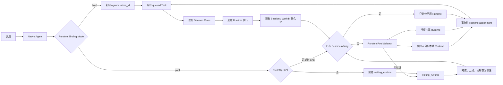
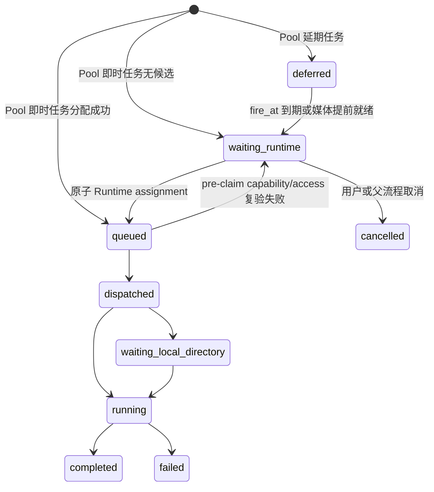

# Multica 通用 Runtime Pool 与 Session Affinity 增量设计

## 1. 需求分析

### 1.1 目标

在不改写 Multica 现有固定 Runtime 生命周期的前提下，为显式启用 Pool 模式的 Agent 增加调用时动态 Runtime 分配：

1. Runtime Pool 由 Workspace 内已注册的 `agent_runtime` 组成，不为 `platform-agent-cli` 建立专用池或第二套 Runtime 表。
2. Pool Agent 首次调用时，从满足能力、权限、在线、心跳和空闲条件的 Runtime 中自动选择。
3. 首选任务发起人自己拥有的本地 Runtime，其次选择调用者有权使用的共享 Runtime。
4. 没有候选时，任务进入可观察的等待状态，不在导入或调用入口立即失败。
5. 已有 Provider Session 的后续调用必须回到原 Runtime；原 Runtime 繁忙时进入该 Runtime 的原队列，离线或不再符合条件时才保持等待，不自动换 Runtime。
6. Runtime 一旦分配给某次 Task，该 Task 继续复用 Multica 原有 `queued → dispatched → running → terminal`、Daemon claim 和 Session resume 机制。
7. Extension Leader 与每个成员都是独立 Agent，首次调用分别分配 Runtime，后续分别保持自己的 Session Affinity。

### 1.2 增量兼容原则

- `fixed` 是 Agent 默认模式；所有既有 Agent、既有 Extension Release 和既有 API 行为保持不变。
- Pool 必须显式启用，禁止用 `runtime_id IS NULL` 或 `runtime_config.platform_agent` 推断。
- `fixed + runtime_id IS NULL` 继续表示 Runtime 被删除后的未绑定 Agent，不得被误认为 Pool Agent。
- 固定模式继续在任务入队时复制 `agent.runtime_id`；原 session、fresh fallback、Agent 并发上限和 Issue/Chat 串行语义保持不变。claim 的协议与状态机不变，但 SQL CAS 必须增加 `runtime_id` 目标条件，避免同一 Pool Agent 在多 Runtime 有任务时被错误 Runtime claim。
- Pool 仅增加任务进入 `queued` 之前的调度阶段；分配后的 Task 对 Daemon 与 CLI 来说仍是普通的 Runtime-pinned Task，Daemon 不执行 Runtime 选择。
- Runtime 权限复用 Multica 的 owner/admin、public、private-owner 规则；Pool 不创建更弱的授权路径。
- Runtime 原子选择复用 PostgreSQL 短事务、行锁、`FOR UPDATE SKIP LOCKED`、现有 Redis liveness 与 DB heartbeat fallback。
- Daemon 的机器级并发 semaphore 仍是实际执行容量的唯一事实来源；服务端不为每个 Runtime 复制一份 slot 数量。
- CLI App Server、Extension Sidecar、Skill、Command 和 Squad 委派协议不变。

### 1.3 非目标

- 不把所有普通 Agent 自动迁移为 Pool 模式。
- 不把既有 Extension Release 静默迁移为 Pool 模式。
- 不允许不兼容的 Provider 因为空闲而执行任务。
- 不实现跨 Runtime 的 Provider Session 搬迁、导出或导入。
- 不建立新的常驻调度进程或独立 Runtime Pool 服务。
- 不修改 Codex App Server 标准方法和事件格式。
- 不实现 Runtime 专属多槽容量模型；V1 的 Pool 空闲含义仍是该 Runtime 没有 capacity-bearing Task。

## 2. 方案比较与决策

### 2.1 全量改写为动态 Runtime

删除 Agent 固定绑定并让所有 Task 进入统一调度器。该方案会改变普通 Agent、Agent Builder、Chat、Autopilot 和全部 Provider 的现有行为，不符合增量适配约束。

### 2.2 在 Daemon claim 时临时选择 Runtime

Daemon 上报真实机器空闲槽后，由 claim 接口同时选 Runtime 和领取任务。该方案能精确感知机器瞬时容量，但不同 Daemon 的 pull 请求存在先后竞态，无法稳定保证“当前用户自己的本地 Runtime 优先”；同时会把调度策略耦合进现有 claim 热路径。

### 2.3 Pool Agent 入队前原子绑定

Pool Task 创建时或等待任务被唤醒时，服务端使用现有 Runtime/Task 数据原子选择严格空闲 Runtime；选中后写入 `task.runtime_id` 并进入原有 `queued` 链路。Daemon 仍使用现有 machine semaphore 决定实际何时执行。

优点：

- 保持 fixed 模式以及 Daemon claim 协议、状态机和容量语义；
- 能稳定执行 owner-local 优先级；
- 能直接复用已验证的 Extension allocator 锁与 liveness 范式；
- assignment 与 execution capacity 分工清楚，不维护双份机器 slot 账。

缺点：选中的 Runtime 所在 Daemon 若正被同机其他 Runtime 占用，Task 会在该 Runtime 的现有队列中等待，而不是立即改投其他机器。这与 Multica 当前“先路由、再由 Daemon 控制执行容量”的原则一致。

### 2.4 决策

采用方案 2.3，并以 `fixed | pool` 判别模式增量实现。Pool 调度器是 Task Queue 的前置分配能力，不是第二套执行器。

## 3. 总体架构



### 3.1 职责边界

| 组件 | 新增职责 | 保持不变 |
| --- | --- | --- |
| Agent | 显式保存 fixed/pool 模式和 Runtime Requirements | Instructions、Skills、权限、Provider 配置 |
| Runtime Registry | 保存可调度能力集合 | 注册、心跳、owner、visibility、status |
| Task Service | Pool 入队、Chat 队头串行、Session Affinity 快照、原子分配、Runtime-targeted claim 和等待唤醒 | fixed 入队、Agent 容量、Issue/Chat 串行和原 Task 生命周期 |
| PostgreSQL | 等待任务、候选锁定和 assignment CAS | queued claim 与终态事务 |
| Daemon | 无新增 Runtime 选择职责 | machine semaphore、singular/batch claim 协议、工作目录、CLI 生命周期 |
| Runtime Adapter | 声明能力并执行已分配任务 | Provider 专属执行协议 |

### 3.2 阅读顺序

首次调用从 Agent 模式分流：fixed 直接进入旧队列；pool 在 Runtime Pool 中选择候选。Pool Chat 同一时刻只解析一个执行队头，队尾必须等队头终态写回 Session 后再决定 affinity。已有 Session 的 Pool 调用不再参与普通候选排序，只能使用 Affinity Runtime。所有成功 assignment 最终汇入原有 queued/claim/execute 链路。

### 3.3 通用 Pool 边界

- Pool 是 Workspace 内 `agent_runtime` 的路由视图，不是 Provider 名单、CLI 进程池或可单独管理的资源实体。
- 调度、claim、Session Affinity 和权限判断只依赖通用 Runtime 字段与 versioned capability，禁止出现 `provider = 'platform-agent-cli'` 的分配或 claim 分支。
- 任何 Runtime Adapter 只有在实际实现某 capability 的上下文物化和执行契约后才可声明该 capability；Pool 不把一个能力自动扩大成“可执行所有 Agent”。
- 旧 `platform-agent-cli` 省略 capability 时的派生只是注册边界的窄化兼容规则，不得泄漏到 Pool 候选查询、Task 数据或 Daemon claim。

## 4. 领域模型

### 4.1 Agent Runtime Binding

`agent` 新增：

| 字段 | 类型 | 语义 |
| --- | --- | --- |
| `runtime_binding_mode` | TEXT，默认 `fixed` | `fixed` 或 `pool`，显式判别执行路由 |
| `runtime_requirements` | JSONB，默认 `{}` | Pool 候选必须满足的不可变执行要求 |

V1 Requirements：

```json
{
  "schema_version": "multica.runtime-requirements/v1",
  "capabilities_all": ["multica.extension.execute/v1"]
}
```

规则：

- fixed Agent 不读取 `runtime_requirements`，继续使用 `runtime_id`。
- pool Agent 的 `runtime_id` 必须为 NULL；具体 Runtime 只写入 Task。
- `agent.runtime_mode` 是历史 wire 字段，对 Pool Agent 保存执行模式 `pool`；`agent_runtime.runtime_mode` 则始终只表示位置 `local | cloud`。Core 必须拆成 `AgentExecutionMode = RuntimeLocationMode | "pool"` 和 `RuntimeLocationMode = "local" | "cloud"`：`Agent.runtime_mode` 使用前者，`RuntimeDevice.runtime_mode` 使用后者，不再共用现有 `AgentRuntimeMode`。
- `runtime_binding_mode` 是服务端路由真相；Agent API/UI 不得把 `Agent.runtime_mode = pool` 当作真实执行位置。Task 分配后的实际位置只能从 `task.runtime_id` 对应 Runtime 读取。fixed Agent 的 `runtime_mode` 继续与绑定 Runtime 的 location mode 一致。
- Requirements 必须严格解码、拒绝未知字段、空 capability、重复 capability 和非规范顺序。
- Capability 标识只允许 ASCII `[a-z0-9][a-z0-9._/-]{0,127}`；每个集合最多 32 项、规范 JSON 最多 4096 bytes。Requirements 输入必须已按字节升序且唯一，Runtime 注册输入按相同规则校验后排序去重。
- Runtime owner 优先级不写入 Requirements，因为它取决于每次调用的发起人。
- `runtime_config` 继续只保存 Provider 执行配置，不承载 Pool 调度策略。

### 4.2 Runtime Capabilities

`agent_runtime` 新增：

```text
capabilities TEXT[] NOT NULL DEFAULT '{}'
```

- Capability 使用稳定、版本化标识，例如 `multica.extension.execute/v1`。
- Pool 候选必须包含 Requirements 中的全部 capability。
- 新 Daemon 在 Runtime 注册时携带 presence-aware capabilities；普通 heartbeat 不改写该字段，能力变更通过重新注册生效。
- 兼容旧 Desktop/Daemon：旧 `platform-agent-cli` Runtime**省略** capabilities 字段时，服务端仅为该精确 Provider 派生 `multica.extension.execute/v1`；新端显式 `[]` 表示不支持，禁止派生；其他 Provider 不按名称推断能力。
- 调度器只按 capability 工作，不包含 `provider = 'platform-agent-cli'` 条件。
- 某 Runtime 声明 capability 之前，必须已经实现对应的 Daemon 上下文物化和执行 Adapter；声明不等于自动获得能力。

Capability 变更是调度状态变更，不是无副作用的元数据覆盖：

1. 注册事务先锁 Runtime，对新旧 capability 做差集。只有增加能力时直接提交，并在 commit 后唤醒该 Workspace 的等待任务。
2. 删除能力时，事务内重读依赖该 Runtime 且 Requirements 将不再满足的非终态 Pool Task。`queued` 任务原子退回 `waiting_runtime`、清空 `runtime_id`；`none` 任务可重新选择，`pinned` 任务保持原 affinity 并显示 `session_runtime_capability_mismatch`。
3. 若依赖者已是 `dispatched | running | waiting_local_directory`，本次 downgrade 以 `RUNTIME_CAPABILITY_IN_USE` 拒绝，旧 capability 不得部分覆盖。Daemon 必须先排空、取消或完成这些任务再注册降级；被拒绝的注册不得作为成功 heartbeat 延长 Online 状态。
4. fresh claim 和 stale-dispatch 重投前都再次校验 Task Requirements 是当前 Runtime capabilities 的子集；不满足时 fail closed，不向 Daemon 下发。该防线不取代注册事务的重排/拒绝规则。
5. Runtime visibility/owner 变更和 Workspace Member 加入、角色恢复等扩大授权的变更，在 commit 后触发同一 Workspace allocator。
6. 授权缩减使用唯一化结果，禁止各入口自选“取消或拒绝”：
   - Runtime visibility 收紧或 owner 切换：`queued` Pool Task 原子退回 `waiting_runtime` 并清 Runtime，`none` 写 `no_eligible_runtime`，`pinned` 写 `session_runtime_unauthorized`；若存在因新权限而失效的 `dispatched | running | waiting_local_directory`，整个 Runtime mutation 返回 `409 RUNTIME_ACCESS_IN_USE` 且不部分更新。
   - Workspace Member 删除、停用或角色降级：这是安全撤权，必须在原 revoke 事务按 **Member → Runtime → 受影响的 Pool ChatSession → Agent → Task** 重排锁序并取消该 requester 已不再授权的全部 Pool 非终态 Task（包括 in-flight）；没有 Chat Task 时才跳过 ChatSession。`unresolved` 按 5.2 同时转 `none`；若撤权取消的是当前已解析 Chat head，则在同一 ChatSession 锁内按 7.2 只推进一个仍获授权的下一队头。不用 409 阻止成员撤权。
   - 上述 requeue 在 commit 后对每条发 `task:waiting_runtime`，cancel 发现有 terminal/cancel 事件；只有 requeue 任务触发 allocator，所有路径在事务内重读 Member/Runtime 并在 claim 前再复验。

### 4.3 Task Routing Snapshot

`agent_task_queue` 新增：

| 字段 | 语义 |
| --- | --- |
| `runtime_binding_mode` | 入队时快照 Agent 的 fixed/pool 模式 |
| `runtime_requirements` | 入队时快照，防止 Agent 后续更新改变已创建 Task |
| `placement_workspace_id` | Pool placement 的不可变 Workspace 快照，用于租户边界和有界等待扫描 |
| `runtime_requester_user_id` | 本次 placement principal，仅用于 Runtime owner/visibility 判断 |
| `session_affinity_state` | `unresolved | none | pinned | removed`；区分 Chat 队尾尚未解析、没有 Session、已固定 Runtime 与来源 Runtime 已删除 |
| `session_affinity_runtime_id` | 已有 Session 对应 Runtime 的软引用；存在时为硬约束 |
| `explicit_fresh_session` | 用户显式放弃旧 Provider Session；与滚动兼容用途的 `force_fresh_session` 分离 |

`placement_workspace_id`、`runtime_requester_user_id` 与 `session_affinity_runtime_id` 遵循 Multica 现有任务快照原则，使用应用层管理的软引用，不新增级联外键。用户或 Runtime 删除流程必须显式处理仍在等待的任务；不得依赖数据库级联静默删除 Task。`session_affinity_state` 与 affinity Runtime ID 的合法对只有 `unresolved + NULL`、`none + NULL`、`pinned + 非 NULL`、`removed + NULL`。

`unresolved` 不是可调度的“无 Session”：它只能用于有前驱的 Pool Chat 队尾，allocator 必须排除。只有在前驱终态事务已经把 Chat Session 指针写回后，队头才能从 `unresolved` 原子变为 `pinned`、`none` 或 `removed`。

不得把 `runtime_requester_user_id` 当作 Agent invocation、MCP、Connected App 或其他授权凭据。Agent 调用授权仍使用现有 `originator_user_id`、permission policy 和 attribution 链路。

Placement principal 解析顺序：

1. 有效的 `originator_user_id`；
2. 无人类 originator 的系统触发使用 Agent owner；
3. 两者都不存在时 fail closed，不创建可执行 Pool Task。

### 4.4 Release Routing Snapshot

`platform_extension_release` 新增：

| 字段 | 语义 |
| --- | --- |
| `runtime_binding_mode` | 既有行为为 fixed，新 Release 为 pool |
| `runtime_requirements` | Release 创建的全部 Agent 使用的 Pool Requirements |

Release 完成约束调整为：

```text
reservation: squad_id NULL, runtime_id NULL
fixed complete: squad_id NOT NULL, runtime_id NOT NULL
pool complete: squad_id NOT NULL, runtime_id NULL
```

既有 Release 默认 fixed，原 `runtime_id` 和 `resources.runtime` 保持不变。

### 4.5 Comment Follow-up Obligation

Pool queued Task 已经选定 Runtime 后，新评论的 originator 可能无权使用该 Runtime。这种评论既不能在旧身份下合并，也不能只依赖 completion reconciliation：现有 `RegisterPlannedCommentForActiveTask` 刻意排除 queued，cancel 也不保证运行 completion reconcile。

因此新增持久化 `agent_comment_followup_obligation`：

| 字段 | 语义 |
| --- | --- |
| `issue_id, agent_id, comment_id` | 一条评论对一个目标 Agent 的唯一待处理义务 |
| `comment_updated_at` | 创建义务时的评论版本 CAS，防止编辑后执行旧内容 |
| `head_sha` | 接受该义务时的 Review HEAD 边界，沿用现有 head-scoped merge 规则 |
| `created_at, updated_at` | FIFO 与恢复扫描 |

- 唯一键为 `(agent_id, comment_id)`；义务行存在即表示 pending，被某 Task 原子覆盖或评论/目标失效后才删除，不使用仅存内存的回调标记。
- 处理器每次从持久化 Comment 重新计算调用权限、originator、Connected Apps 和 overlay；不从被拒绝合并的 Task 继承旧身份。
- 只有以下某个事务性结果成功时才删除义务：合并到可使用的 pre-claim Task，或在空闲 `(issue, agent)` slot 创建了独立 Task。遇到异 HEAD、无权 Runtime、active Task 或唯一键竞态时保持 pending。
- Comment 编辑在同一事务 upsert 新 `comment_updated_at/head_sha`；Comment 删除、Agent/Issue 删除或目标明确不再触发时同事务删除义务。
- 任意 active Task 进入终态（completed、failed、cancelled，包括 Runtime 删除、rerun 取消和 sweeper）都在 commit 后唤醒相同 `(issue, agent)` 的义务；有界周期扫描恢复丢失通知。终态与新义务并发时依靠唯一键、行锁和创建 Task/删除 obligation 同事务收敛，不存在“取消后无 reconcile 就丢评论”窗口。

处理器的 CAS 顺序是可执行合同：事务外只预取有界 obligation ID；事务内先锁并重读 Comment，校验 Comment、Issue、Agent 属于同一 Workspace 且 Comment 仍属于该 Issue，再锁 obligation。

- `comment.updated_at != obligation.comment_updated_at` 时，以当前 Comment 和 Issue HEAD 更新 obligation 后保留 pending，本轮不执行旧内容。
- 当前 active Task 的 HEAD 与 obligation 不同时不合并，obligation 继续 pending；等 `(issue, agent)` slot 空闲后，处理器重读当前 Issue HEAD，在同一事务把 obligation HEAD 提升到当前值、创建独立 Task 并条件删除 obligation；HEAD 前进不会使义务永久悬挂。
- 只有 `agent_id + comment_id + comment_updated_at + head_sha` 仍与锁定 obligation 一致，且 merge/create 成功时，才在同一事务 conditional delete；任何 CAS 失败都保留或刷新 obligation。

## 5. Task 状态机

### 5.1 新状态

新增 `waiting_runtime`：Pool Task 已经持久化，但尚未绑定可执行 Runtime。



### 5.2 数据库约束

迁移必须用独立 CHECK 守住跨字段组合，而不是只放宽 NULL：

```sql
-- agent
(
  runtime_binding_mode = 'fixed'
  AND runtime_mode IN ('local', 'cloud')
)
OR (runtime_binding_mode = 'pool' AND runtime_id IS NULL AND runtime_mode = 'pool')

-- terminal timestamp is closed, not one-way
(status IN ('completed', 'failed', 'cancelled')) = (completed_at IS NOT NULL)

-- task affinity pair
(session_affinity_state = 'unresolved' AND session_affinity_runtime_id IS NULL)
OR (session_affinity_state = 'none' AND session_affinity_runtime_id IS NULL)
OR (session_affinity_state = 'pinned' AND session_affinity_runtime_id IS NOT NULL)
OR (session_affinity_state = 'removed' AND session_affinity_runtime_id IS NULL)

-- fixed never participates in affinity or placement snapshots
runtime_binding_mode <> 'fixed'
OR (
  session_affinity_state = 'none'
  AND session_affinity_runtime_id IS NULL
  AND placement_workspace_id IS NULL
  AND runtime_requester_user_id IS NULL
)

-- explicit reset is Pool-only and cannot carry an affinity
NOT explicit_fresh_session
OR (runtime_binding_mode = 'pool' AND session_affinity_state = 'none')

session_affinity_state <> 'unresolved'
OR (
  runtime_binding_mode = 'pool'
  AND chat_session_id IS NOT NULL
  AND status IN ('waiting_runtime', 'deferred')
  AND runtime_id IS NULL
  AND wait_reason = 'chat_predecessor_pending'
)

-- removed is an observable cancellation, not a mutation of old terminal history
session_affinity_state <> 'removed'
OR (
  runtime_binding_mode = 'pool'
  AND status = 'cancelled'
  AND completed_at IS NOT NULL
  AND runtime_id IS NULL
  AND wait_reason = 'session_runtime_removed'
)

-- task routing lifecycle
(
  runtime_binding_mode = 'fixed'
  AND status <> 'waiting_runtime'
  AND (
    (status IN ('queued', 'deferred', 'dispatched', 'running', 'waiting_local_directory') AND runtime_id IS NOT NULL)
    OR (status IN ('completed', 'failed', 'cancelled'))
  )
)
OR (
  runtime_binding_mode = 'pool'
  AND placement_workspace_id IS NOT NULL
  AND runtime_requester_user_id IS NOT NULL
  AND (
    (status IN ('waiting_runtime', 'deferred') AND runtime_id IS NULL)
    OR (status IN ('queued', 'dispatched', 'running', 'waiting_local_directory') AND runtime_id IS NOT NULL)
    OR (status IN ('completed', 'failed', 'cancelled'))
  )
)
```

因此：

- fixed 的任何非终态 Task 仍必须有 Runtime，不得携带 affinity；终态 fixed Task 继续允许因 Runtime 删除而 `runtime_id IS NULL`；
- pool 只有 `waiting_runtime` 和未到期 `deferred` 可以没有 Runtime；
- 一旦进入 `queued`，无论模式都必须有 Runtime；
- pool 的任意终态 Task 可以因 Runtime 删除而 `runtime_id IS NULL`，但这不会把历史 Task 改成 `session_affinity_state=removed`；
- `removed` 只表示当前调用在创建/等待期间已确认 Session Runtime 不存在，必须是带完成时间和稳定 reason 的 Pool cancelled Task；
- claim/finalize 永远不会看到 Runtime 为空的 Task。

`unresolved` 队尾被取消时，所有单条、批量、Chat Session 删除、Workspace 撤权和 archive 路径必须在同一条 UPDATE/CAS 中写入 `status=cancelled`、`completed_at`、`session_affinity_state=none`、`session_affinity_runtime_id=NULL`，并清除 `chat_predecessor_pending`。取消 unresolved 队尾不是执行队头终态，不得解析或唤醒另一个队尾；只有取消当前已解析队头才走 7.2 的下一队头推进逻辑。

迁移不得盲目将 `completed_at` 双向 CHECK 施加到未知历史数据。267 up 先用只读 preflight 统计并拒绝任何“终态无 completed_at”或“非终态有 completed_at”的旧行，输出稳定行数诊断；只在 preflight 为零后添加 `NOT VALID` CHECK 并立即 `VALIDATE CONSTRAINT`。不自动改写旧 Task 历史。

### 5.3 非终态集合

`waiting_runtime` 必须加入：

- per issue/agent pending partial **unique** index；
- per chat pending partial **non-unique** index、head selector 和 pending queries；
- cancel、archive、workspace revoke 和 runtime-affinity removal；
- HasPending、HasActive、UI task snapshot 和 issue visibility；
- comment coalescing、Squad member status 和任务去重。
- Realtime `task:waiting_runtime` 事件与 Core event schema，使调用入口能立即显示等待而不是误报 queued。

`waiting_runtime` 不加入：

- `CountRunningTasksByAgent`；
- Daemon claim candidate；
- Runtime capacity-bearing 集合，因为未分配任务没有 Runtime；
- queued TTL 清理。

Pool deferred 在 `fire_at` 到期或 Issue/Chat 媒体提前就绪时都先转 `waiting_runtime`，再调用统一 allocator；fixed deferred 的原有 per-runtime promotion 查询和媒体就绪 `deferred → queued` 语义不变。Pool Chat 媒体批次即使一次就绪多个 Task，也只解析该 Session 的一个执行队头，其余保持 `unresolved`。

通用 allocator 是调用/唤醒热路径，新增 `agent_task_queue(runtime_id)` 的 capacity-bearing partial index，谓词精确覆盖 `queued | deferred | dispatched | running | waiting_local_directory`。`waiting_runtime` 使用 `(placement_workspace_id, priority DESC, created_at ASC, id ASC)` partial index，allocator 每轮必须带单一 Workspace 条件和固定 `LIMIT`，禁止扫描全局等待队列。

Chat 的 pending index 使用 rolling-safe 新版本，在原 `queued | dispatched | running | waiting_local_directory | deferred` 上增加 `waiting_runtime`；先 `CREATE INDEX CONCURRENTLY` 新版，后续独立迁移再 `DROP INDEX CONCURRENTLY` 旧版。Chat 队头查询、pending API、队列编辑/取消和 UI 必须共用同一顺序：

1. 已存在的唯一 `session_affinity_state <> unresolved` 非终态执行队头绝对优先，无论后来队尾的 priority 或 media/retry 标记多高；
2. 只有已解析队头终态后，终态事务才从 `unresolved` 集合中选一个新队头：automatic retry 优先，其余按 `priority DESC, created_at ASC, id ASC`；
3. 剩余 unresolved 行仅是可见/可取消队尾，不参与 allocator head 复验。

不允许 allocator 与可见队列对“谁是当前执行队头”有不同定义。`session_id` 或最近终态 Task 的 `work_dir` 任一存在都构成可恢复 affinity；只要任一存在，终态事务必须保存对应 `runtime_id`。有 Session/Workdir 指针却无 Runtime 软引用时解析为 `removed`；两者都不存在才解析为 `none`。

## 6. Runtime 选择与原子分配

### 6.1 候选硬条件

无 Session Affinity 的候选必须全部满足：

1. Runtime 与 Agent 位于同一 Workspace。
2. Runtime capabilities 包含 Task requirements 的全部 capability。
3. `status = online`。
4. Redis liveness 为 alive；Redis 不可用时使用现有 150 秒 DB heartbeat fallback。
5. Placement principal 通过现有 Runtime 使用权限：owner/admin override、public、private-owner。
6. Runtime 没有 `queued`、`deferred`、`dispatched`、`running` 或 `waiting_local_directory` Task。

V1 的 Runtime idle 是数据库路由空闲，不等于 Daemon 机器 semaphore 此刻必有槽。assignment 后的实际执行等待仍由现有 Daemon 控制。

### 6.2 选择顺序

无 Session Affinity：

1. `runtime_mode = local AND owner_id = runtime_requester_user_id`；
2. 其他有权使用的 Runtime；
3. 同层内按 `last_seen_at DESC`；
4. 已绑定非归档 fixed Agent 数量 ASC；
5. `created_at ASC`；
6. `id ASC`。

有 Session Affinity：

- 候选只能是 `session_affinity_runtime_id`；
- 不进入 owner-local/shared 排序；
- Runtime 存在、capability 仍匹配、调用者仍有权限且 Online/alive 时，直接写入该 Runtime 并进入其现有 `queued` 队列，**不把 busy 当作 placement 阻断**；繁忙等待由原 per-runtime queue 和 Daemon semaphore 处理；
- Runtime 离线、心跳失效、失去权限或 capability 不再匹配时保持 `waiting_runtime`；
- 禁止自动选择其他空闲 Runtime。

### 6.3 原子算法与锁序

一次 placement 先做无锁预筛，再进入短事务：

1. 事务外只从一个 `placement_workspace_id` 按 `priority DESC, created_at ASC, id ASC` 读取固定上限的 waiting Task/候选 Runtime，并完成 Redis liveness 预筛。禁止持有数据库行锁等待外部 Redis，`unresolved` Chat 队尾不进入候选。
2. 新增 Pool 事务遵循完整锁序：**Comment → Follow-up Obligation → Workspace Member → Agent Runtime → Chat Session → Agent → Agent Task**。路径只锁它需要的子序列，多行按 UUID 升序。Allocator 是 Member → Runtime →（Chat）Session → Agent → Task；Pool claim 在 Agent 容量锁前已锁 Member/Runtime/可选 ChatSession，再锁 Agent 计数和 global head Task；fixed claim 保持 Agent → Task。
3. 共享 Pool Task factory 必须在创建事务内锁定并重读 placement Member：Chat 创建使用 **Member → ChatSession → Agent → Task**，Issue、Mention、Squad、Quick Create、Autopilot 和其他非 Chat 创建使用 **Member → Agent → Task**。Member 已删除、停用或不再授权时拒绝创建，不得依赖事务外 `requireWorkspaceMember` 快照。Runtime 删除使用 Runtime → Pool ChatSession → Agent → Task；Chat terminal 使用 ChatSession → Agent → Task，绝不得在已锁 Agent 后再反向获取 ChatSession。Comment edit 使用 Comment → Obligation；obligation processor 先无锁预取 ID，再按 Comment → Obligation → Member → Runtime → Agent → Task 重读/CAS。
4. Workspace Member revoke 在本特性中必须从现有 Agent → Task → Member 调整为 **Member → Runtime → 受影响的 Pool ChatSession → Agent → Task**：先锁目标 Member，再按 UUID 锁受影响 Runtime、Pool ChatSession 和 Agent，最后锁 Task；没有 Chat Task 时才跳过 ChatSession。不得保留 Agent→Member、Task→Member 或 Agent→ChatSession 的阻塞反序。与 allocator/queued merge 竞争 Task 时仍可使用 `SKIP LOCKED`/`NOWAIT` 整事务回滚重试，但这只是缩短竞争，不是弥补反序锁的手段。
5. 在锁内重读 placement Member、Runtime、Agent 和（若有）Chat 队头，重新检查 Workspace、capability、status、DB heartbeat、visibility/owner 与 Chat head-only。最后以 `FOR UPDATE SKIP LOCKED`/CAS 锁定 Task，它必须仍为同一 Workspace 的 `waiting_runtime`、routing snapshot 未变且 affinity 已解析。任一复验失败就释放并继续 bounded scan。
6. `none` Task 还要在 Runtime 锁内检查 capacity-bearing active Task 并按 6.2 排序；`pinned` Task 只检查精确 Runtime，不检查 busy。
7. 在同一事务中以 `id + status + runtime_id IS NULL + runtime_binding_mode=pool` 作为 assignment CAS，把 `task.runtime_id` 写为 winner、`status` 改为 `queued`、清空 `wait_reason`。
8. Commit 后广播 `task:queued` 并调用现有 Runtime-targeted `NotifyTaskEnqueued`。

第一个无 affinity 的 Pool assignment 在 Runtime 行锁内重查 strict-idle，因此另一个 Pool allocator 不能在同一空闲快照上选中同一 Runtime。该保证是 Pool allocator 间的 assignment CAS，不是全系统 Runtime 独占租约：fixed 入队仍可在锁释放后向同一 Runtime 排队，最终并发继续由原 Daemon semaphore/claim 控制。

不得采用“先锁 Task，再阻塞等 Runtime”或“先锁 Agent/Task，再阻塞等 Member”的实现：Runtime delete、Member revoke、allocator 和 merge 都必须按上述公共顺序迁移。`NOWAIT/SKIP LOCKED` 只允许作为同序竞争的重试机制，不得用来批准永久反序。

### 6.4 调度触发器

- Pool Task 创建后立即尝试 fast-path assignment。
- Runtime 从 Offline 变 Online 或 heartbeat 恢复时唤醒对应 Workspace 的等待队列。
- Runtime capability 增加、visibility/owner 扩大可用范围、Member 加入/权限恢复时唤醒受影响 Workspace；缩减能力或权限先执行 4.2 的原子重排/拒绝，再发事件。
- capacity-bearing Task 进入终态或取消时唤醒等待队列。
- Pool Chat 执行队头在完成、失败或取消结算后，唤醒同 Chat Session 的下一个 `unresolved` 队尾。
- 现有 server sweeper 周期性扫描少量 `waiting_runtime` 任务，恢复丢失的进程内通知。
- 每个触发器调用同一 allocator，不复制选择规则。

没有候选不是业务错误：Task 保持 `waiting_runtime`，`wait_reason` 使用稳定原因，如 `no_eligible_runtime`、`session_runtime_offline`、`session_runtime_unauthorized` 或 `session_runtime_capability_mismatch`。Chat 队尾使用 `chat_predecessor_pending`，它表示 affinity 尚未解析，不能被周期 allocator 当作普通 `none` Task。Affinity Runtime 仅繁忙时 Task 已进入原 `queued` 队列，不创建新的 busy 等待原因。

Pool 即时任务统一先以 `waiting_runtime` 持久化，再立即调用 Workspace 级的同一 allocator；存在候选时会在相邻短事务内转为 `queued`。这样创建与恢复只维护一条 assignment 实现，不为“创建时有候选”复制第二套 SQL。Pinned Task 可在原 Runtime busy 时直接 queued，因此不依赖额外 Session reservation 或优先锁。

事件在 allocator 返回后统一发布：创建的 Task 仍为 waiting 时只发布一次 `task:waiting_runtime`，不通知 Daemon；每个成功 assignment 在 commit 后各发布一次现有 `task:queued` 并通知对应 Runtime。立即成功的当前 Task 不先发布 waiting，避免 UI 闪烁；allocator 若先分配了更早 Task，调用方必须遍历并发布全部 assignment，再为仍等待的当前 Task发布 waiting。

### 6.5 Comment Coalescing 与 placement principal

现有 comment merge 会把 attribution、Connected Apps 和 MCP overlay 原子重写为最新评论的用户；Pool 必须在同一事务处理 Runtime 权限主体：

- `waiting_runtime` Pool Task 合并时同时把 `runtime_requester_user_id` 更新为新的 originator，保持 Runtime 为空，后续按新用户重新调度。
- 已 queued 的 Pool Task 合并前按 **Member → Runtime → Task** 锁序取锁，并复用同一 `CanUse` policy 校验新 originator；禁止先锁 Task 再等待 Runtime delete 已持有的 Runtime 锁。
- 新用户有权使用时，attribution、overlay、connected apps 和 requester 一起提交；无权时不得把评论合并到该 Runtime 上执行，必须写入 4.5 的持久化 obligation，再由后续独立 Task 覆盖。
- 上一条的“改用”必须是在同一请求中成功 upsert 4.5 的持久化 obligation 后才能返回 deferred，不得只打日志或寄希望于 queued Task 的 completion。Task 后续 failed/cancelled、Runtime 被删除或 rerun 取消都不能清掉 obligation。
- fixed Task 的 merge SQL 和授权语义保持不变。
- merge 与 allocator 并发时最终由同一 Task CAS 串行化，而不是依赖反向锁序；禁止出现 requester 已换人但 Runtime 仍按旧用户授权的中间状态。

### 6.6 Runtime-targeted Claim

现有 `ClaimAgentTask` 只按 `agent_id` 选择。同一 Pool Agent 可能同时有分配到 Runtime A 和 Runtime B 的 Task；若 Runtime A 的 Daemon 沿用该查询，它可以把 B 的高优先级 Task 改成 dispatched，然后才在 Go 层发现 Runtime 不匹配并丢弃返回。因此 post-claim guard 不是正确性保证。

增量实现必须新增 SQL CAS `ClaimAgentTaskForRuntime(agent_id, runtime_id, prepare_lease_secs)` 与内部 service helper `claimTaskForAgentRuntime`：

- 候选子查询先在该 Agent 的**全部 Runtime** 上按现有规则求唯一 global eligible head，不允许在子查询中先用 `runtime_id` 缩小集合；只有 `head.runtime_id = requested_runtime_id` 时外层 UPDATE 才能把它改为 dispatched。不匹配时不更新任何行，低优先级的 Runtime A Task 也保持 queued，等 Runtime B 领取全局队头。
- 外层 UPDATE CAS 同时包含 `id + agent_id + runtime_id + status=queued`；不允许先改成 dispatched 再做 Go 层过滤。
- 完整复制现有 `ClaimAgentTask` 的 Agent 全局 `max_concurrent_tasks`、per `(issue, agent)` 串行、per `(chat_session, agent)` 串行、quick-create 串行、`priority DESC, created_at ASC, id ASC` 和 `FOR UPDATE SKIP LOCKED`。active 阻断查询仍跨 Runtime，不能因增加 Runtime 过滤而放宽串行语义。
- singular `ClaimTaskForRuntime` 和 batch `ClaimTasksForRuntimes` 都调用该 helper。Batch 候选按原全局 priority/FIFO 输出，继续按 `agent_id` 去重，因为一次轮询只尝试该 Agent 的全局队头；Agent 容量仍在 CAS 前以 Agent 锁和全局 running count 复验。
- Pool claim 在 Task CAS 前复验当前 placement Member、Runtime visibility/owner、Workspace、Online 和 capability；不再符合的 queued Task 原子退回 `waiting_runtime` 并走统一唤醒/事件路径，不向 Daemon 返回。fixed claim 不读 Pool 快照，但同样受益于 runtime-targeted CAS。
- Daemon HTTP/WS singular 与 batch 协议、Task payload、token finalize 和 CLI 执行流程不变。

Runtime-specific fixed claim 也使用上述 targeted CAS，这是一个窄化的正确性修复：它只消除 Agent 改绑过渡期“A Runtime 误 dispatch B Runtime Task 再丢弃响应”的意外行为，不改变 fixed 的优先级、串行、容量或 Session 语义。必须保留 `ClaimTask(agent_id)` 非 Runtime-specific 入口的旧语义，并用 Agent runtime rebind 回归证明旧 Runtime 不会错 dispatch、正确 Runtime 仍按原顺序领取。

## 7. Session Affinity

### 7.1 Affinity 来源

沿用 Multica 当前 Session 来源：

- Issue follow-up：同一 `agent_id + issue_id` 最近可恢复 Task；
- Chat：`chat_session.session_id` 或 `chat_session.work_dir` 任一存在，并且同时有 `chat_session.runtime_id`；必要时回退到最近 Chat Task；
- Rerun：显式来源 Task；
- Squad：Leader 和每个成员按各自 Agent/Issue 历史分别计算。

Affinity 解析必须是四态，禁止把“Chat 前驱尚未结算”、“没有 Session”和“Session 来源 Runtime 已删除”合并：

1. 同 Chat Session 已有非终态执行队头时，新队尾写 `unresolved`，不读当前 Chat Session 指针也不进入 allocator。
2. 仅 Pool 调用允许新字段 `explicit_fresh_session=true`，它优先级最高并写 `none`；claim handler 同样先检查该字段，即使保留 `rerun_of_task_id` 做审计，也不得下发来源 Session/Workdir。fixed Agent 传入该新参数返回 `400 FRESH_SESSION_REQUIRES_POOL`，原 rerun/`force_fresh_session` 语义不变。数据库 CHECK 同时要求 `explicit_fresh_session => runtime_binding_mode=pool AND session_affinity_state=none`。
3. `rerun_of_task_id` 存在时读取该精确来源 Task。它优先于旧 `force_fresh_session`；Multica 的手动 rerun 为滚动部署安全会持久化 `force_fresh_session=true`，但新 claim handler 仍按来源 Task恢复。来源 Runtime 有效时写 `pinned`，已被删除时写 `removed`。
4. 系统 retry 的 `retry_of_task_id` / `parent_task_id` 同样优先于旧 `force_fresh_session`，并 pin 到 parent Runtime。即使 `codex_semantic_inactivity` 按现有规则开启 fresh Provider Session，retry 仍留在 parent Runtime；这保持 fixed retry 的路由语义。
5. 非 rerun/retry 且 `force_fresh_session=true` 时写 `none`，明确不读取 Issue/Chat 的旧 Session。
6. 其余 Issue follow-up、当前 Chat 执行队头和 Squad 成员调用沿用现有 Session 查询。存在 Session 且 Runtime 有效时写 `pinned`；Session 指针存在但 Runtime 已被删除时写 `removed`；从未存在可恢复 Session 时写 `none`。

`removed` Task 不得进入普通候选排序或静默换机；创建流程在同一事务将其持久化为可观察的 cancelled Task，同时写 `completed_at` 和 `wait_reason=session_runtime_removed`，并提示用户显式开启新 Session。

### 7.2 Pool Chat 队头串行

Chat Session 的 Session/Workdir 指针是前一个执行结果，不是可以在多个未开始 Task 之间预测的静态配置。因此 Pool Chat 不能在创建多个队尾时把它们都当成 `none` 并独立选 Runtime。

1. 创建 Direct Chat、Channel Chat、媒体 deferred、Chat retry 或 background quick-action Task 的事务，必须通过共享 Pool Task factory 按 **Member → ChatSession → Agent → Task** 锁序重读 placement 授权、判定队头并只持久化 routing snapshot，不在该创建事务内锁 Runtime 或做 assignment。commit 后 allocator 再按 6.3 的 **Member → Runtime → ChatSession → Agent → Task** 锁序分配。fixed Chat 继续原行为；Pool Chat 仅当新 Task 是执行队头时解析 affinity。
2. 已有前驱时，队尾持久化为 `waiting_runtime/deferred + unresolved + runtime_id NULL + chat_predecessor_pending`，无论当时 `chat_session` 指针是什么都不提前 pin，因为前驱可能在本次执行中建立、更换或退役 Session。
3. 队头 completed/failed 时，沿用现有 **ChatSession → Agent → Task** 锁序，在同一终态事务中先写 Task 结果与 `chat_session.session_id/work_dir/runtime_id`（包括 resume-unsafe clear），再选出唯一下一队头并将其 `unresolved` 改为：`session_id` 或 `work_dir` 任一存在都视为可恢复 Session，并且必须同时有有效 `runtime_id` 才写 `pinned`；两者都不存在才写 `none`；存在任一可恢复指针但 Runtime 已删除则写 `removed` 并立即 cancelled。commit 后才调 allocator。
4. 失败事务如果同时创建 automatic retry，必须先在该事务内创建 retry，然后按共享顺序选下一队头。现有 retry 优先级使 retry 先于新用户输入，原队尾继续 `unresolved`。
5. 未 dispatch 的队头取消不可能产生 Session，可在取消事务直接按当前指针解析下一队头。已 dispatched/running 的取消必须等现有 cancel settlement 边界（包括延迟 pin 的 `AdvanceCancelledChatSessionPointer` 和 `FinalizeDeferredCancelledChat`）完成后才解析下一队头，不得在可能迟到的 Session pin 前把它当成 `none` 换机。
6. Pool send 按 **Member → ChatSession → Agent → Task**；terminal report、cancel、late pin 和 Chat delete 按 **ChatSession → Agent → Task** 取其所需子序列。锁的先后者提交后，后来者必须重读 placement Member、Session 指针和队头；禁止使用事务外的 Member 或 `chat_session` 快照写 affinity。

上述规则保证任何时刻每个 Pool Chat Session 只有一个已解析的执行队头；队尾可被 UI 查看、编辑、提权和取消，但不可被 allocator/claim。

### 7.3 续接规则

1. 调度器把 Task 重新分配到 Affinity Runtime。
2. 现有 claim handler 继续执行 `prior.RuntimeID == task.RuntimeID` 校验。
3. 校验通过后按原逻辑下发 `PriorSessionID` 和 `PriorWorkDir`。
4. Daemon 继续使用现有 workdir reuse、rollout 检查、resume 和 Provider 错误处理。

本增量只保证“调度不会主动把已有 Session 发往另一 Runtime”，不改写 Multica 现有同 Runtime 内的 best-effort resume/fresh fallback 处理。

### 7.4 Runtime 不可用

- busy：直接绑定原 Runtime 并保持在原 `queued` 队列，由现有 Daemon 容量和 Agent 并发规则等待。
- offline/stale：保持 `waiting_runtime`，Runtime 恢复后重试。
- unauthorized：保持等待并向 UI 暴露原因，不降级到其他 Runtime。
- Runtime 被删除：删除事务按 **Runtime → Pool ChatSession（UUID 升序）→ Agent（UUID 升序）→ Task（UUID 升序）** 取锁。在现有 `UnbindTasksFromRuntime` 之前，先把关联的非终态 pinned Pool Task 标为 `cancelled + removed`，写 `completed_at`、清空 `runtime_id/session_affinity_runtime_id` 并写 `session_runtime_removed`。已终态历史 Task 保持原 completed/failed/cancelled 和原 affinity state，只沿用 `UnbindTasksFromRuntime` 清空 `runtime_id`，不得把历史改写成 `removed`。随后清理 `chat_session.runtime_id`；Chat/Issue 解析器遇到“可恢复 `session_id/work_dir` 或历史 affinity 存在，但 Runtime 软引用为空/查无 Runtime”时，为新调用生成 `removed` cancelled Task。这样 fixed/Pool 终态历史都兼容 runtime NULL，同时 follow-up 不会被当作首次调用重新选择。
- V1 不迁移 Session。未来只有源/目标 Runtime 都声明兼容的 export/import 格式，并完成可验证的状态传输后，才能新增迁移能力。

### 7.5 显式开启新 Session

- Issue、Leader 和历史 Squad 成员复用现有 `POST /api/issues/{id}/rerun`，请求增量增加 `fresh_session: true`；可同时携带 `task_id` 以保持原目标 Agent、Leader/成员角色和审计 lineage，但新 Task 写 `explicit_fresh_session=true`、affinity=`none`。
- 该操作沿用现有 rerun 的 invoke permission 与审计，原 waiting Task 在同一事务取消；不删除历史评论、Task 或 Provider 输出。
- Chat 使用现有 New Chat 操作创建新的 `chat_session`；若旧会话仍有 waiting Task，UI 先调用现有 session-scoped cancel，再创建新会话。Channel 的现有 `/new` 语义保持不变。
- `session_runtime_removed` 和 `session_runtime_unauthorized` 的 Issue/Task UI 都提供“开启新 Session”恢复动作；普通 retry/rerun 按钮不隐式清 affinity。

### 7.6 Retry

- fixed retry 原样复制 parent runtime。
- pool retry 继承 parent runtime 作为 `session_affinity_runtime_id`，保证基础设施失败不会把 Session 换机。
- 若父 Task 尚未分配 Runtime，则非 Chat retry 继续保持无 affinity 的 Pool 调度；Chat retry 仍服从 7.2 的唯一执行队头规则。
- 只有显式 fresh session 才清除 affinity。

## 8. Extension 与 Squad 增量适配

### 8.1 Importer

新 Release 导入流程：

```text
编译/验证 Bundle
→ 预占不可变 Release
→ 创建 Skills
→ 创建 pool Agent
→ 全量 Agent-Skill 绑定
→ 创建 Native Squad
→ 完成 Release
```

变化：

- Importer 不再枚举、锁定或选择 Runtime。
- 当前没有 Online Runtime 也可以成功导入。
- 新 Agent 使用 `runtime_binding_mode=pool`、`runtime_id=NULL` 和 `multica.extension.execute/v1` requirement。
- `runtime_config.platform_agent`、Agent Prompt、Skill、Command、Leader 和 Squad Instructions 保持原字节/原语义。
- 单事务、版本不可变、并发幂等和全量回滚保持不变。
- 同 key/version 的既有 fixed Release 继续幂等返回原结果；使用 Pool 必须导入新版本。

### 8.2 Leader 与成员

- 调用 Squad 只为 Leader 创建 Task；Leader Task 首次从 Pool 选择 Runtime。
- Leader 委派成员时，Multica 仍为目标成员创建独立 Native Agent Task。
- 目标成员没有 Session 时独立选择 Runtime；有 Session 时等待自己的 Affinity Runtime。
- Squad 不整体绑定 Runtime，也不共享一个 Provider Session。
- 一个成员 Runtime 不可用只阻塞该成员调用，不改变其他 Agent 的 Session。
- Issue 分配 Squad 的 Leader 路径、comment `@squad` 的 Leader 路径以及 Leader 运行时产生的成员路径，都必须在调用共享 Task factory 后获得相同 routing snapshot；禁止某个 Squad 入口继续直接读 `agent.runtime_id` 而绕过 Pool。

### 8.3 其他原生调用入口

Pool 是 Agent 的执行路由模式，不只适用于 Extension 页面。Issue assignee、Mention、Squad Leader/成员、Quick Create、Direct Chat、Channel Chat、媒体 deferred、manual rerun、automatic retry 和 Autopilot `run_only` 都必须在原 fixed 分支旁增加 Pool 分支，并通过同一 routing-snapshot/affinity helper 产生数据。Autopilot 的无人类 placement principal 使用 Agent owner；无 owner 时 fail closed。Mika/Builder 等不允许 Pool 的系统入口继续保持 fixed-only gate，不得因通用 readiness 放宽而误写 NULL Runtime queued Task。

## 9. API 与客户端

### 9.1 Extension API

Release mapping 使用判别结构：

```json
{
  "runtime_policy": {
    "mode": "pool",
    "requirements": {
      "schema_version": "multica.runtime-requirements/v1",
      "capabilities_all": ["multica.extension.execute/v1"]
    }
  },
  "runtime": null
}
```

既有 fixed Release 保持：

```json
{
  "runtime_policy": { "mode": "fixed" },
  "runtime": { "id": "uuid", "provider": "platform-agent-cli" }
}
```

Pool Import 不再返回 `PLATFORM_RUNTIME_UNAVAILABLE`。该错误仍可保留用于兼容旧服务端或 fixed 导入响应。

### 9.2 Agent API

增量返回：

```json
{
  "runtime_binding_mode": "pool",
  "runtime_requirements": {},
  "runtime_bound": false,
  "runtime_routable": true
}
```

- `runtime_bound` 仍只表示是否绑定具体 Runtime。
- `runtime_routable` 表示 fixed 已绑定或 pool 可进入调度。
- Pool Agent 的 `runtime_mode` 返回 `pool`；实际执行的 local/cloud mode 从已分配 Task 的 Runtime读取。
- 普通 Agent 创建 API 继续要求 Runtime；Extension Importer 使用专用事务 helper 创建 Pool Agent。
- 客户端执行入口使用 `runtime_routable`，Runtime 详情链接仍使用 `runtime_bound`。

Task API 为兼容已安装客户端继续把未分配 `runtime_id` 编码为 `""`，并通过 `status=waiting_runtime`、稳定 `wait_reason` 和 routing mode 消除歧义；不把该字段改成 nullable，避免 Core/Web/Mobile schema 分叉。

### 9.3 UI

- Pool Release 显示“Runtime Pool / 调用时分配 / Session 固定到首次选中的 Runtime”，不伪造 Runtime 链接。
- Task 的 `waiting_runtime` 显示等待原因并允许取消。
- 新增 `task:waiting_runtime` Realtime 事件；转为 queued 后继续发原有 `task:queued`。
- Agent/Squad picker 将 Pool Agent 视为可执行；未绑定 fixed Agent 继续显示需要绑定 Runtime。
- 本阶段不增加普通 Agent 的 Pool 配置 UI；Pool 的首个生产入口是 Extension Importer。

### 9.4 Server / Core / Web / Mobile Wire

`waiting_runtime` 和 Pool Agent 不得只在 Server 内部存在，必须完整穿过所有已发布客户端的共享 wire：

- Server DTO/status 枚举、`pkg/protocol` 事件常量与 payload、Realtime allowlist/hub 必须支持 `task:waiting_runtime`；等待任务不发 Daemon wakeup。
- Core 拆分 `AgentExecutionMode` 与 `RuntimeLocationMode`，扩展 `TaskStatus`、Agent/Task Zod schema、API client 和 realtime cache reducer。任何 exhaustive switch 遇到 `pool`/`waiting_runtime` 不得落入“未知即成功”或抛异常。
- Web 的 Issue run/status、Agent activity/presence、Chat pending queue、Squad picker、Autopilot picker、Extension mapping 和 Realtime 必须识别 Pool/等待；只在 `runtime_bound` 时显示 Runtime 详情链接。
- Mobile 即使本阶段不提供 Extension Import UI，也必须更新 Agent/Task schema、chat/issue pending queries、Realtime updater、run row/status label 与 cancel action；它必须能打开、观察和取消由其他客户创建的 Pool waiting Task，不能因 `runtime_mode=pool` 解析失败。
- Server 和 Mobile/Web 对 Chat pending 的顺序、head-only 和 `chat_predecessor_pending` 必须一致；队尾是可取消的 pending，不是已经选定 Runtime 的 queued。

### 9.5 Runtime Location Analytics

Pool Task 的执行位置和 Provider analytics/metrics 只能从 `agent_task_queue.runtime_id → agent_runtime` 得到，不得回退到 `agent.runtime_mode`，否则 Pool 会被误报成一种 location。V1 不新增 Pool location 历史快照；Runtime 删除并使 Pool 终态 Task 的 `runtime_id` 变 NULL 后，该历史位置报 `unknown`。fixed Task 继续沿用现有 analytics fallback，本增量不改它的历史结果。未来若增加 Pool 快照，其类型也只能是 `RuntimeLocationMode` 的 `local | cloud`，永远不能是 `pool`。

## 10. 安全、并发与故障

- Requirements 与 capabilities 均为非敏感数据，不包含 token、路径或用户凭据。
- Runtime capability 只能由已认证 Daemon 注册链路写入，客户端不能替 Runtime 声明能力。
- Placement principal 只参与 Runtime 使用权限，不扩大 Agent 调用权限。
- 首次候选必须同时通过 Workspace、capability、liveness、visibility/owner 和 strict-idle 检查；pinned 候选复验前四项但复用原队列，不要求 idle。
- 事务外预筛不能替代锁后的权限和状态复验。
- 锁内必须同时重读 placement Member 与 Runtime，成员撤销/降权不能与 assignment 穿透；claim 前再做一次同等的防御性复验。
- 两个 scheduler 使用 Task/Runtime `SKIP LOCKED`，不得双分配 Task；strict-idle 的 Pool-vs-Pool 选择不得共享同一快照 winner。
- 所有新事务遵循 6.3 的 Comment → Obligation → Member → Runtime → ChatSession → Agent → Task 子序列锁序；共享 Pool Task factory、Runtime delete、Member revoke、Chat send/terminal、Pool claim 和 obligation processor 使用其中明确的子序列。任何 Pool 创建都必须在事务内锁定并重读 placement Member；任何已有 Member revoke 路径都必须在启用 Pool 前迁移到 Member → Runtime → 受影响的 Pool ChatSession → Agent → Task；`NOWAIT/SKIP LOCKED` 仅用于同序竞争后的整事务重试。
- Runtime-targeted claim 必须先求 Agent 全局 eligible head，再在单条 SQL CAS 内要求 head Runtime 等于请求 Runtime；Go 层 post-claim runtime guard 只能作为断言，不是正确性边界。
- Pool Chat 队尾在 affinity `unresolved` 时不可分配或 claim；terminal/cancel/late-pin/send 依靠 ChatSession → Agent → Task 锁序串行。
- 无权 queued-comment 只有在 durable obligation 已提交后才可报 deferred；completion、failure、cancel 和 sweeper 竞态不得使义务消失。
- assignment 失败回滚后 Task 继续保持 `waiting_runtime`；不得留下半写入 runtime_id 的 queued Task。
- fixed 查询和 fixed 测试必须保持原行为，禁止借 Pool 重构顺带改变旧语义。

## 11. 错误与等待原因

| code/reason | 表面 | 含义 |
| --- | --- | --- |
| `RUNTIME_REQUIREMENTS_INVALID` | 400/内部创建失败 | Pool Requirements 无效 |
| `RUNTIME_CAPABILITY_MISMATCH` | 等待诊断 | 当前没有能力匹配的 Runtime |
| `RUNTIME_CAPABILITY_IN_USE` | 409 | capability downgrade 会使 in-flight Pool Task 失效，本次注册未生效 |
| `no_eligible_runtime` | `waiting_runtime` | 没有 Online、alive、授权且空闲候选 |
| `chat_predecessor_pending` | `waiting_runtime`/`deferred` | Pool Chat 队尾等待前驱写回 Session 后解析 affinity |
| `session_runtime_offline` | `waiting_runtime` | Session Runtime Offline 或心跳失效 |
| `session_runtime_unauthorized` | `waiting_runtime` | 当前调用者不再有权使用 Session Runtime |
| `session_runtime_capability_mismatch` | `waiting_runtime` | Session Runtime 不再声明所需能力 |
| `session_runtime_removed` | cancelled/可恢复错误 | Session Runtime 已被删除，需要显式新 Session |

## 12. 测试与验收

### 12.1 固定模式回归

- migration 后既有 Agent/Release 均为 fixed。
- fixed 入队仍精确复制 `agent.runtime_id`。
- 未绑定 fixed Agent仍被 Agent Readiness、Issue、Chat、Mention 和 Autopilot 拒绝。
- per-runtime/batch claim、Session resume、retry 和 Daemon fresh fallback 保持原结果。

### 12.2 Pool 契约与迁移

- Requirements 严格 JSON、未知字段、重复 capability 和空 capability。
- Runtime capability 注册能区分 omitted 与显式空数组；旧 Platform Runtime 仅 omitted 时派生，其他 Provider显式声明能力可被正向选择。
- capability addition 唤醒等待任务；downgrade 把不兼容 queued Task 原子退回 waiting，遇到 dispatched/running/waiting-local-directory 则整体 409，不出现部分更新。claim 对 capability/visibility/Member 变化做防御性复验。
- Agent、Task、affinity 和 Release 的跨字段 CHECK 拒绝所有非法 fixed/pool/status/runtime 组合；特别覆盖 `removed => pool+cancelled+completed_at+runtime NULL+reason`、fixed 禁止 affinity、unresolved 仅 Chat 队尾。
- 只有 pool waiting/deferred 可以在非终态 `runtime_id NULL`；fixed 与 pool 终态都允许 Runtime 删除后为 NULL；Task API 兼容编码为空字符串。
- issue unique、chat non-unique pending index及 cancel/snapshot 查询完整覆盖 `waiting_runtime`。
- fixed 与 pool Release completion 约束、down migration fail closed。

### 12.3 原子调度

- owner-local 胜过 public/shared。
- owner-local 忙时选择授权 shared。
- private 非 owner、跨 Workspace、capability 不匹配、offline、stale 全部排除。
- Redis alive 与 DB 150 秒 fallback。
- 无候选进入 waiting，不返回导入/调用失败。
- 并发两个 allocator 不双分配 Task；成员 revoke/降权与 assignment 并发时 fail closed。
- Runtime delete 与 allocator/comment merge 并发不死锁，并且只产生“assignment commit”或“delete/revoke commit”两种完整结果。
- fixed enqueue 可在 Pool assignment 后向同 Runtime 排队，测试明确该原子边界且仍由 Daemon 容量控制。
- Task terminal、Runtime online 和 periodic sweep 能唤醒等待任务。
- fire_at 到期和 Issue/Chat 媒体提前就绪都按 mode 提升；waiting 不占 Agent running capacity。
- 跨用户 comment merge 在 waiting 时重写 requester，在 queued/private Runtime 上无权时持久化 obligation。分别与 completed、failed、cancelled、runtime delete 和新 blocker 并发，证明 obligation 最终只被某一 Task 覆盖且不丢失。
- obligation processor 与 Comment edit/delete、HEAD advance 并发：事务按 Comment → Obligation 重读并比较 `comment_updated_at/head_sha`，Workspace/Issue/Agent tenant 必须一致；版本变化时更新义务快照，旧 HEAD 不再 active 时在最新 HEAD 创建或合并，最终条件删除且不会永久 pending。
- singular 和 batch claim 都覆盖“同一 Pool Agent 在两个 Runtime 各有 Task”：先选 Agent 全局 eligible head，再校验请求 Runtime。Runtime A 请求时，属于 Runtime B 的高优先级 Task和 Runtime A 的低优先级 Task都保持 `queued`；只有 B 可把全局 head 改为 dispatched。随后 A 才能领取下一 head，同时验证 max concurrency、Issue/Chat 串行和 priority/FIFO 没有放宽。
- fixed Agent 重绑期间继续使用同一 global-head/runtime-targeted CAS 狭窄修复，但入队快照、Session、retry 和 Agent capacity 结果与旧逻辑等价；Pool-only `fresh_session` 传给 fixed 必须返回 `400 FRESH_SESSION_REQUIRES_POOL`。
- Runtime visibility/owner 收紧遇到失权 in-flight Task 必须整体返回 `409 RUNTIME_ACCESS_IN_USE`；queued 按 none/pinned 精确 requeue。Member 删除、停用或降级必须取消全部失权 Pool 非终态 Task，`unresolved` 同步转 `none`；两类入口分别验证 realtime waiting/cancel 事件和无部分提交。

### 12.4 Session

- Issue、Chat 和 rerun 在同 Runtime 下继续获得相同 PriorSessionID/WorkDir。
- 无历史 Session 的 Pool Chat 连续创建至少三个 Task，只有已解析队头可分配，后来的高优先级/media-ready 尾任务也不能遮蔽它；其余保持 `unresolved/chat_predecessor_pending`。分别取消第二、第三尾任务时必须原子写 `unresolved → none`，不得推进或改变当前队头。队头 success、resume-safe failure、resume-unsafe failure、queued cancel、running cancel+late pin 分别验证下一队头被正确解析为 pinned/none/removed。
- `session_id` 或 `work_dir` 任一存在都构成可恢复指针，必须同时携带原 Runtime 才能 pin；指针存在但 Runtime 缺失时生成 removed/cancelled，不能按首次调用换机。
- Chat send 与 terminal/cancel/late-pin/runtime-delete 并发测试必须证明所有路径按 Member → Runtime → ChatSession → Agent → Task 的兼容子序列取锁，无死锁、无双队头且不使用事务外旧指针；Member revoke 与 allocator/queued merge 并发必须证明 revoke 已按 Member → Runtime → 受影响的 Pool ChatSession → Agent → Task 重排，不再出现 Agent↔Member、Task↔Member 或 Agent↔ChatSession 反序等待。另覆盖被撤权用户并发 send：若其持有当前 resolved queued head、其他用户已有 unresolved tail，只允许推进一个仍获授权队头；无论 create 或 revoke 先取得 Member 锁，最终都不得残留该被撤权用户新建的 waiting/unresolved Task。
- 其他 Runtime 空闲也不能领取有 affinity 的 Task。
- Affinity Runtime busy 时直接在原 Runtime queued；offline/stale/unauthorized/capability mismatch 时 waiting，恢复后在原 Runtime queued/claim。
- Runtime 删除后保留可恢复历史与 Runtime 软引用缺失事实，follow-up 生成 removed/cancelled 而不静默换机。
- Issue/成员 `fresh_session` 与 Chat New Chat 能清除 affinity 后重新选择，旧 task/history 保留。
- pool retry 继承原 Runtime affinity；fixed retry完全不变。

### 12.5 Client Wire

- Server protocol 与 Realtime allowlist 发出 waiting/queued 的精确一次转换，未分配任务不通知 Daemon。
- Core 类型测试证明 `AgentExecutionMode` 与 `RuntimeLocationMode` 无法把 `pool` 赋给 Runtime；API schema 能解析 Pool/waiting 且保留 `runtime_id: ""` 兼容。
- Web 和 Mobile 都覆盖 Issue run、Chat pending、Agent activity/picker、Realtime waiting→queued、等待取消和 `chat_predecessor_pending`；Mobile 不要求 Extension Import UI，但必须可以观察由 Web/Desktop 创建的任务。
- analytics 对已分配 Task 报 Runtime `local|cloud`；Pool Runtime 删除后报 `unknown`，任何统计都不得出现 location=`pool`。fixed Runtime 删除后的既有历史 fallback 保持原行为，并有独立回归测试。

### 12.6 Extension 与 Squad E2E

1. 在没有 Runtime 的情况下导入新版本 Extension，导入成功且 Agents 为 pool/unbound。
2. 注册至少两个声明 `multica.extension.execute/v1` 的 Runtime：发起人本地 Runtime 与授权共享 Runtime。
3. 调用 Leader，验证选择本地 Runtime、Task completed、CLI 上下文不变。
4. 再次调用 Leader，验证同 Runtime 和同 Provider Session。
5. Leader 委派成员，验证成员首次独立分配并建立自己的 affinity。
6. 让本地 Runtime busy，验证 follow-up 直接进入原 Runtime queue；再让它 offline，验证新 follow-up 进入 `waiting_runtime` 而不是切到 shared。
7. 对无 Session 的另一个成员调用，验证可选择 shared Runtime。
8. 恢复原 Runtime，验证等待 Task 被唤醒并续接原 Session。
9. 删除 affinity Runtime，验证 follow-up 为 removed/cancelled；使用显式 fresh 后重新选择且历史仍在。
10. 撤销 Runtime 权限及跨用户合并，验证不会以旧用户私有 Runtime 执行；UI/Realtime 显示 waiting 与恢复动作。
11. 在 allocator/注册集成测试中使用一个非 `platform-agent-cli` 但显式声明能力的测试 Runtime，验证调度器不硬编码 Provider；真实 CLI E2E 仍由已实现该能力的 Platform Adapter 执行。

## 13. 实现范围

### 13.1 本次必须完成

- fixed/pool Agent 与 Release 判别模型。
- Runtime capability 注册与匹配。
- Pool Task Workspace/路由快照、`waiting_runtime`、Chat `unresolved` 队头串行、原子 allocator 和恢复触发器。
- Runtime-targeted singular/batch claim CAS，保留 Agent 容量、Issue/Chat 串行和 priority/FIFO。
- queued Pool comment 的跨用户授权复验与 durable follow-up obligation。
- 现有 Issue、Chat、Mention、Squad、Quick Create、Deferred、Retry、Rerun 和 Autopilot `run_only` 路径的 Pool 分支。
- Session Affinity 硬路由和 Runtime unavailable 等待。
- Extension 新 Release 的 Pool 导入，Server/Core/Web/Mobile wire 与 Extensions UI。
- fixed 模式回归、并发测试和真实 Squad E2E。

### 13.2 本次不实现

- 既有 Agent/Release 自动迁移。
- 普通 Agent Pool 配置 UI。
- 跨 Runtime Session 搬迁。
- Runtime 专属多槽或服务端 machine slot 镜像。
- 新 CLI 协议、MCP Command 或 CLI 内 Squad 调度器。

## 14. 关键决策记录

| 决策 | 结果 | 原因 |
| --- | --- | --- |
| 兼容模式 | `fixed` 默认、`pool` opt-in | 原 Multica 行为不变 |
| Pool 存储 | 复用 `agent_runtime` | 不建立第二套 Runtime 模型 |
| 匹配 | versioned capability | 调度器不硬编码 Provider |
| 分配时机 | 入队 fast path + 等待唤醒 | 保证本地优先并复用 queued/claim |
| 空闲定义 | 无 capacity-bearing DB Task | 复用既有 allocator 语义 |
| 实际机器容量 | 现有 Daemon semaphore | 避免服务端容量双账 |
| 无候选 | `waiting_runtime` | 不在导入或调用时失败 |
| Session | Affinity Runtime 硬路由 | 保留现有 Session resume |
| Pool Chat | 只解析执行队头，队尾 `unresolved` | 后一轮必须基于前一轮真实 Session 结果 |
| Claim | Agent + Runtime 目标 CAS | 同一 Agent 跨 Runtime 时不误 dispatch |
| Capability downgrade | queued 重排，in-flight 拒绝 | 注册、排队和 claim 能力视图一致 |
| 无权 queued comment | durable obligation | completion/cancel 竞态不丢评论，不借旧身份执行 |
| Runtime 不可用 | 等待，不自动换机 | 禁止静默丢 Session |
| 旧数据 | 保持 fixed | 不静默改变生产行为 |
