# Jira Issue 同步技术方案

# 需求背景

- PRD / JIRA 链接：对话需求，无独立 PRD。
- 核心目标：将公司 Jira 中“分配给当前 Jira 绑定账号、且未完成”的 issue 同步到 Multica，并允许在 Multica 内通过 Jira API 评论、改状态、打开 Jira 原链接。
- 涉及业务域：Jira 外部集成、issue mirror、定时同步、issue 列表/详情、Settings integrations。

已确认范围：

- 同步方式：Polling only，不使用 Jira Webhook。
- 同步频率：5 分钟。
- 同步范围：按 Jira project，同步 `assignee = currentUser()` 且未完成的 issue。
- 写操作：Multica 不本地改 Jira-controlled 字段，所有评论/状态变更都调用 Jira API，成功后重新 refresh Jira issue 并更新本地 mirror。
- 第一版支持：打开 Jira 链接、评论 Jira issue、修改 Jira 状态。
- 第一版不做：Webhook、自定义 JQL、标题/描述/优先级编辑、Jira assignee 编辑、附件同步、完整双向同步、多 Jira 用户映射、自动删除不再匹配同步条件的 issue。

# 核心流程图

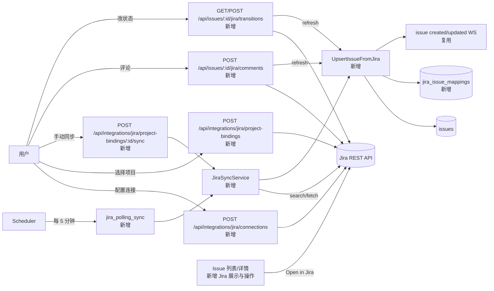

# 数据模型变更

## 新增表：`jira_connections`

```sql
create table jira_connections (
  id uuid primary key,
  workspace_id uuid not null,
  member_id uuid not null,
  site_url text not null,
  auth_type text not null,
  email text,
  encrypted_token text not null,
  jira_account_id text not null,
  jira_display_name text not null,
  jira_email text,
  created_at timestamptz not null,
  updated_at timestamptz not null,
  unique(workspace_id, member_id, site_url)
);
```

说明：`encrypted_token` 必须使用现有 `server/internal/util/secretbox` 加密保存，不返回前端，不写入日志。

## 新增表：`jira_project_bindings`

```sql
create table jira_project_bindings (
  id uuid primary key,
  workspace_id uuid not null,
  connection_id uuid not null references jira_connections(id) on delete cascade,
  project_id text not null,
  project_key text not null,
  project_name text not null,
  sync_enabled boolean not null default true,
  sync_interval_minutes integer not null default 5,
  last_sync_at timestamptz,
  last_successful_sync_at timestamptz,
  last_error text,
  created_at timestamptz not null,
  updated_at timestamptz not null,
  unique(workspace_id, connection_id, project_key)
);

create index idx_jira_project_bindings_due
  on jira_project_bindings(sync_enabled, last_successful_sync_at);
```

说明：第一版固定 `sync_interval_minutes=5`，前端不提供编辑入口，但 scheduler 读取该字段。

## 新增表：`jira_issue_mappings`

```sql
create table jira_issue_mappings (
  id uuid primary key,
  workspace_id uuid not null,
  connection_id uuid not null references jira_connections(id) on delete cascade,
  project_binding_id uuid not null references jira_project_bindings(id) on delete cascade,
  local_issue_id uuid not null references issues(id) on delete cascade,
  jira_issue_id text not null,
  jira_key text not null,
  jira_project_id text,
  jira_project_key text not null,
  jira_status_name text,
  jira_status_category text,
  jira_issue_type text,
  jira_priority_name text,
  jira_updated_at timestamptz,
  last_synced_at timestamptz not null,
  raw_fields jsonb not null default '{}',
  created_at timestamptz not null,
  updated_at timestamptz not null,
  unique(workspace_id, connection_id, jira_issue_id)
);

create index idx_jira_issue_mappings_local_issue
  on jira_issue_mappings(local_issue_id);

create index idx_jira_issue_mappings_binding_updated
  on jira_issue_mappings(project_binding_id, jira_updated_at desc);
```

## 新增表：`jira_sync_runs`

```sql
create table jira_sync_runs (
  id uuid primary key,
  workspace_id uuid not null,
  project_binding_id uuid not null references jira_project_bindings(id) on delete cascade,
  run_type text not null,
  status text not null,
  started_at timestamptz not null,
  finished_at timestamptz,
  issues_seen integer not null default 0,
  issues_created integer not null default 0,
  issues_updated integer not null default 0,
  issues_skipped integer not null default 0,
  error_message text,
  created_at timestamptz not null,
  updated_at timestamptz not null
);

create index idx_jira_sync_runs_binding_started
  on jira_sync_runs(project_binding_id, started_at desc);
```

## 变更表：`issues`

扩展 `origin_type` 约束，新增允许值：

```text
jira
```

保留既有值：

```text
autopilot
quick_create
lark_chat
```

Jira issue 对应的 Multica issue：

```text
origin_type = 'jira'
origin_id = jira_issue_mappings.id
```

# 入口设计

### 【HTTP 接口】`POST /api/integrations/jira/connections`

#### 接口描述

| 项 | 内容 |
| --- | --- |
| 入口类型 | HTTP 接口 |
| 路径 / 标识 | `POST /api/integrations/jira/connections` |
| 触发时机 | 用户在 Settings / Integrations / Jira 页面提交 Jira 站点和认证信息 |
| 既有/新增 | 新增 |
| 实现位置 | `server/internal/handler/jira_integration.go` → `server/internal/service/jira_connection.go` → `server/internal/integrations/jira/` |

职责：绑定当前 Multica member 的 Jira 账号，验证 Jira 凭证，加密保存 token，返回 Jira 用户身份。

#### 请求参数变化

```jsonc
{
  "site_url": "https://company.atlassian.net", // ★ Jira 站点地址
  "auth_type": "cloud_api_token",              // ★ cloud_api_token | pat
  "email": "user@company.com",                 // ★ Cloud API Token 模式需要
  "token": "********"                          // ★ API token / PAT，只传入，不返回
}
```

| 字段 | 位置 | 类型 | 必填 | 说明 |
| --- | --- | --- | --- | --- |
| `site_url` | request | string | 是 | Jira 站点 URL，保存前规范化，去掉末尾 `/` |
| `auth_type` | request | string | 是 | 第一版支持 `cloud_api_token` / `pat` |
| `email` | request | string | 条件必填 | Jira Cloud API Token 模式需要；PAT 模式可为空 |
| `token` | request | string | 是 | 明文 token，仅请求中出现，服务端加密后保存 |

#### 响应参数变化

```jsonc
{
  "connection": {
    "id": "uuid",                              // ★ Jira connection ID
    "workspace_id": "uuid",
    "member_id": "uuid",
    "site_url": "https://company.atlassian.net",
    "auth_type": "cloud_api_token",
    "jira_account_id": "712020:xxxx",
    "jira_display_name": "Alice",
    "jira_email": "user@company.com",
    "created_at": "2026-06-29T10:00:00Z",
    "updated_at": "2026-06-29T10:00:00Z"
  }
}
```

| 字段 | 位置 | 类型 | 数据来源 | 说明 |
| --- | --- | --- | --- | --- |
| `connection.id` | response | uuid | DB | Jira connection ID |
| `connection.member_id` | response | uuid | 当前登录 member | 绑定 Jira 的 Multica member |
| `connection.site_url` | response | string | request 规范化 | 规范化后的 Jira site URL |
| `connection.auth_type` | response | string | request | 认证类型 |
| `connection.jira_account_id` | response | string | Jira myself API | Jira 当前用户稳定 ID |
| `connection.jira_display_name` | response | string | Jira myself API | Jira 当前用户展示名 |
| `connection.jira_email` | response | string nullable | Jira myself API | 可能因权限不可见 |

#### 逻辑变化

**既有逻辑（保留）：**

1. workspace 访问仍沿用现有 workspace membership 校验。
2. API handler 仍通过当前登录用户和 `X-Workspace-ID` 定位 workspace。
3. 敏感凭证不返回给前端。
4. issue 模块已有 `origin_type` 机制，本入口不直接创建 issue。

**新增逻辑：**

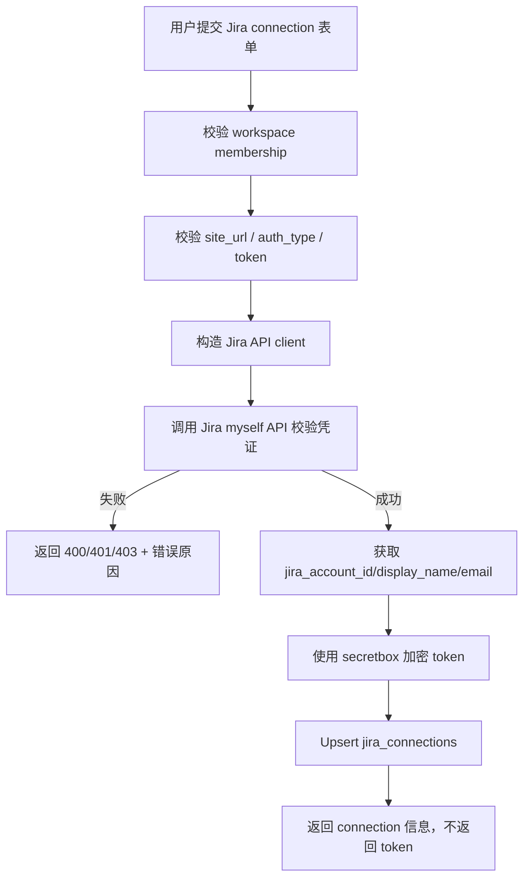

**关键分支：**

| 场景 | 行为 |
| --- | --- |
| `site_url` 为空或非法 | 返回 `400 Bad Request` |
| `auth_type=cloud_api_token` 但 `email` 为空 | 返回 `400 Bad Request` |
| `token` 为空 | 返回 `400 Bad Request` |
| Jira API 校验失败，401/403 | 返回 `401 Unauthorized` 或 `403 Forbidden`，不保存连接 |
| Jira API 超时 | 返回 `502 Bad Gateway` 或项目现有外部服务错误格式 |
| 同一 workspace + member + site_url 已存在 | 更新 token 和 Jira 用户信息 |
| 不同 member 绑定同一 site_url | 允许 |
| 同一 member 绑定多个 site_url | 允许 |
| token 保存后 | 只保存加密值，不返回明文 |

#### 要点

- 复用 `server/internal/util/secretbox` 加密 token；token 不进入 workspace settings、issue metadata、frontend storage、日志。
- Jira client 采用接口抽象，参考 Lark 集成的 `APIClient` 模式。
- 保存前必须调用 Jira `myself` API 校验凭证。
- `site_url` 统一规范化，避免同一站点因末尾 `/` 产生重复连接。
- unique 约束使用 `workspace_id + member_id + site_url`，符合第一版“谁绑定 Jira，就同步谁自己的 issue”的语义。
- 第一版不引入 OAuth，避免不必要复杂度。

需求来源：→ 对话需求：绑定公司 Jira。

---

### 【HTTP 接口】`GET /api/integrations/jira/connections/:connectionID/projects` / `POST /api/integrations/jira/project-bindings`

#### 接口描述

| 项 | 内容 |
| --- | --- |
| 入口类型 | HTTP 接口 |
| 路径 / 标识 | `GET /api/integrations/jira/connections/:connectionID/projects` |
| 路径 / 标识 | `POST /api/integrations/jira/project-bindings` |
| 触发时机 | 用户完成 Jira connection 后，进入项目选择页面，选择要同步的 Jira project |
| 既有/新增 | 新增 |
| 实现位置 | `server/internal/handler/jira_integration.go` → `server/internal/service/jira_project_binding.go` |

职责：读取当前 Jira 账号可访问项目，并创建当前 member 的 project sync binding。

#### 请求参数变化

获取项目列表：

```http
GET /api/integrations/jira/connections/:connectionID/projects
```

创建 project binding：

```jsonc
{
  "connection_id": "uuid",             // ★ Jira connection id
  "project_id": "10001",              // ★ Jira project id
  "project_key": "PAY",               // ★ Jira project key
  "project_name": "Payment Platform",
  "sync_enabled": true                 // ★ 默认 true
}
```

| 字段 | 位置 | 类型 | 必填 | 说明 |
| --- | --- | --- | --- | --- |
| `connectionID` | path | uuid | 是 | Jira connection ID |
| `connection_id` | request | uuid | 是 | 当前 member 的 Jira connection |
| `project_id` | request | string | 是 | Jira project id |
| `project_key` | request | string | 是 | Jira project key，用于后续 JQL |
| `project_name` | request | string | 是 | Jira project 展示名 |
| `sync_enabled` | request | boolean | 否 | 是否启用同步，默认 true |

#### 响应参数变化

项目列表响应：

```jsonc
{
  "projects": [
    {
      "id": "10001",                    // ★ Jira project id
      "key": "PAY",                     // ★ Jira project key
      "name": "Payment Platform",       // ★ Jira project name
      "project_type_key": "software",
      "avatar_url": "https://..."
    }
  ]
}
```

Binding 响应：

```jsonc
{
  "binding": {
    "id": "uuid",
    "workspace_id": "uuid",
    "connection_id": "uuid",
    "project_id": "10001",
    "project_key": "PAY",
    "project_name": "Payment Platform",
    "sync_enabled": true,
    "sync_interval_minutes": 5,
    "last_sync_at": null,
    "last_successful_sync_at": null,
    "last_error": null,
    "created_at": "2026-06-29T10:00:00Z",
    "updated_at": "2026-06-29T10:00:00Z"
  }
}
```

| 字段 | 位置 | 类型 | 数据来源 | 说明 |
| --- | --- | --- | --- | --- |
| `projects[].id` | response | string | Jira projects API | Jira project id |
| `projects[].key` | response | string | Jira projects API | Jira project key |
| `projects[].name` | response | string | Jira projects API | Jira project 展示名 |
| `projects[].project_type_key` | response | string nullable | Jira projects API | Jira project 类型 |
| `projects[].avatar_url` | response | string nullable | Jira projects API | UI 展示用，可为空 |
| `binding.sync_interval_minutes` | response | number | DB default | 第一版固定为 5 |
| `binding.last_sync_at` | response | string nullable | DB | 最近一次同步开始时间 |
| `binding.last_successful_sync_at` | response | string nullable | DB | 最近一次成功同步时间 |
| `binding.last_error` | response | string nullable | DB | 最近一次同步失败信息 |

#### 逻辑变化

**既有逻辑（保留）：**

1. workspace membership 校验仍由现有 handler/middleware 执行。
2. connection 必须属于当前 workspace。
3. connection 必须属于当前 member。
4. Jira token 只在服务端解密后使用，不返回前端。
5. 不影响已有 issue 创建/列表逻辑。

**新增逻辑：获取 projects**

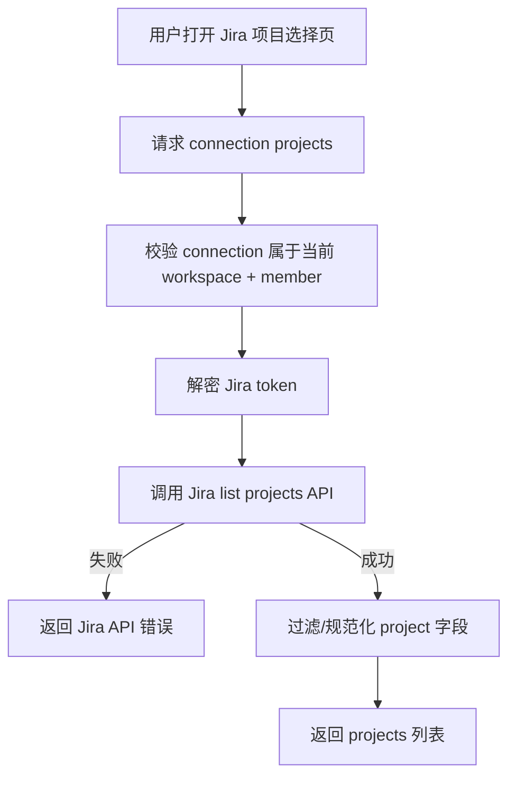

**新增逻辑：创建 binding**

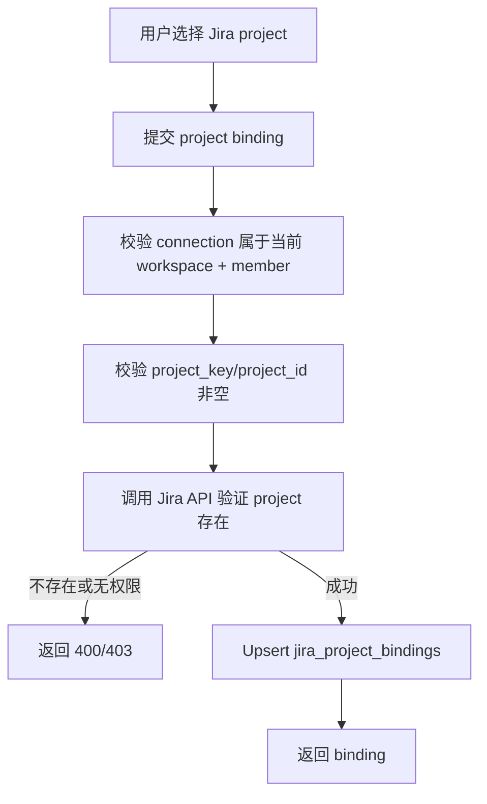

**关键分支：**

| 场景 | 行为 |
| --- | --- |
| connection 不存在 | 返回 `404 Not Found` |
| connection 不属于当前 workspace | 返回 `404 Not Found`，避免泄露 |
| connection 不属于当前 member | 返回 `404 Not Found` |
| Jira token 解密失败 | 返回内部错误，并提示重新绑定 |
| Jira projects API 失败 | 返回 `502 Bad Gateway`，不写 DB |
| Jira project 无权限 | 不返回该 project，或创建 binding 时返回 `403` |
| 同一 connection 重复绑定同一 project | Upsert，更新 `project_name` / `sync_enabled` |
| 用户禁用同步 | `sync_enabled=false`，scheduler 跳过 |
| 保存 binding 成功 | 不在该入口同步；由 Manual Sync Now 入口触发 initial sync |

#### 要点

- project 列表第一版实时从 Jira API 读取，不做缓存。
- binding 只能绑定当前 member 自己的 connection。
- 不开放自定义 JQL；系统固定生成同步查询。
- `project_key` 和 `project_id` 都保存：JQL 使用 key，debug/mapping 使用 id。
- binding 独立表存储，不放 workspace settings JSON。
- 保存 binding 不自动同步，initial sync 复用 Manual Sync Now 入口，保持职责单一。

需求来源：→ 对话需求：按项目同步。

---

### 【定时任务】`jira_polling_sync`

#### 接口描述

| 项 | 内容 |
| --- | --- |
| 入口类型 | 定时任务 |
| 路径 / 标识 | `jira_polling_sync` |
| 触发时机 | scheduler 每轮扫描启用中的 Jira project binding，发现到期后执行同步 |
| 既有/新增 | 新增 |
| 实现位置 | `server/internal/scheduler/jobs_jira.go` → `server/internal/service/jira_sync.go` |

职责：每 5 分钟自动同步到期的 Jira project binding。

#### 请求参数变化

无外部请求参数。

内部 job scope：

```jsonc
{
  "job_name": "jira_polling_sync",          // ★ 新增 job name
  "scope": {
    "kind": "jira_project_binding",         // ★ 每个 binding 一个 scope
    "id": "jira_project_binding_uuid"       // ★ binding id
  }
}
```

| 字段 | 位置 | 类型 | 必填 | 说明 |
| --- | --- | --- | --- | --- |
| `job_name` | scheduler job | string | 是 | 固定为 `jira_polling_sync` |
| `scope.kind` | scheduler scope | string | 是 | 固定为 `jira_project_binding` |
| `scope.id` | scheduler scope | uuid | 是 | `jira_project_bindings.id` |

#### 响应参数变化

无外部响应。

运行结果写入 `jira_sync_runs` 和 `jira_project_bindings.last_*` 字段。

| 字段 | 位置 | 类型 | 数据来源 | 说明 |
| --- | --- | --- | --- | --- |
| `last_sync_at` | `jira_project_bindings` | timestamptz nullable | job | 最近一次同步开始时间 |
| `last_successful_sync_at` | `jira_project_bindings` | timestamptz nullable | job | 最近一次成功同步完成时间 |
| `last_error` | `jira_project_bindings` | text nullable | job | 最近一次失败摘要 |
| `jira_sync_runs.status` | `jira_sync_runs` | string | job | `running` / `success` / `failed` |
| `jira_sync_runs.issues_seen` | `jira_sync_runs` | int | job | Jira 返回的 issue 数 |
| `jira_sync_runs.issues_created` | `jira_sync_runs` | int | mirror service | 新建 Multica issue 数 |
| `jira_sync_runs.issues_updated` | `jira_sync_runs` | int | mirror service | 更新 Multica issue 数 |
| `jira_sync_runs.error_message` | `jira_sync_runs` | text nullable | job | 失败原因摘要，不含 token |

#### 逻辑变化

**既有逻辑（保留）：**

1. 现有 issue 创建仍通过 `IssueService.Create`。
2. 现有 issue 更新仍走已有 DB query / service 逻辑。
3. 现有 WebSocket / React Query 缓存更新机制继续复用。
4. scheduler 已有 lease / heartbeat / stale 处理机制继续保留。
5. workspace 隔离仍以 `workspace_id` 为边界。

**新增逻辑：**

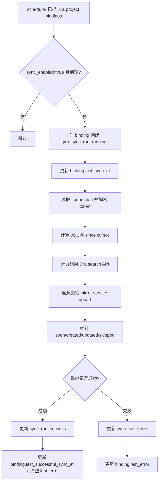

**JQL 分支：**

| 场景 | JQL | 行为 |
| --- | --- | --- |
| initial sync，`last_successful_sync_at=null` | `project = <project_key> AND assignee = currentUser() AND statusCategory != Done ORDER BY updated ASC` | 只导入当前分配给我的未完成 issue |
| delta sync，`last_successful_sync_at!=null` | `project = <project_key> AND assignee = currentUser() AND updated >= "<last_successful_sync_at - 5m>" ORDER BY updated ASC` | 不过滤 Done，以捕获已同步 issue 被完成的状态变化 |

**关键分支：**

| 场景 | 行为 |
| --- | --- |
| `sync_enabled=false` | scheduler 不生成该 binding 的 sync plan |
| Jira 返回 Done 且无 mapping | 跳过，不创建本地 issue |
| Jira 返回 Done 且已有 mapping | 更新本地 issue 状态为 `done` |
| Jira token 失效 | 本轮失败，记录 `last_error`，不禁用 binding |
| Jira rate limit | 短重试一次；仍失败则本轮 failed，记录 `last_error` |
| 单个 issue upsert 失败 | 整轮失败，不推进 `last_successful_sync_at` |
| 多页同步中途失败 | 整轮失败，不推进 `last_successful_sync_at` |
| 重复拉取同一 Jira issue | 通过 mapping 幂等更新，不重复创建 |

#### 要点

- 每个 project binding 是独立 scheduler scope，复用现有 scheduler lease 能力。
- sync 主逻辑放 `JiraSyncService`，scheduled job 和 Manual Sync Now 共用。
- delta sync 不过滤 Done，这是避免漏掉完成状态的关键。
- 使用 `last_successful_sync_at - 5 minutes` overlap window，允许重复拉取，靠 mapping 幂等处理。
- 单个 issue 失败时不要推进 cursor，优先保证不漏数据。
- `last_error` 和 sync run error 不允许包含 token、Authorization header、完整 request body。

需求来源：→ 对话需求：5 分钟轮询同步。

---

### 【内部服务入口】`JiraSyncService.UpsertIssueFromJira`

#### 接口描述

| 项 | 内容 |
| --- | --- |
| 入口类型 | 内部服务入口 |
| 路径 / 标识 | `JiraSyncService.UpsertIssueFromJira` |
| 触发时机 | 定时同步、Manual Sync Now、Jira 写操作成功后的 refresh |
| 既有/新增 | 新增 |
| 实现位置 | `server/internal/service/jira_sync.go`，依赖 `server/internal/service/issue.go` |

职责：把 Jira API 返回的 issue 转换为 Multica issue，并维护 Jira issue 与 Multica issue 的映射关系。

#### 请求参数变化

内部服务输入：

```jsonc
{
  "workspace_id": "uuid",              // ★ 当前 workspace
  "connection_id": "uuid",             // ★ Jira connection
  "project_binding_id": "uuid",        // ★ Jira project binding
  "member_id": "uuid",                 // ★ 绑定 Jira 的 Multica member
  "jira_issue": {
    "id": "10042",                     // ★ Jira 稳定 issue id
    "key": "PAY-1283",                 // ★ Jira issue key
    "self": "https://.../rest/api/3/issue/10042",
    "fields": {
      "summary": "Fix payment callback retry",
      "description": {},               // ★ Jira Cloud 可能是 ADF
      "status": {
        "name": "In Progress",
        "statusCategory": {
          "key": "indeterminate",
          "name": "In Progress"
        }
      },
      "priority": {
        "name": "High"
      },
      "issuetype": {
        "name": "Bug"
      },
      "project": {
        "id": "10001",
        "key": "PAY",
        "name": "Payment Platform"
      },
      "updated": "2026-06-29T10:00:00.000+0800"
    }
  }
}
```

| 字段 | 位置 | 类型 | 必填 | 说明 |
| --- | --- | --- | --- | --- |
| `workspace_id` | service input | uuid | 是 | 当前 workspace |
| `connection_id` | service input | uuid | 是 | Jira connection ID |
| `project_binding_id` | service input | uuid | 是 | Jira project binding ID |
| `member_id` | service input | uuid | 是 | 绑定 Jira 的 Multica member |
| `jira_issue.id` | service input | string | 是 | Jira 稳定 issue id，用于幂等匹配 |
| `jira_issue.key` | service input | string | 是 | Jira issue key，用于 UI 展示 |
| `fields.summary` | Jira payload | string | 是 | 映射到 Multica `issues.title` |
| `fields.description` | Jira payload | object/string/null | 否 | 转换后映射到 Multica `issues.description` |
| `fields.status` | Jira payload | object | 是 | 映射到 Multica `issues.status`，原始值进入 metadata/mapping |
| `fields.priority` | Jira payload | object nullable | 否 | 映射到 Multica `issues.priority` |
| `fields.issuetype` | Jira payload | object nullable | 否 | 存入 metadata/mapping 展示字段 |
| `fields.updated` | Jira payload | datetime | 是 | 存入 `jira_issue_mappings.jira_updated_at` |

#### 响应参数变化

内部服务输出：

```jsonc
{
  "local_issue_id": "uuid",
  "mapping_id": "uuid",
  "action": "created",       // ★ created | updated | skipped
  "jira_key": "PAY-1283",
  "jira_updated_at": "2026-06-29T10:00:00Z"
}
```

| 字段 | 位置 | 类型 | 数据来源 | 说明 |
| --- | --- | --- | --- | --- |
| `local_issue_id` | service output | uuid | DB | Multica issue ID |
| `mapping_id` | service output | uuid | DB | Jira mapping ID |
| `action` | service output | string | service | `created` / `updated` / `skipped` |
| `jira_key` | service output | string | Jira payload | Jira issue key |
| `jira_updated_at` | service output | datetime | Jira payload | Jira updated time |

#### 逻辑变化

**既有逻辑（保留）：**

1. 本地用户创建 issue 的流程不变。
2. `IssueService.Create` 仍是新建 issue 的统一入口。
3. 现有 `origin_type` 机制继续使用。
4. 现有 issue number / identifier 机制继续使用。
5. 已同步 Jira issue 仍然拥有 Multica 自己的 `MUL-123` identifier。
6. 前端列表/详情继续消费现有 issue API。
7. WebSocket issue created/updated 事件继续沿用现有机制。

**新增逻辑：**

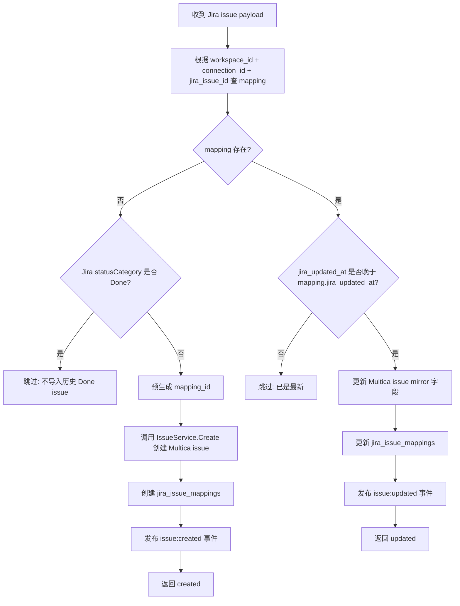

**字段映射：**

| Multica issue 字段 | 来源 | 创建时 | 更新时 |
| --- | --- | --- | --- |
| `workspace_id` | 当前 workspace | 写入 | 不变 |
| `title` | Jira `fields.summary` | 写入 | 更新 |
| `description` | Jira description 转换文本 | 写入 | 更新 |
| `status` | Jira statusCategory 映射 | 写入 | 更新 |
| `priority` | Jira priority 映射 | 写入 | 更新 |
| `assignee_type` | 固定 `member` | 写入 | 不覆盖 |
| `assignee_id` | `jira_connections.member_id` | 写入 | 不覆盖 |
| `creator_type` | 固定 `member` | 写入 | 不变 |
| `creator_id` | `jira_connections.member_id` | 写入 | 不变 |
| `origin_type` | 固定 `jira` | 写入 | 不变 |
| `origin_id` | `jira_issue_mappings.id` | 写入 | 不变 |
| `metadata.jiraKey` | Jira `key` | 写入 | 更新 |
| `metadata.jiraUrl` | `${site_url}/browse/${jira_key}` | 写入 | 更新 |
| `metadata.jiraStatusName` | Jira status name | 写入 | 更新 |
| `metadata.jiraStatusCategory` | Jira status category | 写入 | 更新 |
| `metadata.jiraIssueType` | Jira issue type | 写入 | 更新 |
| `metadata.jiraProjectKey` | Jira project key | 写入 | 更新 |

**关键分支：**

| 场景 | 行为 |
| --- | --- |
| Jira issue 无 `id` | 当前 issue 处理失败，整轮 sync 失败 |
| Jira issue 无 `key` | 当前 issue 处理失败，整轮 sync 失败 |
| Jira issue 无 `summary` | 当前 issue 处理失败，避免脏数据 |
| Jira description 转换失败 | description 置空，记录 metadata 标记 |
| Jira status 未知 | 映射为 `in_progress`，保留 raw status |
| Jira priority 未知 | 映射为 `none`，保留 raw priority |
| 无 mapping + Done | skip |
| 无 mapping + 非 Done | create |
| 有 mapping + Jira 未变化 | skip |
| 有 mapping + Jira 变化 | update mirror fields |
| 本地 issue 被用户删除但 mapping 仍存在 | 当前 issue 处理失败，记录 sync error |
| issue 已被本地重新分配给 agent | 更新时不覆盖 assignee |
| issue 已有本地 labels/stage/position | 更新时不覆盖 |

#### 要点

- Upsert 必须以 `workspace_id + connection_id + jira_issue_id` 幂等。
- 新建本地 issue 仍走 `IssueService.Create`，不要绕过现有 issue number、position、event broadcast 等逻辑。
- Jira 同步创建 issue 不应触发 agent 自动执行；如现有 `IssueService.Create` 会因 assignee/status 入队，需要增加明确参数或调用策略，例如 `source=jira_sync` / `enqueue_agent_task=false`。
- `origin_id` 使用预生成的 mapping UUID，不直接存 Jira key。
- 更新时只覆盖 Jira-controlled mirror 字段，不覆盖 Multica-controlled 协作字段。
- status 第一版使用 Jira `statusCategory` 映射，不做配置化。
- description 第一版优先保存可读文本，不追求富文本保真。

需求来源：→ 对话需求：Jira issue 与本地自建 issue 结合。

---

### 【HTTP 接口】`POST /api/integrations/jira/project-bindings/:bindingID/sync`

#### 接口描述

| 项 | 内容 |
| --- | --- |
| 入口类型 | HTTP 接口 |
| 路径 / 标识 | `POST /api/integrations/jira/project-bindings/:bindingID/sync` |
| 触发时机 | 用户在 Jira Settings 页面点击 `Sync now`，或创建 binding 后前端立即触发 initial sync |
| 既有/新增 | 新增 |
| 实现位置 | `server/internal/handler/jira_integration.go` → `server/internal/service/jira_sync.go` |

职责：手动触发某个 project binding 同步一次，复用定时任务的同步逻辑。

#### 请求参数变化

```http
POST /api/integrations/jira/project-bindings/:bindingID/sync
```

请求 body 可为空。

| 字段 | 位置 | 类型 | 必填 | 说明 |
| --- | --- | --- | --- | --- |
| `bindingID` | path | uuid | 是 | Jira project binding ID |

#### 响应参数变化

第一版建议同步接口同步执行到完成后返回结果。若后续发现同步耗时过长，再改为异步 run 状态查询。

```jsonc
{
  "sync_run": {
    "id": "uuid",                         // ★ sync run ID
    "project_binding_id": "uuid",
    "run_type": "manual",
    "status": "success",
    "started_at": "2026-06-29T10:00:00Z",
    "finished_at": "2026-06-29T10:00:08Z",
    "issues_seen": 12,
    "issues_created": 2,
    "issues_updated": 10,
    "issues_skipped": 0,
    "error_message": null
  }
}
```

| 字段 | 位置 | 类型 | 数据来源 | 说明 |
| --- | --- | --- | --- | --- |
| `sync_run.id` | response | uuid | DB | 本次同步运行 ID |
| `sync_run.run_type` | response | string | service | 固定为 `manual` |
| `sync_run.status` | response | string | service | `success` / `failed` |
| `sync_run.issues_seen` | response | number | service | Jira 返回 issue 数 |
| `sync_run.issues_created` | response | number | mirror service | 新建本地 issue 数 |
| `sync_run.issues_updated` | response | number | mirror service | 更新本地 issue 数 |
| `sync_run.issues_skipped` | response | number | mirror service | 跳过数 |
| `sync_run.error_message` | response | string nullable | service | 失败原因摘要 |

#### 逻辑变化

**既有逻辑（保留）：**

1. 定时任务仍按 5 分钟自动执行。
2. workspace/member 权限校验继续沿用现有模式。
3. 同步主逻辑与 scheduled job 共用，不复制实现。

**新增逻辑：**

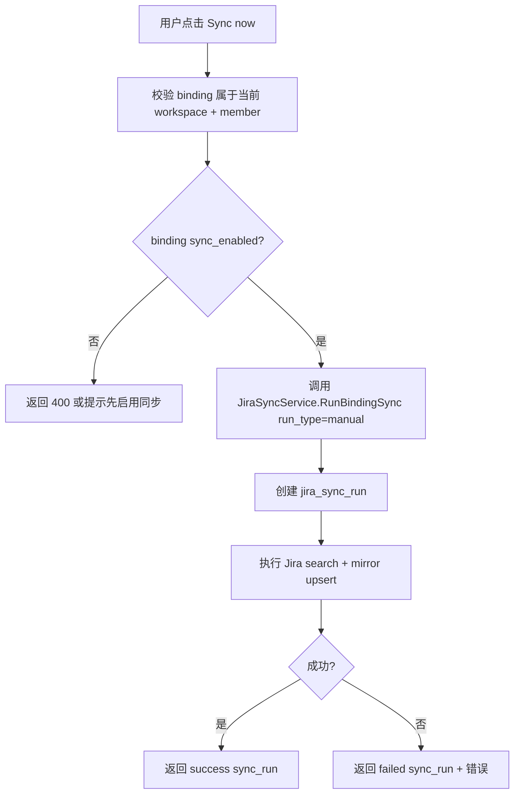

**关键分支：**

| 场景 | 行为 |
| --- | --- |
| binding 不存在或不属于当前用户 | 返回 `404 Not Found` |
| binding 被禁用 | 返回 `400 Bad Request`，提示启用同步 |
| 另一个 sync run 正在执行 | 返回 `409 Conflict` 或复用现有 scheduler lease 机制拒绝并发 |
| Jira API 失败 | 返回失败的 sync_run，记录 `last_error` |
| 部分 issue upsert 失败 | 整轮失败，不推进 cursor |
| 同步成功 | 更新 `last_successful_sync_at`，清空 `last_error` |

#### 要点

- Manual Sync Now 必须复用 scheduled sync service，不要单独实现 JQL/upsert。
- 并发同步必须避免：同一个 binding 同时只允许一个 run。
- 如果项目 issue 数较多，同步执行时间可能较长；第一版可同步返回，后续再改异步。
- 前端在创建 binding 后可立即调用该入口完成 initial sync。

需求来源：→ 对话需求：无 webhook 下的手动刷新能力。

---

### 【HTTP 接口】`POST /api/issues/:issueID/jira/comments`

#### 接口描述

| 项 | 内容 |
| --- | --- |
| 入口类型 | HTTP 接口 |
| 路径 / 标识 | `POST /api/issues/:issueID/jira/comments` |
| 触发时机 | 用户在 Jira-synced issue 详情里提交评论 |
| 既有/新增 | 新增 |
| 实现位置 | `server/internal/handler/jira_action.go` → `server/internal/service/jira_action.go` |

职责：在 Multica 中评论 Jira issue，但实际写入 Jira。Jira 成功后 refresh issue/comments 并更新本地 mirror/timeline。

#### 请求参数变化

```jsonc
{
  "body": "I will ask an agent to investigate this." // ★ 评论正文
}
```

| 字段 | 位置 | 类型 | 必填 | 说明 |
| --- | --- | --- | --- | --- |
| `issueID` | path | uuid/string | 是 | Multica issue ID 或现有 issue path identifier |
| `body` | request | string | 是 | Jira comment 正文 |

#### 响应参数变化

```jsonc
{
  "comment": {
    "jira_comment_id": "10015",          // ★ Jira comment id
    "body": "I will ask an agent to investigate this.",
    "created_at": "2026-06-29T10:00:00Z",
    "author_display_name": "Alice"
  },
  "issue": {
    "id": "uuid",                        // ★ refresh 后的 Multica issue
    "metadata": {
      "jiraKey": "PAY-1283"
    }
  }
}
```

| 字段 | 位置 | 类型 | 数据来源 | 说明 |
| --- | --- | --- | --- | --- |
| `comment.jira_comment_id` | response | string | Jira Add Comment API | Jira comment id |
| `comment.body` | response | string | Jira API | Jira 返回的评论正文或原始正文 |
| `comment.created_at` | response | datetime | Jira API | Jira comment 创建时间 |
| `comment.author_display_name` | response | string | Jira API | Jira 评论作者 |
| `issue` | response | Issue | mirror service | Jira refresh 后的本地 issue |

#### 逻辑变化

**既有逻辑（保留）：**

1. 本地 Multica comment 流程不变。
2. 非 Jira issue 不出现 Jira comment action。
3. issue 访问仍通过现有 workspace/member 权限校验。

**新增逻辑：**

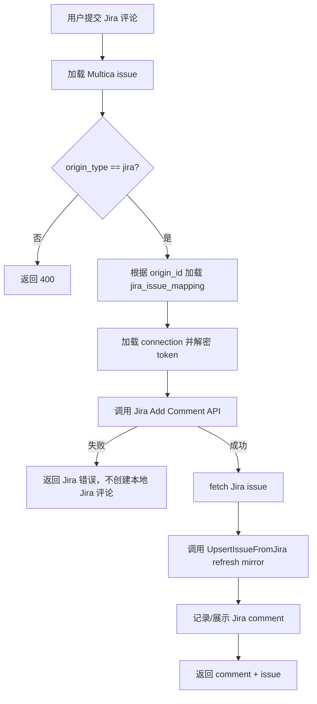

**关键分支：**

| 场景 | 行为 |
| --- | --- |
| issue 不是 Jira-synced issue | 返回 `400 Bad Request` |
| mapping 不存在 | 返回 `404` 或数据异常错误 |
| comment body 为空 | 返回 `400 Bad Request` |
| Jira 无评论权限 | 返回 `403 Forbidden`，不创建本地评论 |
| Jira API 失败 | 返回错误，不创建本地 Jira 评论 |
| Jira 成功但 refresh 失败 | 评论已在 Jira 创建，返回部分成功错误并提示刷新 |

#### 要点

- Jira comment 是 write-through：Jira 成功才算成功。
- 不要先写本地 comment 再异步写 Jira，避免不一致。
- 第一版不做完整 Jira comment 历史同步；只保证从 Multica 发出的评论进入 Jira。
- 如果现有 timeline 要展示 Jira comment，可记录一个本地 comment/activity，metadata 标记 `source=jira`、`jiraCommentId`。该记录必须在 Jira Add Comment 成功后创建。
- 评论失败错误要可读，但不能泄露 token 或完整 upstream response。

需求来源：→ 对话需求：可以评论。

---

### 【HTTP 接口】`GET /api/issues/:issueID/jira/transitions` / `POST /api/issues/:issueID/jira/transitions`

#### 接口描述

| 项 | 内容 |
| --- | --- |
| 入口类型 | HTTP 接口 |
| 路径 / 标识 | `GET /api/issues/:issueID/jira/transitions` |
| 路径 / 标识 | `POST /api/issues/:issueID/jira/transitions` |
| 触发时机 | 用户在 Jira-synced issue 详情里打开状态菜单并选择 Jira transition |
| 既有/新增 | 新增 |
| 实现位置 | `server/internal/handler/jira_action.go` → `server/internal/service/jira_action.go` |

职责：读取当前 Jira issue 可用 transitions，并通过 Jira Transition Issue API 修改 Jira 状态。成功后 refresh Jira issue 并更新 Multica mirror。

#### 请求参数变化

获取 transitions：

```http
GET /api/issues/:issueID/jira/transitions
```

执行 transition：

```jsonc
{
  "transition_id": "31" // ★ Jira transition id
}
```

| 字段 | 位置 | 类型 | 必填 | 说明 |
| --- | --- | --- | --- | --- |
| `issueID` | path | uuid/string | 是 | Multica issue ID 或现有 issue path identifier |
| `transition_id` | request | string | 是 | Jira transition id |

#### 响应参数变化

Transitions 响应：

```jsonc
{
  "transitions": [
    {
      "id": "31",                      // ★ Jira transition id
      "name": "Done",                  // ★ transition name
      "to_status_name": "Done",
      "to_status_category": "done"
    }
  ]
}
```

执行 transition 响应：

```jsonc
{
  "issue": {
    "id": "uuid",                      // ★ refresh 后的 Multica issue
    "status": "done",
    "metadata": {
      "jiraKey": "PAY-1283",
      "jiraStatusName": "Done"
    }
  }
}
```

| 字段 | 位置 | 类型 | 数据来源 | 说明 |
| --- | --- | --- | --- | --- |
| `transitions[].id` | response | string | Jira transitions API | Jira transition id |
| `transitions[].name` | response | string | Jira transitions API | transition 展示名 |
| `transitions[].to_status_name` | response | string | Jira transitions API | 目标 Jira status name |
| `transitions[].to_status_category` | response | string | Jira transitions API | 目标 Jira status category |
| `issue` | response | Issue | mirror service | transition 后 refresh 的本地 issue |

#### 逻辑变化

**既有逻辑（保留）：**

1. 非 Jira issue 的本地 status 更新流程不变。
2. Jira issue 的 Multica-only 字段仍可按现有逻辑更新。
3. issue 访问权限仍沿用现有 workspace/member 校验。

**新增逻辑：获取 transitions**

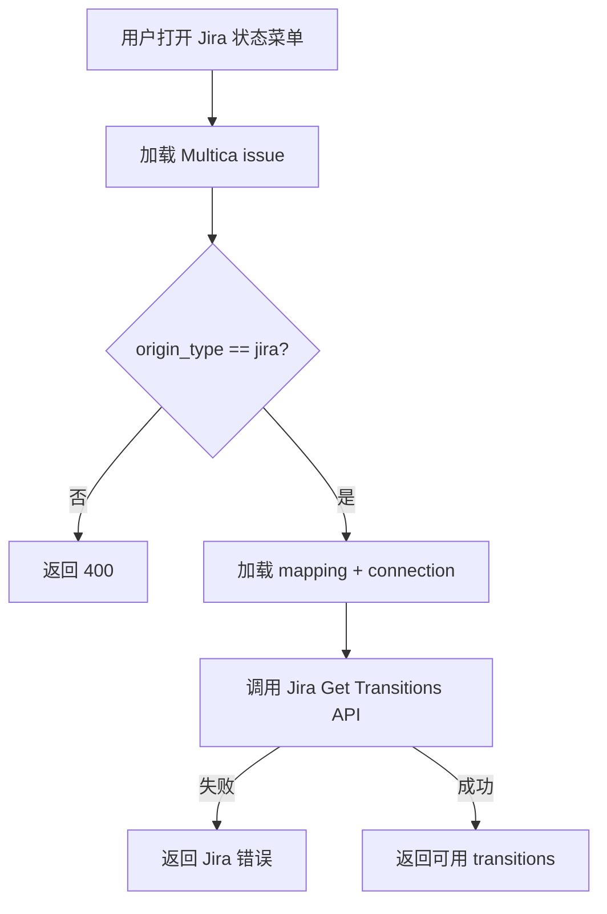

**新增逻辑：执行 transition**

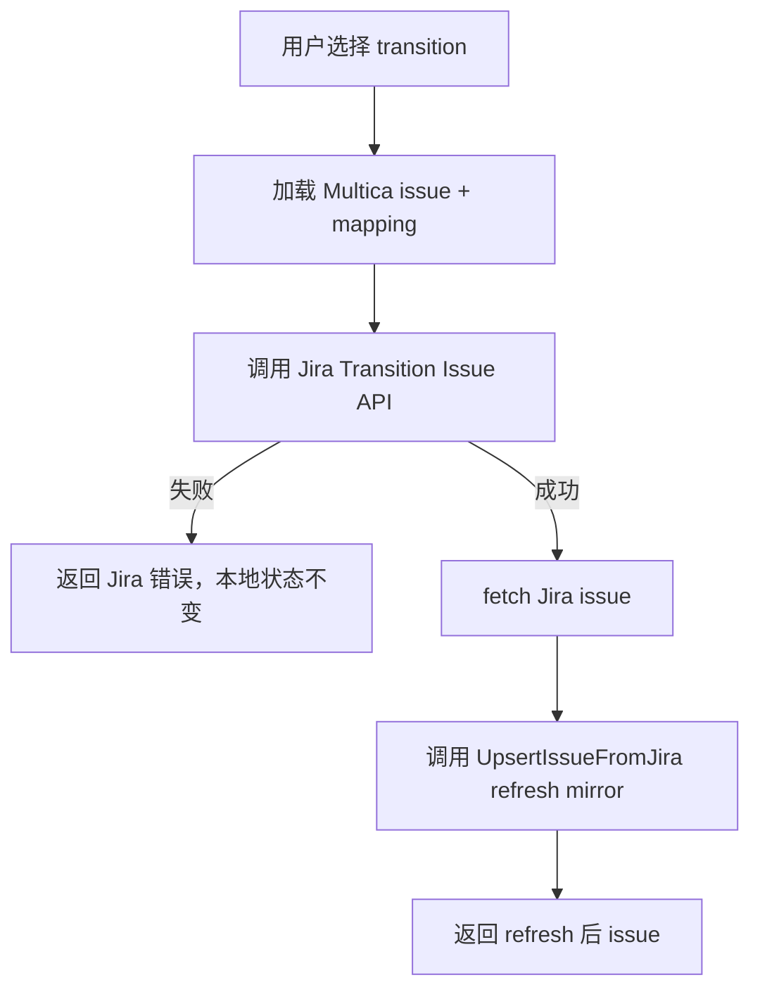

**关键分支：**

| 场景 | 行为 |
| --- | --- |
| issue 不是 Jira-synced issue | 返回 `400 Bad Request` |
| Jira 没有可用 transitions | 返回空列表，前端置灰状态操作 |
| transition_id 无效 | Jira 返回错误，透传为用户可读错误 |
| Jira 无 transition 权限 | 返回 `403 Forbidden` |
| Jira transition 成功但 refresh 失败 | 状态已在 Jira 修改，返回部分成功错误并提示刷新 |
| transition 后 Jira issue Done | 本地 issue 更新为 `done`，保留本地记录 |

#### 要点

- 状态选择不使用 Multica 固定状态枚举作为输入，必须使用 Jira transitions API 返回的 transition id。
- 不展示 Jira API 当前不允许的状态。
- transition 成功后必须 fetch Jira issue 再 mirror，不要根据目标状态本地猜测。
- Jira 是状态事实源；本地失败不能伪造成功状态。

需求来源：→ 对话需求：可以改状态，如果 Jira API 没能力就不能改。

---

### 【前端页面】Settings / Integrations / Jira

#### 接口描述

| 项 | 内容 |
| --- | --- |
| 入口类型 | 前端页面 |
| 路径 / 标识 | Settings / Integrations / Jira |
| 触发时机 | 用户配置 Jira 连接、选择项目、查看同步状态、点击 Sync Now |
| 既有/新增 | 新增 |
| 实现位置 | `packages/views/` 中新增 shared settings view；平台路由在 web/desktop 各自接入 |

职责：提供 Jira 连接配置、项目绑定、同步状态展示和手动同步入口。

#### 请求参数变化

前端调用入口 1、2、5 的 API，无额外协议。

#### 响应参数变化

前端展示以下字段：

| 字段 | 位置 | 类型 | 数据来源 | 说明 |
| --- | --- | --- | --- | --- |
| `connection.site_url` | UI | string | connection API | Jira 站点 |
| `connection.jira_display_name` | UI | string | connection API | 已绑定 Jira 用户 |
| `binding.project_key` | UI | string | binding API | 同步项目 key |
| `binding.project_name` | UI | string | binding API | 同步项目名 |
| `binding.sync_enabled` | UI | boolean | binding API | 是否启用 |
| `binding.last_successful_sync_at` | UI | datetime nullable | binding API | 最近成功同步时间 |
| `binding.last_error` | UI | string nullable | binding API | 最近错误 |
| `sync_run.issues_created/updated/skipped` | UI | number | Sync Now API | 手动同步结果 |

#### 逻辑变化

**既有逻辑（保留）：**

1. web/desktop shared view 仍遵守 `packages/views` 不依赖 `next/*` / `react-router-dom`。
2. server state 使用 React Query。
3. workspace context 通过已有 provider/props 传入。

**新增逻辑：**

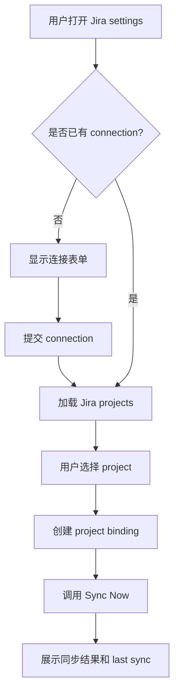

**关键分支：**

| 场景 | 行为 |
| --- | --- |
| 未配置 Jira | 显示 connection 表单 |
| token 校验失败 | 表单展示错误，不保存 |
| project 加载失败 | 显示重试按钮 |
| binding 已存在 | 显示已绑定项目和同步状态 |
| Sync Now 失败 | 显示 `last_error` 和重试入口 |
| sync_enabled=false | 显示禁用状态，不自动同步 |

#### 要点

- UI 不展示 token 明文。
- 第一版不提供 sync interval 编辑；固定展示“每 5 分钟同步”。
- 创建 binding 后前端调用 Sync Now 完成 initial sync。
- Settings 页面放在 shared views，平台路由分别接入 web/desktop。
- API 响应在 `packages/core/api/schemas.ts` 增加 zod schema，遵守项目 API compatibility 规则。

需求来源：→ 对话需求：配置 Jira 同步。

---

### 【前端 issue 列表/详情】Jira source badge + Jira actions

#### 接口描述

| 项 | 内容 |
| --- | --- |
| 入口类型 | 前端页面/组件 |
| 路径 / 标识 | issue board/list/detail components |
| 触发时机 | 用户浏览 issue 列表或打开 Jira-synced issue 详情 |
| 既有/新增 | 既有组件扩展 |
| 实现位置 | `packages/views/issues/components/`、`packages/views/issues/actions/`、`packages/core/types/issue.ts` |

职责：让 Jira issue 与自建 issue 共存展示，并为 Jira issue 提供 Open in Jira、Comment、Change Status 操作。

#### 请求参数变化

前端调用入口 6、7，无额外请求协议。

#### 响应参数变化

Issue API 现有 `metadata` 需要约定 Jira 展示字段：

```jsonc
{
  "metadata": {
    "source": "jira",                                      // ★ Jira issue source
    "jiraKey": "PAY-1283",                                // ★ Jira key
    "jiraUrl": "https://company.atlassian.net/browse/PAY-1283", // ★ Jira 原链接
    "jiraProjectKey": "PAY",                              // ★ Jira project key
    "jiraStatusName": "In Progress",                      // ★ 原始 Jira status
    "jiraStatusCategory": "indeterminate",                // ★ Jira status category
    "jiraIssueType": "Bug",                               // ★ Jira issue type
    "jiraPriorityName": "High"                             // ★ 原始 Jira priority
  }
}
```

| 字段 | 位置 | 类型 | 数据来源 | 说明 |
| --- | --- | --- | --- | --- |
| `metadata.source` | Issue metadata | string | mirror service | 固定 `jira` |
| `metadata.jiraKey` | Issue metadata | string | Jira payload | Jira issue key |
| `metadata.jiraUrl` | Issue metadata | string | service 拼接 | Open in Jira 链接 |
| `metadata.jiraProjectKey` | Issue metadata | string | Jira payload | Jira project key |
| `metadata.jiraStatusName` | Issue metadata | string | Jira payload | Jira 原始状态名 |
| `metadata.jiraStatusCategory` | Issue metadata | string | Jira payload | Jira status category |
| `metadata.jiraIssueType` | Issue metadata | string | Jira payload | Jira issue type |
| `metadata.jiraPriorityName` | Issue metadata | string | Jira payload | Jira 原始 priority |

#### 逻辑变化

**既有逻辑（保留）：**

1. 本地 issue 卡片、列表、详情展示不变。
2. 本地 issue 的创建、编辑、状态更新操作不变。
3. issue identifier 仍显示 Multica 自己的 `MUL-123`。
4. Jira-synced issue 仍可被分配给 agent/squad/member。

**新增逻辑：**

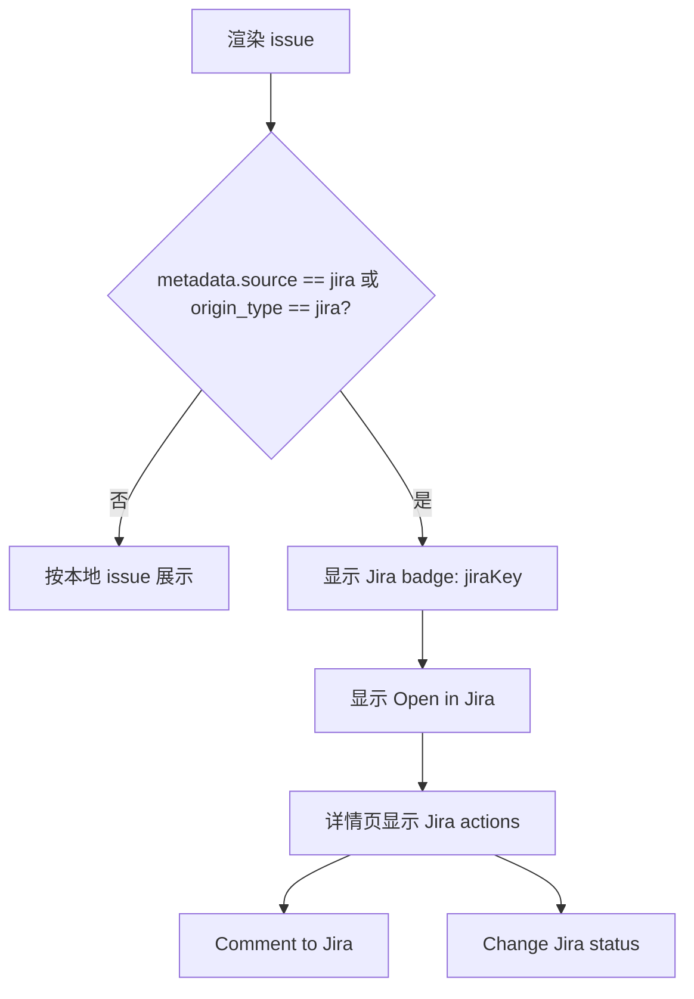

**关键分支：**

| 场景 | 行为 |
| --- | --- |
| 本地 issue | 不显示 Jira badge/actions |
| Jira issue 缺少 `jiraUrl` | 隐藏 Open in Jira，显示 source badge |
| Jira transitions 为空 | Change Status 置灰或提示无可用状态 |
| Jira comment 失败 | 展示错误，不插入乐观评论 |
| Jira transition 成功 | 使用返回 issue 更新 React Query 缓存 |
| 用户将 Jira issue 分配给 agent | 允许，后续 sync 不覆盖 assignee |

#### 要点

- 列表建议显示 `MUL-456 · Jira PAY-1283`，避免 Multica identifier 与 Jira key 混淆。
- 标题/描述/优先级第一版不提供编辑入口，避免用户以为本地编辑会同步到 Jira。
- Comment/Change Status 必须调用 Jira action API，不能走本地 comment/status mutation。
- 新增 API response schema 使用 `parseWithFallback` + zod，避免 desktop response drift 问题。
- `packages/views` 不直接使用 Next.js/router API，Open in Jira 用普通外链或通过平台 adapter 注入。

需求来源：→ 对话需求：Jira issue 与自建 issue 共同展示。

---

### 【实时/缓存入口】issue WebSocket / React Query cache update

#### 接口描述

| 项 | 内容 |
| --- | --- |
| 入口类型 | 事件监听 / 前端缓存更新 |
| 路径 / 标识 | existing issue created/updated WebSocket events |
| 触发时机 | Jira sync 创建/更新 Multica issue 后，后端发布 issue event，前端更新 React Query cache |
| 既有/新增 | 既有机制复用，必要时扩展 metadata schema |
| 实现位置 | `packages/core/issues/ws-updaters.ts`、`server/internal/service/issue.go`、realtime hub |

职责：Jira sync 后让 issue 列表/详情实时刷新，不新增 Jira-specific WebSocket channel。

#### 请求参数变化

无请求参数变化。

#### 响应参数变化

复用现有 issue WS payload。新增 Jira 展示字段通过 issue `metadata` 体现。

| 字段 | 位置 | 类型 | 数据来源 | 说明 |
| --- | --- | --- | --- | --- |
| `metadata.jira*` | issue payload | object fields | mirror service | 前端展示 Jira badge/actions |

#### 逻辑变化

**既有逻辑（保留）：**

1. WebSocket events invalidate or patch Query cache，不写 Zustand server state。
2. React Query 继续拥有 issues server state。
3. workspace-scoped query keys 继续包含 `wsId`。

**新增逻辑：**

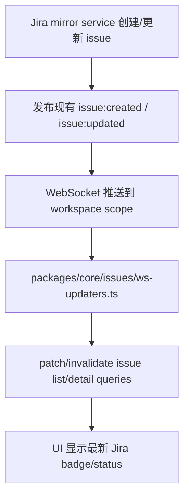

**关键分支：**

| 场景 | 行为 |
| --- | --- |
| Jira sync 创建 issue | 复用 `issue:created` 更新列表缓存 |
| Jira sync 更新 issue | 复用 `issue:updated` 更新列表/详情缓存 |
| 当前前端不在对应 workspace | 不更新 |
| metadata schema 缺少 Jira 字段 | UI 降级为普通 issue 展示 |

#### 要点

- 不新增 Jira-specific WS 事件，减少前后端复杂度。
- WS payload 中的 Jira 信息通过现有 Issue metadata 承载。
- Zustand 不存 Jira issue server data。
- 后端发布事件时应保证 payload 走现有 issue serialization/schema。

需求来源：→ 项目现状：已有 issue WS updaters。

# 兼容性与降级

- **现有 issue 兼容**：本地创建 issue 不变；`origin_type` 为空或非 `jira` 时 UI 不显示 Jira actions。
- **API 兼容**：前端新增 Jira API response schema，使用 `parseWithFallback`；下游 UI 对 `metadata.jira*` optional-chain。
- **无 Webhook 降级**：同步依赖 5 分钟 polling + Manual Sync Now；Jira 到 Multica 是分钟级最终一致。
- **Jira API 失败**：记录 `last_error` / `jira_sync_runs.error_message`；不推进 cursor；不禁用 binding。
- **Rate limit**：短重试一次，仍失败则本轮 failed，下一轮继续。
- **Done issue**：initial sync 不导入历史 Done；delta sync 捕获已同步 issue 变 Done，并更新本地为 done，不自动删除。
- **不再匹配同步条件**：不自动删除本地 issue，避免因权限/assignee/project 变化误删。
- **Token 失效**：Settings 显示 last_error，用户重新保存 connection token。
- **Description 转换失败**：description 置空或保留纯文本可读部分，metadata 标记不支持，不让非关键富文本转换阻断整条同步。

# 附录 A：历史方案参考

- RAG 服务不可用，未搜索历史方案。
- 本方案基于当前代码探索结果：现有 issue 模块、Lark/Slack integration、scheduler、secretbox、realtime hub、React Query issue updaters。

# 附录 B：设计决策记录

#### 决策 1：不用 Jira Webhook，使用 polling-only

- **背景**：用户 IP 不固定，不适合提供稳定公网 webhook endpoint。
- **方案对比**：

| 方案 | 优势 | 劣势 |
| --- | --- | --- |
| Jira Webhook + polling | 实时性好 | 需要公网入口、HTTPS、稳定地址，仍需补偿 polling |
| Polling only | 适合自托管/内网/动态 IP，实现简单 | 分钟级最终一致，不是秒级实时 |

- **选择**：Polling only，每 5 分钟同步一次，并提供 Manual Sync Now。
- **需求追溯**：→ 用户确认“不需要 jira webhook，因为 IP 不固定”。

#### 决策 2：Jira 是事实源，Multica 使用 write-through action

- **背景**：用户希望可以评论、改状态，但能力由 Jira API 决定。
- **方案对比**：

| 方案 | 优势 | 劣势 |
| --- | --- | --- |
| 本地修改后异步同步 Jira | UI 响应快 | 冲突复杂，Jira 失败时不一致 |
| Write-through Jira API | Jira 始终权威，权限/状态流由 Jira 控制 | 操作依赖 Jira API 可用性 |

- **选择**：评论/改状态均调用 Jira API，成功后 refresh Jira issue 并 mirror 到 Multica。
- **需求追溯**：→ 用户确认“都是使用 jira api 进行，如果 jiraapi 没那个能力，那就不能改”。

#### 决策 3：同步范围固定为当前 Jira 用户未完成 issue

- **背景**：用户希望同步“分配给我的 issue 且未完成”。
- **方案对比**：

| 方案 | 优势 | 劣势 |
| --- | --- | --- |
| 自定义 JQL | 灵活 | UI/校验复杂，用户理解成本高 |
| 按项目 + currentUser 未完成 | 简单，符合个人待办场景 | 第一版不支持复杂筛选 |

- **选择**：按 project 同步 `assignee = currentUser() AND statusCategory != Done`。
- **需求追溯**：→ 用户确认“分配给我的 issue 且未完成”。

#### 决策 4：Jira issue 默认分配给绑定者本人，后续不覆盖 assignee

- **背景**：Jira issue 同步进 Multica 后需要一个默认 assignee，同时用户希望可再分配给 agent。
- **方案对比**：

| 方案 | 优势 | 劣势 |
| --- | --- | --- |
| 默认分配给绑定者本人 | 符合“我的 Jira 待办”语义 | 需要明确后续 sync 不覆盖 assignee |
| 默认不分配 | 不改变协作归属 | 需要用户额外处理 |
| 默认分配给 agent/squad | 自动化强 | 容易误触发执行 |

- **选择**：首次导入默认分配给绑定者本人；后续 sync 不覆盖 Multica assignee。
- **需求追溯**：→ 用户确认“默认分配给绑定者本人”。

#### 决策 5：使用 mapping 表，不把 Jira key 直接塞进 `origin_id`

- **背景**：现有 `origin_id` 是 UUID，Jira issue id/key 是字符串；还需要保存同步状态和 raw 展示字段。
- **方案对比**：

| 方案 | 优势 | 劣势 |
| --- | --- | --- |
| Jira key 存 metadata | 简单 | 幂等、索引、sync 状态弱 |
| 新增 `jira_issue_mappings`，`origin_id` 指向 mapping UUID | 结构清晰，幂等可靠 | 新增表和查询 |

- **选择**：新增 `jira_issue_mappings`，`issues.origin_type='jira'`，`issues.origin_id=jira_issue_mappings.id`。
- **需求追溯**：→ 对话需求：Jira issue 与自建 issue 结合。
