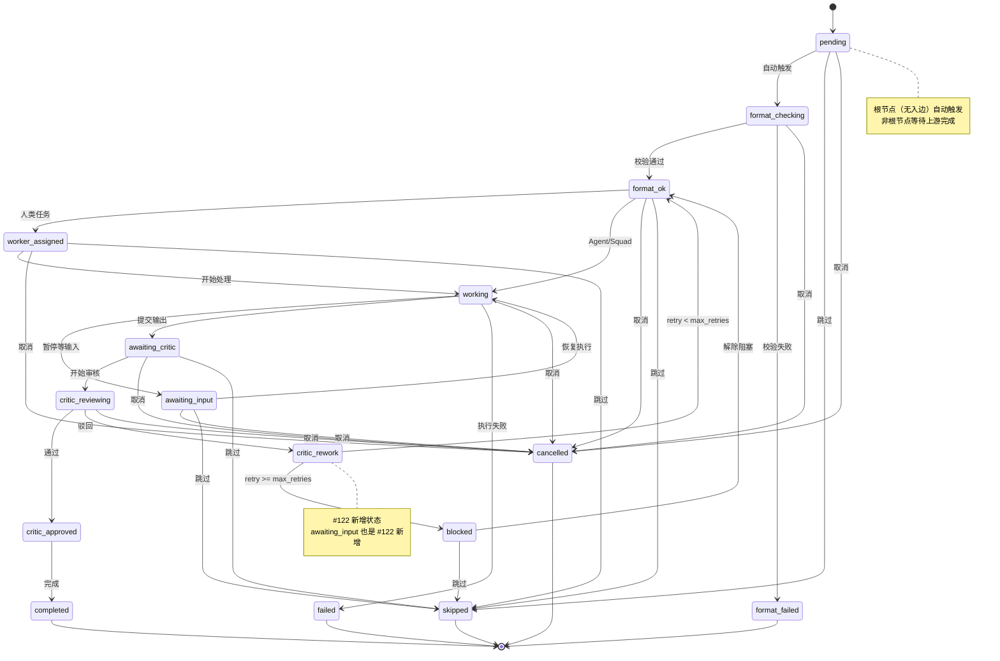
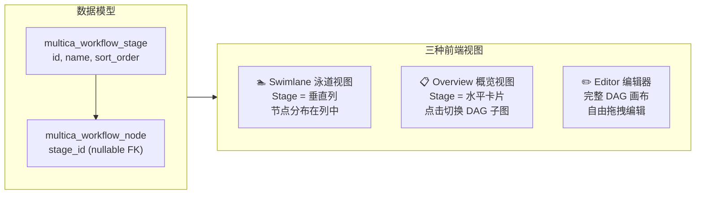
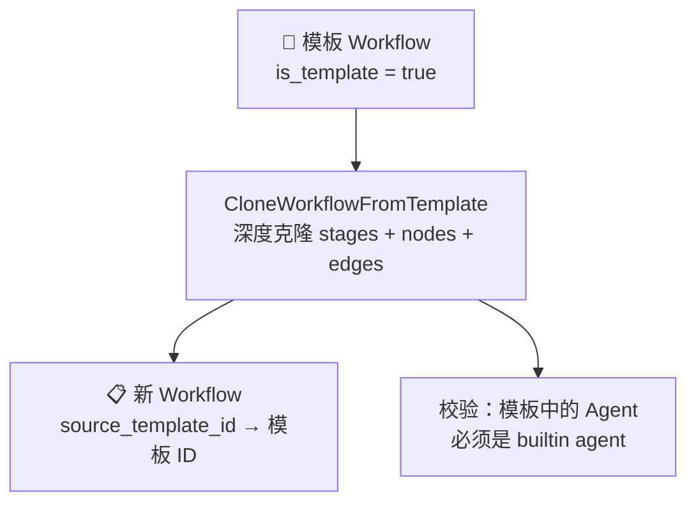
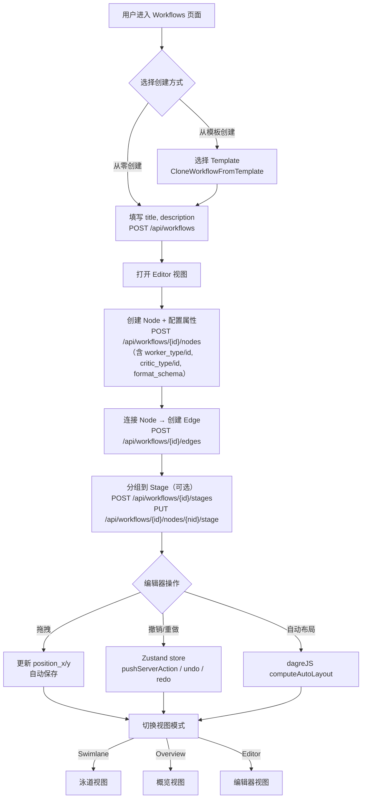
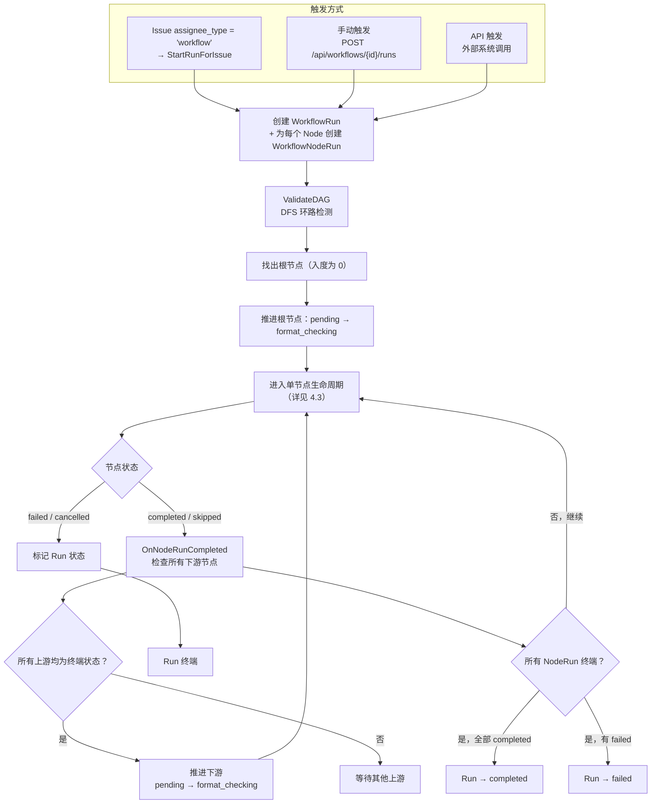
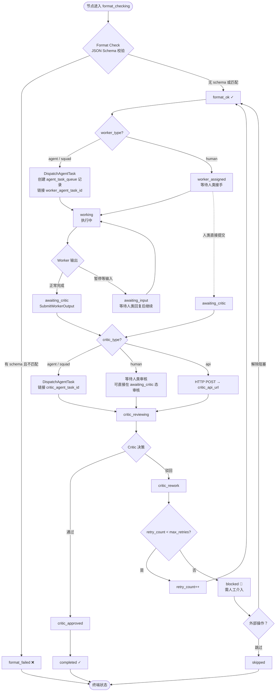
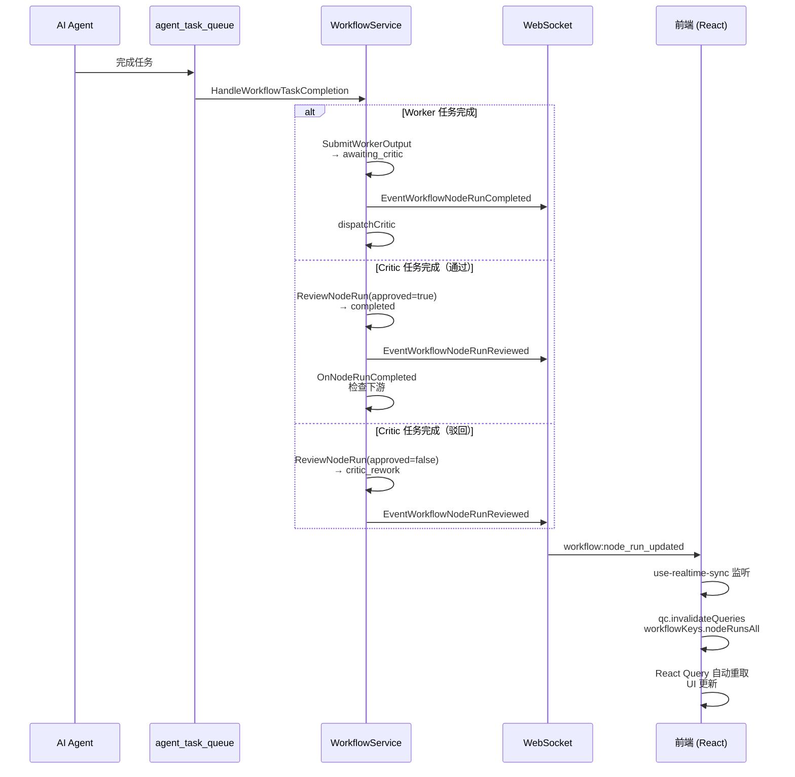
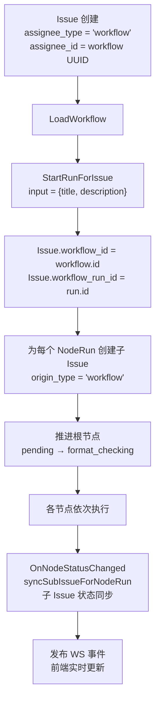

# Workflow 数据模型分析

## 一、整体架构概览

Workflow 是一个 **AI 原生的 DAG（有向无环图）工作流编排引擎**。其核心设计是一个"需求→方案设计→任务拆解→TDD编码→测试生成→集成验证"的全链路 AI 开发流水线。每个节点可以由 AI Agent、Squad（智能体小组）或人类来执行（Worker），执行结果由另一个角色进行审核（Critic）。

涉及 **6 张核心数据库表** + 2 张关联表：

| 表名（迁移后） | 用途 | 迁移编号 |
|---|---|---|
| `multica_workflow` | 工作流 DAG 的顶层定义 | #108（+ #116 加模板字段） |
| `multica_workflow_node` | DAG 中的一个节点 | #108（+ #125 加 stage_id） |
| `multica_workflow_edge` | 节点间的有向边 | #108 |
| `multica_workflow_run` | 工作流的一次执行实例 | #108（+ #121 加 runtime_id） |
| `multica_workflow_node_run` | 一次运行中单个节点的执行状态（16 状态机） | #108（+ #111/112 加 task FK, + #122 加状态） |
| `multica_workflow_stage` | 节点的逻辑分组/泳道列 | #125 |
| `multica_issue` | 关联 `workflow_id` + `workflow_run_id` | #109 |
| `multica_agent_task_queue` | 关联 `workflow_node_run_id` | #108（在原 #3 中补充列） |

### 1.1 实体关系图（ER Diagram）

```mermaid
erDiagram
    multica_workflow {
        uuid id PK
        uuid workspace_id FK
        text title
        text description
        text status
        int max_retries
        text created_by_type
        uuid created_by_id
        boolean is_template "default false, #116"
        uuid source_template_id "自引用, #116"
        timestamptz created_at
        timestamptz updated_at
    }

    multica_workflow_stage {
        uuid id PK
        uuid workflow_id FK
        text name
        text description
        int sort_order
        timestamptz created_at
        timestamptz updated_at
    }

    multica_workflow_node {
        uuid id PK
        uuid workflow_id FK
        uuid stage_id "可空 FK, #125"
        text title
        text description
        float position_x
        float position_y
        jsonb format_schema
        text worker_type
        uuid worker_id "多态: agent/member/squad"
        text critic_type
        uuid critic_id "多态: agent/member/squad/api"
        text critic_api_url
        int sort_order
        timestamptz created_at
        timestamptz updated_at
    }

    multica_workflow_edge {
        uuid id PK
        uuid workflow_id FK
        uuid source_node_id FK
        uuid target_node_id FK
        jsonb condition
        timestamptz created_at
    }

    multica_workflow_run {
        uuid id PK
        uuid workflow_id FK
        uuid workspace_id FK
        uuid runtime_id FK "#121, 可空"
        text workflow_title
        text status
        text triggered_by_type
        uuid triggered_by_id
        jsonb input
        jsonb output
        timestamptz started_at
        timestamptz completed_at
        timestamptz created_at
    }

    multica_workflow_node_run {
        uuid id PK
        uuid workflow_run_id FK
        uuid workflow_node_id FK
        text node_title
        text status "16 种状态"
        int retry_count
        text worker_type
        uuid worker_id
        jsonb worker_output
        uuid worker_agent_task_id FK "#111, agent_task_queue"
        text critic_type
        uuid critic_id
        jsonb critic_output
        text critic_comment
        uuid critic_agent_task_id FK "#111, agent_task_queue"
        uuid agent_task_id FK "已废弃, #108 原始列"
        timestamptz started_at
        timestamptz completed_at
        timestamptz created_at
        timestamptz updated_at
    }

    multica_agent {
        uuid id PK
        uuid workspace_id FK
        text name
        text description
        text instructions
        text runtime_mode
        text status
        text plugin_id "TEXT, 外部 Plugin ID, #118"
        boolean is_builtin
        uuid owner_id FK "→ multica_user"
        int max_concurrent_tasks
        timestamptz created_at
        timestamptz updated_at
    }

    multica_user {
        uuid id PK
        text name
        text email
        boolean can_manage_workflows "#117, 全局管理工作流权限"
    }

    multica_member {
        uuid id PK
        uuid workspace_id FK
        uuid user_id FK "→ multica_user"
        text role
        timestamptz created_at
    }

    multica_issue {
        uuid id PK
        uuid workspace_id FK
        text title
        text description
        text status
        text assignee_type
        uuid assignee_id
        uuid workflow_id "可空 FK, #109"
        uuid workflow_run_id "可空 FK, #109"
        uuid origin_id "origin_type=workflow 时指向 node_run"
        text origin_type
        timestamptz created_at
        timestamptz updated_at
    }

    multica_agent_task_queue {
        uuid id PK
        uuid agent_id FK
        uuid issue_id FK
        uuid workflow_node_run_id "可空 FK, #108"
        uuid runtime_id FK
        text status
        int priority
        jsonb context "任务上下文, #3"
        jsonb result "执行结果"
        text error
        timestamptz dispatched_at
        timestamptz started_at
        timestamptz completed_at
        timestamptz created_at
    }

    %% ===== 核心 Workflow 结构 =====
    multica_workflow ||--o{ multica_workflow_stage : "含"
    multica_workflow ||--o{ multica_workflow_node : "含"
    multica_workflow ||--o{ multica_workflow_edge : "含"
    multica_workflow ||--o{ multica_workflow : "source_template_id 自引用"
    multica_workflow_stage ||--o{ multica_workflow_node : "stage_id"
    multica_workflow_node ||--o{ multica_workflow_edge : "source_node"
    multica_workflow_node ||--o{ multica_workflow_edge : "target_node"

    %% ===== 运行实例 =====
    multica_workflow ||--o{ multica_workflow_run : "执行"
    multica_workflow_run ||--o{ multica_workflow_node_run : "含"
    multica_workflow_node ||--o{ multica_workflow_node_run : "节点快照"

    %% ===== Worker/Critic 多态分配 =====
    multica_workflow_node }o--|| multica_agent : "worker_type=agent"
    multica_workflow_node }o--|| multica_member : "worker_type=human"
    multica_workflow_node }o--|| multica_agent : "critic_type=agent"
    multica_workflow_node }o--|| multica_member : "critic_type=human"

    %% ===== Agent → User =====
    multica_agent }o--|| multica_user : "owner_id"
    multica_member }o--|| multica_user : "user_id"

    %% ===== 任务队列 =====
    multica_workflow_node_run ||--o| multica_agent_task_queue : "worker_agent_task_id"
    multica_workflow_node_run ||--o| multica_agent_task_queue : "critic_agent_task_id"
    multica_agent_task_queue }o--|| multica_agent : "agent_id"

    %% ===== Issue 集成 =====
    multica_workflow ||--o{ multica_issue : "workflow_id"
    multica_workflow_run ||--o{ multica_issue : "workflow_run_id"
    multica_workflow_node_run ||--o{ multica_issue : "子 Issue"
```



### 1.2 多态分配者模式

Node 的 Worker 和 Critic 采用 **类型(type) + ID** 的多态关联：

| 组件 | type 值 | id 指向表 |
|---|---|---|
| Worker | `human` | `multica_member` |
| Worker | `agent` | `multica_agent` |
| Worker | `squad` | `multica_squad` |
| Critic | `human` | `multica_member` |
| Critic | `agent` | `multica_agent` |
| Critic | `squad` | `multica_squad` |
| Critic | `api` | 不走 DB，直接使用 `critic_api_url` 字段 |

### 1.3 Agent ↔ Plugin ↔ Skill 关联链路

```
WorkflowNode
  ├── worker_type="agent", worker_id ──→ Agent ──→ agent.plugin_id (TEXT) → 外部 Plugin API
  └── critic_type="agent", critic_id ──→ Agent ──→ agent.plugin_id (TEXT) → 外部 Plugin API
```

> **注意**：`multica_agent.plugin_id` 是 TEXT 列（迁移 #118），无 FK 约束。Plugin 实体不在本地数据库中——它来自 `/api/plugins/builtin` 外部 API，内含 `metadata.bundle.skills_namespaces` 等技能列表。

实际数据示例（来自 model.md 中"cospower全链路"工作流）：

| Workflow Node | Agent | Plugin ID | Plugin Slug | 内嵌 Skills |
|---|---|---|---|---|
| 需求分析 | 需求分析 | fa87f958-... | cospowers-requirements | 9 |
| 方案设计 | 方案设计 | 365d045e-... | cospowers-solution-design | 12 |
| 任务拆解 | 任务拆解 | 8fabc295-... | cospowers-task-planning | 9 |
| 编码 | TDD 编码 | 665b5bbf-... | cospowers-tdd-development | 12 |
| 测试生成 | 测试生成 | 10a3b7d2-... | cospowers-test-generation | 10 |
| 验证 | 集成验证 | 5d54963c-... | cospowers-integration-verification | 15 |
| (所有 Critic) | 审核师 | null | — | — |

---

## 二、核心数据模型详解

### 2.1 NodeRun 状态机（16 种状态）

每个节点运行经历严格的 **Format → Worker → Critic** 三阶段流水线。以下状态图根据 `server/internal/service/workflow.go` 中 `validTransitions` map 精确绘制：



**状态归属：**

| 阶段 | 状态 | 含义 |
|---|---|---|
| **就绪** | `pending` | 等待上游节点完成 |
| **Format** | `format_checking` | 正在校验 format_schema |
| | `format_ok` | 格式校验通过 |
| | `format_failed` | 格式校验失败（终端） |
| **Worker** | `worker_assigned` | 人类任务已分配 |
| | `working` | Agent/Squad/人类执行中 |
| | `awaiting_input` | Worker 暂停等待人类输入（#122） |
| **Critic** | `awaiting_critic` | Worker 完成，等待 Critic |
| | `critic_reviewing` | Critic 审核中 |
| | `critic_approved` | 审核通过 |
| | `critic_rework` | 驳回重做（#122） |
| **终端** | `completed` | 成功完成 |
| | `failed` | 执行失败 |
| | `blocked` | 超最大重试，需人工介入 |
| | `skipped` | 被跳过 |
| | `cancelled` | 被取消 |

> **关于 `skipped`**：从 `pending`、`format_ok`、`worker_assigned`、`awaiting_input`、`awaiting_critic`、`blocked` 均可直接 `skipped`。这是一个主动"跳过"操作，与 `cancelled`（取消）不同。

### 2.2 Stage（阶段）模型

Stage 在迁移 #125 中新增，用于将 DAG 节点按逻辑阶段分组。前端提供三种视图模式：



### 2.3 模板系统

Workflow 支持模板化复用：



---

## 三、前后端模型对应关系

| 概念 | Go 后端 (sqlc) | TypeScript 前端 |
|---|---|---|
| 表前缀 | `multica_` (迁移 #114) | 无（通过 REST API 通信） |
| 类型定义 | `generated/models.go` | `packages/core/types/workflow.ts` |
| 状态枚举 | SQL CHECK 约束 | TypeScript union type（16 种完全匹配） |
| 运行时验证 | Go handler 内联校验 | Zod schema (`packages/core/api/schemas.ts`) |
| 服务端状态 | TanStack Query（缓存 + 失效） | `packages/core/workflows/queries.ts` |
| 编辑器 UI 状态 | Zustand（撤销/重做/选择） | `packages/core/workflows/store.ts` |
| 视图模式状态 | Zustand persist | `packages/core/workflows/stores/view-store.ts` |
| 实时同步 | WebSocket (gorilla/websocket) | `use-realtime-sync.ts` 监听 `workflow:node_run_updated` |
| API 契约 | handler 层 req/res 结构体 | `packages/core/api/client.ts` 方法签名 |

---

## 四、数据流与流程图

### 4.1 工作流创建与编辑流程



### 4.2 工作流执行流程



### 4.3 单节点生命周期（三阶段流水线）



> **虚线箭头**：`worker_assigned -.-> awaiting_critic` 表示人类 Worker 可以直接提交输出而无需先进入 `working`（实际代码中，`SubmitWorkerOutput` 同时接受 `working` 和 `worker_assigned` 两种来源状态）。

### 4.4 实时事件同步



### 4.5 Issue 与 Workflow 集成



---

## 五、关键文件索引

### 后端（Go）

| 文件 | 说明 |
|---|---|
| `server/migrations/108_workflow.up.sql` | 核心 5 表创建 |
| `server/migrations/109_issue_workflow.up.sql` | Issue 关联 workflow |
| `server/migrations/116_template_system.up.sql` | is_template + source_template_id |
| `server/migrations/117_user_workflow_admin.up.sql` | user.can_manage_workflows |
| `server/migrations/122_awaiting_input.up.sql` | awaiting_input + critic_rework 状态 |
| `server/migrations/125_workflow_stage.up.sql` | Stage 表和 node.stage_id |
| `server/pkg/db/queries/workflow.sql` | 30+ SQL 查询（CRUD + 模板 + Stage） |
| `server/pkg/db/queries/workflow_node_run.sql` | 22 个 NodeRun 查询（状态机 + 任务链接） |
| `server/pkg/db/generated/models.go` | sqlc 生成的 Go 结构体 |
| `server/internal/service/workflow.go` | 核心编排引擎（约 1565 行，含 validTransitions） |
| `server/internal/handler/workflow.go` | REST API handler（约 1285 行） |
| `server/internal/handler/workflow_run.go` | 运行相关 handler（约 498 行） |
| `server/cmd/server/router.go` | 路由注册 |

### 前端（TypeScript）

| 文件 | 说明 |
|---|---|
| `packages/core/types/workflow.ts` | 所有 TS 类型定义 |
| `packages/core/api/schemas.ts` | Zod 验证 schema |
| `packages/core/api/client.ts` | API 客户端方法 |
| `packages/core/workflows/queries.ts` | TanStack Query hooks |
| `packages/core/workflows/store.ts` | 编辑器 Zustand store（撤销/重做） |
| `packages/core/workflows/stores/view-store.ts` | 视图模式 store |
| `packages/views/workflows/components/` | 所有 UI 组件（编辑器/泳道/概览） |
