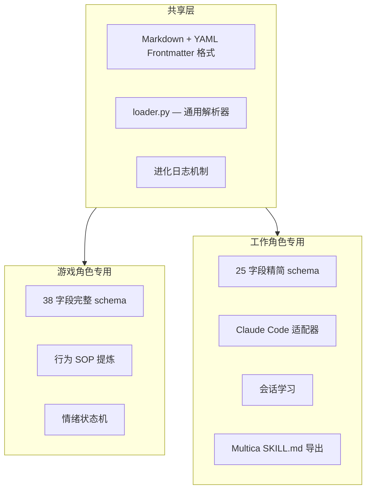

# 工作角色设计底层逻辑

## 核心洞察：两类角色的根本差异

character_md 最初是为**游戏角色**设计的——诸葛亮、NPC、互动叙事中的虚拟人格。但实际使用中发现，它同样适用于定义 **AI 编程 Agent 的工作角色**（架构师、工程师、设计师、研究员）。

这两类角色的**底层需求完全不同**：

| 维度 | 游戏角色 | 工作角色 |
|------|---------|---------|
| **目的** | 让对话有趣、有戏剧性、人格一致 | 让 Agent 可靠、高效、边界清晰 |
| **核心机制** | 人格模拟——信念、创伤、情绪状态机 | 行为约束——工作流、权限边界、输出标准 |
| **评估标准** | "像不像这个角色" | "输出是否可信、可验证" |
| **进化方式** | 对话中浮现行为模式，追加 SOP | 工作会话中积累项目知识、发现权限缺口 |
| **失败模式** | 角色崩塌（OOC） | 越权操作、过度设计、分析瘫痪 |

## 字段分类法

把 CHARACTER_FORMAT.md v2.0 的 38 个字段按"对工作角色是否有用"分成三类：

### 🔴 纯游戏字段（15 个，删除）

这些字段服务于**叙事心理学**——核心谎言、成长弧线、情绪状态机。工作角色不需要"童年创伤"和"MBTI 类型"：

```
personality_model     — MBTI/九型人格，工作角色不需要人格标签
core_lie              — "我的价值取决于比别人聪明"——这是角色弧线用的
core_truth            — 角色需要学会的真相——叙事概念
formative_trauma      — 性格成因的关键事件——纯叙事
core_fear             — 最深恐惧——游戏 drama 驱动
core_desire           — 真正欲望——已有 primary_goal 覆盖
hidden_motivation     — 不公开的内在驱动——过于叙事化
emotional_default     — 默认情绪——工作角色不需要情绪状态机
emotional_range       — 情绪波动模式——纯游戏
emotional_triggers    — 情绪触发条件——纯游戏互动
catchphrase           — 口头禅——golden_lines 已覆盖示例对话
catchphrase_probability — 口头禅频率——纯游戏概率
appearance_hint       — 视觉描述——除非渲染头像
relationship_defaults — 对不同类型的社交策略——工作角色不需要社交模拟
special_responses     — 特定情境预设反应——互动叙事
```

### 🟡 有效但命名太游戏化（8 个，重命名）

这些字段工作角色在用，但名字带着"人格模拟"的包袱：

```
v2.0 名称                  实际在工作角色中的含义        → v3.0 名称
─────────────────────────────────────────────────────────────────
personality_surface        外显工作风格                  → work_style
personality_surface_example 行为示例                     → work_style_example
personality_hidden         底层倾向/系统性偏见           → inherent_bias
personality_hidden_leak    偏见在什么场景下暴露          → bias_manifestation
personality_weakness       已知的失败模式                → failure_mode
personality_weakness_trigger 触发失败的条件              → failure_trigger
moral_framework            职业伦理框架                  → professional_ethics
moral_red_lines            不可逾越的行为边界            → red_lines
special_ability            独特的核心工作方法            → signature_method
special_ability_trigger    该方法的触发条件              → signature_trigger
```

### 🟢 原生适用（~15 个，保持）

这些字段两种角色都天然需要，且命名中立：

```
Meta:     id, name, version, author, tags, role_type, preferred_model
目标:     primary_goal, goal_strategy, secondary_goal, on_success, on_failure
风格:     speaking_style, sentence_length, forbidden_phrases, golden_lines
知识:     knowledge_areas, knowledge_blindspots
工具:     allowed_tools, denied_tools
可选:     avatar_url
```

## 设计原则

### 原则 1：工作角色是"约束系统"，不是"人格模拟"

游戏角色追求的是** believable illusion **——让用户觉得在和一个有血有肉的角色对话。工作角色追求的是**可靠的行为边界**——让 Agent 在明确的约束下产出可预测的高质量结果。

这决定了字段的选择标准：**这个字段是在帮助约束行为，还是在丰富人格细节？**

- `core_lie` → 丰富人格细节 → 删
- `red_lines` → 约束行为 → 留

### 原则 2：每个字段必须对应一个"可观察的行为后果"

如果一个字段填了和没填，Agent 的输出没有可观测的差异，这个字段就是噪音。

```
✅ failure_mode: "分析阶段耗时过长" → 可观测：Agent 会在多方案时给更长的分析
✅ red_lines: "不修改代码（只读）"    → 可观测：Agent 不会调用 Edit/Write
❌ personality_model: "ENTP"        → 不可观测：Agent 的行为差异无法归因于 MBTI
❌ core_fear: "被人看穿"            → 不可观测：在代码审查中无法体现
```

### 原则 3：两种角色共享基础设施，但前端不同



loader.py 保持通用——它只是 YAML → dict 的解析器。字段语义由上层（claude_adapter、Multica bridge）解释。

### 原则 4：进化日志的语义因角色类型而异

```
游戏角色的进化日志：
  "发现 SOP：被提到王司徒时语速加快、攻击性增强"
  → 提炼的是角色行为模式

工作角色的进化日志：
  "发现：此项目使用 pnpm 管理依赖，测试命令是 pnpm test -- --coverage"
  → 积累的是项目知识和权限缺口
```

两种角色都用 `# 进化日志` 章节，但写入的内容和含义完全不同。writer.py 的 `write_evolution()` 服务游戏角色，`write_session_learnings()` 服务工作角色。

## 与 Multica 的关系

工作角色 v3.0 是 character_md 向 Multica 生态融合的桥梁：

| 概念 | character_md v3.0 | multica-ai/multica |
|------|------------------|-------------------|
| 角色定义 | WORK_ROLE_FORMAT.md（25 字段） | Agent Instructions（自由文本） |
| 可复用技能 | — | SKILL.md |
| 部署目标 | Claude Code（CLAUDE.md） | 11 种 CLI 工具 |
| 会话记忆 | 进化日志追加到角色文件 | 任务结束即释放上下文 |

**融合路径**：character_md 提供结构化的人格创作格式 → claude_adapter 渲染为 CLAUDE.md → Multica Daemon 注入给 Agent。character_md 填补了 Multica Agent "Instructions 是自由文本、缺乏结构约束"的空白。

## 版本历史

| 版本 | 日期 | 变更 |
|------|------|------|
| v1.0 | — | 初始格式，面向游戏角色 |
| v2.0 | 2026-06 | 增加 role_type 字段，引入 Claude Code 适配器 |
| v3.0 | 2026-06-30 | 拆分工作角色与游戏角色：删除 15 个游戏字段，重命名 8 个叙事字段，新增 WORK_ROLE_FORMAT.md 和 DESIGN_LOGIC.md |
