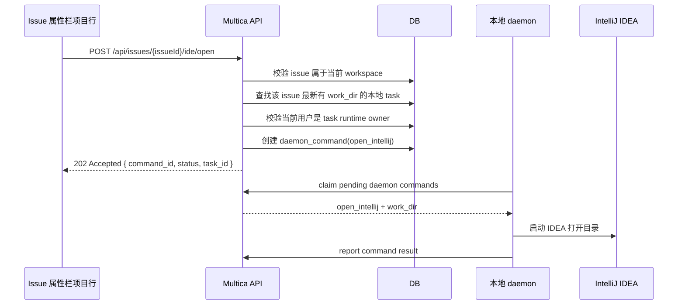

# Issue 属性栏打开 IntelliJ IDEA Spec

## 背景

当前 issue 详情页右侧属性栏会展示项目字段，例如 `项目 sqs-harness-module-css`。用户希望在该项目行右侧直接提供一个打开入口，用 IntelliJ IDEA 打开该 issue 最近一次任务实际写代码的目录。

实际代码目录有两类来源：

- `github_repo` 模式：daemon 通过 `multica repo checkout` 创建隔离 worktree，真实目录记录在 task 的 `work_dir`。
- `local_directory` 模式：daemon 直接在项目绑定的本地目录执行，真实目录同样记录在 task 的 `work_dir`。

该能力必须延续既有运行时隐私规则：运行时不允许被其他人调用，也不允许被其他人可见；workspace owner/admin 也不能越权调用他人的本地运行时。运行日志可见，但不能让普通 API 暴露绝对路径。

## 目标

在 issue 详情页右侧属性栏的“项目”行中，在项目名右侧、截图红框位置增加一个“用 IntelliJ IDEA 打开”的图标按钮。点击后，服务端根据当前 issue 的最新可打开 task 解析真实 `work_dir`，授权后下发命令给执行该 task 的本地 daemon，由 daemon 在其所在机器上启动 IntelliJ IDEA 打开目录。

## 非目标

- 不在前端或普通用户 API 响应中暴露绝对路径 `work_dir`。
- 不允许非 runtime owner 调用本地 runtime 打开 IDE，即使该用户是 workspace owner/admin。
- 不支持 cloud runtime 打开本地 IDE。
- 第一版不实现 JetBrains Toolbox 自动发现/安装引导，只支持 daemon 配置项、环境变量或 PATH 中可用的 IDEA 命令。
- 第一版只支持打开目录，不支持定位到具体文件或行号。
- 第一版不在执行记录行、transcript 弹窗或评论区额外增加同类按钮。

## 用户体验

### 入口位置

位置：`packages/views/issues/components/issue-detail.tsx`

具体放置在右侧属性栏 `PropRow label={t(($) => $.detail.prop_project)}` 内，紧跟 `ProjectPicker` 右侧，位于截图红框位置。

建议结构：

```tsx
<PropRow label={t(($) => $.detail.prop_project)}>
  <div className="flex min-w-0 items-center gap-1">
    <ProjectPicker
      projectId={issue.project_id}
      onUpdate={handleUpdateField}
    />
    <OpenIssueInIntelliJButton issueId={issue.id} />
  </div>
</PropRow>
```

按钮样式：

- 使用 icon-only 按钮，尺寸与属性栏内小按钮一致。
- 图标建议使用 `Code2` 或 `ExternalLink`，优先用 `lucide-react` 现有图标。
- Tooltip：`用 IntelliJ IDEA 打开`
- aria-label：`用 IntelliJ IDEA 打开工作目录`
- 按钮在项目名右侧靠近红框位置，不挤压项目名；项目名过长时保持截断。

### 显示与禁用规则

推荐第一版采用“可见但按服务端结果反馈”的策略：

- 当 issue 有 `project_id` 时显示按钮。
- 点击后由后端判断是否存在可打开 task、runtime 是否归当前用户、daemon 是否在线、`work_dir` 是否存在。
- 后端返回 `409` 或 `403` 时，前端展示对应 toast。

原因：

- 属性栏本身不一定已经加载执行记录列表，不应为了显示按钮强依赖执行日志组件。
- 运行时隐私要求前端不能通过额外查询推断其他人的 runtime 状态。
- 是否可打开由服务端统一裁决，避免前端根据不完整字段误判。

错误提示：

- `403`：`只能在执行该 task 的本地运行时上打开`
- `409 no_eligible_task`：`当前 issue 没有可打开的工作目录`
- `409 daemon_offline`：`本地运行时离线，无法打开 IntelliJ IDEA`
- `409 ide_unavailable`：`未找到 IntelliJ IDEA 命令，请在 runtime 配置中设置`
- 其他失败：`打开 IntelliJ IDEA 失败`

成功反馈：

- 服务端接受命令后立即 toast：`已请求本地运行时打开 IntelliJ IDEA`
- daemon 异步执行失败时，第一版可只记录日志；后续可通过通知或 WebSocket 补充失败反馈。

## 推荐架构

采用“服务端授权 + daemon 本机执行 + issue 级 API”的方式。

核心原则：

- 前端只发起 `issueId + ide` 请求，不传 taskId，不接收绝对路径。
- 服务端在当前 workspace 内为 issue 选择最新可打开 task。
- 服务端强校验当前用户必须是该 task runtime 的 owner。
- daemon 只 claim 属于自己 daemon_id 的命令，payload 内部携带 `work_dir`。

流程：



## 后端设计

### 新增数据表

新增 migration，例如：

`server/migrations/0XX_daemon_commands.up.sql`

表名：`daemon_command`

字段：

- `id uuid primary key`
- `workspace_id uuid not null`
- `daemon_id text not null`
- `runtime_id uuid not null`
- `requester_user_id uuid not null`
- `issue_id uuid not null`
- `task_id uuid not null`
- `command_type text not null`
- `payload jsonb not null default '{}'::jsonb`
- `status text not null default 'queued'`
- `claimed_at timestamptz null`
- `completed_at timestamptz null`
- `error text null`
- `created_at timestamptz not null default now()`

约束：

- `command_type` 第一版只允许 `open_intellij`。
- `status` 允许 `queued | claimed | completed | failed | expired`。
- 索引：`(daemon_id, status, created_at)`。
- 索引：`(workspace_id, issue_id, created_at desc)`。

### 用户侧 API

新增 endpoint：

`POST /api/issues/{issueId}/ide/open`

请求体：

```json
{
  "ide": "intellij_idea"
}
```

响应：

```json
{
  "command_id": "uuid",
  "status": "queued",
  "task_id": "uuid"
}
```

选择 task 的规则：

1. task 必须属于该 issue 和当前 workspace。
2. task 必须有关联 runtime，且 runtime 类型为 `local`。
3. task 必须有服务端保存的非空 `work_dir`。
4. runtime 必须有可投递的 `daemon_id`。
5. 多个 task 符合条件时，选择 `created_at` 最新的一条。

错误：

- `400`：不支持的 IDE。
- `403`：当前用户不是该 runtime owner。
- `404`：issue 不存在或不属于当前 workspace。
- `409 no_eligible_task`：没有符合条件的本地 task 或缺少 `work_dir`。
- `409 daemon_offline`：daemon 不在线。
- `409 ide_unavailable`：daemon 已知 IDEA 命令不可用。

安全规则：

- 不能通过 workspace role 放宽权限。
- 即使当前用户是 owner/admin，只要不是 runtime owner，也返回 `403`。
- 用户侧响应不返回 `work_dir`、`daemon_id`、runtime 详情。
- 审计日志可记录谁请求打开哪个 issue/task，但不向普通 API 暴露绝对路径。

### daemon 侧 API

claim endpoint：

`POST /api/daemon/commands/claim`

请求：

```json
{
  "daemon_id": "daemon-xxx",
  "limit": 5
}
```

响应：

```json
{
  "commands": [
    {
      "id": "uuid",
      "command_type": "open_intellij",
      "payload": {
        "work_dir": "C:\\Users\\imshe\\multica_workspaces\\...\\workdir"
      }
    }
  ]
}
```

complete endpoint：

`POST /api/daemon/commands/{commandId}/complete`

成功：

```json
{
  "status": "completed"
}
```

失败：

```json
{
  "status": "failed",
  "error": "IntelliJ IDEA command not found"
}
```

daemon endpoint 权限：

- 只能由对应 daemon token 调用。
- claim 时服务端只返回该 daemon_id 的命令。
- complete 时必须校验 command 的 daemon_id 与调用 daemon 一致。

## daemon 设计

### 配置

新增 daemon 配置项：

```json
{
  "tools": {
    "intellij": {
      "command": "idea"
    }
  }
}
```

环境变量覆盖：

- `MULTICA_INTELLIJ_COMMAND`

解析优先级：

1. `MULTICA_INTELLIJ_COMMAND`
2. daemon config `tools.intellij.command`
3. PATH 中的 `idea`

Windows 可额外尝试：

- `idea64.exe`
- `idea.exe`

第一版找不到命令时直接失败并上报明确错误，不做自动安装。

### 执行命令

伪代码：

```go
func openIntelliJ(ctx context.Context, workDir string, command string) error {
    if workDir == "" {
        return errors.New("work_dir is empty")
    }
    st, err := os.Stat(workDir)
    if err != nil {
        return fmt.Errorf("stat work_dir: %w", err)
    }
    if !st.IsDir() {
        return errors.New("work_dir is not a directory")
    }
    cmd := exec.CommandContext(ctx, command, workDir)
    return cmd.Start()
}
```

注意：

- 使用 `Start()`，不阻塞等待 IDEA 退出。
- 不把 `workDir` 写入用户可见错误；daemon 本机日志可记录。
- server 侧 command payload 可保存绝对路径，因为这是 daemon 通信内部数据，不进入普通用户 API。

## 前端设计

### API client

修改：

- `packages/core/api/client.ts`
- `packages/core/api/schemas.ts`
- 如项目已有集中类型定义，则同步更新 `packages/core/types`

新增类型：

```ts
export interface OpenIdeCommandResponse {
  command_id: string;
  status: "queued";
  task_id: string;
}
```

新增 client 方法：

```ts
openIssueInIde(issueId: string, ide: "intellij_idea"): Promise<OpenIdeCommandResponse>
```

解析要求：

- 使用 zod schema 和 `parseWithFallback`。
- malformed response 不应导致整个 issue 页面 crash。

### UI 组件

修改：

- `packages/views/issues/components/issue-detail.tsx`
- `packages/views/locales/en/issues.json`
- `packages/views/locales/zh-Hans/issues.json`

建议在 `issue-detail.tsx` 内新增一个小型局部组件，或放到同目录新文件：

- `OpenIssueInIntelliJButton`

职责：

- 渲染属性栏项目行右侧 icon button。
- 点击调用 `api.openIssueInIde(issueId, "intellij_idea")`。
- 管理 pending 状态，避免重复点击。
- 成功/失败 toast。

按钮只放在项目属性行，不放在 `ExecutionLogSection`。

### i18n

中文：

- `open_intellij_tooltip`: `用 IntelliJ IDEA 打开`
- `open_intellij_aria`: `用 IntelliJ IDEA 打开工作目录`
- `open_intellij_requested`: `已请求本地运行时打开 IntelliJ IDEA`
- `open_intellij_failed`: `打开 IntelliJ IDEA 失败`
- `open_intellij_not_owner`: `只能在执行该 task 的本地运行时上打开`
- `open_intellij_no_workdir`: `当前 issue 没有可打开的工作目录`
- `open_intellij_daemon_offline`: `本地运行时离线，无法打开 IntelliJ IDEA`

英文：

- `open_intellij_tooltip`: `Open in IntelliJ IDEA`
- `open_intellij_aria`: `Open working directory in IntelliJ IDEA`
- `open_intellij_requested`: `Requested local runtime to open IntelliJ IDEA`
- `open_intellij_failed`: `Failed to open IntelliJ IDEA`
- `open_intellij_not_owner`: `Only the local runtime that ran this task can open it`
- `open_intellij_no_workdir`: `This issue has no working directory to open`
- `open_intellij_daemon_offline`: `Local runtime is offline and cannot open IntelliJ IDEA`

## 测试计划

### 后端 handler 测试

文件建议：

- `server/internal/handler/open_ide_test.go`

用例：

- 当前用户是最新 eligible task 的 runtime owner，可以创建 `open_intellij` command。
- 当前用户是 workspace owner/admin 但不是 runtime owner，返回 `403`。
- issue 没有任何带 `work_dir` 的本地 task，返回 `409 no_eligible_task`。
- 最新 task 没有 `work_dir`，但更早 task 有 `work_dir`，选择更早的 eligible task。
- task runtime 是 cloud，跳过该 task；没有其他 eligible task 时返回 `409`。
- daemon 离线时返回 `409 daemon_offline`。
- 响应不包含 `work_dir` 或 runtime 私密信息。

### daemon 测试

文件建议：

- `server/internal/daemon/open_ide_test.go`

用例：

- 配置了 `MULTICA_INTELLIJ_COMMAND` 时使用该命令。
- `work_dir` 不存在时上报 failed。
- `work_dir` 是文件时上报 failed。
- 命令启动成功后上报 completed。
- 找不到 IDEA 命令时上报 failed，错误可读。

### API schema 测试

文件建议：

- `packages/core/api/schema.test.ts`
- `packages/core/api/client.test.ts`

用例：

- `openIssueInIde` 解析 `{ command_id, status, task_id }`。
- malformed response 使用 fallback，不导致 UI crash。

### 前端组件测试

文件建议：

- 优先扩展现有 `issue-detail` 测试；如没有，新增 `packages/views/issues/components/issue-detail.test.tsx` 或同目录最接近的测试文件。

用例：

- issue 有 `project_id` 时，在右侧属性栏“项目”行内项目名右侧渲染 IDEA 按钮。
- 点击按钮调用 `api.openIssueInIde(issue.id, "intellij_idea")`。
- pending 期间按钮 disabled，避免重复提交。
- API 成功时展示 success toast。
- API 返回 `403` 时展示无权限 toast。
- API 返回 `409 no_eligible_task` 时展示无可打开目录 toast。
- issue 无 `project_id` 时不显示按钮。
- 项目名过长时仍截断，按钮保持在行尾，不被挤出属性栏。

## 实施步骤

1. 写后端 handler 失败测试，覆盖 issue 级入口、runtime owner 权限和 latest eligible task 选择。
2. 写 migration 和 sqlc query。
3. 实现 `POST /api/issues/{issueId}/ide/open`。
4. 写 daemon command claim/complete 测试。
5. 实现 daemon command claim/complete endpoint。
6. 实现 daemon 轮询 command 并执行 `open_intellij`。
7. 写 core API schema/client 测试。
8. 实现 core API client `openIssueInIde`。
9. 写 issue detail 项目行按钮测试。
10. 在 `issue-detail.tsx` 的项目 `PropRow` 内实现红框位置按钮和 i18n。
11. 运行验证：

```bash
make sqlc
go test ./internal/handler -run 'TestOpenIssueInIde|TestDaemonCommand' -count=1
go test ./internal/daemon -run TestOpenIntelliJ -count=1
corepack pnpm --filter @multica/core test
corepack pnpm --filter @multica/views exec vitest run issues/components/issue-detail.test.tsx
corepack pnpm --filter @multica/views typecheck
```

## 风险与决策

### 风险：绝对路径泄露

决策：普通 task/API 继续只返回 `relative_work_dir`；打开 IDEA 通过服务端授权命令和 daemon 内部 payload 完成。

### 风险：非 runtime owner 调用本地运行时

决策：服务端强制校验 `task.runtime_id -> runtime.owner_id == current_user.id`，不允许 workspace role 越权。

### 风险：属性栏按钮不是 task 级，无法明确用户想打开哪次运行

决策：第一版固定选择最新 eligible task。后续如果用户需要打开历史运行目录，再在执行记录里增加 per-task 入口。

### 风险：daemon 离线

决策：第一版同步返回 `409 daemon_offline`，UI toast 显示本地运行时离线；不创建等待 daemon 上线后自动执行的 pending 命令。

### 风险：Web 用户误以为会在浏览器所在机器打开

决策：按钮语义是“在执行该 task 的本地运行时所在机器打开”。如果用户当前浏览器不在那台机器上，也不会在当前浏览器机器上打开。

## 待确认

1. 第一版是否只支持 IntelliJ IDEA，还是同时预留 `cursor` / `vscode` / `webstorm` 枚举？
2. IDEA 命令不可用时，是否需要在 UI 上提供跳转到 runtime 配置页的快捷入口？
