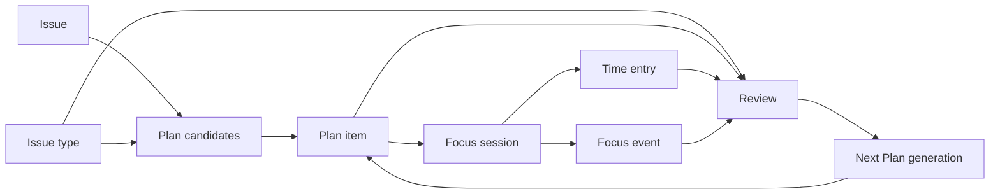

# Issue Energy Loop 技术规格

## Context

本技术规格对应 [PRODUCT.md](./PRODUCT.md)。产品目标已经收敛为单一闭环：`Backlog -> Plan -> Focus -> Review -> Next Plan`。V1 不引入 Sprint/Cycle，也不把 Knowledge 纳入本次范围；技术实现应围绕个人 Plan、计划项执行、精力信号回流和下一轮计划建议展开。

当前代码里已经具备部分基础能力，但它们还没有形成结构化闭环：

- Issue 已经是核心工作对象。[`server/migrations/001_init.up.sql:51-74 @ 45f097d`](https://github.com/aircjm/multim/blob/45f097d54f2c0cc7ae6f7054f8bb0ec53e9ebd0c/server/migrations/001_init.up.sql#L51-L74) 定义了 `issue` 的状态、优先级、负责人、日期、归档和上下文字段；[`server/cmd/server/router.go:215-251 @ 45f097d`](https://github.com/aircjm/multim/blob/45f097d54f2c0cc7ae6f7054f8bb0ec53e9ebd0c/server/cmd/server/router.go#L215-L251) 暴露了 issue 列表、详情、归档、标签、评论、时间记录和 timeline API。
- 当前 issue 还没有 `issue_type`。[`server/migrations/001_init.up.sql:51-74 @ 45f097d`](https://github.com/aircjm/multim/blob/45f097d54f2c0cc7ae6f7054f8bb0ec53e9ebd0c/server/migrations/001_init.up.sql#L51-L74) 的 `issue` 只有 status/priority/assignee/date 等字段；[`apps/workspace/src/shared/types/issue.ts:55-83 @ 45f097d`](https://github.com/aircjm/multim/blob/45f097d54f2c0cc7ae6f7054f8bb0ec53e9ebd0c/apps/workspace/src/shared/types/issue.ts#L55-L83) 的前端 `Issue` 类型也没有工作形态字段。因此 issue type 是本规格要新增的基础字段，而不是复用现有 label。
- 当前计划能力还是 Markdown 草稿。[`server/migrations/039_daily_plan.up.sql:1-16 @ 45f097d`](https://github.com/aircjm/multim/blob/45f097d54f2c0cc7ae6f7054f8bb0ec53e9ebd0c/server/migrations/039_daily_plan.up.sql#L1-L16) 的 `daily_plan` 只有 `draft_content`、`top_issue_ids` 和确认状态；[`server/pkg/db/queries/daily_plan.sql:1-31 @ 45f097d`](https://github.com/aircjm/multim/blob/45f097d54f2c0cc7ae6f7054f8bb0ec53e9ebd0c/server/pkg/db/queries/daily_plan.sql#L1-L31) 的 upsert 会覆盖 draft/top IDs，无法表达计划项顺序、预估、状态、是否已执行。
- 计划服务已经能读取 open issues、上一轮 review 和 focus 信号生成下一天计划。[`server/internal/service/daily_plan.go:36-100 @ 45f097d`](https://github.com/aircjm/multim/blob/45f097d54f2c0cc7ae6f7054f8bb0ec53e9ebd0c/server/internal/service/daily_plan.go#L36-L100) 生成 draft 并写入 `daily_plan`；[`server/internal/service/daily_plan.go:185-245 @ 45f097d`](https://github.com/aircjm/multim/blob/45f097d54f2c0cc7ae6f7054f8bb0ec53e9ebd0c/server/internal/service/daily_plan.go#L185-L245) 的 prompt 已经包含精力安排，但输出仍是不可操作 Markdown。
- Focus 已有执行会话和事件模型。[`server/migrations/045_focus_mode.up.sql:1-41 @ 45f097d`](https://github.com/aircjm/multim/blob/45f097d54f2c0cc7ae6f7054f8bb0ec53e9ebd0c/server/migrations/045_focus_mode.up.sql#L1-L41) 的 `focus_sessions` 支持 `issue_id`、mode、phase、阻力原因和事件；[`server/cmd/server/router.go:279-292 @ 45f097d`](https://github.com/aircjm/multim/blob/45f097d54f2c0cc7ae6f7054f8bb0ec53e9ebd0c/server/cmd/server/router.go#L279-L292) 暴露 start/pause/resume/complete/abandon/break API，但还不能关联计划项。
- Time tracking 记录实际执行，而不是计划。[`server/migrations/036_time_entry.up.sql:1-29 @ 45f097d`](https://github.com/aircjm/multim/blob/45f097d54f2c0cc7ae6f7054f8bb0ec53e9ebd0c/server/migrations/036_time_entry.up.sql#L1-L29) 存储 `issue_id`、开始/结束时间和 duration；它适合作为 actual source，不应被复用成计划时间块。
- Review 已经是精力回流入口。[`server/migrations/038_daily_review.up.sql:1-15 @ 45f097d`](https://github.com/aircjm/multim/blob/45f097d54f2c0cc7ae6f7054f8bb0ec53e9ebd0c/server/migrations/038_daily_review.up.sql#L1-L15) 定义 `daily_review`；当前工作树里的 `server/migrations/046_daily_review_energy.up.sql` 又增加了 `energy_level`、`energy_note`、`recovery_need`，可直接作为复盘精力字段。由于 046 还不是当前 HEAD 的一部分，实现时应把新迁移编号放在 046 之后。
- 前端路由已有 Issues、Backlog、Today、Upcoming、Focus、My Time、Calendar，但没有独立 Plan 页面。[`apps/workspace/src/router.tsx:291-368 @ 45f097d`](https://github.com/aircjm/multim/blob/45f097d54f2c0cc7ae6f7054f8bb0ec53e9ebd0c/apps/workspace/src/router.tsx#L291-L368) 显示现有路由树；[`apps/workspace/src/shared/query/keys.ts:77-84 @ 45f097d`](https://github.com/aircjm/multim/blob/45f097d54f2c0cc7ae6f7054f8bb0ec53e9ebd0c/apps/workspace/src/shared/query/keys.ts#L77-L84) 只有 `dailyPlan.tomorrow/list` query key，缺少 `today/date/items/candidates`。
- 前端 API client 已经有 daily plan 和 focus 方法。[`apps/workspace/src/shared/api/client.ts:1192-1212 @ 45f097d`](https://github.com/aircjm/multim/blob/45f097d54f2c0cc7ae6f7054f8bb0ec53e9ebd0c/apps/workspace/src/shared/api/client.ts#L1192-L1212) 调用 `/api/daily-plans`；[`apps/workspace/src/shared/api/client.ts:1291-1353 @ 45f097d`](https://github.com/aircjm/multim/blob/45f097d54f2c0cc7ae6f7054f8bb0ec53e9ebd0c/apps/workspace/src/shared/api/client.ts#L1291-L1353) 调用 `/api/focus`。

## Proposed Changes

### 1. 命名与迁移策略

用户可见概念统一叫 `Plan`。实现层可以保留既有 `daily_plan` 表和 `/api/daily-plans` 路由，原因是它已经承载了 `(workspace_id, user_id, plan_date)` 唯一性和生成/确认流程；但新增前端页面、类型和文案不得继续强化 “Daily Plan” 心智。

推荐方案：

- 保留 `daily_plan` 作为“某用户某日期的 Plan 容器”。
- 新增 `plan_item` 表表达可操作计划项。
- 新增 `/api/plans` 作为用户语义 API facade，内部复用或逐步包裹 `DailyPlanService`。
- 暂时保留 `/api/daily-plans`，避免一次性改坏现有 My Time 面板和测试；新功能只消费 `/api/plans`。

不推荐把 `daily_plan` 立即重命名为 `plan`。这会扩大迁移、sqlc、handler、前端 hook 的改动面，而且当前产品只需要消除用户心智里的 Daily Plan，不需要同步重命名所有内部对象。

### 2. 数据模型

新增迁移 `server/migrations/047_issue_type_and_plan_items.up.sql` 和对应 down migration。若实现前 046 已合入，应继续使用下一个可用编号。

新增 `issue_type`：

```sql
CREATE TABLE issue_type (
    id UUID PRIMARY KEY DEFAULT gen_random_uuid(),
    workspace_id UUID NOT NULL REFERENCES workspace(id) ON DELETE CASCADE,
    key TEXT NOT NULL,
    name TEXT NOT NULL,
    description TEXT NOT NULL DEFAULT '',
    color TEXT NOT NULL DEFAULT 'gray',
    icon TEXT NOT NULL DEFAULT 'circle',
    load_profile TEXT NOT NULL DEFAULT 'neutral'
        CHECK (load_profile IN ('deep_work', 'light_work', 'recovery', 'neutral')),
    is_system BOOLEAN NOT NULL DEFAULT false,
    archived_at TIMESTAMPTZ,
    position INT NOT NULL DEFAULT 0,
    created_at TIMESTAMPTZ NOT NULL DEFAULT now(),
    updated_at TIMESTAMPTZ NOT NULL DEFAULT now(),
    UNIQUE (workspace_id, key)
);
```

扩展 `issue`：

- 增加 `issue_type_id UUID REFERENCES issue_type(id) ON DELETE SET NULL`。
- 每个 workspace seed 内置 type：`task`、`feature`、`bug`、`chore`、`research`、`recovery`。
- 现有 issue 回填到当前 workspace 的 `task` issue type。
- `CreateIssueRequest`、`UpdateIssueRequest`、`ListIssuesParams`、issue response、bulk import/export 都要携带 `issue_type_id`，response 同时展开 `issue_type` 摘要。
- `issue_type.key` 创建后不可改；`name/color/icon/description/load_profile/position` 可改；已被使用的 type 只能归档，不做硬删除。

扩展 `daily_plan`：

- `energy_level INT CHECK (energy_level BETWEEN 1 AND 5)`：计划前容量信号，对应 PRODUCT B66-B72。
- `energy_note TEXT`：计划前精力备注。
- `recovery_need BOOLEAN NOT NULL DEFAULT false`：是否需要降低负载或安排恢复。
- `capacity_minutes INT`：用户可选的当天/下一天可用容量估计。
- `capacity_note TEXT`：容量说明。

新增 `plan_item`：

```sql
CREATE TABLE plan_item (
    id UUID PRIMARY KEY DEFAULT gen_random_uuid(),
    workspace_id UUID NOT NULL REFERENCES workspace(id) ON DELETE CASCADE,
    user_id UUID NOT NULL REFERENCES "user"(id) ON DELETE CASCADE,
    plan_id UUID NOT NULL REFERENCES daily_plan(id) ON DELETE CASCADE,
    issue_id UUID REFERENCES issue(id) ON DELETE SET NULL,
    suggested_issue_type_id UUID REFERENCES issue_type(id) ON DELETE SET NULL,
    title_snapshot TEXT NOT NULL,
    note TEXT NOT NULL DEFAULT '',
    position INT NOT NULL,
    estimated_minutes INT,
    status TEXT NOT NULL DEFAULT 'planned'
        CHECK (status IN ('planned', 'in_progress', 'progressed', 'done', 'skipped')),
    status_reason TEXT,
    source TEXT NOT NULL DEFAULT 'manual'
        CHECK (source IN ('manual', 'generated', 'carry_over')),
    completed_at TIMESTAMPTZ,
    skipped_at TIMESTAMPTZ,
    created_at TIMESTAMPTZ NOT NULL DEFAULT now(),
    updated_at TIMESTAMPTZ NOT NULL DEFAULT now()
);
```

`suggested_issue_type_id` 只用于无关联 issue 的计划项。有关联 issue 时，页面和 API 优先展示 issue 当前的 `issue_type`，避免 issue type 修改后 Plan 仍显示旧值。

索引和约束：

- `idx_plan_item_plan_position (plan_id, position)` 支持计划页排序。
- `idx_plan_item_issue (workspace_id, issue_id)` 支持 issue 详情回看关联计划项。
- `idx_plan_item_user_status (workspace_id, user_id, status)` 支持 Review 和 carry-over 查询。
- `UNIQUE (plan_id, issue_id) WHERE issue_id IS NOT NULL` 避免同一个 issue 在同一个 Plan 重复出现。
- `idx_issue_workspace_type (workspace_id, issue_type_id)` 支持 Plan 候选区按类型过滤和排序。
- `idx_issue_type_workspace_active (workspace_id, archived_at, position)` 支持 type 管理和筛选器。

扩展执行关联：

- `focus_sessions` 增加 `plan_item_id UUID REFERENCES plan_item(id) ON DELETE SET NULL`。
- `time_entry` 增加 `plan_item_id UUID REFERENCES plan_item(id) ON DELETE SET NULL`。
- `focus_events.metadata` 可以继续放补充信息，但计划项主关联必须落在结构化字段里，避免 Review 只能解析 JSON。

状态语义：

- `planned`：计划中，尚未执行。
- `in_progress`：当前 Focus 正在执行该计划项。
- `progressed`：已有执行记录，但用户没有声明计划项完成。
- `done`：用户确认今日目标达成。
- `skipped`：用户明确跳过或延期。

`progressed` 是技术层状态，用来满足 PRODUCT B56-B60：Focus 完成不等于计划项完成，放弃也不等于 skipped。界面可以显示为 “Progressed” 或更轻量的进展标记。

### 3. 后端 API 与服务

新增 `server/internal/handler/plan.go` 和 `server/internal/service/plan.go`。`PlanService` 应优先组合现有 `DailyPlanService`，不要把旧服务复制一份。

建议 API：

- `GET /api/plans?date=YYYY-MM-DD`：返回某日 Plan、items、容量信号、统计汇总；没有记录时返回空 Plan 壳或 204，由前端统一处理。
- `POST /api/plans/generate`：生成指定日期 Plan。默认日期由前端传入，Today/Tomorrow 都使用同一个接口。
- `PATCH /api/plans/{id}`：更新容量信号、summary 或确认状态。
- `POST /api/plans/{id}/items`：创建手动计划项，可关联 `issue_id`，也可只填标题。
- `PATCH /api/plan-items/{id}`：更新标题快照、note、estimated_minutes、status、status_reason。
- `POST /api/plans/{id}/items/reorder`：批量更新 position。
- `POST /api/plans/{id}/items/from-issue`：把 issue 加入 Plan，并在重复时返回已有 item。
- `POST /api/plan-items/{id}/convert-to-issue`：无 issue 计划项转成 issue，并保留原 plan item 历史。
- `GET /api/plans/candidates?date=YYYY-MM-DD`：返回候选 issue，按用户相关性、未完成/未取消、优先级、日期、状态排序。
- `GET /api/plans/candidates?date=YYYY-MM-DD&issue_type_id=<uuid>`：可选按 issue type 过滤候选 issue。
- `GET /api/issue-types`、`POST /api/issue-types`、`PATCH /api/issue-types/{id}`、`POST /api/issue-types/{id}/archive`：workspace 级 issue type 管理 API。V1 可以先只在设置或轻量弹窗中暴露新增/编辑/归档能力。
- `POST /api/plan-items/{id}/start-focus`：从计划项启动 Focus；服务端校验 item、issue、workspace、user 后调用现有 Focus 启动逻辑。

扩展现有 Focus API：

- `StartFocusRequest` 增加可选 `plan_item_id`。
- `CompleteFocusRequest` 增加可选 `plan_item_status_after_complete`，允许 `progressed|done`；默认 `progressed`。
- `AbandonFocus` 不自动改 plan item 为 `skipped`，只记录事件和原因。
- `CompleteFocus` 创建 `time_entry` 时写入 `plan_item_id`，并在 `plan_item` 上写 `progressed` 或 `done`。

候选 issue 查询：

- 默认只查当前 workspace、当前用户相关、`archived=false`、`status NOT IN ('done','cancelled')`。
- 排序：高优先级、due/start date 更近、`in_progress/todo` 优先于 backlog、issue type 与当前容量建议更匹配、最近更新靠前。
- 不强制 issue 字段完整；若缺少 next step、优先级、负责人或日期，API 返回 `readiness_warnings`，由前端提示 PRODUCT B29-B32。
- 返回值包含 `issue_type` 摘要和 `energy_fit`，其中 `energy_fit` 可为 `high_load|normal|low_energy_friendly|recovery`，并由 `issue_type.load_profile` 推导，用于前端解释为什么某类候选更适合当前状态。

生成与回流：

- 生成 Plan 时，`draft_content` 继续保存 AI Markdown summary，但页面主数据源是 `plan_item`。
- 生成不会删除用户手动创建或修改过的 plan item。已存在 item 保留，新增 AI 建议以 `source='generated'` 追加，重复 issue 只更新推荐说明。
- 生成逻辑把 `issue_type.load_profile` 作为负载平衡信号：低精力或恢复需求存在时，减少 `deep_work` 的大块连续建议，增加 `light_work/recovery` 这类候选或恢复安排提示。
- 生成下一轮 Plan 时读取上一轮 plan items、focus sessions、time entries、daily review 和 energy fields，生成 carry-over 建议。
- Review 生成逻辑扩展为读取 plan item 状态和实际执行时长，避免只从 issue/time entry 推断计划完成情况。

### 4. 前端结构

新增 `apps/workspace/src/features/plan/`：

- `pages/PlanPage.tsx`：Plan 主页面，桌面双栏、移动单栏。
- `components/PlanHeader.tsx`：Today/Tomorrow 切换、日期、生成/确认/容量入口。
- `components/PlanCapacityPanel.tsx`：1-5 精力、恢复需求、容量分钟、备注。
- `components/PlanItemList.tsx`：计划项列表、状态、预估/实际、排序。
- `components/PlanItemCard.tsx`：关联 issue、状态提示、执行入口。
- `components/PlanCandidatesPanel.tsx`：候选 issue 区，支持 issue type 分组/过滤。
- `components/PlanItemDetailSheet.tsx`：编辑标题、note、预估、状态、转换为 issue。
- `hooks/use-plan.ts`：封装 query/mutation/invalidation。
- `types.ts`：前端 Plan/PlanItem/PlanCandidate 类型。

路由与导航：

- 在 `apps/workspace/src/router.tsx` 新增 `/plan`，支持 `?date=today|tomorrow|YYYY-MM-DD`。
- Today/Tomorrow 是同一页面的时间范围切换；V1 不提供 Sprint/Cycle 入口。
- My Time 中现有 `DailyPlanPanel` 改成 Plan 摘要卡或跳转入口，避免用户面对两套计划页面。

Query keys：

- 在 `queryKeys` 新增 `plan.byDate(workspaceId, date)`、`plan.items(workspaceId, planId)`、`plan.candidates(workspaceId, date)`。
- 把 `plan` 加入 `WORKSPACE_SCOPED_ROOTS`，确保切换 workspace 时缓存不会串。
- Plan mutation 成功后同时 invalidate `plan.*`、相关 `issues.detail/list`、`focus.current/events` 和 `timeTracking.entries`。

Issue 集成：

- Issue 创建和详情编辑支持 `issue_type_id`，默认当前 workspace 的 `task` type。
- Issue type 管理入口支持新增、编辑展示属性、调整排序和归档；归档后的 type 不再作为新 issue 默认选项，但历史 issue 仍可展示。
- Issue 列表、详情、Plan 候选和 Review 汇总显示 issue type badge；该 badge 不替代 label。
- Issue 详情增加 “Add to Plan” 操作，默认 Today，可选 Tomorrow。
- Issue 列表/看板不直接塞入复杂计划交互，先复用详情入口和候选区，降低 UI 改动面。
- Issue detail timeline 展示关联 plan item 和执行记录，避免 PRODUCT B10 中的标题快照造成“像另一条 issue”的误解。

Focus 集成：

- 从 plan item 启动 Focus 时，前端传 `plan_item_id`、`issue_id`、`commitment_text`。
- Focus 页面显示当前 plan item 标题、关联 issue、next step、已用时间和计划预估。
- Focus 完成后弹出轻量确认：`Mark plan item done`、`Record progress only`、可选 `Mark issue done`。默认是记录进展，不自动完成 issue。

Review 集成：

- Review 页面展示本轮 Plan 汇总：planned/done/skipped/progressed/unhandled、预估 vs 实际、低精力/跳过休息信号。
- Confirm review 继续保存精力字段；下一轮 Plan 生成读取这些字段和 focus signal。

### 5. 数据流



核心所有权：

- Issue 仍由 `features/issues` 和 `IssueHandler` 拥有。
- Plan/PlanItem 由新 `features/plan`、`PlanHandler`、`PlanService` 拥有。
- Focus 负责执行状态和事件，但不拥有计划排序和计划容量。
- TimeEntry 只记录 actual，不负责计划。
- DailyReview 负责复盘和精力回流，不负责创建计划项；它只提供下一轮生成输入。

### 6. 实施顺序

1. 数据层：新增迁移、SQL queries、sqlc 生成代码，扩展 focus/time_entry 的 `plan_item_id`。
2. Issue type 基础能力：扩展 issue handler、queries、前端类型、创建/编辑表单、列表/详情展示和 import/export。
3. 后端 Plan API：实现 PlanHandler/PlanService、候选 issue、items CRUD/reorder、from-issue、convert-to-issue。
4. Focus 联动：扩展 Start/Complete/Abandon 请求和服务逻辑，写入 plan item 状态与 time_entry 关联。
5. Review/Generation：扩展 plan generation 和 review generation 的输入，确保不覆盖用户手动 plan items，并把 issue type 纳入低精力建议。
6. 前端 API/types/hooks：新增 Plan 类型、ApiClient 方法、query keys。
7. 前端 Plan 页面：实现主页面、容量、计划项、候选区、Today/Tomorrow 切换、issue type 分组/过滤、移动单栏。
8. Issue/Focus/Review 集成：详情入口、Focus 完成确认、Review 计划汇总。
9. 测试与验证：先后端服务/API，再前端组件，最后 E2E 闭环。

## Testing and Validation

后端测试：

- Plan item CRUD/reorder：验证 PRODUCT B11-B18、B23-B28、B61-B65。
- Issue type seed、创建、更新、归档、列表过滤和响应序列化：验证 PRODUCT B159-B171。
- 候选 issue 查询：验证 PRODUCT B23-B32，尤其是 done/cancelled/archived 不应默认进入候选。
- Focus 启动/完成/放弃关联计划项：验证 PRODUCT B34-B60。重点覆盖完成后默认 `progressed`、用户确认才 `done`、放弃不自动 `skipped`。
- 无 issue 计划项执行和转 issue：验证 PRODUCT B42-B45。
- 精力容量、issue type load profile 和下一轮生成输入：验证 PRODUCT B66-B81、B82-B115、B163-B166。
- Workspace/user 隔离：验证 PRODUCT B126-B135，尤其是用户不能读写别人的 plan item、focus 关联或 review 数据。

前端单元/组件测试：

- Plan 页面 Today/Tomorrow 切换、空状态、加载态、错误态，对应 PRODUCT B26-B28、B149-B158。
- PlanItemCard 状态、终态 issue 提示、预估 vs 实际展示，对应 PRODUCT B15-B20、B61-B63。
- PlanCandidatesPanel 排序和 readiness warnings，对应 PRODUCT B23-B32。
- Issue type badge、分组、过滤和归档后展示，对应 PRODUCT B159-B171。
- Focus 完成确认弹层默认只记录进展，对应 PRODUCT B56-B60。
- Review Plan 汇总和精力输入，对应 PRODUCT B82-B115。

E2E 验证：

- 从 issue 详情加入 Today Plan -> 从计划项启动 Focus -> 完成 Focus -> 选择只记录进展 -> Review 中看到 progressed 和实际时长。
- 创建无 issue 计划项 -> 启动 Focus -> 完成 -> 转换为 issue -> 历史执行记录仍可理解来源。
- 低精力容量记录 -> 生成 Tomorrow Plan -> 页面提示减少负载或降低大块深度工作建议。
- 创建不同 load profile 的 issue type 和候选 issue -> 低精力容量下生成 Plan -> `light_work/recovery` 更容易被提示，`deep_work` 不被误标为不可执行。
- skipped/unhandled carry-over -> 生成下一轮 Plan -> 建议区体现原因，且不静默把旧计划项改成 done。
- 多 workspace 切换后 Plan 缓存不串，不能访问其他 workspace 的 plan item。

手动验收：

- 桌面宽度下 Plan 为双栏：左侧计划项，右侧候选/容量/复盘摘要；移动宽度下为单栏，候选区折叠或位于计划项之后。
- 所有用户可见文案使用 Plan，不出现 Sprint/Cycle，也不把 Knowledge 暴露在本功能中。
- Focus、Plan、Review 中的同一 issue 标题一致；历史标题快照不应表现为另一条 issue。
- 修改 issue type 后，Issue、Plan、Focus、Review 中的关联 issue 展示保持一致。

## Risks and Mitigations

- 内部 `daily_plan` 命名与用户可见 Plan 不一致：用 `/api/plans` facade 和 `features/plan` 隔离用户语义，暂不做高风险表重命名。
- AI 生成覆盖手工计划：生成逻辑只追加或建议，不删除用户手动项；必要时增加 `source` 和后续 `user_modified_at`。
- Focus 完成自动改状态过度激进：默认写 `progressed`，只有用户确认才写 `done` 或同步 issue done。
- 计划项和 time_entry 双向关联不完整：以 `plan_item_id` 结构化字段为准，Review 不依赖 JSON metadata。
- Issue type 被误用成 label：issue type 管理只表达工作形态和负载画像；自由分类仍使用 label，并在 UI 上区分展示。
- 自定义 type 破坏 AI prompt 稳定性：prompt 使用稳定 `key` 和 `load_profile`，展示名只作为辅助文本。
- 隐私越界：所有 Plan API 必须同时校验 `workspace_id` 和 `user_id`；issue 关联必须确认当前用户可见。

## Follow-ups

- Later 作为真正持久时间范围暂不做；V1 只把 Later 作为候选区/后续建议，不新增长期计划模型。
- Calendar timeboxing 和 `planned_time_block` 暂不纳入 V1；本次只做计划项预估与实际执行差异。
- 团队共享 Plan、团队负载、管理者视图后置。
- Agent 自动调整计划、自动改 issue 状态后置；V1 只做建议和用户确认。
