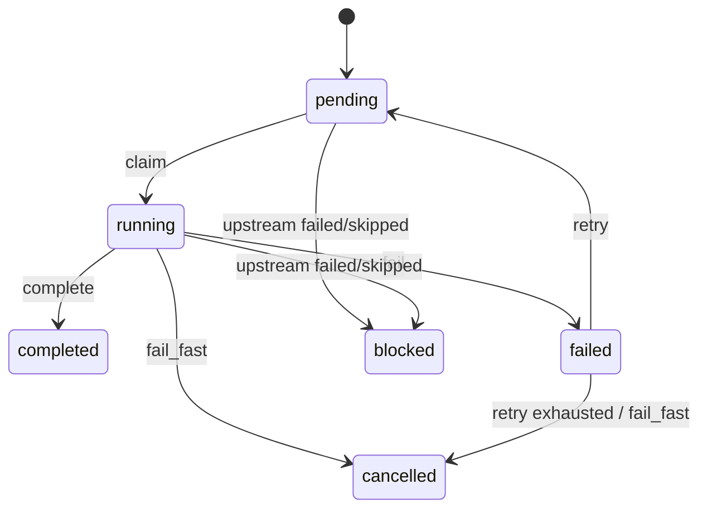

# 任务编排引擎设计文档

## 目标

为 Squad 的多任务工作流提供一个轻量的编排引擎，支持：

- 任务依赖关系
- DAG 环检测
- 可执行任务判定
- 并发限制
- 失败策略：`fail_fast`、`retry`、`skip`

## 数据模型

### Task

每个任务至少包含：

- `id`：唯一标识
- `dependsOn`：前置任务列表
- `status`：`pending | running | completed | failed | blocked | cancelled`
- `failureStrategy`：失败策略
- `maxRetries`：重试上限
- `retriesRemaining`：剩余重试次数

### Graph

使用邻接表表达 DAG：

- `parents[taskId]`：当前任务依赖哪些前置任务
- `children[taskId]`：当前任务解锁哪些后续任务

这种结构同时适合：

- 从某个任务向下传播失败影响
- 从某个任务向上检查其是否已满足所有前置依赖

## 状态机

### 说明

- `pending`：已创建但尚未领取
- `running`：已领取，正在执行
- `completed`：成功结束
- `failed`：执行失败
- `blocked`：因为上游失败而无法再执行
- `cancelled`：被 `fail_fast` 统一取消

## 调度算法

### 可执行任务判定

一个任务可执行，当且仅当：

1. 它处于 `pending`
2. 它的所有前置依赖都已经 `completed`
3. 当前运行中的任务数量未超过并发上限

这可以用一次线性扫描完成，复杂度约为 `O(V + E)`，其中 `V` 是任务数，`E` 是依赖数。

### 领取流程

1. 按插入顺序找到所有可执行任务。
2. 根据并发上限挑出前 `N` 个。
3. 将这些任务从 `pending` 切换为 `running`。
4. 返回给执行器。

## 环检测

### 方式

每次添加依赖边时做一次 DFS：

- 新边是 `parent -> child`
- 如果从 `child` 出发可以回到 `parent`
- 就说明形成了环，拒绝这次写入

### 原因

环一旦出现，任务就永远无法满足“所有前置依赖完成”这一前提，因此必须在构图阶段直接拦截。

## 失败策略

### `fail_fast`

- 当前失败任务标记为 `failed`
- 所有未完成任务直接取消
- 适合“后续任务已经没有继续执行价值”的场景

### `retry`

- 如果还有重试次数，任务回到 `pending`
- 否则升级为 `fail_fast`
- 适合网络抖动、临时资源不可用等可恢复错误

### `skip`

- 当前任务标记为 `failed`
- 将其后代任务标记为 `blocked`
- 不影响其他独立分支继续执行

## API 设计

最小核心 API：

- `addTask(task)`
- `addDependency(taskId, dependsOnId)`
- `claimNextTasks()`
- `completeTask(taskId)`
- `failTask(taskId)`
- `snapshot()`

这个 API 有三个优点：

1. 容易做单元测试
2. 容易接入数据库或消息队列
3. 容易扩展为“租约 + 续租 + 回收”的真实执行器模型

## 关键取舍

### 1. 纯内存实现 vs 持久化实现

本次实现先用纯内存模型表达核心逻辑，优点是：

- 代码短
- 状态变化清晰
- 更适合面试场景快速验证算法

缺点是：

- 进程重启会丢状态
- 不能直接支持多节点分布式调度

### 2. 立即传播失败 vs 懒惰判断

这里选择“失败后立即传播”：

- 一旦某条分支不可用，立即把下游任务切到 `blocked`
- 可以避免调度器反复扫描无效任务

代价是：

- 需要维护向下游传播的逻辑

## 测试矩阵

必须覆盖：

- 线性依赖：`A -> B -> C`
- 菱形依赖：`A -> [B, C] -> D`
- 循环依赖：`A -> B -> C -> A`
- 并发限制：10 个无依赖任务，限制并发为 3
- 失败策略：`fail_fast`、`retry`、`skip`

## 结论

这个设计把“图结构、状态机、并发控制、失败传播”四个责任拆开，既能满足题目要求，也能自然演进成真实的分布式 task orchestrator。

