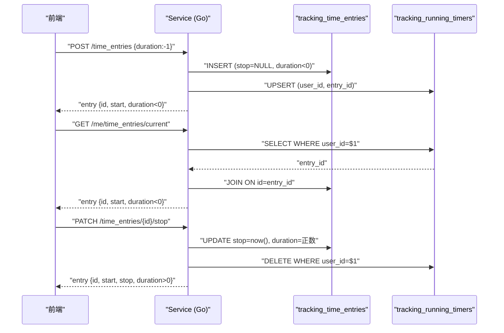

以下是两张表从数据产生到消费的完整调用链：

---

## 数据产生

### 1. 开始计时（创建运行中条目）

**前端** → `useStartTimeEntryMutation` 发送 `POST /api/v9/workspaces/{id}/time_entries`，body 中 `duration: -1`： [1](#6-0) 

**HTTP Handler** → `PostPublicTrackTimeEntry` 解析参数，调用 service： [2](#6-1) 

**Service** → `CreateTimeEntry`（在 `service_time_entries.go`）调用 `normalizeTimeEntryRange`，将 `duration=-1` 转换为 `duration=-start.Unix()`（运行中约定），然后：

1. `store.CreateTimeEntry` → **INSERT** 一行到 `tracking_time_entries`，`stop_time=NULL`，`duration_seconds=负数`
2. `store.SetRunningTimeEntry` → **UPSERT** 一行到 `tracking_running_timers` [3](#6-2) [4](#6-3) 

`SetRunningTimeEntry` 用 `ON CONFLICT DO UPDATE`，保证每个用户只有一行：
```sql
insert into tracking_running_timers (user_id, time_entry_id)
values ($1, $2)
on conflict (user_id) do update set
    time_entry_id = excluded.time_entry_id,
    started_at = now()
```

---

## 数据消费（读取）

### 2. 查询当前计时器

`GET /api/v9/me/time_entries/current` → `GetCurrentTimeEntry`：

**主路径**：JOIN `tracking_running_timers` + `tracking_time_entries`，通过 `user_id` 直接定位： [5](#6-4) 

**兜底路径**：如果 `tracking_running_timers` 没有记录（如通过导入创建的条目），则扫描 `tracking_time_entries` 找 `duration_seconds < 0` 的行，并自动修复写入 `tracking_running_timers`： [6](#6-5) 

前端每 30 秒轮询一次这个接口： [7](#6-6) 

---

## 数据变更

### 3. 停止计时

**前端** → `useStopTimeEntryMutation` 发送 `PATCH /api/v9/workspaces/{id}/time_entries/{id}/stop`，同时做乐观更新（立即把 `currentTimeEntry` 设为 null，把列表中该条目的 `stop` 设为当前时间）： [8](#6-7) 

**Service** → `StopTimeEntry` 计算 `stop = now()`，调用 `UpdateTimeEntry`： [9](#6-8) 

`UpdateTimeEntry` 内部：
1. `store.UpdateTimeEntry` → **UPDATE** `tracking_time_entries`，写入 `stop_time=now()`，`duration_seconds=正数`
2. `store.ClearRunningTimeEntry` → **DELETE** `tracking_running_timers` 中该用户的行 [10](#6-9) [11](#6-10) 

### 4. 删除时间记录

`DeleteTimeEntry` 对 `tracking_time_entries` 做**软删除**（`deleted_at = now()`），如果被删的是运行中条目（`stop == nil`），同时 `ClearRunningTimeEntry`： [12](#6-11) 

---

## 完整状态机



---

## 两张表的职责分工

| 表 | 写入时机 | 删除时机 | 核心作用 |
|---|---|---|---|
| `tracking_time_entries` | 开始计时 / 手动创建 | 软删除（`deleted_at`） | 持久化所有时间记录，是唯一的事实来源 |
| `tracking_running_timers` | 开始计时（UPSERT） | 停止/删除运行中条目 | 热路径索引，O(1) 查找当前计时器，避免扫描主表 |

`tracking_running_timers` 本质上是 `tracking_time_entries` 中"当前运行中条目"的**物化缓存**，两者通过 `time_entry_id` 外键关联，级联删除（`on delete cascade`）保证一致性。 [13](#6-12)

### Citations

**File:** apps/website/src/shared/query/web-shell-time-entries.ts (L42-49)
```typescript
export function useCurrentTimeEntryQuery() {
  return useQuery({
    queryFn: () => unwrapWebApiResult(getCurrentTimeEntry()),
    queryKey: currentTimeEntryQueryKey,
    retry: false,
    refetchInterval: 30_000,
  });
}
```

**File:** apps/website/src/shared/query/web-shell-time-entries.ts (L67-83)
```typescript
        postWorkspaceTimeEntries({
          body: {
            billable: request.billable,
            created_with: "opentoggl-web",
            description: request.description,
            duration: -1,
            project_id: request.projectId ?? undefined,
            start: toTrackUtcString(request.start),
            tag_ids: request.tagIds,
            task_id: request.taskId ?? undefined,
            workspace_id: workspaceId,
          },
          path: {
            workspace_id: workspaceId,
          },
        }),
      ),
```

**File:** apps/website/src/shared/query/web-shell-time-entries.ts (L277-293)
```typescript
      const nowIso = new Date().toISOString();
      // setQueryData FIRST so the UI re-renders in the same tick; cancel in the background.
      queryClient.setQueryData(currentTimeEntryQueryKey, null);

      // Flip the running entry to a stopped entry in every list so the
      // calendar block and the recent-entries row settle to their final
      // layout on tap instead of re-arranging when the server responds.
      queryClient.setQueriesData<GithubComTogglTogglApiInternalModelsTimeEntry[]>(
        { queryKey: ["time-entries"] },
        (old) =>
          old?.map((entry) => {
            if (entry.id !== timeEntryId) return entry;
            const startMs = entry.start ? new Date(entry.start).getTime() : Date.now();
            const durationSec = Math.max(0, Math.round((Date.now() - startMs) / 1000));
            return { ...entry, stop: nowIso, duration: durationSec };
          }),
      );
```

**File:** apps/backend/internal/tracking/transport/http/public-api/handler_time_entries.go (L161-177)
```go
	entry, err := handler.tracking.CreateTimeEntry(ctxWithAuth, trackingapplication.CreateTimeEntryCommand{
		WorkspaceID: workspaceID,
		UserID:      user.ID,
		Billable:    lo.FromPtr(payload.Billable),
		Description: lo.FromPtr(payload.Description),
		Start:       start,
		Stop:        stop,
		Duration:    int64PointerToIntPointer(payload.Duration),
		CreatedWith: lo.FromPtr(payload.CreatedWith),
		ProjectID:   firstTrackIntPointerAsInt64(payload.ProjectId, payload.Pid),
		TaskID:      firstTrackIntPointerAsInt64(payload.TaskId, payload.Tid),
		TagIDs:      tagIDs,
	})
	if err != nil {
		return writePublicTrackTrackingError(err)
	}
	return ctx.JSON(http.StatusOK, timeEntryViewToAPI(entry))
```

**File:** apps/backend/internal/tracking/infra/postgres/store_time_entries.go (L17-50)
```go
func (store *Store) CreateTimeEntry(
	ctx context.Context,
	record trackingapplication.CreateTimeEntryRecord,
) (trackingapplication.TimeEntryView, error) {
	row := store.pool.QueryRow(
		ctx,
		`insert into tracking_time_entries (
			workspace_id, user_id, client_id, project_id, task_id, description, billable,
			start_time, stop_time, duration_seconds, created_with, tag_ids, expense_ids
		) values (
			$1, $2, $3, $4, $5, $6, $7,
			$8, $9, $10, $11, $12, $13
		)
		returning id, workspace_id, user_id, client_id, project_id, task_id, description, billable,
			start_time, stop_time, duration_seconds, created_with, tag_ids,
			expense_ids, deleted_at, created_at, updated_at,
			null::text as client_name, null::text as project_name, null::text as task_name, null::boolean as project_active, null::text as project_color,
			`+tagNamesReturning+``,
		record.WorkspaceID,
		record.UserID,
		record.ClientID,
		record.ProjectID,
		record.TaskID,
		record.Description,
		record.Billable,
		record.Start.UTC(),
		record.Stop,
		record.Duration,
		record.CreatedWith,
		coalesceInt64Slice(record.TagIDs),
		coalesceInt64Slice(record.ExpenseIDs),
	)
	return scanTimeEntry(row)
}
```

**File:** apps/backend/internal/tracking/infra/postgres/store_time_entries.go (L417-456)
```go
func (store *Store) GetCurrentTimeEntry(ctx context.Context, userID int64) (trackingapplication.TimeEntryView, bool, error) {
	// Primary path: look up via the running timers table.
	row := store.pool.QueryRow(
		ctx,
		`select
			te.id,
			te.workspace_id,
			te.user_id,
			te.client_id,
			te.project_id,
			te.task_id,
			te.description,
			te.billable,
			te.start_time,
			te.stop_time,
			te.duration_seconds,
			te.created_with,
			te.tag_ids,
			te.expense_ids,
			te.deleted_at,
			te.created_at,
			te.updated_at,
			c.name,
			p.name,
			t.name,
			p.active,
			p.color,
			`+tagNamesSubquery+`
		from tracking_running_timers rt
		join tracking_time_entries te on te.id = rt.time_entry_id
		left join catalog_clients c on c.id = te.client_id
		left join catalog_projects p on p.id = te.project_id
		left join catalog_tasks t on t.id = te.task_id
		where rt.user_id = $1 and te.deleted_at is null`,
		userID,
	)
	entry, err := scanTimeEntry(row)
	if err == nil {
		return entry, true, nil
	}
```

**File:** apps/backend/internal/tracking/infra/postgres/store_time_entries.go (L461-519)
```go
	// Fallback: find an entry with negative duration (Toggl convention for
	// running timers). This covers entries created through import or other
	// paths that do not populate tracking_running_timers.
	fallbackRow := store.pool.QueryRow(
		ctx,
		`select
			te.id,
			te.workspace_id,
			te.user_id,
			te.client_id,
			te.project_id,
			te.task_id,
			te.description,
			te.billable,
			te.start_time,
			te.stop_time,
			te.duration_seconds,
			te.created_with,
			te.tag_ids,
			te.expense_ids,
			te.deleted_at,
			te.created_at,
			te.updated_at,
			c.name,
			p.name,
			t.name,
			p.active,
			p.color,
			`+tagNamesSubquery+`
		from tracking_time_entries te
		left join catalog_clients c on c.id = te.client_id
		left join catalog_projects p on p.id = te.project_id
		left join catalog_tasks t on t.id = te.task_id
		where te.user_id = $1 and te.deleted_at is null and te.duration_seconds < 0
		order by te.start_time desc
		limit 1`,
		userID,
	)
	entry, err = scanTimeEntry(fallbackRow)
	if err != nil {
		if strings.Contains(err.Error(), "no rows") {
			return trackingapplication.TimeEntryView{}, false, nil
		}
		return trackingapplication.TimeEntryView{}, false, err
	}

	// Repair: populate tracking_running_timers so the primary path works
	// on subsequent calls.
	_, _ = store.pool.Exec(
		ctx,
		`insert into tracking_running_timers (user_id, time_entry_id)
		values ($1, $2)
		on conflict (user_id) do update set
			time_entry_id = excluded.time_entry_id,
			started_at = now()`,
		userID, entry.ID,
	)

	return entry, true, nil
```

**File:** apps/backend/internal/tracking/infra/postgres/store_time_entries.go (L596-611)
```go
func (store *Store) SetRunningTimeEntry(ctx context.Context, userID int64, timeEntryID int64) error {
	_, err := store.pool.Exec(
		ctx,
		`insert into tracking_running_timers (user_id, time_entry_id)
		values ($1, $2)
		on conflict (user_id) do update set
			time_entry_id = excluded.time_entry_id,
			started_at = now()`,
		userID,
		timeEntryID,
	)
	if err != nil {
		return writeTrackingError("set running time entry", err)
	}
	return nil
}
```

**File:** apps/backend/internal/tracking/infra/postgres/store_time_entries.go (L613-619)
```go
func (store *Store) ClearRunningTimeEntry(ctx context.Context, userID int64) error {
	_, err := store.pool.Exec(ctx, "delete from tracking_running_timers where user_id = $1", userID)
	if err != nil {
		return writeTrackingError("clear running time entry", err)
	}
	return nil
}
```

**File:** apps/backend/internal/tracking/application/service_time_entry_mutations.go (L131-149)
```go
	if stop == nil {
		if err := service.store.SetRunningTimeEntry(ctx, current.UserID, current.ID); err != nil {
			service.logger.ErrorContext(ctx, "failed to set running time entry after update",
				"user_id", current.UserID,
				"entry_id", current.ID,
				"error", err.Error(),
			)
			return TimeEntryView{}, err
		}
	} else {
		if err := service.store.ClearRunningTimeEntry(ctx, current.UserID); err != nil {
			service.logger.ErrorContext(ctx, "failed to clear running time entry after update",
				"user_id", current.UserID,
				"entry_id", current.ID,
				"error", err.Error(),
			)
			return TimeEntryView{}, err
		}
	}
```

**File:** apps/backend/internal/tracking/application/service_time_entry_mutations.go (L185-198)
```go
func (service *Service) StopTimeEntry(ctx context.Context, workspaceID int64, userID int64, timeEntryID int64) (TimeEntryView, error) {
	current, err := service.GetTimeEntry(ctx, workspaceID, userID, timeEntryID)
	if err != nil {
		return TimeEntryView{}, err
	}
	stop := service.now()
	return service.UpdateTimeEntry(ctx, UpdateTimeEntryCommand{
		WorkspaceID: workspaceID,
		TimeEntryID: timeEntryID,
		UserID:      userID,
		Stop:        &stop,
		Duration:    lo.ToPtr(int(stop.Sub(current.Start).Seconds())),
	})
}
```

**File:** apps/backend/internal/tracking/application/service_time_entry_mutations.go (L200-249)
```go
func (service *Service) DeleteTimeEntry(ctx context.Context, workspaceID int64, userID int64, timeEntryID int64) error {
	service.logger.InfoContext(ctx, "deleting time entry",
		"workspace_id", workspaceID,
		"user_id", userID,
		"entry_id", timeEntryID,
	)

	entry, ok, err := service.store.GetTimeEntry(ctx, workspaceID, userID, timeEntryID)
	if err != nil {
		service.logger.ErrorContext(ctx, "failed to get time entry for deletion",
			"workspace_id", workspaceID,
			"user_id", userID,
			"entry_id", timeEntryID,
			"error", err.Error(),
		)
		return err
	}
	if !ok {
		service.logger.WarnContext(ctx, "time entry not found for deletion",
			"workspace_id", workspaceID,
			"user_id", userID,
			"entry_id", timeEntryID,
		)
		return ErrTimeEntryNotFound
	}

	// Enforce report lock: entries before the lock date cannot be deleted.
	if err := service.checkReportLock(ctx, workspaceID, entry.Start); err != nil {
		return err
	}

	if err := service.store.DeleteTimeEntry(ctx, workspaceID, userID, timeEntryID); err != nil {
		service.logger.ErrorContext(ctx, "failed to delete time entry",
			"workspace_id", workspaceID,
			"user_id", userID,
			"entry_id", timeEntryID,
			"error", err.Error(),
		)
		return err
	}
	if entry.Stop == nil {
		if err := service.store.ClearRunningTimeEntry(ctx, userID); err != nil {
			service.logger.ErrorContext(ctx, "failed to clear running time entry after deletion",
				"user_id", userID,
				"entry_id", timeEntryID,
				"error", err.Error(),
			)
			return err
		}
	}
```

**File:** apps/backend/db/schema/latest.sql (L401-405)
```sql
create table tracking_running_timers (
    user_id bigint primary key references identity_users (id) on delete cascade,
    time_entry_id bigint references tracking_time_entries (id) on delete cascade,
    started_at timestamptz not null default now()
);
```

时间记录模块的功能可以按操作类型分类：

---

## 创建方式

| 方式 | 入口 |
|---|---|
| **计时器模式** | 输入描述后点击开始，再点停止 |
| **手动模式** | `ManualModeComposer`，直接输入开始/结束时间和日期 |
| **继续历史记录** | 列表/日历中点击"继续"，复制旧条目的 description/project/tags 开始新计时 |
| **URL 参数触发** | 访问 `/timer?description=...&project_id=...&tag_ids=...&billable=...` 自动开始 |
| **收藏模板一键启动** | 侧边栏 `GoalsFavoritesSidebar` 中点击收藏条目的播放按钮 | [1](#10-0) 

---

## 三种视图

| 视图 | 组件 | 特点 |
|---|---|---|
| **列表视图** | `ConnectedListView` / `ListView` | 按天分组，支持批量选择 |
| **日历视图** | `ConnectedCalendarView` / `CalendarView` | 周视图，支持拖拽移动/调整大小 |
| **工时表视图** | `ConnectedTimesheetView` / `TimesheetView` | 按项目/任务汇总 |

日历视图支持两种拖拽手势：`move`（移动条目）和 `resize`（拖拽 start/end 边缘调整时长），以 15 分钟为最小粒度： [2](#10-1) 

---

## 单条记录操作

列表行的"更多操作"菜单（`ListRowMoreActions`）和日历右键菜单（`CalendarEntryContextMenu`）提供：

| 操作 | 说明 |
|---|---|
| **编辑** | 打开 `TimeEntryEditorDialog`，可改 description/project/task/tags/billable/start/stop |
| **继续** | 复制该条目开始新计时 |
| **复制（Duplicate）** | 创建一条相同内容的新记录 |
| **拆分（Split）** | `SplitTimeEntryDialog`，拖拽分割线把一条记录拆成两条 |
| **切换计费状态** | 直接切换 billable/non-billable |
| **收藏（Pin as favorite）** | 保存为收藏模板 |
| **跳转到项目** | 有关联项目时显示，跳转到项目详情页 |
| **复制描述** | 复制 description 到剪贴板 |
| **复制启动链接** | 复制 `/timer?description=...` URL 到剪贴板 |
| **删除** | 软删除，有确认弹窗 | [3](#10-2) [4](#10-3) 

---

## 批量操作（列表视图）

勾选多条记录后出现 `BulkActionToolbar`，支持：

- **批量编辑**：可同时修改 description / project / tags（支持"清除已有标签"）/ 日期（移动到某天）/ billable
- **批量删除**：有确认弹窗 [5](#10-4) [6](#10-5) 

---

## 侧边栏辅助功能

`GoalsFavoritesSidebar` 提供：
- **收藏（Favorites）**：保存常用记录模板，一键启动
- **目标（Goals）**：显示当前时间目标的完成进度 [7](#10-6) 

---

## 其他功能

| 功能 | 说明 |
|---|---|
| **搜索** | `useSearchTimeEntriesQuery`，按 description/project/task/client 搜索 |
| **键盘快捷键** | `KeyboardShortcutsDialog` 展示快捷键列表 |
| **显示设置** | `DisplaySettingsPopover`，控制视图显示选项 |
| **周导航** | `WeekRangePicker`，切换查看不同周的记录 |
| **加载更多** | 列表视图底部分页加载历史记录 |
| **document.title 计时** | 运行中时标签页标题实时显示已过时间（`1:23:45 · OpenTickly`） | [8](#10-7)

### Citations

**File:** apps/website/src/features/tracking/ManualModeComposer.tsx (L56-63)
```typescript
  const handleAdd = () => {
    const startMs = parseLocalDateTime(startDate, startTime, timezone);
    const stopMs = parseLocalDateTime(effectiveStopDate, stopTime, timezone);
    if (startMs == null || stopMs == null || stopMs <= startMs) {
      return;
    }
    onAddTimeEntry(new Date(startMs), new Date(stopMs));
  };
```

**File:** apps/website/src/features/tracking/calendar-dnd.ts (L1-40)
```typescript
import { type PointerEvent as ReactPointerEvent } from "react";

export type CalendarDragGesture =
  | {
      kind: "move";
    }
  | {
      edge: "start" | "end";
      kind: "resize";
    };

export type CalendarDragSession = {
  entryId: number;
  gesture: CalendarDragGesture;
  originClientY: number;
};

export type CalendarDragBindings = {
  onPointerDown: (event: ReactPointerEvent<HTMLElement>) => void;
};

export function beginCalendarDrag(
  entryId: number,
  gesture: CalendarDragGesture,
  event: ReactPointerEvent<HTMLElement>,
): CalendarDragSession {
  event.preventDefault();
  event.stopPropagation();

  return {
    entryId,
    gesture,
    originClientY: event.clientY,
  };
}

export function resolveCalendarDragMinutes(session: CalendarDragSession, clientY: number): number {
  const deltaPixels = clientY - session.originClientY;
  const quarterHour = 15;
  return Math.round(deltaPixels / quarterHour) * quarterHour;
```

**File:** apps/website/src/features/tracking/ListRowMoreActions.tsx (L42-80)
```typescript
      <MenuItem onClick={() => onBillableToggle?.(entry)}>
        {entry.billable ? t("setAsNonBillable") : t("setAsBillable")}
      </MenuItem>
      <MenuItem onClick={() => onDuplicate?.(entry)}>{t("duplicate")}</MenuItem>
      {entry.start && entry.stop ? (
        <MenuItem onClick={() => onSplit?.(entry)}>{t("split")}</MenuItem>
      ) : null}
      {entry.project_id || entry.pid ? (
        <MenuLink
          href={`/projects/${entry.workspace_id ?? entry.wid}/edit/${resolveTimeEntryProjectId(entry)}`}
        >
          {t("goToProject")}
        </MenuLink>
      ) : null}
      <MenuItem onClick={() => onFavorite?.(entry)}>{t("pinAsFavorite")}</MenuItem>
      <MenuItem onClick={() => void navigator.clipboard.writeText(entry.description?.trim() ?? "")}>
        {t("copyDescription")}
      </MenuItem>
      <MenuItem
        onClick={() => {
          const params = new URLSearchParams();
          const desc = (entry.description ?? "").trim();
          if (desc) params.set("description", desc);
          const projectId = resolveTimeEntryProjectId(entry);
          if (projectId != null) params.set("project_id", String(projectId));
          if (entry.tag_ids?.length) params.set("tag_ids", entry.tag_ids.join(","));
          if (entry.billable) params.set("billable", "true");
          void navigator.clipboard.writeText(
            `${window.location.origin}/timer?${params.toString()}`,
          );
        }}
      >
        {t("copyStartLink")}
      </MenuItem>
      <MenuSeparator />
      <MenuItem destructive onClick={() => onDelete?.(entry)}>
        {t("delete")}
      </MenuItem>
    </DropdownMenu>
```

**File:** apps/website/src/features/tracking/CalendarEntryContextMenu.tsx (L57-74)
```typescript
    >
      <MenuItem onClick={onDuplicate}>{t("duplicate")}</MenuItem>
      <MenuItem disabled={!onSplit} onClick={onSplit}>
        {t("split")}
      </MenuItem>
      <MenuItem disabled={!onFavorite} onClick={onFavorite}>
        {t("pinAsFavorite")}
      </MenuItem>
      {hasProject && projectPath ? (
        <MenuLink href={projectPath}>{t("goToProject")}</MenuLink>
      ) : null}
      <MenuItem disabled={!hasDescription} onClick={onCopyDescription}>
        {t("copyDescription")}
      </MenuItem>
      <MenuItem onClick={onCopyStartLink}>{t("copyStartLink")}</MenuItem>
      <MenuItem destructive onClick={onDelete}>
        {t("delete")}
      </MenuItem>
```

**File:** apps/website/src/features/tracking/BulkEditDialog.tsx (L23-30)
```typescript
export type BulkEditUpdates = {
  billable?: boolean;
  date?: string;
  description?: string;
  projectId?: number | null;
  removeExistingTags?: boolean;
  tagIds?: number[];
};
```

**File:** apps/website/src/shared/query/web-shell-time-entry-bulk.ts (L12-41)
```typescript
export function useBulkEditTimeEntriesMutation(workspaceId: number) {
  const queryClient = useQueryClient();

  return useMutation({
    mutationFn: ({
      operations,
      timeEntryIds,
    }: {
      operations: BulkEditPatchOperation[];
      timeEntryIds: number[];
    }) =>
      unwrapWebApiResult(
        patchTimeEntries({
          body: operations,
          path: {
            time_entry_ids: timeEntryIds,
            workspace_id: workspaceId,
          },
        }),
      ),
    onSuccess: async () => {
      await queryClient.invalidateQueries({
        queryKey: ["time-entries"],
      });
      await queryClient.invalidateQueries({
        queryKey: currentTimeEntryQueryKey,
      });
    },
  });
}
```

**File:** apps/website/src/shared/query/web-shell-time-entry-bulk.ts (L70-84)
```typescript
export function useSearchTimeEntriesQuery(workspaceId: number, query: string) {
  const trimmed = query.trim();
  return useQuery({
    queryFn: () =>
      unwrapWebApiResult(
        searchWorkspaceTimeEntries({
          path: { workspace_id: workspaceId },
          query: { query: trimmed },
        }),
      ) as Promise<TimeEntrySearchResult>,
    queryKey: ["time-entry-search", workspaceId, trimmed],
    enabled: trimmed.length > 0,
    staleTime: 5_000,
  });
}
```

**File:** apps/website/src/features/tracking/GoalsFavoritesSidebar.tsx (L21-60)
```typescript
export function GoalsFavoritesSidebar({
  favorites,
  goals,
  onDeleteFavorite,
  onStartFavorite,
  showGoals = true,
  workspaceId,
}: GoalsFavoritesSidebarProps): ReactElement {
  const { t } = useTranslation("goals");

  return (
    <div
      className="sticky top-[var(--timer-header-height,0px)] flex h-fit max-h-[calc(100vh-var(--timer-header-height,0px))] w-[220px] shrink-0 flex-col overflow-y-auto border-l border-[var(--track-border)] bg-[var(--track-surface)]"
      data-testid="goals-favorites-sidebar"
    >
      {showGoals ? (
        <SidebarSection
          title={t("sidebarGoals")}
          action={
            <Link
              aria-label={t("addGoals")}
              className="flex size-5 items-center justify-center rounded text-[var(--track-text-muted)] transition hover:bg-[var(--track-row-hover)] hover:text-white"
              to="/workspaces/$workspaceId/goals"
              params={{ workspaceId: String(workspaceId) }}
            >
              <PlusIcon className="size-3" />
            </Link>
          }
        >
          {goals.length === 0 ? (
            <div className="px-4 pb-3 text-[12px] text-[var(--track-text-muted)]">
              {t("noGoalsYetSidebar")}
            </div>
          ) : (
            <div className="flex flex-col gap-0.5 px-2 pb-2">
              {goals.map((goal) => (
                <GoalItem key={goal.goal_id} goal={goal} />
              ))}
            </div>
          )}
```
